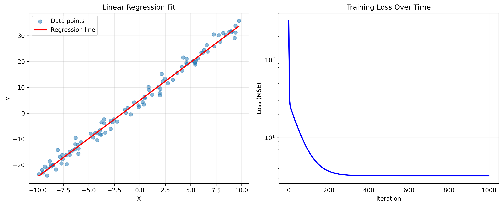
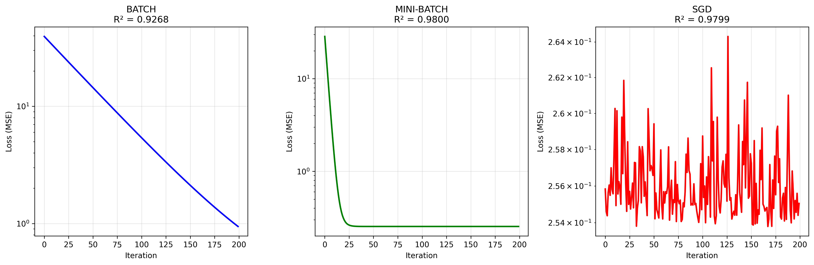
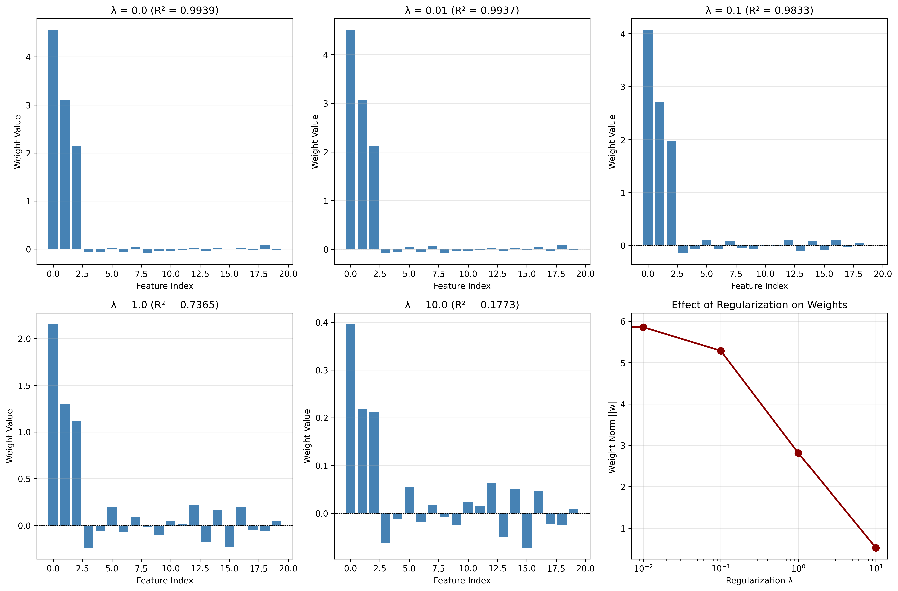
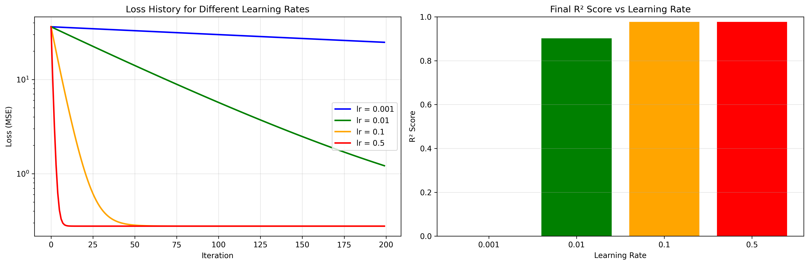
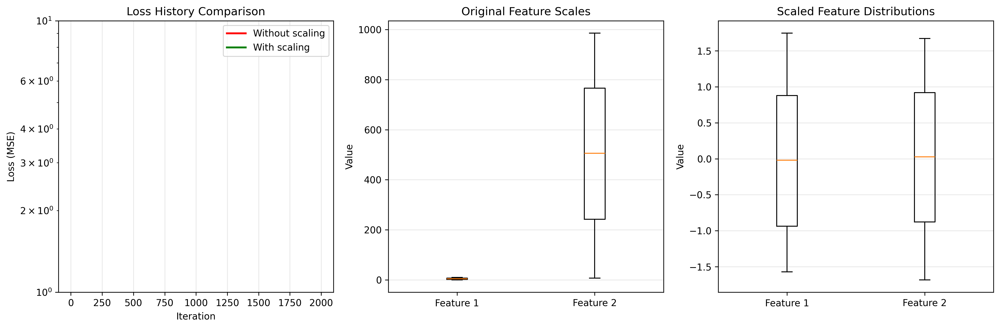
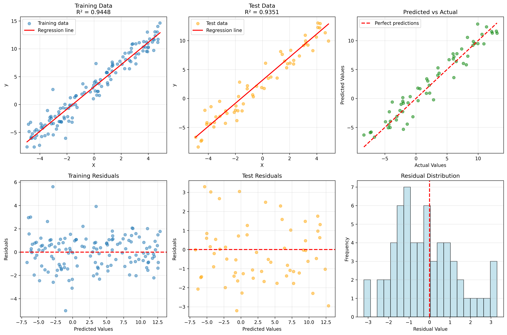

# Linear Regression from Scratch

A complete and professional implementation of **Linear Regression** using only NumPy, with detailed mathematical documentation.

## 📚 Table of Contents

- [Introduction](#introduction)
- [Mathematical Foundations](#mathematical-foundations)
  - [1. Linear Model](#1-linear-model)
  - [2. Cost Function](#2-cost-function)
  - [3. Gradient Descent](#3-gradient-descent)
  - [4. L2 Regularization](#4-l2-regularization-ridge)
  - [5. Advanced Optimizations](#5-advanced-optimizations)
- [Evaluation Metrics](#evaluation-metrics)
- [Features](#features)
- [Installation](#installation)
- [Quick Start](#quick-start)
- [Detailed Documentation](#detailed-documentation)
- [Examples](#examples)
- [Tests](#tests)
- [Performance](#performance)

## 🎯 Introduction

Linear regression is a supervised machine learning algorithm that models the relationship between a dependent variable (target) and one or more independent variables (features) by fitting a linear equation to observed data.

### When to use Linear Regression?

- ✅ Predicting continuous values (prices, temperature, sales, etc.)
- ✅ Trend and correlation analysis
- ✅ Baseline for comparison with complex models
- ✅ Important interpretability (coefficients = feature importance)

## 📐 Mathematical Foundations

### 1. Linear Model

#### 1.1 Model Definition

The linear regression model predicts a continuous value $y$ from a feature vector $\mathbf{x}$:


```math
\hat{y} = \mathbf{w}^T \mathbf{x} + b
```


In matrix notation for $n$ samples:


```math
\hat{\mathbf{y}} = \mathbf{X} \mathbf{w} + b
```


**Where:**
- $\hat{\mathbf{y}} \in \mathbb{R}^{n}$: predictions vector (n_samples,)
- $\mathbf{X} \in \mathbb{R}^{n \times d}$: feature matrix (n_samples, n_features)
- $\mathbf{w} \in \mathbb{R}^{d}$: weights vector (n_features,)
- $b \in \mathbb{R}$: bias term (scalar)
- $n$: number of samples
- $d$: number of features

#### 1.2 Vector Form

For a single sample $\mathbf{x}_i$:


```math
\hat{y}_i = \sum_{j=1}^{d} w_j x_{ij} + b = w_1 x_{i1} + w_2 x_{i2} + \cdots + w_d x_{id} + b
```


#### 1.3 Geometric Interpretation

- Vector $\mathbf{w}$ defines the **direction** of the hyperplane
- Bias $b$ defines the **offset** from the origin
- In 2D: $\hat{y} = w_1 x_1 + b$ represents a **line**
- In 3D: $\hat{y} = w_1 x_1 + w_2 x_2 + b$ represents a **plane**
- In higher dimensions: a **hyperplane**

---

### 2. Cost Function

#### 2.1 Mean Squared Error (MSE)

The cost function measures the error between predictions and true values. We use **Mean Squared Error**:


```math
\mathcal{L}(\mathbf{w}, b) = \frac{1}{2n} \sum_{i=1}^{n} (y_i - \hat{y}_i)^2 = \frac{1}{2n} \sum_{i=1}^{n} (y_i - \mathbf{w}^T \mathbf{x}_i - b)^2
```


In matrix notation:


```math
\mathcal{L}(\mathbf{w}, b) = \frac{1}{2n} \|\mathbf{y} - \mathbf{X}\mathbf{w} - b\|^2 = \frac{1}{2n} (\mathbf{y} - \mathbf{X}\mathbf{w} - b)^T (\mathbf{y} - \mathbf{X}\mathbf{w} - b)
```


**Why the $\frac{1}{2}$ factor?**
- Simplifies derivatives (the 2 from the square cancels with $\frac{1}{2}$)
- Doesn't affect optimization (same minimum)

#### 2.2 Expanded Form


```math
\mathcal{L}(\mathbf{w}, b) = \frac{1}{2n} \left[ \mathbf{y}^T\mathbf{y} - 2\mathbf{y}^T(\mathbf{X}\mathbf{w} + b) + (\mathbf{X}\mathbf{w} + b)^T(\mathbf{X}\mathbf{w} + b) \right]
```


#### 2.3 MSE Properties

- **Convex**: single global minimum (no local minima)
- **Differentiable everywhere**: well-defined gradients
- **Sensitive to outliers**: squared errors amplify large errors

---

### 3. Gradient Descent

#### 3.1 General Principle

Gradient descent minimizes $\mathcal{L}$ by iteratively adjusting parameters in the opposite direction of the gradient:


```math
\begin{aligned}
\mathbf{w}^{(t+1)} &= \mathbf{w}^{(t)} - \alpha \nabla_{\mathbf{w}} \mathcal{L}(\mathbf{w}^{(t)}, b^{(t)}) \\
b^{(t+1)} &= b^{(t)} - \alpha \nabla_{b} \mathcal{L}(\mathbf{w}^{(t)}, b^{(t)})
\end{aligned}
```


**Where:**
- $\alpha > 0$: learning rate
- $t$: iteration number
- $\nabla$: gradient operator

#### 3.2 Gradient Computation

##### Gradient with respect to weights $\mathbf{w}$


```math
\begin{aligned}
\nabla_{\mathbf{w}} \mathcal{L} &= \frac{\partial \mathcal{L}}{\partial \mathbf{w}} \\
&= \frac{\partial}{\partial \mathbf{w}} \left[ \frac{1}{2n} \sum_{i=1}^{n} (y_i - \mathbf{w}^T \mathbf{x}_i - b)^2 \right] \\
&= \frac{1}{n} \sum_{i=1}^{n} (y_i - \mathbf{w}^T \mathbf{x}_i - b) \cdot (-\mathbf{x}_i) \\
&= -\frac{1}{n} \sum_{i=1}^{n} \mathbf{x}_i (y_i - \hat{y}_i) \\
&= \frac{1}{n} \sum_{i=1}^{n} \mathbf{x}_i (\hat{y}_i - y_i)
\end{aligned}
```


**In matrix notation:**


```math
\boxed{\nabla_{\mathbf{w}} \mathcal{L} = \frac{1}{n} \mathbf{X}^T (\hat{\mathbf{y}} - \mathbf{y}) = \frac{1}{n} \mathbf{X}^T (\mathbf{X}\mathbf{w} + b - \mathbf{y})}
```


##### Gradient with respect to bias $b$


```math
\begin{aligned}
\nabla_{b} \mathcal{L} &= \frac{\partial \mathcal{L}}{\partial b} \\
&= \frac{1}{n} \sum_{i=1}^{n} (\hat{y}_i - y_i) \cdot 1 \\
&= \frac{1}{n} \sum_{i=1}^{n} (\hat{y}_i - y_i)
\end{aligned}
```


**Compact form:**


```math
\boxed{\nabla_{b} \mathcal{L} = \frac{1}{n} \mathbf{1}^T (\hat{\mathbf{y}} - \mathbf{y}) = \frac{1}{n} \sum_{i=1}^{n} (\hat{y}_i - y_i)}
```


#### 3.3 Update Rule


```math
\boxed{
\begin{aligned}
\mathbf{w} &\leftarrow \mathbf{w} - \alpha \cdot \frac{1}{n} \mathbf{X}^T (\mathbf{X}\mathbf{w} + b - \mathbf{y}) \\
b &\leftarrow b - \alpha \cdot \frac{1}{n} \sum_{i=1}^{n} (\mathbf{X}_i\mathbf{w} + b - y_i)
\end{aligned}
}
```


---

### 3.4 Gradient Descent Variants

#### 3.4.1 Batch Gradient Descent (BGD)

Uses **all samples** at each iteration:


```math
\begin{aligned}
\mathbf{w}^{(t+1)} &= \mathbf{w}^{(t)} - \frac{\alpha}{n} \sum_{i=1}^{n} \mathbf{x}_i (\hat{y}_i - y_i) \\
&= \mathbf{w}^{(t)} - \frac{\alpha}{n} \mathbf{X}^T (\mathbf{X}\mathbf{w}^{(t)} + b^{(t)} - \mathbf{y})
\end{aligned}
```


**Advantages:**
- ✅ Stable and deterministic convergence
- ✅ Uses all available information
- ✅ Converges to global minimum (convex function)

**Disadvantages:**
- ❌ Slow on large datasets ($O(nd)$ per iteration)
- ❌ Requires loading all data in memory

#### 3.4.2 Mini-Batch Gradient Descent (MBGD)

Uses **batches** of size $B$:


```math
\mathbf{w}^{(t+1)} = \mathbf{w}^{(t)} - \frac{\alpha}{B} \sum_{i \in \mathcal{B}_t} \mathbf{x}_i (\hat{y}_i - y_i)
```


**Where $\mathcal{B}_t$ is a random batch of $B$ samples.**

**Advantages:**
- ✅ Good speed/stability tradeoff
- ✅ GPU parallelizable
- ✅ Enables streaming training
- ✅ Gradient noise helps escape local minima (for non-convex functions)

**Disadvantages:**
- ⚙️ Requires tuning $B$ (typically 32, 64, 128, 256)

**Recommended batch sizes:**
- **Small batch (8-32)**: Implicit regularization, generalization
- **Medium batch (32-128)**: Good balance
- **Large batch (256-1024)**: More stable, faster, but overfitting risk

#### 3.4.3 Stochastic Gradient Descent (SGD)

Uses **one sample** per iteration ($B=1$):


```math
\mathbf{w}^{(t+1)} = \mathbf{w}^{(t)} - \alpha \mathbf{x}_i (\hat{y}_i - y_i)
```


**Advantages:**
- ✅ Very fast ($O(d)$ per update)
- ✅ Can make frequent updates
- ✅ Better generalization (noise = regularization)

**Disadvantages:**
- ❌ Noisy convergence
- ❌ Requires learning rate decay

---

### 4. L2 Regularization (Ridge)

#### 4.1 Motivation

Without regularization, the model can **overfit**:
- Very large weights $\mathbf{w}$
- Too complex model
- Poor generalization

#### 4.2 Regularized Cost Function

We add a penalty term on the weight norm:


```math
\boxed{\mathcal{L}_{\text{Ridge}}(\mathbf{w}, b) = \frac{1}{2n} \sum_{i=1}^{n} (y_i - \hat{y}_i)^2 + \frac{\lambda}{2} \|\mathbf{w}\|^2}
```


```math
= \underbrace{\frac{1}{2n} \sum_{i=1}^{n} (y_i - \hat{y}_i)^2}_{\text{Fitting error (MSE)}} + \underbrace{\frac{\lambda}{2} \sum_{j=1}^{d} w_j^2}_{\text{Regularization term}}
```


**Where:**
- $\lambda \geq 0$: **regularization hyperparameter**
  - $\lambda = 0$: no regularization (standard linear regression)
  - $\lambda \to \infty$: weights → 0 (underfitting)
- $\|\mathbf{w}\|^2 = \mathbf{w}^T\mathbf{w} = \sum_{j=1}^{d} w_j^2$: squared L2 norm

**Note:** Bias $b$ is **not regularized** (standard convention).

#### 4.3 Gradient with Regularization

##### Gradient with respect to $\mathbf{w}$


```math
\begin{aligned}
\nabla_{\mathbf{w}} \mathcal{L}_{\text{Ridge}} &= \nabla_{\mathbf{w}} \left[ \frac{1}{2n} \sum_{i=1}^{n} (y_i - \hat{y}_i)^2 \right] + \nabla_{\mathbf{w}} \left[ \frac{\lambda}{2} \|\mathbf{w}\|^2 \right] \\
&= \frac{1}{n} \mathbf{X}^T (\mathbf{X}\mathbf{w} + b - \mathbf{y}) + \lambda \mathbf{w}
\end{aligned}
```


```math
\boxed{\nabla_{\mathbf{w}} \mathcal{L}_{\text{Ridge}} = \frac{1}{n} \mathbf{X}^T (\hat{\mathbf{y}} - \mathbf{y}) + \lambda \mathbf{w}}
```


##### Gradient with respect to $b$


```math
\boxed{\nabla_{b} \mathcal{L}_{\text{Ridge}} = \frac{1}{n} \sum_{i=1}^{n} (\hat{y}_i - y_i)}
```


(Unchanged because $b$ is not regularized)

#### 4.4 Update Rule with Regularization


```math
\boxed{
\begin{aligned}
\mathbf{w} &\leftarrow \mathbf{w} - \alpha \left[ \frac{1}{n} \mathbf{X}^T (\hat{\mathbf{y}} - \mathbf{y}) + \lambda \mathbf{w} \right] \\
&= (1 - \alpha\lambda) \mathbf{w} - \frac{\alpha}{n} \mathbf{X}^T (\hat{\mathbf{y}} - \mathbf{y}) \\
b &\leftarrow b - \frac{\alpha}{n} \sum_{i=1}^{n} (\hat{y}_i - y_i)
\end{aligned}
}
```


**Interpretation:**
- The term $(1 - \alpha\lambda)$ **shrinks** weights at each iteration
- This is **weight decay**
- Larger $\lambda$ means more constrained weights

#### 4.5 Closed-Form Solution (Normal Equations)

For Ridge Regression, there exists an analytical solution:


```math
\boxed{\mathbf{w}^* = (\mathbf{X}^T\mathbf{X} + \lambda \mathbf{I})^{-1} \mathbf{X}^T \mathbf{y}}
```


**Where $\mathbf{I}$ is the identity matrix.**

**Advantages of closed form:**
- ✅ Exact solution in one operation
- ✅ No learning rate tuning

**Disadvantages:**
- ❌ Complexity $O(d^3)$ (matrix inversion)
- ❌ Impractical for $d > 10,000$
- ❌ Requires all data in memory

**→ That's why we use gradient descent!**

---

### 5. Advanced Optimizations

#### 5.1 Learning Rate Decay

The learning rate decreases over iterations:


```math
\boxed{\alpha^{(t)} = \frac{\alpha_0}{1 + \beta \cdot t}}
```


**Where:**
- $\alpha_0$: initial learning rate
- $\beta \geq 0$: decay rate
- $t$: iteration number

**Common variants:**

1. **Step Decay:**

```math
\alpha^{(t)} = \alpha_0 \cdot \gamma^{\lfloor t/k \rfloor}
```

(Multiply by $\gamma < 1$ every $k$ iterations)

2. **Exponential Decay:**

```math
\alpha^{(t)} = \alpha_0 \cdot e^{-\beta t}
```


3. **Inverse Time Decay:**

```math
\alpha^{(t)} = \frac{\alpha_0}{1 + \beta \cdot t}
```

(Used in our implementation)

**Why use decay?**
- Early: large $\alpha$ for fast convergence
- Late: small $\alpha$ for stability and precision
- ✅ Better final convergence
- ✅ Avoids oscillations around minimum

#### 5.2 Early Stopping

Stops training if loss doesn't improve:

**Algorithm:**
```
best_loss = ∞
patience_counter = 0

for each iteration t:
    compute loss L^(t)

    if L^(t) < best_loss - ε:
        best_loss = L^(t)
        patience_counter = 0
    else:
        patience_counter += 1

    if patience_counter ≥ patience:
        STOP (early stopping)
```

**Where:**
- $\varepsilon$: **tolerance** (minimum required improvement)
- **patience**: number of iterations without improvement before stopping

**Improvement condition:**


```math
\mathcal{L}^{(t)} < \mathcal{L}_{\text{best}} - \varepsilon
```


**Advantages:**
- ✅ Saves computation time
- ✅ Prevents overfitting (implicit regularization)
- ✅ Automatic convergence detection

---

## 📊 Evaluation Metrics

### 1. Mean Squared Error (MSE)

Mean squared error:


```math
\boxed{\text{MSE} = \frac{1}{n} \sum_{i=1}^{n} (y_i - \hat{y}_i)^2}
```


- **Unit:** Square of $y$ unit
- **Interpretation:** Smaller = better
- **Sensitivity:** Very sensitive to outliers (squared errors)

---

### 2. Root Mean Squared Error (RMSE)

Root mean squared error:


```math
\boxed{\text{RMSE} = \sqrt{\frac{1}{n} \sum_{i=1}^{n} (y_i - \hat{y}_i)^2} = \sqrt{\text{MSE}}}
```


- **Unit:** Same unit as $y$
- **Interpretation:** "Average" error in original units
- **Advantage:** More interpretable than MSE

---

### 3. Mean Absolute Error (MAE)

Mean absolute error:


```math
\boxed{\text{MAE} = \frac{1}{n} \sum_{i=1}^{n} |y_i - \hat{y}_i|}
```


- **Unit:** Same unit as $y$
- **Interpretation:** Average error without squaring
- **Robustness:** Less sensitive to outliers than MSE/RMSE

**MSE vs MAE comparison:**
- **MSE**: Heavily penalizes large errors
- **MAE**: Treats all errors equally

---

### 4. R² Score (Coefficient of Determination)

Proportion of explained variance:


```math
\boxed{R^2 = 1 - \frac{SS_{\text{res}}}{SS_{\text{tot}}} = 1 - \frac{\sum_{i=1}^{n}(y_i - \hat{y}_i)^2}{\sum_{i=1}^{n}(y_i - \bar{y})^2}}
```


**Where:**
- $SS_{\text{res}} = \sum_{i=1}^{n}(y_i - \hat{y}_i)^2$: **Residual Sum of Squares**
- $SS_{\text{tot}} = \sum_{i=1}^{n}(y_i - \bar{y})^2$: **Total Sum of Squares**
- $\bar{y} = \frac{1}{n}\sum_{i=1}^{n} y_i$: mean of true values

**Variance decomposition:**


```math
\underbrace{\sum_{i=1}^{n}(y_i - \bar{y})^2}_{SS_{\text{tot}}} = \underbrace{\sum_{i=1}^{n}(\hat{y}_i - \bar{y})^2}_{SS_{\text{reg}}} + \underbrace{\sum_{i=1}^{n}(y_i - \hat{y}_i)^2}_{SS_{\text{res}}}
```


**Therefore:**


```math
R^2 = \frac{SS_{\text{reg}}}{SS_{\text{tot}}} = 1 - \frac{SS_{\text{res}}}{SS_{\text{tot}}}
```


**Interpretation:**
- **$R^2 = 1.0$**: Perfect predictions (100% variance explained)
- **$R^2 = 0.7$**: 70% of variance explained (good model)
- **$R^2 = 0.0$**: Model = mean (no better than a constant)
- **$R^2 < 0$**: Worse than predicting the mean (very bad!)

---

### 5. Adjusted R² Score

Penalizes adding irrelevant features:


```math
\boxed{R^2_{\text{adj}} = 1 - \frac{(1-R^2)(n-1)}{n-d-1}}
```


**Where:**
- $n$: number of samples
- $d$: number of features

**Why Adjusted R²?**

Classic $R^2$ **always increases** when adding features, even if they add nothing!


```math
R^2_{\text{with d features}} \leq R^2_{\text{with d+1 features}}
```


$R^2_{\text{adj}}$ **penalizes** useless features:
- ✅ If feature is useful: $R^2_{\text{adj}}$ increases
- ❌ If feature is useless: $R^2_{\text{adj}}$ decreases

**Usage:** Compare models with different numbers of features.

---

### 6. Mean Absolute Percentage Error (MAPE)

Error in percentage:


```math
\boxed{\text{MAPE} = \frac{100}{n} \sum_{i=1}^{n} \left| \frac{y_i - \hat{y}_i}{y_i} \right|}
```


- **Unit:** Percentage (%)
- **Interpretation:** Average relative error
- **Warning:** Problem if $y_i \approx 0$ (division by zero)

---

### 7. Explained Variance Score

Explained variance:


```math
\boxed{\text{EV} = 1 - \frac{\text{Var}(y - \hat{y})}{\text{Var}(y)}}
```


**Difference with $R^2$:**
- $R^2$: Uses empirical mean $\bar{y}$
- EV: Uses residual variance

---

## ✨ Features

Our implementation offers:

### Algorithms
- ✅ Batch Gradient Descent
- ✅ Mini-batch Gradient Descent
- ✅ Stochastic Gradient Descent (SGD)

### Optimizations
- ✅ L2 Regularization (Ridge)
- ✅ Learning Rate Decay
- ✅ Early Stopping

### Preprocessing
- ✅ StandardScaler (z-score normalization)
- ✅ MinMaxScaler (0-1 scaling)
- ✅ Train/Test Split

### Evaluation Metrics
- ✅ Mean Squared Error (MSE)
- ✅ Root Mean Squared Error (RMSE)
- ✅ Mean Absolute Error (MAE)
- ✅ R² Score
- ✅ Adjusted R² Score
- ✅ MAPE
- ✅ Explained Variance Score

### Code Quality
- ✅ Complete type hints
- ✅ Detailed docstrings (NumPy style)
- ✅ Input validation
- ✅ Robust error handling
- ✅ Complete test suite

## 🚀 Installation

```bash
# Required dependencies
pip install numpy

# For examples and visualizations
pip install matplotlib scikit-learn
```

## 💡 Quick Start

### Simple Example

```python
import numpy as np
from LINEAR_REGRESSION import LinearRegression, train_test_split, StandardScaler

# Generate data
X = np.random.randn(100, 3)
y = 2*X[:, 0] + 3*X[:, 1] + 5*X[:, 2] + 10 + np.random.randn(100)*0.1

# Train/test split
X_train, X_test, y_train, y_test = train_test_split(X, y, test_size=0.2)

# Normalize features
scaler = StandardScaler()
X_train_scaled = scaler.fit_transform(X_train)
X_test_scaled = scaler.transform(X_test)

# Create and train model
model = LinearRegression(
    learning_rate=0.01,
    n_iterations=1000,
    method='batch',
    verbose=True
)
model.fit(X_train_scaled, y_train)

# Predict
y_pred = model.predict(X_test_scaled)

# Evaluate
r2 = model.score(X_test_scaled, y_test)
print(f"R² Score: {r2:.4f}")
```

### With Ridge Regularization

```python
# Ridge Regression (L2)
model = LinearRegression(
    learning_rate=0.01,
    n_iterations=1000,
    regularization=0.1,  # λ = 0.1
    verbose=True
)
model.fit(X_train_scaled, y_train)
```

### With Early Stopping

```python
model = LinearRegression(
    learning_rate=0.01,
    n_iterations=5000,
    early_stopping=True,
    patience=50,
    tolerance=1e-6,
    verbose=True
)
model.fit(X_train_scaled, y_train)
print(f"Stopped at iteration: {model.n_iterations_used_}")
```

### Mini-Batch Gradient Descent

```python
model = LinearRegression(
    learning_rate=0.01,
    n_iterations=1000,
    method='mini-batch',
    batch_size=32,
    random_state=42
)
model.fit(X_train_scaled, y_train)
```

## 📖 Detailed Documentation

### LinearRegression Class

#### Parameters

| Parameter | Type | Default | Description |
|-----------|------|--------|-------------|
| `learning_rate` | float | 0.01 | Learning rate α |
| `n_iterations` | int | 1000 | Maximum number of iterations |
| `method` | str | 'batch' | 'batch', 'mini-batch', 'sgd' |
| `batch_size` | int | 32 | Batch size (mini-batch) |
| `regularization` | float | 0.0 | λ parameter for L2 |
| `learning_rate_decay` | float | 0.0 | LR decay rate |
| `early_stopping` | bool | False | Enable early stopping |
| `patience` | int | 10 | Patience for early stopping |
| `tolerance` | float | 1e-4 | Improvement tolerance |
| `random_state` | int | None | Seed for reproducibility |
| `verbose` | bool | False | Display progress |

## 🧪 Tests

Run the complete test suite:

```bash
python test_linear_regression.py
```

Included tests:
- ✅ Simple regression (1 feature)
- ✅ Multivariate regression
- ✅ Gradient descent methods comparison
- ✅ L2 regularization
- ✅ Early stopping
- ✅ Learning rate decay
- ✅ Scalers
- ✅ Error handling

## 📊 Performance

### Time Complexity

| Operation | Batch | Mini-Batch | SGD |
|-----------|-------|------------|-----|
| Forward pass | $O(nd)$ | $O(Bd)$ | $O(d)$ |
| Gradient | $O(nd)$ | $O(Bd)$ | $O(d)$ |
| Update | $O(d)$ | $O(d)$ | $O(d)$ |
| **Per epoch** | **$O(nd)$** | **$O(nd)$** | **$O(nd)$** |

Where: $n$ = samples, $d$ = features, $B$ = batch size

### Space Complexity

- Model: $O(d)$ to store $\mathbf{w}$
- Training: $O(nd)$ for data

## 🎓 Advanced Theory

### Why Normalize Features?

**Without normalization:**
```
Feature 1: [1, 2, 3]         → scale ~1
Feature 2: [1000, 2000, 3000] → scale ~1000
```

Gradients for Feature 2 will be 1000× larger!

**Impact on gradient descent:**


```math
\frac{\partial \mathcal{L}}{\partial w_j} \propto x_j
```


If $x_2 \gg x_1$ then $\frac{\partial \mathcal{L}}{\partial w_2} \gg \frac{\partial \mathcal{L}}{\partial w_1}$

**Consequences:**
- ❌ Very slow convergence
- ❌ Very small learning rate needed
- ❌ Oscillations in some directions

**With normalization:** All features have similar scale → fast and stable convergence!

### Bias-Variance Tradeoff

**Error decomposition:**


```math
\mathbb{E}[(y - \hat{y})^2] = \underbrace{\text{Bias}^2(\hat{y})}_{\text{Underfitting}} + \underbrace{\text{Var}(\hat{y})}_{\text{Overfitting}} + \underbrace{\sigma^2}_{\text{Irreducible noise}}
```


**Regularization and tradeoff:**
- $\lambda = 0$: High variance (possible overfitting)
- $\lambda \uparrow$: Variance $\downarrow$, Bias $\uparrow$
- Optimal $\lambda$: Minimizes total error

## 📊 Visualizations

The `examples.py` script generates comprehensive visualizations demonstrating all key concepts:

### 1. Simple Linear Regression



Demonstrates basic linear regression with data points, fitted line, and loss convergence over iterations.

### 2. Gradient Descent Methods Comparison



Compares convergence behavior of Batch, Mini-Batch, and SGD methods on the same dataset.

### 3. L2 Regularization (Ridge)



Shows how different values of λ affect weight magnitudes and model complexity.

### 4. Learning Rate Impact



Illustrates how learning rate affects convergence speed and final model performance.

### 5. Feature Scaling Importance



Demonstrates why feature normalization is crucial for gradient descent convergence.

### 6. Predictions and Residual Analysis



Comprehensive prediction analysis with residual plots for model diagnostics.

**To regenerate visualizations:**
```bash
python examples.py
```

---

**Created with ❤️ for learning Machine Learning from Scratch**
