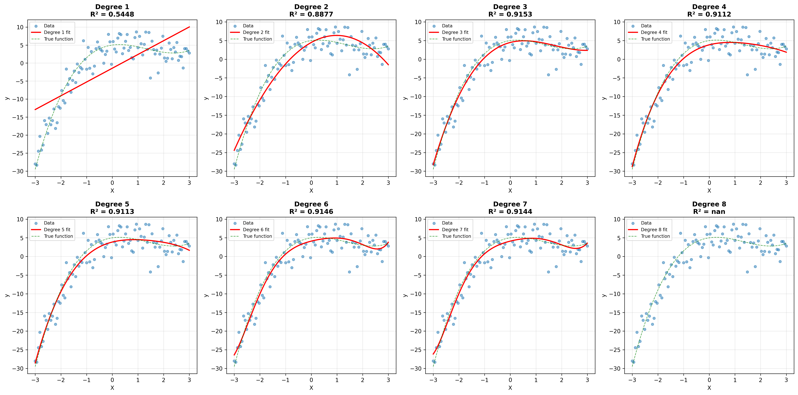
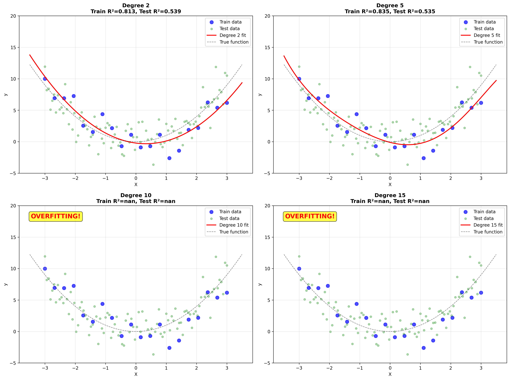
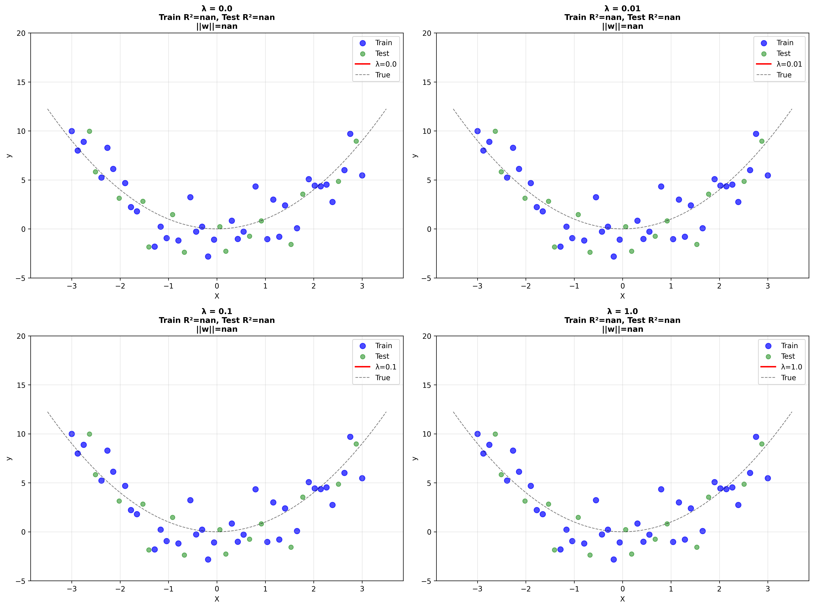
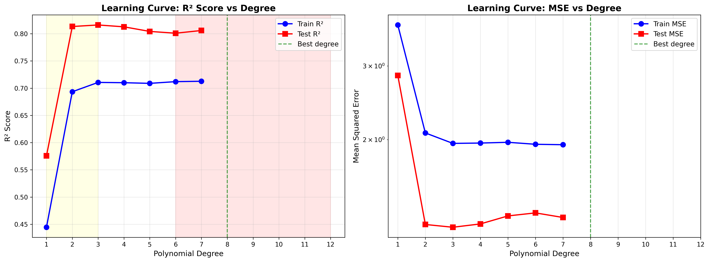
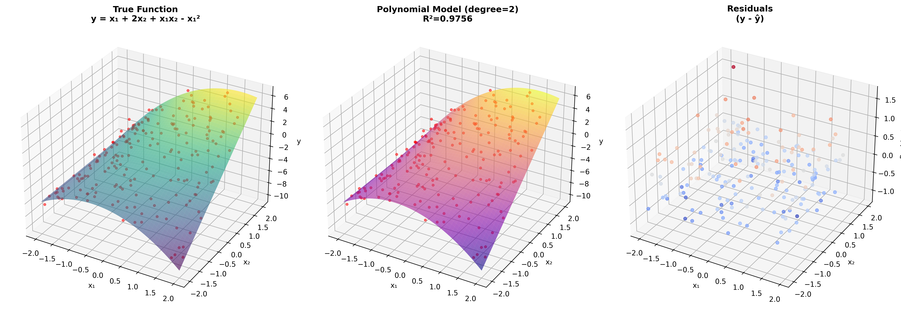
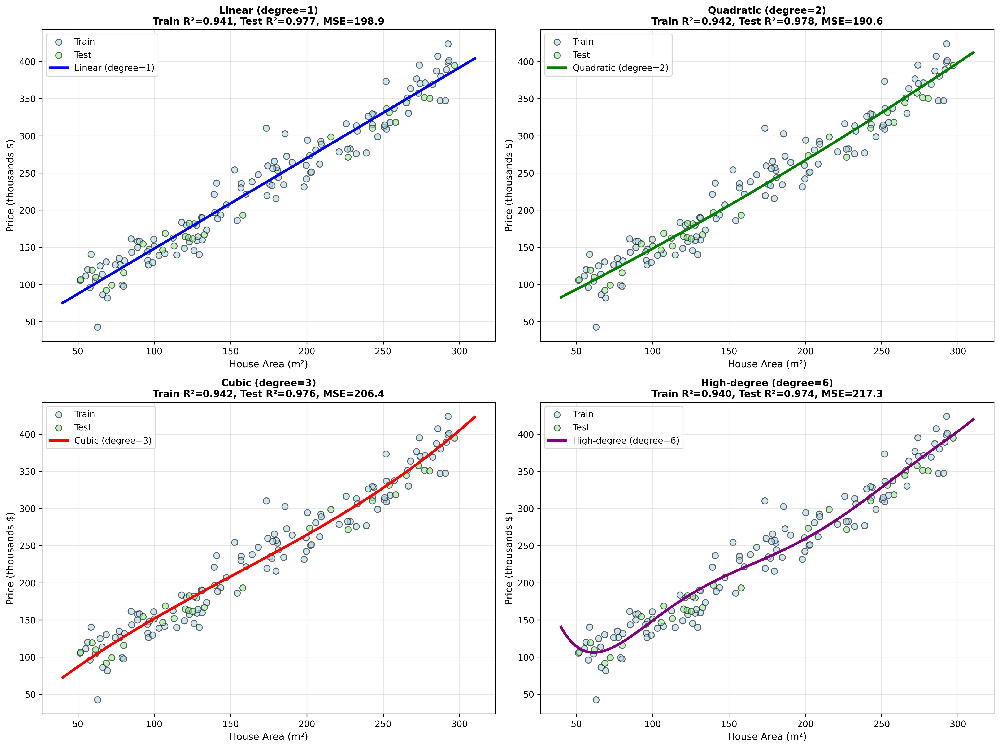

# Polynomial Regression from Scratch

A complete and professional implementation of **Polynomial Regression** using only NumPy, with detailed mathematical documentation.

## 📚 Table of Contents

- [Introduction](#introduction)
- [Mathematical Foundations](#mathematical-foundations)
  - [1. Polynomial Model](#1-polynomial-model)
  - [2. Feature Expansion](#2-feature-expansion)
  - [3. Cost Function](#3-cost-function)
  - [4. Gradient Descent](#4-gradient-descent)
  - [5. L2 Regularization](#5-l2-regularization-ridge)
  - [6. Bias-Variance Tradeoff](#6-bias-variance-tradeoff)
- [Evaluation Metrics](#evaluation-metrics)
- [Features](#features)
- [Installation](#installation)
- [Quick Start](#quick-start)
- [Examples](#examples)
- [Tests](#tests)

## 🎯 Introduction

Polynomial regression extends linear regression by modeling non-linear relationships through polynomial features. It transforms input features into polynomial combinations, allowing the model to capture complex patterns.

### When to use Polynomial Regression?

- ✅ Data shows non-linear patterns (curves, U-shapes, S-curves)
- ✅ Need more flexibility than linear regression
- ✅ Feature interactions are important
- ✅ Maintaining interpretability while modeling complexity

### Advantages vs Linear Regression

| Aspect | Linear Regression | Polynomial Regression |
|--------|------------------|---------------------|
| Flexibility | Low (straight lines) | High (curves) |
| Overfitting Risk | Low | Higher (needs regularization) |
| Interpretability | Very high | Moderate |
| Use Cases | Linear trends | Non-linear patterns |

---

## 📐 Mathematical Foundations

### 1. Polynomial Model

#### 1.1 Single Feature Polynomial

For one input feature $x$, a polynomial of degree $d$:


```math
\hat{y} = w_0 + w_1 x + w_2 x^2 + w_3 x^3 + \cdots + w_d x^d + b
```


Or in compact form:


```math
\hat{y} = \sum_{i=0}^{d} w_i x^i + b = w_0 + \sum_{i=1}^{d} w_i x^i + b
```


**Where:**
- $d$: **degree** of the polynomial
- $w_i$: weight for the $i$-th power of $x$
- $b$: bias term
- $x^i$: $x$ raised to power $i$

#### 1.2 Examples by Degree

**Degree 1 (Linear):**


```math
\hat{y} = w_1 x + b
```


**Degree 2 (Quadratic):**


```math
\hat{y} = w_1 x + w_2 x^2 + b
```


**Degree 3 (Cubic):**


```math
\hat{y} = w_1 x + w_2 x^2 + w_3 x^3 + b
```


**Degree 4 (Quartic):**


```math
\hat{y} = w_1 x + w_2 x^2 + w_3 x^3 + w_4 x^4 + b
```


#### 1.3 Matrix Form

For $n$ samples and degree $d$:


```math
\hat{\mathbf{y}} = \mathbf{X}_{\text{poly}} \mathbf{w} + b
```


**Where:**
- $\hat{\mathbf{y}} \in \mathbb{R}^n$: predictions (n\_samples,)
- $\mathbf{X}_{\text{poly}} \in \mathbb{R}^{n \times d}$: polynomial feature matrix
- $\mathbf{w} \in \mathbb{R}^d$: weights (d,)
- $b \in \mathbb{R}$: bias

---

### 2. Feature Expansion

#### 2.1 Polynomial Feature Transform

Transform original features $\mathbf{x} = [x_1, x_2, \ldots, x_p]$ into polynomial features.

**For single feature $x$:**


```math
\phi(x) = [x, x^2, x^3, \ldots, x^d]
```


**Example with $d=3$:**


```math
\begin{aligned}
x &= 2 \\
\phi(x) &= [2, 4, 8] = [2^1, 2^2, 2^3]
\end{aligned}
```


#### 2.2 Multiple Features

For $p$ input features and degree $d$, polynomial features include:
- All powers up to $d$
- All interaction terms

**Example with 2 features $(x_1, x_2)$ and $d=2$:**


```math
\phi(x_1, x_2) = [x_1, x_2, x_1^2, x_1 x_2, x_2^2]
```


**Number of polynomial features:**

For $p$ input features and degree $d$:


```math
n_{poly} = \frac{(p+d)!}{p! \cdot d!} - 1
```


Or using binomial coefficient notation:


```math
n_{poly} = \binom{p+d}{d} - 1
```


**Note:** The "-1" excludes the constant term (bias), which is handled separately.

**Example:**
- $p=1$, $d=3$: 3 features $[x, x^2, x^3]$
- $p=2$, $d=2$: 5 features $[x_1, x_2, x_1^2, x_1 x_2, x_2^2]$
- $p=3$, $d=2$: 9 features

#### 2.3 Feature Matrix Construction

**Original data** (n samples):


```math
X = \begin{bmatrix}
x_1^{(1)} \\\\
x_1^{(2)} \\\\
\vdots \\\\
x_1^{(n)}
\end{bmatrix}
```


**Polynomial features** (degree 3):


```math
X_{poly} = \begin{bmatrix}
x_1^{(1)} & (x_1^{(1)})^2 & (x_1^{(1)})^3 \\\\
x_1^{(2)} & (x_1^{(2)})^2 & (x_1^{(2)})^3 \\\\
\vdots & \vdots & \vdots \\\\
x_1^{(n)} & (x_1^{(n)})^2 & (x_1^{(n)})^3
\end{bmatrix}
```


Each row represents one sample, each column represents a polynomial feature.

---

### 3. Cost Function

#### 3.1 Mean Squared Error

Same as linear regression, but with polynomial features:


```math
\mathcal{L}(w, b) = \frac{1}{2n} \sum_{i=1}^{n} (y_i - \hat{y}_i)^2 = \frac{1}{2n} ||y - X_{poly} \cdot w - b||^2
```


#### 3.2 Expanded Form


```math
\mathcal{L}(w, b) = \frac{1}{2n} \sum_{i=1}^{n} \left(y_i - \sum_{j=1}^{d} w_j (x_i)^j - b\right)^2
```


**For degree 2:**


```math
\mathcal{L}(w, b) = \frac{1}{2n} \sum_{i=1}^{n} (y_i - w_1 x_i - w_2 x_i^2 - b)^2
```


---

### 4. Gradient Descent

#### 4.1 General Update Rule

Once features are transformed to $\mathbf{X}_{\text{poly}}$, optimization is identical to linear regression:


```math
\begin{aligned}
\mathbf{w} &\leftarrow \mathbf{w} - \alpha \nabla_{\mathbf{w}} \mathcal{L} \\
b &\leftarrow b - \alpha \nabla_{b} \mathcal{L}
\end{aligned}
```


#### 4.2 Gradient Computation

**Gradient with respect to weights:**


```math
\nabla_{\mathbf{w}} \mathcal{L} = \frac{1}{n} \mathbf{X}_{\text{poly}}^T (\mathbf{X}_{\text{poly}}\mathbf{w} + b - \mathbf{y})
```


**Gradient with respect to bias:**


```math
\nabla_{b} \mathcal{L} = \frac{1}{n} \sum_{i=1}^{n} (\hat{y}_i - y_i)
```


#### 4.3 Component-wise Gradients

For weight $w_j$ (coefficient of $x^j$):


```math
\frac{\partial \mathcal{L}}{\partial w_j} = \frac{1}{n} \sum_{i=1}^{n} (x_i)^j \cdot (\hat{y}_i - y_i)
```


**Example for degree 2:**


```math
\begin{aligned}
\frac{\partial \mathcal{L}}{\partial w_1} &= \frac{1}{n} \sum_{i=1}^{n} x_i \cdot (\hat{y}_i - y_i) \\
\frac{\partial \mathcal{L}}{\partial w_2} &= \frac{1}{n} \sum_{i=1}^{n} x_i^2 \cdot (\hat{y}_i - y_i)
\end{aligned}
```


#### 4.4 Gradient Descent Variants

Same as linear regression:
- **Batch GD**: Uses all samples
- **Mini-Batch GD**: Uses batches
- **SGD**: Uses one sample at a time

---

### 5. L2 Regularization (Ridge)

#### 5.1 Why Regularization is Critical

Polynomial regression with high degree $d$ has **many parameters**:


```math
\text{Risk of overfitting} \uparrow \text{ as } d \uparrow
```


**Example:**
- Degree 10 with 1 feature → 10 parameters
- Degree 5 with 3 features → 56 parameters!

Without regularization, weights can become **extremely large**, causing:
- ❌ Perfect fit on training data (overfitting)
- ❌ Terrible generalization on test data
- ❌ Numerical instability

#### 5.2 Regularized Cost Function


```math
\mathcal{L}_{\text{Ridge}}(\mathbf{w}, b) = \frac{1}{2n} \sum_{i=1}^{n} (y_i - \hat{y}_i)^2 + \frac{\lambda}{2} \|\mathbf{w}\|^2
```


**Interpretation:**
- $\lambda = 0$: No regularization (risk of overfitting)
- $\lambda$ small: Slight constraint on weights
- $\lambda$ large: Strong constraint (risk of underfitting)

#### 5.3 Gradient with Regularization


```math
\begin{aligned}
\nabla_{\mathbf{w}} \mathcal{L}_{\text{Ridge}} &= \frac{1}{n} \mathbf{X}_{\text{poly}}^T (\hat{\mathbf{y}} - \mathbf{y}) + \lambda \mathbf{w} \\
\nabla_{b} \mathcal{L}_{\text{Ridge}} &= \frac{1}{n} \sum_{i=1}^{n} (\hat{y}_i - y_i)
\end{aligned}
```


#### 5.4 Update Rule with Regularization


```math
\begin{aligned}
\mathbf{w} &\leftarrow (1 - \alpha\lambda) \mathbf{w} - \frac{\alpha}{n} \mathbf{X}_{\text{poly}}^T (\hat{\mathbf{y}} - \mathbf{y}) \\
b &\leftarrow b - \frac{\alpha}{n} \sum_{i=1}^{n} (\hat{y}_i - y_i)
\end{aligned}
```


The term $(1 - \alpha\lambda)$ causes **weight decay**.

---

### 6. Bias-Variance Tradeoff

#### 6.1 Error Decomposition

Total prediction error:


```math
\mathbb{E}[(y - \hat{y})^2] = \underbrace{\text{Bias}^2(\hat{y})}_{\text{Underfitting}} + \underbrace{\text{Var}(\hat{y})}_{\text{Overfitting}} + \underbrace{\sigma^2}_{\text{Irreducible}}
```


#### 6.2 Impact of Polynomial Degree

**Low degree** ($d = 1$ or $2$):
- High bias (underfitting)
- Low variance
- Cannot capture complex patterns

**Optimal degree** ($d$ moderate):
- Balanced bias and variance
- Good generalization

**High degree** ($d$ large):
- Low bias (fits training data perfectly)
- High variance (overfitting)
- Poor generalization

#### 6.3 Visualization

```
Error
  │
  │     Training Error
  │    /
  │   /
  │  /_______________  Test Error
  │        /\
  │       /  \
  │      /    \___________
  │     /
  └─────────────────────> Degree d
      Underfitting   Overfitting
```

#### 6.4 Choosing the Right Degree

**Methods:**
1. **Cross-validation**: Test multiple degrees, choose best validation score
2. **Learning curves**: Plot train/test error vs degree
3. **Regularization**: Use Ridge to constrain high-degree polynomials
4. **Domain knowledge**: Physical laws may suggest appropriate degree

---

## 📊 Evaluation Metrics

### 1. Mean Squared Error (MSE)


```math
\text{MSE} = \frac{1}{n} \sum_{i=1}^{n} (y_i - \hat{y}_i)^2
```


### 2. Root Mean Squared Error (RMSE)


```math
\text{RMSE} = \sqrt{\frac{1}{n} \sum_{i=1}^{n} (y_i - \hat{y}_i)^2}
```


### 3. Mean Absolute Error (MAE)


```math
\text{MAE} = \frac{1}{n} \sum_{i=1}^{n} |y_i - \hat{y}_i|
```


### 4. R² Score


```math
R^2 = 1 - \frac{\sum_{i=1}^{n}(y_i - \hat{y}_i)^2}{\sum_{i=1}^{n}(y_i - \bar{y})^2}
```


**Interpretation:**
- $R^2 = 1.0$: Perfect predictions
- $R^2 = 0.0$: Model = mean
- $R^2 < 0$: Worse than mean (very bad!)

### 5. Adjusted R²

Penalizes adding features:


```math
R^2_{\text{adj}} = 1 - \frac{(1-R^2)(n-1)}{n-d_{\text{poly}}-1}
```


**Important for polynomial regression** to avoid overfitting with high degrees!

---

## ✨ Features

### Core Capabilities
- ✅ Polynomial feature expansion (any degree)
- ✅ Single and multiple input features
- ✅ Interaction terms for multivariate data
- ✅ Batch/Mini-Batch/SGD optimization
- ✅ L2 Regularization (Ridge)
- ✅ Learning Rate Decay
- ✅ Early Stopping

### Code Quality
- ✅ Complete type hints
- ✅ Input validation
- ✅ Robust error handling
- ✅ Comprehensive tests
- ✅ Detailed documentation

---

## 🚀 Installation

```bash
# Required dependencies
pip install numpy

# For examples and visualizations
pip install matplotlib scikit-learn
```

---

## 💡 Quick Start

### Basic Example (Degree 2)

```python
import numpy as np
from polynomial_regression import PolynomialRegression
from utils import train_test_split, StandardScaler

# Generate non-linear data: y = 2x - 3x^2 + noise
np.random.seed(42)
X = np.linspace(-3, 3, 100).reshape(-1, 1)
y = 2*X.flatten() - 3*(X.flatten()**2) + np.random.randn(100)*2

# Split data
X_train, X_test, y_train, y_test = train_test_split(X, y, test_size=0.2)

# Normalize features (important!)
scaler = StandardScaler()
X_train_scaled = scaler.fit_transform(X_train)
X_test_scaled = scaler.transform(X_test)

# Create polynomial regression model (degree 2)
model = PolynomialRegression(
    degree=2,
    learning_rate=0.01,
    n_iterations=1000,
    verbose=True
)

# Train
model.fit(X_train_scaled, y_train)

# Predict
y_pred = model.predict(X_test_scaled)

# Evaluate
r2 = model.score(X_test_scaled, y_test)
print(f"R² Score: {r2:.4f}")
```

### With Regularization (Ridge)

```python
# For high degree polynomials, use regularization!
model = PolynomialRegression(
    degree=5,
    learning_rate=0.01,
    n_iterations=2000,
    regularization=0.1,  # Ridge
    verbose=True
)
model.fit(X_train_scaled, y_train)
```

### Degree Selection Example

```python
# Test multiple degrees
degrees = [1, 2, 3, 4, 5, 6, 7, 8]
train_scores = []
test_scores = []

for d in degrees:
    model = PolynomialRegression(degree=d, learning_rate=0.01, n_iterations=1000)
    model.fit(X_train_scaled, y_train)

    train_scores.append(model.score(X_train_scaled, y_train))
    test_scores.append(model.score(X_test_scaled, y_test))

# Plot to find optimal degree
import matplotlib.pyplot as plt
plt.plot(degrees, train_scores, label='Train')
plt.plot(degrees, test_scores, label='Test')
plt.xlabel('Polynomial Degree')
plt.ylabel('R² Score')
plt.legend()
plt.show()
```

---

## 📖 API Reference

### PolynomialRegression Class

#### Parameters

| Parameter | Type | Default | Description |
|-----------|------|---------|-------------|
| `degree` | int | 2 | Polynomial degree |
| `learning_rate` | float | 0.01 | Learning rate α |
| `n_iterations` | int | 1000 | Max iterations |
| `method` | str | 'batch' | 'batch', 'mini-batch', 'sgd' |
| `batch_size` | int | 32 | Batch size (mini-batch) |
| `regularization` | float | 0.0 | λ for L2 regularization |
| `learning_rate_decay` | float | 0.0 | LR decay rate |
| `early_stopping` | bool | False | Enable early stopping |
| `patience` | int | 10 | Patience for early stopping |
| `tolerance` | float | 1e-4 | Improvement tolerance |
| `random_state` | int | None | Random seed |
| `verbose` | bool | False | Display progress |

#### Methods

```python
fit(X, y)              # Train the model
predict(X)             # Make predictions
score(X, y)            # Calculate R² score
get_params()           # Get model parameters
```

---

## 🧪 Tests

Run complete test suite:

```bash
python test_polynomial_regression.py
```

Tests include:
- ✅ Simple polynomial regression (degree 2, 3)
- ✅ Degree comparison (1 to 8)
- ✅ Overfitting detection
- ✅ Regularization effectiveness
- ✅ Multivariate polynomial features
- ✅ Gradient descent variants
- ✅ Early stopping
- ✅ Error handling

---

## 📊 Visualizations

The `examples.py` script generates comprehensive visualizations:

### 1. Polynomial Degrees Comparison

Compares fits from degree 1 to 8 on the same dataset.



### 2. Overfitting Demonstration

Shows how high-degree polynomials overfit training data.



### 3. Regularization Effect

Demonstrates Ridge regularization controlling high-degree overfitting.



### 4. Learning Curves

Training vs test error as polynomial degree increases.



### 5. Feature Interactions (3D)

3D visualization of polynomial features with multiple inputs.



### 6. Real-World Example

Application to real-world non-linear data.



**To generate visualizations:**
```bash
python examples.py
```

---

## 🎓 Advanced Topics

### Polynomial Regression vs Neural Networks

Polynomial regression is a special case of neural networks:

**Polynomial Regression (Degree 3):**

```math
\hat{y} = w_1 x + w_2 x^2 + w_3 x^3 + b
```


**Equivalent to:** Single-layer network with polynomial activation.

### Computational Complexity

| Operation | Complexity |
|-----------|-----------|
| Feature expansion | $O(n \cdot d \cdot p)$ |
| Forward pass | $O(n \cdot d)$ |
| Gradient | $O(n \cdot d)$ |
| **Per epoch** | **$O(n \cdot d)$** |

**Where:** $n$ = samples, $d$ = polynomial degree, $p$ = original features

### Memory Usage

Polynomial features increase memory:
- Original: $O(n \cdot p)$
- Polynomial: $O(n \cdot \binom{p+d}{d})$

**Example:** $p=5$, $d=3$ → 35 polynomial features!

---

## ⚠️ Common Pitfalls

### 1. Not Normalizing Features

**Problem:** Higher powers create vastly different scales:
- $x = 100 \Rightarrow x^2 = 10,000, x^3 = 1,000,000$

**Solution:** Always use StandardScaler before polynomial expansion!

### 2. High Degree without Regularization

**Problem:** Overfitting with perfect training fit but poor test performance.

**Solution:** Use Ridge regularization ($\lambda > 0$) for $d \geq 4$.

### 3. Too Many Features

**Problem:** Curse of dimensionality with multiple input features.

**Solution:**
- Limit degree for multivariate data
- Use feature selection
- Consider interaction-only models

### 4. Ignoring Validation

**Problem:** Choosing degree based on training error only.

**Solution:** Use cross-validation to select optimal degree.

---

**Created with ❤️ for learning Machine Learning from Scratch**
