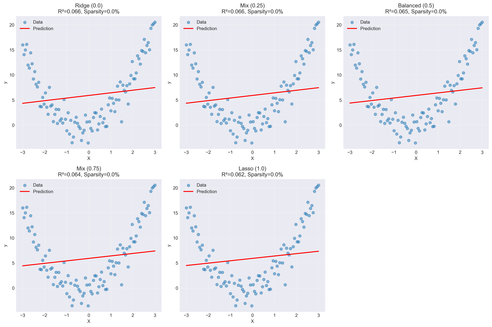
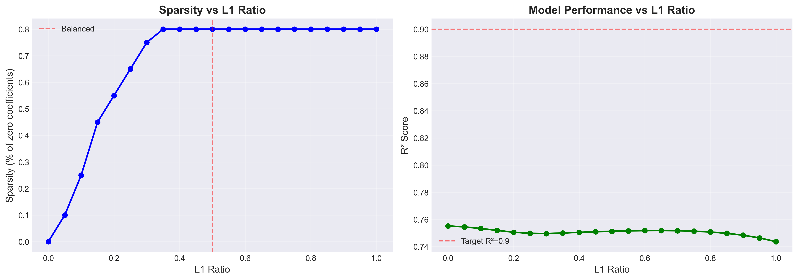
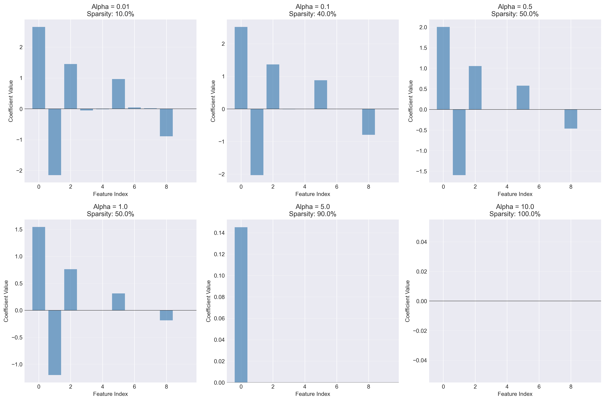
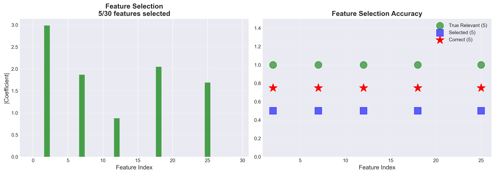
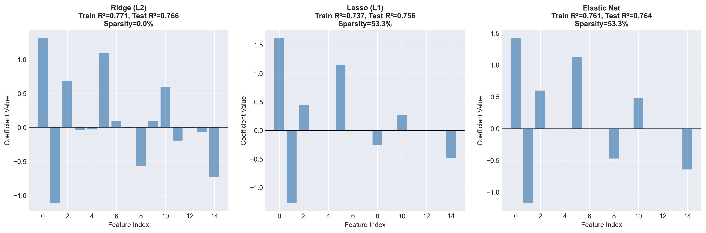
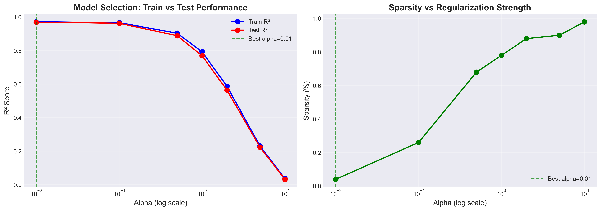

# Elastic Net Regression - Complete Implementation from Scratch

**Complete implementation of Elastic Net Regression using only NumPy, with comprehensive mathematical documentation, tests, and visualizations.**

---

## 📋 Table of Contents

1. [Mathematical Foundation](#-mathematical-foundation)
2. [Implementation](#-implementation)
3. [Usage Examples](#-usage-examples)
4. [Evaluation Metrics](#-evaluation-metrics)
5. [Visualizations](#-visualizations)
6. [Testing](#-testing)
7. [Files Structure](#-files-structure)
8. [Advanced Topics](#-advanced-topics)

---

## 🎯 What is Elastic Net?

**Elastic Net** is a regularized regression method that linearly combines the **L1 (Lasso)** and **L2 (Ridge)** penalties. It addresses limitations of both methods:

- **Ridge (L2)**: Shrinks coefficients but **never sets them to zero** → no feature selection
- **Lasso (L1)**: Can set coefficients to **exactly zero** → feature selection, but unstable with correlated features
- **Elastic Net**: **Best of both worlds** → feature selection + stability

---

## 📐 Mathematical Foundation

### 1. Model Formulation

#### 1.1 Prediction Function

For an input $\mathbf{x} \in \mathbb{R}^p$ with $p$ features:


```math
\hat{y} = \mathbf{w}^T \mathbf{x} + b = \sum_{j=1}^{p} w_j x_j + b
```


**Where:**
- $\mathbf{w} \in \mathbb{R}^p$: Weight vector (coefficients)
- $b \in \mathbb{R}$: Bias term (intercept)
- $\mathbf{x} \in \mathbb{R}^p$: Input features
- $\hat{y} \in \mathbb{R}$: Predicted value

#### 1.2 Matrix Form

For $n$ samples:


```math
\hat{\mathbf{y}} = \mathbf{X} \mathbf{w} + b
```


**Where:**
- $\mathbf{X} \in \mathbb{R}^{n \times p}$: Feature matrix (n samples, p features)
- $\hat{\mathbf{y}} \in \mathbb{R}^n$: Predictions vector

---

### 2. Cost Function (Loss Function)

#### 2.1 Elastic Net Loss

The Elastic Net combines Mean Squared Error with both L1 and L2 penalties:


```math
\mathcal{L}(\mathbf{w}, b) = \frac{1}{2n} \sum_{i=1}^{n} (y_i - \hat{y}_i)^2 + \lambda_1 \|\mathbf{w}\|_1 + \lambda_2 \|\mathbf{w}\|_2^2
```


**Or in compact form:**


```math
\mathcal{L}(\mathbf{w}, b) = \text{MSE} + \lambda_1 \sum_{j=1}^{p} |w_j| + \lambda_2 \sum_{j=1}^{p} w_j^2
```


**Components:**

1. **MSE term**: Measures prediction error

```math
\frac{1}{2n} \sum_{i=1}^{n} (y_i - \hat{y}_i)^2
```

2. **L1 penalty**: Induces sparsity (feature selection)

```math
\lambda_1 \|\mathbf{w}\|_1 = \lambda_1 \sum_{j=1}^{p} |w_j|
```

3. **L2 penalty**: Shrinks coefficients (regularization)

```math
\lambda_2 \|\mathbf{w}\|_2^2 = \lambda_2 \sum_{j=1}^{p} w_j^2
```

#### 2.2 Parameterization

In practice, we use a single parameter $\alpha$ (overall strength) and $\rho$ (mixing ratio):


```math
\lambda_1 = \alpha \rho \quad \text{and} \quad \lambda_2 = \alpha (1 - \rho)
```


**Where:**
- $\alpha \geq 0$: Overall regularization strength
- $0 \leq \rho \leq 1$: L1 ratio (mixing parameter)

**Special cases:**
- $\rho = 0$: Pure Ridge regression (L2 only)
- $\rho = 1$: Pure Lasso regression (L1 only)
- $0 < \rho < 1$: True Elastic Net (combination)

#### 2.3 Final Loss Formula


```math
\mathcal{L}(\mathbf{w}, b) = \frac{1}{2n} \|\mathbf{y} - \mathbf{X}\mathbf{w} - b\|^2 + \alpha \rho \|\mathbf{w}\|_1 + \frac{\alpha(1-\rho)}{2} \|\mathbf{w}\|_2^2
```


---

### 3. Optimization: Gradient Descent + Proximal Operator

Elastic Net requires a special optimization approach because the L1 term is **non-differentiable** at zero.

#### 3.1 Gradient of MSE + L2

The gradient with respect to weights (excluding L1):


```math
\nabla_{\mathbf{w}} \mathcal{L}_{\text{MSE+L2}} = \frac{1}{n} \mathbf{X}^T (\mathbf{X}\mathbf{w} + b - \mathbf{y}) + \alpha(1-\rho) \mathbf{w}
```


The gradient with respect to bias:


```math
\nabla_{b} \mathcal{L} = \frac{1}{n} \sum_{i=1}^{n} (\hat{y}_i - y_i)
```


#### 3.2 Proximal Gradient Descent

**Step 1**: Update weights using gradient of MSE + L2:


```math
\mathbf{w}^{temp} = \mathbf{w} - \eta \left[ \frac{1}{n} \mathbf{X}^T (\mathbf{X}\mathbf{w} + b - \mathbf{y}) \right]
```


**Step 2**: Apply L2 weight decay:


```math
\mathbf{w}^{temp} = (1 - \eta \alpha (1-\rho)) \mathbf{w}^{temp}
```


**Step 3**: Apply soft-thresholding (proximal operator for L1):


```math
w_j = \text{sign}(w_j^{temp}) \cdot \max(|w_j^{temp}| - \eta \alpha \rho, 0)
```


**This is called the soft-thresholding operator:**


```math
\text{soft}(w, \lambda) = \begin{cases}
w - \lambda & \text{if } w > \lambda \\
0 & \text{if } |w| \leq \lambda \\
w + \lambda & \text{if } w < -\lambda
\end{cases}
```


**Why it works:**
- L1 penalty "pushes" small coefficients to **exactly zero** → feature selection
- L2 penalty "shrinks" all coefficients → stability

#### 3.3 Complete Update Rule


```math
\begin{aligned}
\mathbf{w} &\leftarrow \text{soft}\left((1 - \eta \alpha (1-\rho)) \mathbf{w} - \eta \nabla_{\mathbf{w}} \text{MSE}, \eta \alpha \rho \right) \\\\
b &\leftarrow b - \eta \nabla_b \mathcal{L}
\end{aligned}
```


---

### 4. Why Elastic Net?

#### 4.1 Comparison of Regularization Methods

| Method | L1 Penalty | L2 Penalty | Feature Selection | Handles Correlation | Stability |
|--------|------------|------------|-------------------|---------------------|-----------|
| **Ridge** | ✗ | ✓ | ✗ | ✓ | ✓ |
| **Lasso** | ✓ | ✗ | ✓ | ✗ | ✗ |
| **Elastic Net** | ✓ | ✓ | ✓ | ✓ | ✓ |

#### 4.2 Geometric Interpretation

**Constraint regions:**
- **Ridge**: $\|\mathbf{w}\|_2^2 \leq t$ → Circle/sphere (smooth)
- **Lasso**: $\|\mathbf{w}\|_1 \leq t$ → Diamond (corners at axes → sparsity)
- **Elastic Net**: Combination → Rounded diamond

The contours of the loss function (ellipses) intersect the constraint region:
- **Lasso**: Often at corners → sparse solutions
- **Elastic Net**: Balance between corners and edges → controlled sparsity

---

### 5. Gradient Descent Variants

#### 5.1 Batch Gradient Descent

Uses **all samples** in each iteration:


```math
\nabla_{\mathbf{w}} \mathcal{L} = \frac{1}{n} \sum_{i=1}^{n} \mathbf{x}_i (\mathbf{w}^T \mathbf{x}_i + b - y_i)
```


- **Pros**: Stable, smooth convergence
- **Cons**: Slow for large datasets

#### 5.2 Stochastic Gradient Descent (SGD)

Uses **one sample** per iteration:


```math
\nabla_{\mathbf{w}} \mathcal{L} \approx \mathbf{x}_i (\mathbf{w}^T \mathbf{x}_i + b - y_i)
```


- **Pros**: Fast, can escape local minima
- **Cons**: Noisy, unstable

#### 5.3 Mini-Batch Gradient Descent

Uses **batch of samples** (e.g., 32, 64, 128):


```math
\nabla_{\mathbf{w}} \mathcal{L} \approx \frac{1}{B} \sum_{i \in \text{batch}} \mathbf{x}_i (\mathbf{w}^T \mathbf{x}_i + b - y_i)
```


- **Pros**: Balance between speed and stability
- **Recommended**: Default choice for most cases

---

### 6. Evaluation Metrics

#### 6.1 Mean Squared Error (MSE)


```math
\text{MSE} = \frac{1}{n} \sum_{i=1}^{n} (y_i - \hat{y}_i)^2
```


#### 6.2 Root Mean Squared Error (RMSE)


```math
\text{RMSE} = \sqrt{\text{MSE}}
```


#### 6.3 R² Score (Coefficient of Determination)


```math
R^2 = 1 - \frac{\sum_{i=1}^{n} (y_i - \hat{y}_i)^2}{\sum_{i=1}^{n} (y_i - \bar{y})^2} = 1 - \frac{\text{SS}_{\text{res}}}{\text{SS}_{\text{tot}}}
```


**Interpretation:**
- $R^2 = 1$: Perfect fit
- $R^2 = 0$: Model performs as well as predicting the mean
- $R^2 < 0$: Model performs worse than predicting the mean

#### 6.4 Adjusted R²

Penalizes adding irrelevant features:


```math
R^2_{\text{adj}} = 1 - \frac{(1 - R^2)(n - 1)}{n - p - 1}
```


**Where:**
- $n$: Number of samples
- $p$: Number of features

---

## 💻 Implementation

### Features

- ✅ **Combined L1 + L2 regularization** with configurable mixing
- ✅ **Soft-thresholding operator** for L1 penalty
- ✅ **Batch / Mini-Batch / SGD** gradient descent
- ✅ **Early stopping** with validation split
- ✅ **Learning rate decay**
- ✅ **Feature selection** via sparsity
- ✅ **Numerical stability** (gradient clipping, overflow prevention)
- ✅ **Complete preprocessing utilities** (StandardScaler, MinMaxScaler)
- ✅ **7 evaluation metrics**
- ✅ **Type hints** and comprehensive docstrings

### Files Structure

```
03_ELASTIC_NET/
├── README.md                    # This file - complete documentation
├── elastic_net.py              # Main ElasticNet implementation
├── metrics.py                   # 7 evaluation metrics
├── utils.py                     # Preprocessing utilities
├── test_elastic_net.py         # 8 comprehensive test suites
├── examples.py                  # 6 visual examples
└── images/                      # Generated visualizations
    ├── example_1_l1_ratio_comparison.png
    ├── example_2_sparsity_analysis.png
    ├── example_3_regularization_strength.png
    ├── example_4_feature_selection.png
    ├── example_5_comparison.png
    └── example_6_real_world.png
```

---

## 🚀 Usage Examples

### Example 1: Basic Usage

```python
import numpy as np
from elastic_net import ElasticNet
from utils import StandardScaler, train_test_split

# Generate data
np.random.seed(42)
X = np.random.randn(200, 10)
y = 2*X[:, 0] + 3*X[:, 1] - X[:, 2] + np.random.randn(200) * 0.5

# Split and scale
X_train, X_test, y_train, y_test = train_test_split(X, y, test_size=0.2)

scaler = StandardScaler()
X_train_scaled = scaler.fit_transform(X_train)
X_test_scaled = scaler.transform(X_test)

# Train Elastic Net
model = ElasticNet(
    learning_rate=0.01,
    n_iterations=1000,
    l1_ratio=0.5,        # 50% L1, 50% L2
    alpha=1.0,           # Overall regularization strength
    early_stopping=True,
    random_state=42
)

model.fit(X_train_scaled, y_train)

# Evaluate
train_r2 = model.score(X_train_scaled, y_train)
test_r2 = model.score(X_test_scaled, y_test)

print(f"Train R²: {train_r2:.4f}")
print(f"Test R²: {test_r2:.4f}")
print(f"Sparsity: {model.get_sparsity():.2%}")
```

### Example 2: Feature Selection

```python
# Generate data with irrelevant features
X = np.random.randn(200, 50)  # 50 features
true_weights = np.zeros(50)
true_weights[[0, 5, 10, 15, 20]] = [3, -2, 1.5, -1, 2]  # Only 5 are relevant
y = np.dot(X, true_weights) + np.random.randn(200) * 0.5

# Train with high L1 for feature selection
model = ElasticNet(
    learning_rate=0.01,
    n_iterations=2000,
    l1_ratio=0.8,  # High L1 for sparsity
    alpha=1.0
)

model.fit(X, y)

# Get selected features
selected = model.get_nonzero_features()
print(f"Selected features: {selected}")
print(f"Number of selected features: {len(selected)}/50")
print(f"Sparsity: {model.get_sparsity():.1%}")
```

### Example 3: Comparing Ridge vs Lasso vs Elastic Net

```python
# Pure Ridge (l1_ratio=0.0)
ridge = ElasticNet(l1_ratio=0.0, alpha=1.0, n_iterations=1000)
ridge.fit(X_train, y_train)

# Pure Lasso (l1_ratio=1.0)
lasso = ElasticNet(l1_ratio=1.0, alpha=1.0, n_iterations=1000)
lasso.fit(X_train, y_train)

# Elastic Net (l1_ratio=0.5)
elastic = ElasticNet(l1_ratio=0.5, alpha=1.0, n_iterations=1000)
elastic.fit(X_train, y_train)

print(f"Ridge - R²: {ridge.score(X_test, y_test):.4f}, Sparsity: {ridge.get_sparsity():.1%}")
print(f"Lasso - R²: {lasso.score(X_test, y_test):.4f}, Sparsity: {lasso.get_sparsity():.1%}")
print(f"Elastic Net - R²: {elastic.score(X_test, y_test):.4f}, Sparsity: {elastic.get_sparsity():.1%}")
```

---

## 📊 Visualizations

The `examples.py` script generates 6 comprehensive visualizations:

### 1. L1 Ratio Comparison

Compares different l1_ratio values (0.0, 0.25, 0.5, 0.75, 1.0) on the same dataset.



### 2. Sparsity Analysis

Shows how sparsity increases with L1 ratio.



### 3. Regularization Strength Effect

Demonstrates the effect of different alpha values on coefficient magnitude and sparsity.



### 4. Feature Selection

Visualization of feature selection on high-dimensional data.



### 5. Ridge vs Lasso vs Elastic Net

Direct comparison of the three methods.



### 6. Real-World Scenario

Cross-validation to find optimal regularization strength.



**To generate visualizations:**
```bash
python examples.py
```

---

## 🧪 Testing

The test suite includes 8 comprehensive tests:

1. **Basic functionality** - Simple linear regression
2. **Multivariate regression** - Multiple features
3. **Pure Ridge** - l1_ratio=0.0
4. **Pure Lasso** - l1_ratio=1.0
5. **Early stopping** - Validation and patience
6. **Batch modes** - Batch/Mini-Batch/SGD
7. **Metrics** - All evaluation functions
8. **Utils** - Preprocessing utilities

**Run tests:**
```bash
python test_elastic_net.py
```

**Expected output:**
```
======================================================================
               ELASTIC NET - COMPREHENSIVE TEST SUITE
======================================================================

... (test details) ...

======================================================================
TEST SUMMARY
======================================================================
Total Tests: 8
Passed: 8
Failed: 0

*** ALL TESTS PASSED! ***
======================================================================
```

---

## 🎓 Advanced Topics

### 1. Choosing l1_ratio

**Guidelines:**
- **More features than samples** ($p > n$): Use higher l1_ratio (0.7-0.9) for feature selection
- **Correlated features**: Use lower l1_ratio (0.3-0.5) for stability
- **Need interpretability**: Use higher l1_ratio for sparse models
- **Need stability**: Use lower l1_ratio for smooth coefficient paths

### 2. Choosing alpha

Use **cross-validation** to select optimal alpha:

```python
alphas = [0.01, 0.1, 0.5, 1.0, 5.0, 10.0]
best_alpha = None
best_score = -np.inf

for alpha in alphas:
    model = ElasticNet(l1_ratio=0.5, alpha=alpha)
    model.fit(X_train, y_train)
    score = model.score(X_val, y_val)

    if score > best_score:
        best_score = score
        best_alpha = alpha

print(f"Best alpha: {best_alpha}")
```

### 3. Feature Standardization

**CRITICAL**: Always standardize features before using Elastic Net!

**Why?**
- L1 and L2 penalties are **scale-dependent**
- Features with larger scales will be penalized more
- Standardization ensures fair comparison

```python
scaler = StandardScaler()
X_scaled = scaler.fit_transform(X)
```

### 4. Handling High-Dimensional Data

For $p \gg n$ (many more features than samples):

1. Use **high l1_ratio** (0.8-0.95) for aggressive feature selection
2. Start with **large alpha**, gradually decrease
3. Use **cross-validation** to avoid overfitting
4. Monitor **sparsity level**

### 5. Convergence Tips

If model doesn't converge:
- **Increase n_iterations**
- **Decrease learning_rate**
- **Enable early_stopping**
- **Use learning rate decay**
- **Check feature scaling**

---

## 📝 Key Differences from Ridge and Lasso

| Aspect | Ridge | Lasso | Elastic Net |
|--------|-------|-------|-------------|
| **Penalty** | L2: $\lambda \\|\mathbf{w}\\|_2^2$ | L1: $\lambda \\|\mathbf{w}\\|_1$ | L1 + L2: $\lambda_1\\|\mathbf{w}\\|_1 + \lambda_2\\|\mathbf{w}\\|_2^2$ |
| **Sparsity** | No (all coefficients non-zero) | Yes (some coefficients = 0) | Yes (controlled sparsity) |
| **Feature Selection** | No | Yes | Yes |
| **Correlated Features** | Stable (averages coefficients) | Unstable (picks one randomly) | Stable (handles groups) |
| **Optimization** | Closed-form or gradient descent | Proximal gradient descent | Proximal gradient descent |
| **Use Case** | Multicollinearity, all features important | High dimensions, feature selection | Best of both worlds |

---

## 🔍 Common Pitfalls

### 1. Forgetting to Scale Features

**Problem:** Features with different scales lead to biased regularization.

**Solution:** Always use StandardScaler or MinMaxScaler.

### 2. Using High alpha Without Validation

**Problem:** Too much regularization → underfitting.

**Solution:** Use cross-validation to tune alpha.

### 3. Expecting Perfect Sparsity with Low l1_ratio

**Problem:** Low l1_ratio means less L1 penalty → less sparsity.

**Solution:** Increase l1_ratio if you need feature selection.

### 4. Not Checking Convergence

**Problem:** Model may not have converged.

**Solution:** Monitor loss history, use early_stopping, increase n_iterations.

---

**Created with ❤️ for learning Machine Learning from Scratch**
