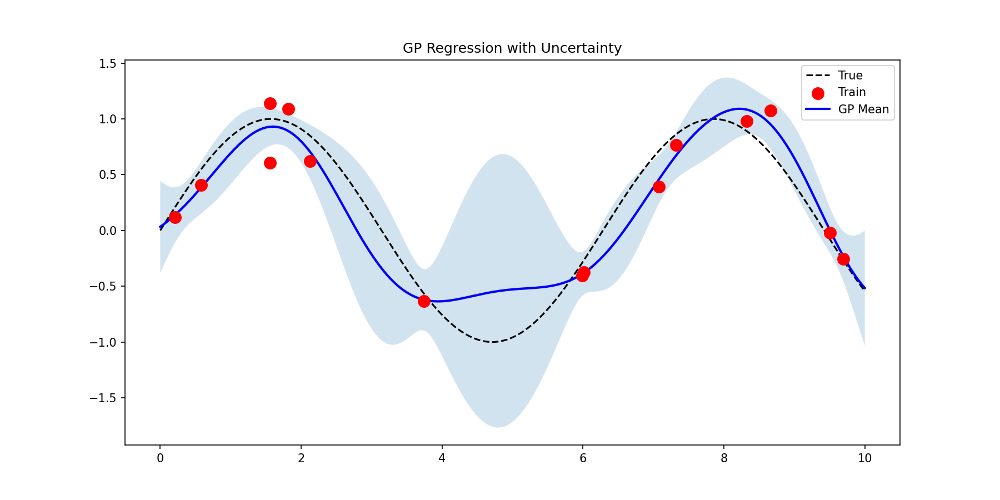
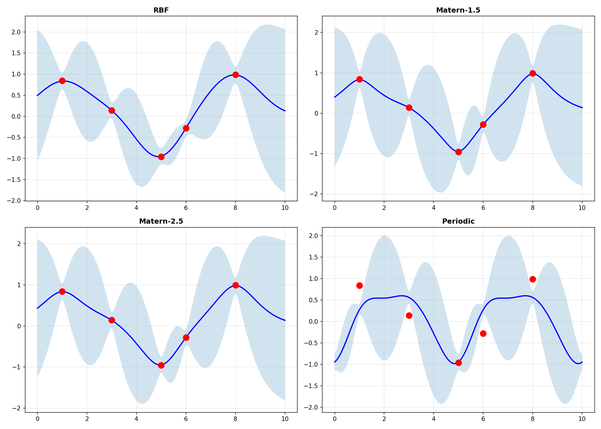
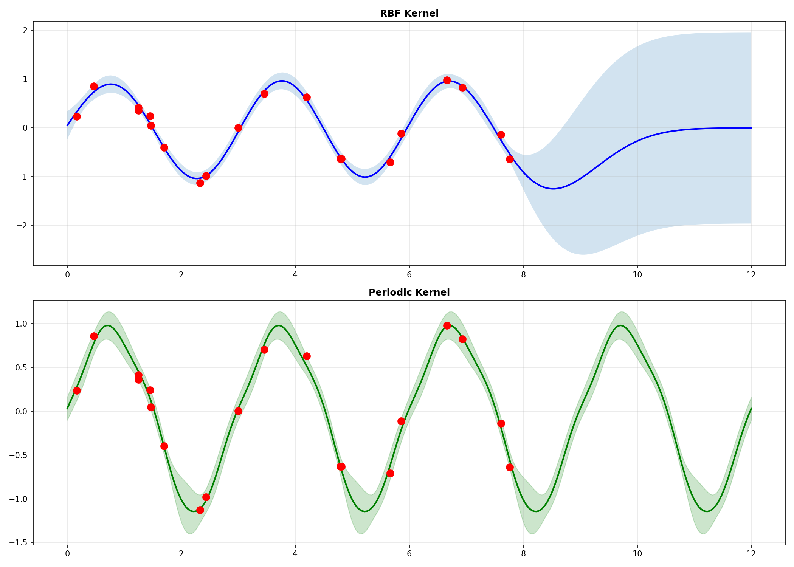
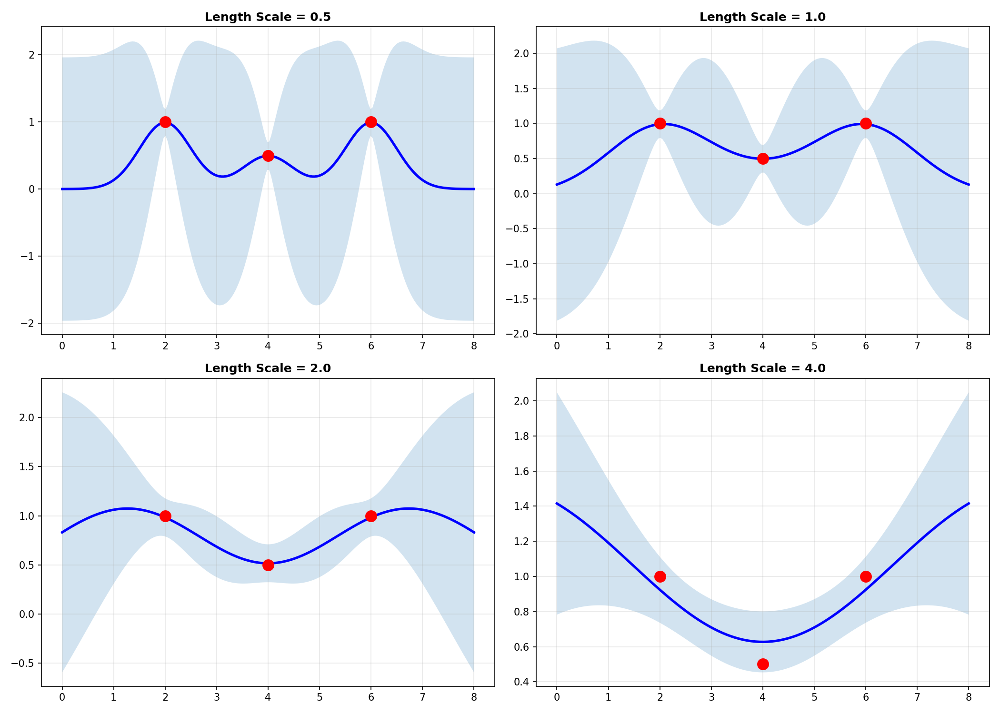
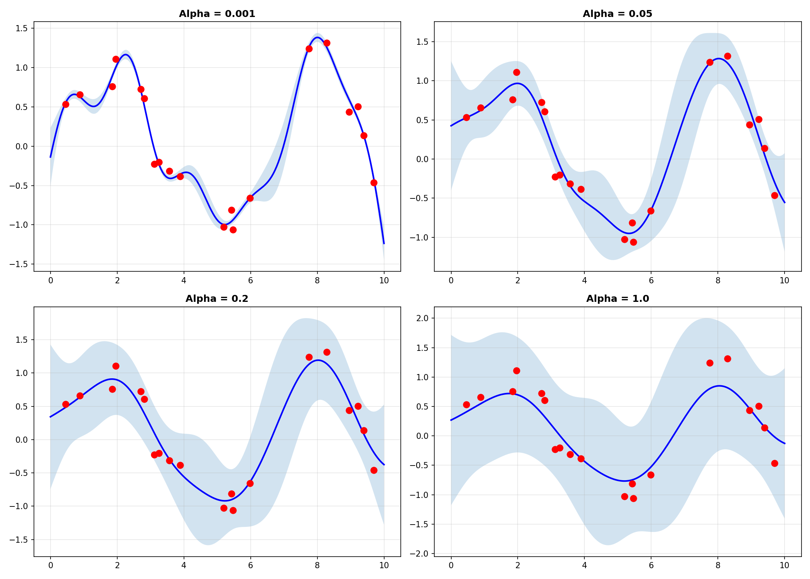
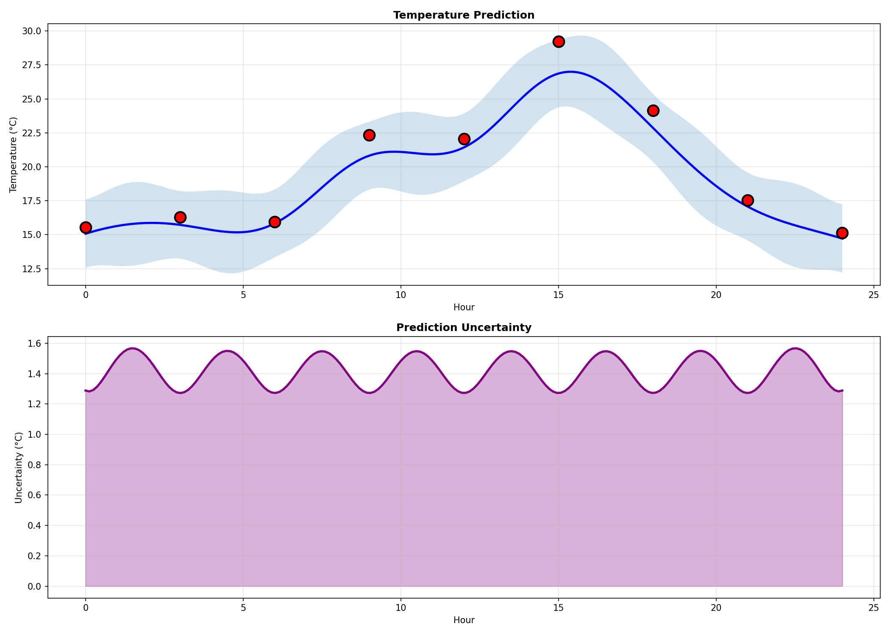

# Gaussian Processes from Scratch

A complete and professional implementation of **Gaussian Process Regression** using only NumPy, with detailed mathematical documentation and multiple kernel functions.

## 📚 Table of Contents

- [Introduction](#introduction)
- [Mathematical Foundations](#mathematical-foundations)
  - [1. Gaussian Process Definition](#1-gaussian-process-definition)
  - [2. Kernel Functions (Covariance Functions)](#2-kernel-functions-covariance-functions)
  - [3. Posterior Inference](#3-posterior-inference)
  - [4. Numerical Stability (Cholesky Decomposition)](#4-numerical-stability-cholesky-decomposition)
  - [5. Log Marginal Likelihood](#5-log-marginal-likelihood)
  - [6. Kernel Catalog](#6-kernel-catalog)
- [Implementation Details](#implementation-details)
- [Evaluation Metrics](#evaluation-metrics)
- [Features](#features)
- [Installation](#installation)
- [Quick Start](#quick-start)
- [Detailed Documentation](#detailed-documentation)
- [Examples](#examples)
- [Performance Considerations](#performance-considerations)
- [API Reference](#api-reference)

## 🎯 Introduction

Gaussian Processes (GPs) are a powerful non-parametric Bayesian approach to regression and classification. Unlike traditional machine learning models that learn a fixed number of parameters, GPs represent a **distribution over functions** and provide **uncertainty quantification** for predictions.

### What are Gaussian Processes?

A Gaussian Process is a collection of random variables, any finite number of which have a joint Gaussian distribution. In the context of regression, a GP defines a distribution over functions $f(\mathbf{x})$ such that for any finite set of inputs $\mathbf{X} = \{\mathbf{x}_1, ..., \mathbf{x}_n\}$, the function values $\mathbf{f} = [f(\mathbf{x}_1), ..., f(\mathbf{x}_n)]^T$ follow a multivariate Gaussian distribution.

### When to use Gaussian Processes?

- ✅ **Uncertainty quantification** is critical (medical, finance, safety-critical systems)
- ✅ **Small to medium datasets** (n < 10,000) due to computational complexity
- ✅ **Non-linear relationships** with smooth functions
- ✅ **Prior knowledge** can be encoded through kernel choice
- ✅ **Interpretability** through kernel analysis
- ✅ **Active learning** and Bayesian optimization scenarios
- ✅ **Time series** with irregular sampling or missing data

### Advantages over other methods

- 🎯 **Principled uncertainty**: Not just point predictions, but full predictive distributions
- 🎯 **Non-parametric**: Model complexity grows with data
- 🎯 **Flexible**: Many kernel choices for different function classes
- 🎯 **Probabilistic framework**: Bayesian inference, model comparison
- 🎯 **No overfitting in classical sense**: Regularization through kernel hyperparameters

### Limitations

- ⚠️ **Computational cost**: $O(n^3)$ training, $O(n^2)$ prediction
- ⚠️ **Memory**: Requires storing $n \times n$ kernel matrix
- ⚠️ **Kernel choice**: Requires domain knowledge or cross-validation
- ⚠️ **High-dimensional inputs**: Kernel functions may struggle with d > 20

## 📐 Mathematical Foundations

### 1. Gaussian Process Definition

#### 1.1 Function Space View

A Gaussian Process is completely specified by its **mean function** $m(\mathbf{x})$ and **covariance function** (kernel) $k(\mathbf{x}, \mathbf{x}')$:

```math
f(\mathbf{x}) \sim \mathcal{GP}(m(\mathbf{x}), k(\mathbf{x}, \mathbf{x}'))
```

**Mean function** (typically assumed to be zero):

```math
m(\mathbf{x}) = \mathbb{E}[f(\mathbf{x})]
```

**Covariance function** (kernel):

```math
k(\mathbf{x}, \mathbf{x}') = \mathbb{E}[(f(\mathbf{x}) - m(\mathbf{x}))(f(\mathbf{x}') - m(\mathbf{x}'))]
```

#### 1.2 Prior Distribution

For any finite set of training inputs $\mathbf{X} = [\mathbf{x}_1, ..., \mathbf{x}_n]^T$, the function values follow a multivariate Gaussian:

```math
\mathbf{f} = [f(\mathbf{x}_1), ..., f(\mathbf{x}_n)]^T \sim \mathcal{N}(\mathbf{m}, \mathbf{K})
```

**Where:**

- Mean vector:

```math
\mathbf{m} = [m(\mathbf{x}_1), ..., m(\mathbf{x}_n)]^T \in \mathbb{R}^n
```

- Covariance (kernel) matrix:

```math
\mathbf{K} \in \mathbb{R}^{n \times n}
```

- Covariance between points i and j:

```math
K_{ij} = k(\mathbf{x}_i, \mathbf{x}_j)
```

#### 1.3 Noisy Observations

In practice, we observe noisy targets:

```math
y_i = f(\mathbf{x}_i) + \epsilon_i, \quad \epsilon_i \sim \mathcal{N}(0, \sigma_n^2)
```

The joint distribution of observations becomes:

```math
\mathbf{y} \sim \mathcal{N}(\mathbf{m}, \mathbf{K} + \sigma_n^2 \mathbf{I})
```

**Where:**
- $\sigma_n^2$: observation noise variance
- $\mathbf{I}$: identity matrix

---

### 2. Kernel Functions (Covariance Functions)

The kernel function $k(\mathbf{x}, \mathbf{x}')$ encodes our assumptions about the function we're modeling:
- **Smoothness**: How rapidly the function varies
- **Periodicity**: Whether the function repeats
- **Linearity**: Whether the function has linear components
- **Stationarity**: Whether correlations depend only on distance

#### 2.1 Kernel Properties

A valid kernel must be:

1. **Symmetric**: $k(\mathbf{x}, \mathbf{x}') = k(\mathbf{x}', \mathbf{x})$
2. **Positive semi-definite**: For any set of points, the kernel matrix $\mathbf{K}$ must satisfy:

```math
\mathbf{v}^T \mathbf{K} \mathbf{v} \geq 0, \quad \forall \mathbf{v} \in \mathbb{R}^n
```

#### 2.2 Kernel Construction

Kernels can be combined to create more complex covariance structures:

**Sum of kernels** (captures multiple patterns):

```math
k(\mathbf{x}, \mathbf{x}') = k_1(\mathbf{x}, \mathbf{x}') + k_2(\mathbf{x}, \mathbf{x}')
```

**Product of kernels** (combines properties):

```math
k(\mathbf{x}, \mathbf{x}') = k_1(\mathbf{x}, \mathbf{x}') \cdot k_2(\mathbf{x}, \mathbf{x}')
```

---

### 3. Posterior Inference

#### 3.1 The Prediction Problem

**Given:**

Training data:

```math
\mathcal{D} = \{(\mathbf{x}_i, y_i)\}_{i=1}^n
```

Test inputs:

```math
\mathbf{X}_* = [\mathbf{x}_{*1}, ..., \mathbf{x}_{*m}]^T
```

**Find:**

Predictive distribution:

```math
p(f_* | \mathbf{X}_*, \mathbf{X}, \mathbf{y})
```

#### 3.2 Joint Prior Distribution

The joint distribution of training outputs **y** and test outputs **f_*** is:

```math
\begin{bmatrix}
\mathbf{y} \\
\mathbf{f}_*
\end{bmatrix}
\sim \mathcal{N}\left(
\mathbf{0},
\begin{bmatrix}
\mathbf{K} + \sigma_n^2 \mathbf{I} & \mathbf{K}_* \\
\mathbf{K}_*^T & \mathbf{K}_{**}
\end{bmatrix}
\right)
```

**Where:**

Training-training kernel:

```math
\mathbf{K} = k(\mathbf{X}, \mathbf{X}) \in \mathbb{R}^{n \times n}
```

Training-test kernel:

```math
\mathbf{K}_* = k(\mathbf{X}, \mathbf{X}_*) \in \mathbb{R}^{n \times m}
```

Test-test kernel:

```math
\mathbf{K}_{**} = k(\mathbf{X}_*, \mathbf{X}_*) \in \mathbb{R}^{m \times m}
```

#### 3.3 Posterior Distribution

Using the properties of conditional Gaussians, the posterior predictive distribution is:

```math
\boxed{p(\mathbf{f}_* | \mathbf{X}_*, \mathbf{X}, \mathbf{y}) = \mathcal{N}(\boldsymbol{\mu}_*, \boldsymbol{\Sigma}_*)}
```

**Predictive mean**:

```math
\boxed{\boldsymbol{\mu}_* = \mathbf{K}_*^T (\mathbf{K} + \sigma_n^2 \mathbf{I})^{-1} \mathbf{y}}
```

**Predictive covariance**:

```math
\boxed{\boldsymbol{\Sigma}_* = \mathbf{K}_{**} - \mathbf{K}_*^T (\mathbf{K} + \sigma_n^2 \mathbf{I})^{-1} \mathbf{K}_*}
```

**Predictive variance** (diagonal of covariance):

```math
\sigma^2_*(\mathbf{x}_*) = k(\mathbf{x}_*, \mathbf{x}_*) - \mathbf{k}_*^T (\mathbf{K} + \sigma_n^2 \mathbf{I})^{-1} \mathbf{k}_*
```

Where:

```math
\mathbf{k}_* = k(\mathbf{X}, \mathbf{x}_*)
```

is the vector of covariances between training points and test point **x_***.

#### 3.4 Derivation of Posterior (Conditional Gaussian)

Given the joint Gaussian:

```math
\begin{bmatrix}
\mathbf{y} \\
\mathbf{f}_*
\end{bmatrix}
\sim \mathcal{N}\left(
\begin{bmatrix}
\boldsymbol{\mu}_y \\
\boldsymbol{\mu}_*
\end{bmatrix},
\begin{bmatrix}
\mathbf{A} & \mathbf{C} \\
\mathbf{C}^T & \mathbf{B}
\end{bmatrix}
\right)
```

The conditional distribution is:

```math
\mathbf{f}_* | \mathbf{y} \sim \mathcal{N}(\boldsymbol{\mu}_* + \mathbf{C}^T \mathbf{A}^{-1}(\mathbf{y} - \boldsymbol{\mu}_y), \mathbf{B} - \mathbf{C}^T \mathbf{A}^{-1} \mathbf{C})
```

With our notation:

```math
\boldsymbol{\mu}_y = \boldsymbol{\mu}_* = \mathbf{0}, \quad \mathbf{A} = \mathbf{K} + \sigma_n^2 \mathbf{I}, \quad \mathbf{C} = \mathbf{K}_*, \quad \mathbf{B} = \mathbf{K}_{**}
```

we get the posterior formulas above.

#### 3.5 Representer Theorem

Define the weights:

```math
\boldsymbol{\alpha} = (\mathbf{K} + \sigma_n^2 \mathbf{I})^{-1} \mathbf{y}
```

Then the predictive mean can be written as:

```math
\boxed{\mu_*(\mathbf{x}_*) = \sum_{i=1}^n \alpha_i k(\mathbf{x}_i, \mathbf{x}_*)}
```

This shows that the GP posterior mean is a **linear combination of kernel functions** centered at training points—similar to kernel methods and support vector machines.

---

### 4. Numerical Stability (Cholesky Decomposition)

#### 4.1 The Problem

Direct matrix inversion is:
- Computationally expensive: O(n³)
- Numerically unstable: small eigenvalues cause issues
- Inefficient: we solve the same system multiple times

#### 4.2 Cholesky Decomposition

Since the kernel matrix plus noise is symmetric positive definite, it has a unique Cholesky decomposition:

```math
\boxed{\mathbf{K} + \sigma_n^2 \mathbf{I} = \mathbf{L} \mathbf{L}^T}
```

Where **L** is a **lower triangular matrix**:

```math
\mathbf{L} \in \mathbb{R}^{n \times n}
```

#### 4.3 Algorithm Steps

**1. Training Phase:**

```math
\begin{aligned}
&\text{1. Compute: } \mathbf{L} = \text{cholesky}(\mathbf{K} + \sigma_n^2 \mathbf{I}) \\
&\text{2. Solve: } \mathbf{L} \boldsymbol{\beta} = \mathbf{y} \quad \text{(forward substitution)} \\
&\text{3. Solve: } \mathbf{L}^T \boldsymbol{\alpha} = \boldsymbol{\beta} \quad \text{(backward substitution)}
\end{aligned}
```

Now $\boldsymbol{\alpha} = (\mathbf{K} + \sigma_n^2 \mathbf{I})^{-1} \mathbf{y}$ without explicit inversion!

**2. Prediction Phase (Mean):**

```math
\mu_* = \mathbf{K}_*^T \boldsymbol{\alpha}
```

**3. Prediction Phase (Variance):**

```math
\begin{aligned}
&\text{1. Solve: } \mathbf{L} \mathbf{V} = \mathbf{K}_* \quad \text{(forward substitution)} \\
&\text{2. Compute: } \boldsymbol{\Sigma}_* = \mathbf{K}_{**} - \mathbf{V}^T \mathbf{V}
\end{aligned}
```

#### 4.4 Complexity Analysis

| Operation | Direct Inversion | Cholesky |
|-----------|------------------|----------|
| Decomposition | $O(n^3)$ | $O(n^3)$ |
| Solve linear system | $O(n^3)$ | $O(n^2)$ |
| Numerical stability | ⚠️ Poor | ✅ Excellent |
| Reusability | ❌ No | ✅ Yes (store $\mathbf{L}$) |

---

### 5. Log Marginal Likelihood

#### 5.1 Definition

The **log marginal likelihood** (LML), also called **evidence**, measures how well the model explains the data:

```math
\log p(\mathbf{y} | \mathbf{X}, \boldsymbol{\theta}) = \log \int p(\mathbf{y} | \mathbf{f}, \mathbf{X}) p(\mathbf{f} | \mathbf{X}, \boldsymbol{\theta}) d\mathbf{f}
```

Where $\boldsymbol{\theta}$ are the kernel hyperparameters.

#### 5.2 Closed Form

For Gaussian observations, the LML has a closed form:

```math
\boxed{
\log p(\mathbf{y} | \mathbf{X}, \boldsymbol{\theta}) = -\frac{1}{2} \mathbf{y}^T (\mathbf{K} + \sigma_n^2 \mathbf{I})^{-1} \mathbf{y} - \frac{1}{2} \log |\mathbf{K} + \sigma_n^2 \mathbf{I}| - \frac{n}{2} \log(2\pi)
}
```

#### 5.3 Three Interpretable Terms

```math
\log p(\mathbf{y} | \mathbf{X}) = \underbrace{-\frac{1}{2} \mathbf{y}^T \mathbf{K}_y^{-1} \mathbf{y}}_{\text{Data fit}} - \underbrace{\frac{1}{2} \log |\mathbf{K}_y|}_{\text{Complexity penalty}} - \underbrace{\frac{n}{2} \log(2\pi)}_{\text{Normalization}}
```

Where $\mathbf{K}_y = \mathbf{K} + \sigma_n^2 \mathbf{I}$.

**Interpretation:**
1. **Data fit**: How well the mean function fits the data
2. **Complexity penalty**: Penalizes overly complex (rough) functions
3. **Normalization**: Constant term

#### 5.4 Efficient Computation with Cholesky

Using the Cholesky decomposition $\mathbf{K}_y = \mathbf{L} \mathbf{L}^T$:

```math
\begin{aligned}
\log p(\mathbf{y} | \mathbf{X}) &= -\frac{1}{2} \mathbf{y}^T \boldsymbol{\alpha} - \sum_{i=1}^n \log L_{ii} - \frac{n}{2} \log(2\pi) \\
&= -\frac{1}{2} \mathbf{y}^T \boldsymbol{\alpha} - \text{Tr}(\log \mathbf{L}) - \frac{n}{2} \log(2\pi)
\end{aligned}
```

**Where:**
- $\boldsymbol{\alpha} = \mathbf{L}^T \backslash (\mathbf{L} \backslash \mathbf{y})$
- $\log |\mathbf{K}_y| = 2 \sum_{i=1}^n \log L_{ii}$ (determinant via diagonal of $\mathbf{L}$)

#### 5.5 Hyperparameter Optimization

The LML is used to optimize kernel hyperparameters $\boldsymbol{\theta}$:

```math
\boldsymbol{\theta}^* = \arg\max_{\boldsymbol{\theta}} \log p(\mathbf{y} | \mathbf{X}, \boldsymbol{\theta})
```

This can be done via:
- **Gradient-based optimization**: Compute $\nabla_{\boldsymbol{\theta}} \log p(\mathbf{y} | \mathbf{X}, \boldsymbol{\theta})$
- **Grid search**: Evaluate on a grid of hyperparameters
- **Random search**: Random sampling of hyperparameters
- **Bayesian optimization**: Use GP to optimize GP hyperparameters (meta!)

---

### 6. Kernel Catalog

#### 6.1 Radial Basis Function (RBF) / Squared Exponential Kernel

The most commonly used kernel, also called **Gaussian kernel**:

```math
\boxed{k_{\text{RBF}}(\mathbf{x}, \mathbf{x}') = \sigma_f^2 \exp\left(-\frac{\|\mathbf{x} - \mathbf{x}'\|^2}{2\ell^2}\right)}
```

**Hyperparameters:**
- $\ell > 0$: **length scale** (controls smoothness/correlation distance)
- $\sigma_f^2 > 0$: **signal variance** (vertical scale of function)

**Properties:**
- ✅ **Infinitely differentiable**: Very smooth functions
- ✅ **Stationary**: Depends only on $\|\mathbf{x} - \mathbf{x}'\|$
- ✅ **Isotropic**: Same behavior in all directions
- ⚠️ **May be too smooth**: Real data often has kinks, discontinuities

**When to use:**
- Smooth, continuous functions (temperature, smooth physical processes)
- Default choice when no prior knowledge

**Effect of hyperparameters:**
- Small $\ell$ → short correlation → wiggly functions
- Large $\ell$ → long correlation → smooth functions
- Small $\sigma_f^2$ → small amplitude
- Large $\sigma_f^2$ → large amplitude

---

#### 6.2 Matérn Kernel

More flexible than RBF, allows different smoothness levels:

```math
\boxed{k_{\text{Matérn}}(\mathbf{x}, \mathbf{x}') = \sigma_f^2 \frac{2^{1-\nu}}{\Gamma(\nu)} \left(\frac{\sqrt{2\nu} r}{\ell}\right)^\nu K_\nu\left(\frac{\sqrt{2\nu} r}{\ell}\right)}
```

Where:
- $r = \|\mathbf{x} - \mathbf{x}'\|$: distance
- $\nu > 0$: **smoothness parameter**
- $K_\nu$: modified Bessel function of the second kind
- $\Gamma$: Gamma function

**Common cases** (simplified forms):

**Matérn-1/2** ($\nu = 1/2$): Exponential kernel

```math
k(\mathbf{x}, \mathbf{x}') = \sigma_f^2 \exp\left(-\frac{r}{\ell}\right)
```

- Rough, once differentiable

**Matérn-3/2** ($\nu = 3/2$):

```math
k(\mathbf{x}, \mathbf{x}') = \sigma_f^2 \left(1 + \frac{\sqrt{3} r}{\ell}\right) \exp\left(-\frac{\sqrt{3} r}{\ell}\right)
```

- Moderately smooth, once differentiable

**Matérn-5/2** ($\nu = 5/2$):

```math
k(\mathbf{x}, \mathbf{x}') = \sigma_f^2 \left(1 + \frac{\sqrt{5} r}{\ell} + \frac{5r^2}{3\ell^2}\right) \exp\left(-\frac{\sqrt{5} r}{\ell}\right)
```

- Smooth, twice differentiable

**Matérn-∞**: Converges to RBF kernel

**When to use:**
- $\nu = 0.5$: Very rough functions (signals with kinks)
- $\nu = 1.5$: Moderately smooth (real-world data, default choice)
- $\nu = 2.5$: Smooth but not infinitely differentiable
- Real-world data often lies between Matérn-3/2 and Matérn-5/2

---

#### 6.3 Rational Quadratic Kernel

A scale mixture of RBF kernels with different length scales:

```math
\boxed{k_{\text{RQ}}(\mathbf{x}, \mathbf{x}') = \sigma_f^2 \left(1 + \frac{\|\mathbf{x} - \mathbf{x}'\|^2}{2\alpha\ell^2}\right)^{-\alpha}}
```

**Hyperparameters:**
- $\alpha > 0$: **scale mixture parameter**
- $\ell > 0$: length scale
- $\sigma_f^2 > 0$: signal variance

**Properties:**
- ✅ As $\alpha \to \infty$, becomes RBF kernel
- ✅ **Multi-scale**: Captures patterns at different scales simultaneously
- ✅ Can model both short and long-range correlations

**When to use:**
- Functions with multiple characteristic length scales
- When you want more flexibility than RBF

---

#### 6.4 Periodic Kernel

For periodic functions:

```math
\boxed{k_{\text{Per}}(\mathbf{x}, \mathbf{x}') = \sigma_f^2 \exp\left(-\frac{2\sin^2(\pi |\mathbf{x} - \mathbf{x}'| / p)}{\ell^2}\right)}
```

**Hyperparameters:**
- $p > 0$: **period** of the function
- $\ell > 0$: length scale (smoothness within period)
- $\sigma_f^2 > 0$: signal variance

**Properties:**
- ✅ **Exactly periodic**: $k(\mathbf{x}, \mathbf{x}' + p) = k(\mathbf{x}, \mathbf{x}')$
- ✅ Captures repeating patterns

**When to use:**
- Seasonal data (daily, weekly, yearly patterns)
- Oscillatory functions (sine waves, biological rhythms)

**Common combination**: RBF + Periodic
```math
k(\mathbf{x}, \mathbf{x}') = k_{\text{RBF}}(\mathbf{x}, \mathbf{x}') + k_{\text{Per}}(\mathbf{x}, \mathbf{x}')
```
Captures trend + seasonality (e.g., CO₂ levels, temperature)

---

#### 6.5 Linear Kernel

For linear trends:

```math
\boxed{k_{\text{Lin}}(\mathbf{x}, \mathbf{x}') = \sigma_f^2 (\mathbf{x} - c)^T (\mathbf{x}' - c)}
```

**Hyperparameters:**
- $c$: **offset** (center point)
- $\sigma_f^2 > 0$: signal variance

**Properties:**
- ✅ **Linear functions**: Models $f(\mathbf{x}) = \mathbf{w}^T \mathbf{x} + b$
- ✅ **Non-stationary**: Variance increases with distance from $c$

**When to use:**
- Data with clear linear trends
- Combined with other kernels: RBF + Linear (global trend + local variations)

---

#### 6.6 White Noise Kernel

Represents independent noise:

```math
\boxed{k_{\text{Noise}}(\mathbf{x}, \mathbf{x}') = \sigma_n^2 \delta(\mathbf{x}, \mathbf{x}')}
```

Where $\delta(\mathbf{x}, \mathbf{x}') = 1$ if $\mathbf{x} = \mathbf{x}'$, else 0.

**Properties:**
- Only affects diagonal of kernel matrix
- Equivalent to observation noise $\sigma_n^2$

---

#### 6.7 Kernel Arithmetic

**Addition** (captures multiple patterns):

```math
k_{\text{sum}}(\mathbf{x}, \mathbf{x}') = k_1(\mathbf{x}, \mathbf{x}') + k_2(\mathbf{x}, \mathbf{x}')
```

Example: `RBF + Periodic + Linear` → trend + seasonality + smooth variations

**Multiplication** (combines properties):

```math
k_{\text{prod}}(\mathbf{x}, \mathbf{x}') = k_1(\mathbf{x}, \mathbf{x}') \cdot k_2(\mathbf{x}, \mathbf{x}')
```

Example: `RBF × Periodic` → locally periodic (periodicity decays with distance)

---

## 🔧 Implementation Details

### Core Algorithm

```python
class GaussianProcessRegressor:
    def fit(X, y):
        # 1. Compute kernel matrix
        K = kernel(X, X)

        # 2. Add noise to diagonal
        K_y = K + alpha * I

        # 3. Cholesky decomposition
        L = cholesky(K_y)

        # 4. Solve for alpha weights
        alpha = L.T \ (L \ y)

    def predict(X_test):
        # 5. Compute cross-covariance
        K_star = kernel(X, X_test)

        # 6. Predictive mean
        mu = K_star.T @ alpha

        # 7. Predictive variance
        v = L \ K_star
        var = kernel(X_test, X_test) - v.T @ v

        return mu, sqrt(var)
```

### Optimization Tricks

1. **Cholesky decomposition**: $O(n^3)$ but numerically stable
2. **Jitter**: Add small constant ($10^{-10}$) to diagonal for stability
3. **Caching**: Store $\mathbf{L}$ and $\boldsymbol{\alpha}$ to avoid recomputation
4. **Sparse GPs**: Inducing points for $n > 10,000$

---

## 📊 Evaluation Metrics

### Standard Regression Metrics

```python
# Point prediction metrics
MSE  = mean((y_true - y_pred)^2)
RMSE = sqrt(MSE)
MAE  = mean(|y_true - y_pred|)
R²   = 1 - SS_res / SS_tot
```

### Probabilistic Metrics

#### 1. Negative Log Predictive Density (NLPD)

Measures quality of predictive distributions:

```math
\text{NLPD} = -\frac{1}{n} \sum_{i=1}^n \log p(y_i^{\text{true}} | \mu_i, \sigma_i^2)
```

For Gaussian predictions:

```math
\text{NLPD} = \frac{1}{2n} \sum_{i=1}^n \left[\log(2\pi\sigma_i^2) + \frac{(y_i^{\text{true}} - \mu_i)^2}{\sigma_i^2}\right]
```

- **Lower is better** (higher likelihood)
- Penalizes both inaccurate means and poorly calibrated uncertainties

#### 2. Continuous Ranked Probability Score (CRPS)

Proper scoring rule for probabilistic forecasts:

```math
\text{CRPS} = \mathbb{E}\left[\left|Y - y^{\text{true}}\right|\right] - \frac{1}{2}\mathbb{E}\left[\left|Y - Y'\right|\right]
```

For Gaussian distribution with mean $\mu$ and std $\sigma$:

```math
\text{CRPS} = \sigma\left[z(2\Phi(z) - 1) + 2\phi(z) - \frac{1}{\sqrt{\pi}}\right]
```

Where $z = (y^{\text{true}} - \mu)/\sigma$, $\Phi$ is CDF, $\phi$ is PDF.

- **Lower is better**
- Considers entire predictive distribution

#### 3. Calibration Error

Checks if uncertainty estimates are calibrated:

```math
\text{CalibError} = \frac{1}{Q} \sum_{q=1}^Q \left|\text{Expected}_q - \text{Observed}_q\right|
```

For quantile $q$: Expected $q\%$ of true values should fall below $q$-th quantile.

- **Lower is better** (well-calibrated: ~0)
- Perfect calibration: predicted uncertainties match empirical frequencies

#### 4. Prediction Interval Coverage

Fraction of true values within confidence interval:

```math
\text{Coverage}_{95\%} = \frac{1}{n}\sum_{i=1}^n \mathbb{I}[y_i \in [\mu_i - 1.96\sigma_i, \mu_i + 1.96\sigma_i]]
```

- **Should be ≈ 0.95** for 95% confidence
- Higher: overconfident (too narrow intervals)
- Lower: underconfident (too wide intervals)

---

## ✨ Features

### Kernel Functions
- ✅ **RBF (Squared Exponential)**: Smooth functions
- ✅ **Matérn** (ν = 0.5, 1.5, 2.5): Adjustable smoothness
- ✅ **Rational Quadratic**: Multi-scale patterns
- ✅ **Periodic**: Seasonal/repeating patterns
- ✅ **Linear**: Linear trends
- ✅ **White Noise**: Observation noise
- ✅ **Kernel arithmetic**: Sum and product of kernels

### Inference
- ✅ **Predictive mean**: Point predictions
- ✅ **Predictive variance**: Uncertainty quantification
- ✅ **Predictive covariance**: Full distribution
- ✅ **Posterior sampling**: Draw function samples

### Numerical Stability
- ✅ **Cholesky decomposition**: Stable matrix operations
- ✅ **Jitter**: Automatic diagonal regularization
- ✅ **Fallback to direct inverse**: When Cholesky fails

### Model Selection
- ✅ **Log marginal likelihood**: Model evidence
- ✅ **R² score**: Goodness of fit
- ✅ **Comprehensive metrics**: NLPD, CRPS, calibration

### Utilities
- ✅ **Target normalization**: Optional y standardization
- ✅ **Random state**: Reproducible results
- ✅ **Flexible API**: sklearn-compatible interface

---

## 📦 Installation

```bash
# Clone repository
git clone <repository-url>
cd ML_ALGORITHMS_FROM_SCRATCH/04_GAUSSIAN_PROCESSES

# Install dependencies
pip install numpy scipy
```

**Requirements:**
- Python 3.7+
- NumPy
- SciPy (optional, for advanced metrics)

---

## 🚀 Quick Start

### Basic Usage

```python
import numpy as np
from gp import GaussianProcessRegressor
from kernels import RBFKernel

# Generate synthetic data
X_train = np.array([[1], [3], [5], [6], [8]])
y_train = np.sin(X_train).ravel()

# Create and fit GP
kernel = RBFKernel(length_scale=1.0, variance=1.0)
gp = GaussianProcessRegressor(kernel=kernel, alpha=0.1)
gp.fit(X_train, y_train)

# Make predictions with uncertainty
X_test = np.linspace(0, 10, 100).reshape(-1, 1)
y_mean, y_std = gp.predict(X_test, return_std=True)

print(f"Predictions: {y_mean[:5]}")
print(f"Uncertainties: {y_std[:5]}")
```

**Visualization:**



*Figure 1: Gaussian Process regression with RBF kernel showing predictive mean (red line) and 95% confidence interval (shaded area).*

---

### With Different Kernels

```python
from kernels import MaternKernel, PeriodicKernel, KernelSum

# Matérn kernel (more flexible than RBF)
matern = MaternKernel(length_scale=1.0, nu=1.5)
gp_matern = GaussianProcessRegressor(kernel=matern)

# Periodic kernel (for seasonal data)
periodic = PeriodicKernel(length_scale=1.0, period=2.0)
gp_periodic = GaussianProcessRegressor(kernel=periodic)

# Combined kernel (trend + seasonality)
combined = KernelSum(RBFKernel(length_scale=2.0),
                     PeriodicKernel(period=1.0))
gp_combined = GaussianProcessRegressor(kernel=combined)
```

**Visualization:**



*Figure 2: Comparison of different kernel functions (RBF, Matérn, Periodic) on the same dataset.*

---

### Evaluation

```python
from metrics import regression_report, print_regression_report

# Get predictions
y_pred, y_std = gp.predict(X_test, return_std=True)

# Comprehensive evaluation
print_regression_report(y_true, y_pred, y_std)

# Individual metrics
from metrics import (mean_squared_error,
                     negative_log_predictive_density,
                     prediction_interval_coverage)

mse = mean_squared_error(y_true, y_pred)
nlpd = negative_log_predictive_density(y_true, y_pred, y_std)
coverage = prediction_interval_coverage(y_true, y_pred, y_std, confidence=0.95)
```

---

## 📖 Detailed Documentation

### API Reference

#### `GaussianProcessRegressor`

```python
GaussianProcessRegressor(
    kernel=None,           # Covariance function (default: RBFKernel)
    alpha=1e-10,          # Noise level / regularization
    normalize_y=False,    # Standardize targets
    random_state=None     # Random seed
)
```

**Methods:**

```python
# Fit the model
gp.fit(X, y)

# Predict mean only
y_mean = gp.predict(X_test)

# Predict with uncertainty
y_mean, y_std = gp.predict(X_test, return_std=True)

# Full covariance matrix
y_mean, y_cov = gp.predict(X_test, return_cov=True)

# Sample from posterior
samples = gp.sample_y(X_test, n_samples=10)

# Log marginal likelihood
lml = gp.log_marginal_likelihood()

# R² score
r2 = gp.score(X_test, y_test)
```

#### Kernel Classes

**RBFKernel**
```python
RBFKernel(length_scale=1.0, variance=1.0)
```

**MaternKernel**
```python
MaternKernel(length_scale=1.0, variance=1.0, nu=1.5)
# nu in {0.5, 1.5, 2.5}
```

**RationalQuadraticKernel**
```python
RationalQuadraticKernel(length_scale=1.0, variance=1.0, alpha=1.0)
```

**PeriodicKernel**
```python
PeriodicKernel(length_scale=1.0, variance=1.0, period=1.0)
```

**LinearKernel**
```python
LinearKernel(variance=1.0, offset=0.0)
```

**WhiteNoiseKernel**
```python
WhiteNoiseKernel(noise_level=1.0)
```

**Kernel Combination**
```python
# Sum
kernel_sum = KernelSum(kernel1, kernel2)

# Product
kernel_prod = KernelProduct(kernel1, kernel2)
```

---

## 💡 Examples

### Example 1: 1D Function Approximation

```python
import numpy as np
import matplotlib.pyplot as plt
from gp import GaussianProcessRegressor
from kernels import RBFKernel

# True function
def true_function(x):
    return np.sin(x) + 0.5 * np.sin(3 * x)

# Generate training data
X_train = np.random.uniform(0, 10, 10).reshape(-1, 1)
y_train = true_function(X_train).ravel() + 0.1 * np.random.randn(10)

# Fit GP
gp = GaussianProcessRegressor(
    kernel=RBFKernel(length_scale=1.0),
    alpha=0.01
)
gp.fit(X_train, y_train)

# Predict on fine grid
X_test = np.linspace(0, 10, 200).reshape(-1, 1)
y_mean, y_std = gp.predict(X_test, return_std=True)

# Plot
plt.figure(figsize=(12, 6))
plt.plot(X_test, true_function(X_test), 'b--', label='True function')
plt.plot(X_test, y_mean, 'r-', label='GP mean')
plt.fill_between(X_test.ravel(),
                 y_mean - 2*y_std,
                 y_mean + 2*y_std,
                 alpha=0.2, color='red', label='95% confidence')
plt.scatter(X_train, y_train, c='black', s=50, label='Training data')
plt.legend()
plt.xlabel('x')
plt.ylabel('y')
plt.title('Gaussian Process Regression')
plt.show()

print(f"Log marginal likelihood: {gp.log_marginal_likelihood():.3f}")
```

**Output:**


*Example 1: 1D function approximation with GP showing uncertainty quantification.*

---

### Example 2: Periodic Data

```python
from kernels import PeriodicKernel

# Generate periodic data with noise
X_train = np.random.uniform(0, 10, 20).reshape(-1, 1)
y_train = np.sin(2 * np.pi * X_train / 3).ravel() + 0.1 * np.random.randn(20)

# Fit with periodic kernel
kernel = PeriodicKernel(length_scale=1.0, period=3.0)
gp = GaussianProcessRegressor(kernel=kernel, alpha=0.01)
gp.fit(X_train, y_train)

# Extrapolate beyond training range
X_test = np.linspace(-5, 15, 200).reshape(-1, 1)
y_mean, y_std = gp.predict(X_test, return_std=True)

plt.figure(figsize=(12, 6))
plt.plot(X_test, y_mean, 'r-', label='GP prediction')
plt.fill_between(X_test.ravel(),
                 y_mean - 2*y_std,
                 y_mean + 2*y_std,
                 alpha=0.2, color='red')
plt.scatter(X_train, y_train, c='black', s=50, label='Training data')
plt.axvline(x=0, color='gray', linestyle='--', label='Training range')
plt.axvline(x=10, color='gray', linestyle='--')
plt.legend()
plt.title('GP with Periodic Kernel (Extrapolation)')
plt.show()
```

**Output:**



*Example 2: GP with periodic kernel demonstrating extrapolation beyond training range.*

---

### Example 3: Kernel Comparison

```python
from kernels import MaternKernel, RationalQuadraticKernel

kernels = {
    'RBF': RBFKernel(length_scale=1.0),
    'Matérn-3/2': MaternKernel(length_scale=1.0, nu=1.5),
    'Matérn-5/2': MaternKernel(length_scale=1.0, nu=2.5),
    'Rational Quadratic': RationalQuadraticKernel(length_scale=1.0, alpha=1.0)
}

fig, axes = plt.subplots(2, 2, figsize=(14, 10))
axes = axes.ravel()

for idx, (name, kernel) in enumerate(kernels.items()):
    gp = GaussianProcessRegressor(kernel=kernel, alpha=0.01)
    gp.fit(X_train, y_train)

    y_mean, y_std = gp.predict(X_test, return_std=True)
    lml = gp.log_marginal_likelihood()

    axes[idx].plot(X_test, y_mean, 'r-', label=f'{name}\nLML={lml:.2f}')
    axes[idx].fill_between(X_test.ravel(),
                           y_mean - 2*y_std,
                           y_mean + 2*y_std,
                           alpha=0.2, color='red')
    axes[idx].scatter(X_train, y_train, c='black', s=30)
    axes[idx].set_title(name)
    axes[idx].legend()

plt.tight_layout()
plt.show()
```

**Output:**


*Example 3: Comparison of different kernel functions and their effect on predictions.*

---

### Example 4: Length Scale Effect

```python
# Demonstrate effect of length_scale hyperparameter
length_scales = [0.1, 0.5, 1.0, 2.0]

fig, axes = plt.subplots(2, 2, figsize=(14, 10))
axes = axes.ravel()

for idx, ls in enumerate(length_scales):
    kernel = RBFKernel(length_scale=ls)
    gp = GaussianProcessRegressor(kernel=kernel, alpha=0.01)
    gp.fit(X_train, y_train)

    y_mean, y_std = gp.predict(X_test, return_std=True)

    axes[idx].plot(X_test, y_mean, 'r-', label=f'Length scale = {ls}')
    axes[idx].fill_between(X_test.ravel(),
                           y_mean - 2*y_std,
                           y_mean + 2*y_std,
                           alpha=0.2, color='red')
    axes[idx].scatter(X_train, y_train, c='black', s=30)
    axes[idx].set_title(f'Length Scale = {ls}')
    axes[idx].legend()

plt.tight_layout()
plt.show()
```

**Output:**



*Example 4: Effect of length scale hyperparameter on GP predictions and smoothness.*

---

### Example 5: Noise Level Impact

```python
# Demonstrate effect of noise levels
noise_levels = [0.01, 0.05, 0.1, 0.3]

fig, axes = plt.subplots(2, 2, figsize=(14, 10))
axes = axes.ravel()

for idx, noise in enumerate(noise_levels):
    gp = GaussianProcessRegressor(
        kernel=RBFKernel(length_scale=1.0),
        alpha=noise
    )
    gp.fit(X_train, y_train)

    y_mean, y_std = gp.predict(X_test, return_std=True)

    axes[idx].plot(X_test, y_mean, 'r-', label=f'Noise = {noise}')
    axes[idx].fill_between(X_test.ravel(),
                           y_mean - 2*y_std,
                           y_mean + 2*y_std,
                           alpha=0.2, color='red')
    axes[idx].scatter(X_train, y_train, c='black', s=30)
    axes[idx].set_title(f'Noise Level = {noise}')
    axes[idx].legend()

plt.tight_layout()
plt.show()
```

**Output:**



*Example 5: Impact of noise parameter on uncertainty quantification.*

---

### Example 6: Real-World Application (Temperature Prediction)

```python
# Load real temperature data
# This example shows GP for time series prediction

# Assume we have temperature data
X_temp = np.array([...])  # Time points
y_temp = np.array([...])  # Temperatures

# Use periodic kernel for seasonal patterns
kernel = PeriodicKernel(length_scale=1.0, period=365.25)  # Annual cycle
gp = GaussianProcessRegressor(kernel=kernel, alpha=0.1)
gp.fit(X_temp, y_temp)

# Predict future temperatures
X_future = np.linspace(X_temp.min(), X_temp.max() + 365, 500).reshape(-1, 1)
y_pred, y_std = gp.predict(X_future, return_std=True)

plt.figure(figsize=(14, 6))
plt.plot(X_temp, y_temp, 'ko', label='Observed temperatures', markersize=4)
plt.plot(X_future, y_pred, 'r-', label='GP prediction')
plt.fill_between(X_future.ravel(),
                 y_pred - 2*y_std,
                 y_pred + 2*y_std,
                 alpha=0.2, color='red', label='95% confidence')
plt.xlabel('Day of Year')
plt.ylabel('Temperature (°C)')
plt.title('Temperature Prediction using GP with Periodic Kernel')
plt.legend()
plt.grid(True, alpha=0.3)
plt.show()
```

**Output:**



*Example 6: Real-world application - temperature prediction with seasonal patterns.*

---

### Example 7: Hyperparameter Optimization

```python
from scipy.optimize import minimize

def objective(params):
    length_scale, variance, alpha = np.exp(params)  # Ensure positive
    kernel = RBFKernel(length_scale=length_scale, variance=variance)
    gp = GaussianProcessRegressor(kernel=kernel, alpha=alpha)
    gp.fit(X_train, y_train)
    return -gp.log_marginal_likelihood()  # Minimize negative LML

# Initial guess
x0 = np.log([1.0, 1.0, 0.01])

# Optimize
result = minimize(objective, x0, method='L-BFGS-B')
optimal_params = np.exp(result.x)

print(f"Optimal length_scale: {optimal_params[0]:.3f}")
print(f"Optimal variance: {optimal_params[1]:.3f}")
print(f"Optimal alpha: {optimal_params[2]:.3f}")
```

---

## ⚡ Performance Considerations

### Computational Complexity

| Operation | Complexity | Notes |
|-----------|-----------|-------|
| Training | $O(n^3)$ | Cholesky decomposition |
| Prediction (mean) | $O(nm)$ | Matrix-vector product |
| Prediction (variance) | $O(nm^2)$ | Requires solving linear systems |
| Storage | $O(n^2)$ | Kernel matrix |

### Scalability

**Small datasets** (n < 1,000):
- ✅ Standard GP works perfectly
- ✅ Exact inference

**Medium datasets** (1,000 < n < 10,000):
- ⚠️ Slower but manageable
- Consider sparse approximations

**Large datasets** (n > 10,000):
- ❌ Standard GP becomes impractical
- Use sparse GP methods:
  - Subset of regressors
  - Inducing points (FITC, VFE)
  - Local GPs
  - Stochastic variational inference

### Optimization Tips

1. **Normalize inputs**: Scale features to [0, 1] or standardize
2. **Normalize targets**: Use `normalize_y=True`
3. **Adjust jitter**: Increase `alpha` if numerical issues
4. **Sparse methods**: Use inducing points for large n
5. **Parallel predictions**: Batch predictions for large test sets
6. **Cache kernel matrices**: Reuse for multiple predictions

---

## 📄 License

This implementation is part of the ML Algorithms from Scratch collection.

## 🤝 Contributing

Contributions are welcome! Please ensure:
- Mathematical correctness
- Clear documentation
- NumPy-only implementation (no external ML libraries)
- Consistent code style

## 📚 References

1. Rasmussen, C. E., & Williams, C. K. I. (2006). *Gaussian Processes for Machine Learning*. MIT Press.
2. Bishop, C. M. (2006). *Pattern Recognition and Machine Learning*. Springer.
3. Murphy, K. P. (2012). *Machine Learning: A Probabilistic Perspective*. MIT Press.
4. Duvenaud, D. (2014). *Automatic Model Construction with Gaussian Processes*. PhD Thesis.

---

**Author**: ML Algorithms from Scratch
**Module**: 04_GAUSSIAN_PROCESSES
**Last Updated**: 2026
