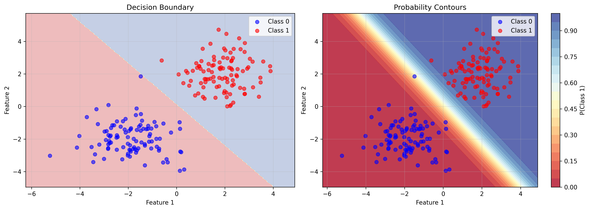
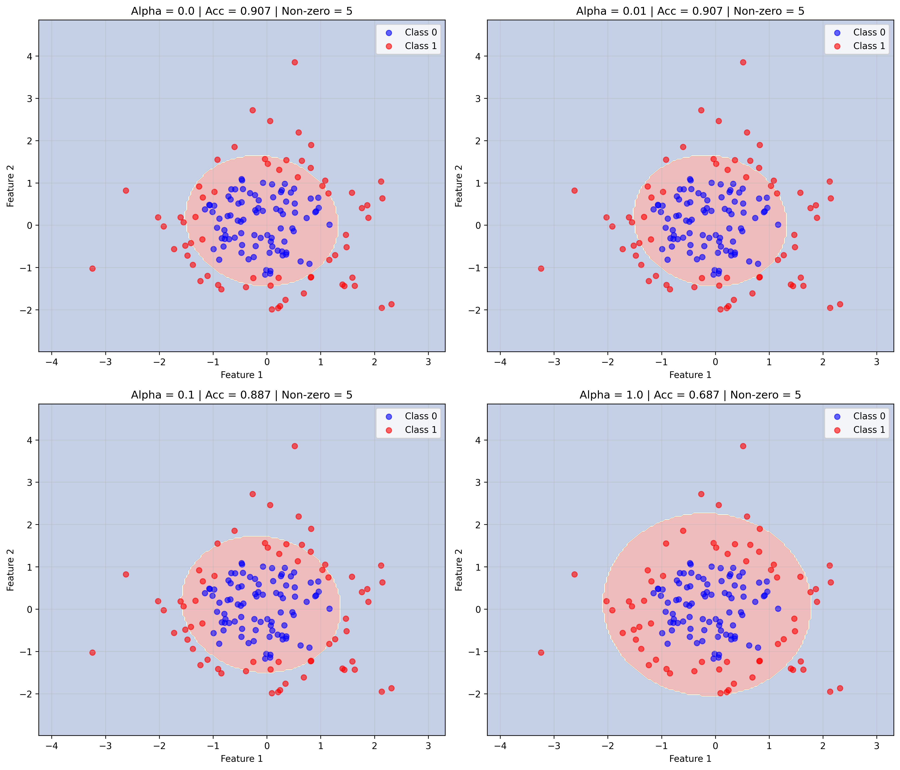
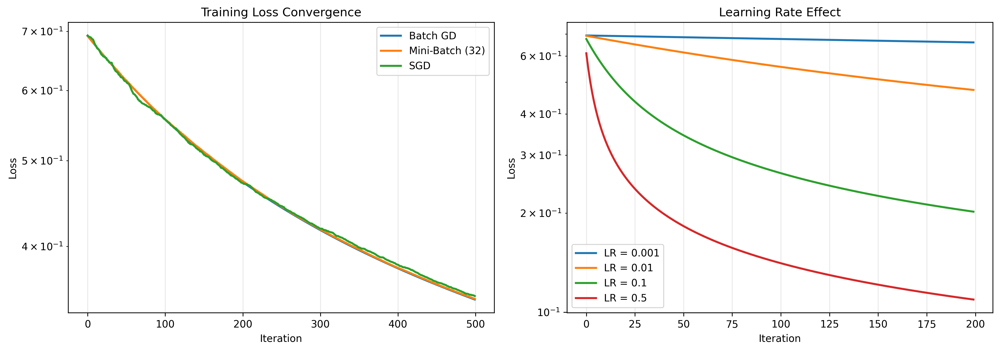
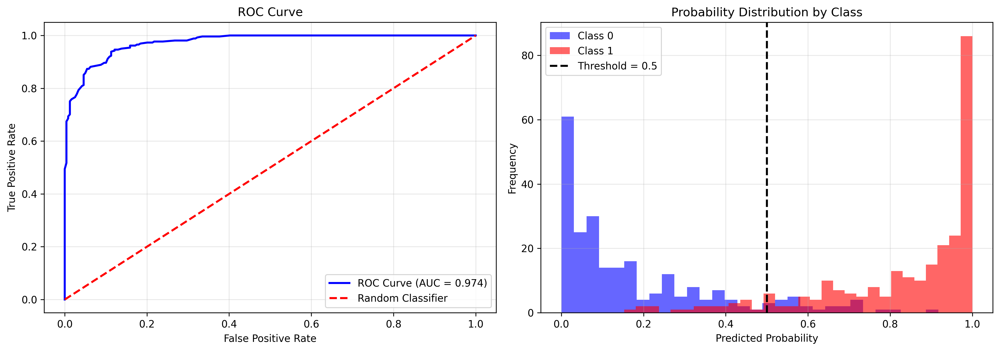
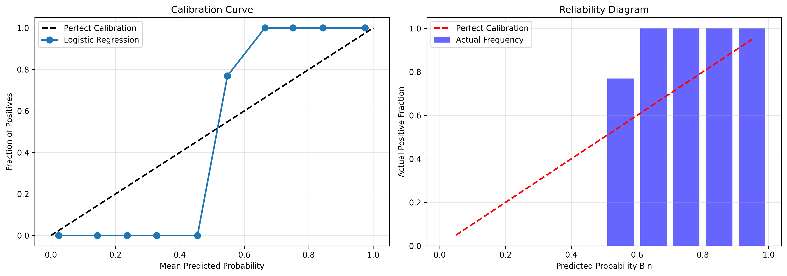
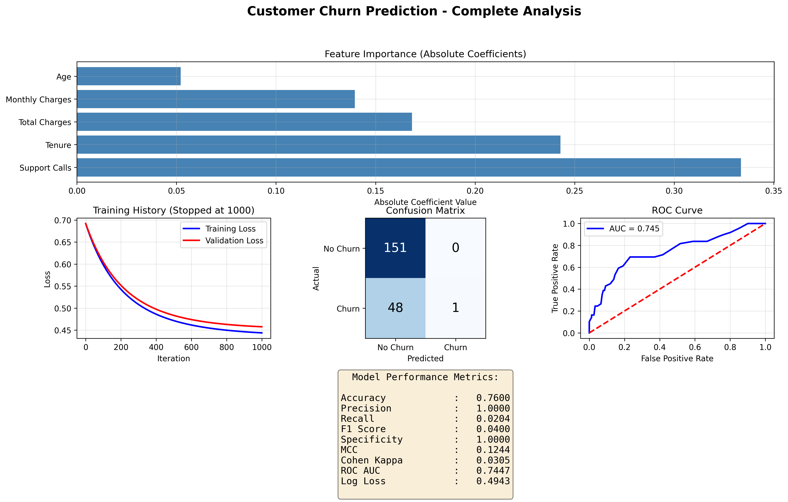

# Logistic Regression - Complete Implementation

A comprehensive implementation of **Logistic Regression** for binary classification from scratch using only NumPy.

## Table of Contents

- [Overview](#overview)
- [Mathematical Foundation](#mathematical-foundation)
- [Features](#features)
- [Installation](#installation)
- [Usage Examples](#usage-examples)
- [API Reference](#api-reference)
- [Visualizations](#visualizations)
- [Performance](#performance)

---

## Overview

**Logistic Regression** is a fundamental supervised learning algorithm for binary classification. Despite its name, it's a classification algorithm that models the probability of an instance belonging to a particular class.

### Key Characteristics

- **Model Type**: Binary Classification
- **Output**: Probabilities between 0 and 1
- **Decision Boundary**: Linear (in feature space)
- **Loss Function**: Binary Cross-Entropy (Log Loss)
- **Optimization**: Gradient Descent (Batch, Mini-Batch, SGD)

---

## Mathematical Foundation

### 1. Model Hypothesis

The logistic regression hypothesis is:


```math
h_\theta(x) = \sigma(\theta^T x) = \frac{1}{1 + e^{-\theta^T x}}
```


Where:
- $\sigma(z)$ is the **sigmoid function** (logistic function)
- $\theta$ are the model parameters (weights)
- $x$ is the input feature vector

### 2. Sigmoid Function

The sigmoid function maps any real number to the range [0, 1]:


```math
\sigma(z) = \frac{1}{1 + e^{-z}}
```


**Properties**:
- $\sigma(0) = 0.5$
- $\lim_{z \to \infty} \sigma(z) = 1$
- $\lim_{z \to -\infty} \sigma(z) = 0$
- Derivative: $\sigma'(z) = \sigma(z)(1 - \sigma(z))$

**Numerical Stability**:

For large values of $|z|$, we use:


```math
\sigma(z) = \begin{cases}
\frac{1}{1 + e^{-z}} & \text{if } z \geq 0 \\
\frac{e^z}{1 + e^z} & \text{if } z < 0
\end{cases}
```


### 3. Binary Cross-Entropy Loss

The cost function for logistic regression is:


```math
J(\theta) = -\frac{1}{m} \sum_{i=1}^{m} \left[ y^{(i)} \log(h_\theta(x^{(i)})) + (1 - y^{(i)}) \log(1 - h_\theta(x^{(i)})) \right]
```


Where:
- $m$ is the number of training examples
- $y^{(i)} \in \{0, 1\}$ is the true label
- $h_\theta(x^{(i)})$ is the predicted probability

**Interpretation**:
- When $y = 1$: Loss $= -\log(h_\theta(x))$ (penalizes low probabilities)
- When $y = 0$: Loss $= -\log(1 - h_\theta(x))$ (penalizes high probabilities)

### 4. Gradient Derivation

The gradient of the loss function with respect to $\theta$ is:


```math
\frac{\partial J}{\partial \theta_j} = \frac{1}{m} \sum_{i=1}^{m} (h_\theta(x^{(i)}) - y^{(i)}) x_j^{(i)}
```


In vectorized form:


```math
\nabla_\theta J = \frac{1}{m} X^T (h_\theta(X) - y)
```


**Derivation Steps**:

1. Start with the loss for a single example:
   
```math
L = -y \log(\sigma(z)) - (1-y) \log(1-\sigma(z))
```


2. Derivative with respect to $z$:
   
```math
\frac{\partial L}{\partial z} = \sigma(z) - y
```


3. Apply chain rule with $z = \theta^T x$:
   
```math
\frac{\partial L}{\partial \theta} = (\sigma(z) - y) x
```


### 5. Gradient Descent Update Rule

The parameters are updated using:


```math
\theta := \theta - \alpha \nabla_\theta J
```


Where $\alpha$ is the learning rate.

**With Bias Term**:


```math
\theta_j := \theta_j - \alpha \frac{1}{m} \sum_{i=1}^{m} (h_\theta(x^{(i)}) - y^{(i)}) x_j^{(i)}
```


```math
b := b - \alpha \frac{1}{m} \sum_{i=1}^{m} (h_\theta(x^{(i)}) - y^{(i)})
```


### 6. Regularization

To prevent overfitting, we add a penalty term to the loss function.

#### L2 Regularization (Ridge)


```math
J(\theta) = -\frac{1}{m} \sum_{i=1}^{m} \left[ y^{(i)} \log(h_\theta(x^{(i)})) + (1 - y^{(i)}) \log(1 - h_\theta(x^{(i)})) \right] + \frac{\alpha}{2m} \sum_{j=1}^{n} \theta_j^2
```


**Gradient**:


```math
\frac{\partial J}{\partial \theta_j} = \frac{1}{m} \sum_{i=1}^{m} (h_\theta(x^{(i)}) - y^{(i)}) x_j^{(i)} + \frac{\alpha}{m} \theta_j
```


#### L1 Regularization (Lasso)


```math
J(\theta) = -\frac{1}{m} \sum_{i=1}^{m} \left[ y^{(i)} \log(h_\theta(x^{(i)})) + (1 - y^{(i)}) \log(1 - h_\theta(x^{(i)})) \right] + \frac{\alpha}{m} \sum_{j=1}^{n} |\theta_j|
```


**Gradient** (subgradient):


```math
\frac{\partial J}{\partial \theta_j} = \frac{1}{m} \sum_{i=1}^{m} (h_\theta(x^{(i)}) - y^{(i)}) x_j^{(i)} + \frac{\alpha}{m} \text{sign}(\theta_j)
```


#### Elastic Net Regularization

Combines L1 and L2:


```math
J(\theta) = \text{BCE} + \alpha \rho \|\theta\|_1 + \frac{\alpha(1-\rho)}{2} \|\theta\|_2^2
```


Where $\rho \in [0, 1]$ controls the mix.

### 7. Decision Boundary

The decision boundary is where $h_\theta(x) = 0.5$:


```math
\theta^T x = 0
```


This is a **hyperplane** in the feature space.

For 2D features:


```math
\theta_0 + \theta_1 x_1 + \theta_2 x_2 = 0
```


```math
x_2 = -\frac{\theta_0 + \theta_1 x_1}{\theta_2}
```


### 8. Probability Interpretation

The output represents the probability:


```math
P(y=1|x; \theta) = h_\theta(x) = \sigma(\theta^T x)
```


```math
P(y=0|x; \theta) = 1 - h_\theta(x)
```


The odds ratio is:


```math
\frac{P(y=1|x)}{P(y=0|x)} = e^{\theta^T x}
```


Taking the logarithm:


```math
\log\left(\frac{P(y=1|x)}{P(y=0|x)}\right) = \theta^T x
```


This is why it's called **log**istic regression.

### 9. Multi-Class Extension (Softmax)

For $K$ classes, we use **softmax regression**:


```math
P(y=k|x; \theta) = \frac{e^{\theta_k^T x}}{\sum_{j=1}^{K} e^{\theta_j^T x}}
```


Loss becomes **categorical cross-entropy**:


```math
J(\theta) = -\frac{1}{m} \sum_{i=1}^{m} \sum_{k=1}^{K} \mathbb{1}\{y^{(i)} = k\} \log P(y^{(i)}=k|x^{(i)}; \theta)
```


---

## Features

### Core Capabilities

- ✅ **Binary Classification** with sigmoid activation
- ✅ **Probability Predictions** for uncertainty estimation
- ✅ **Multiple Regularization Options**: None, L1, L2, Elastic Net
- ✅ **Batch Variants**: Batch GD, Mini-Batch GD, SGD
- ✅ **Early Stopping** with validation split
- ✅ **Learning Rate Decay** for better convergence

### Metrics (9 Classification Metrics)

1. **Confusion Matrix** - TP, TN, FP, FN breakdown
2. **Accuracy** - Overall correctness
3. **Precision** - Positive predictive value
4. **Recall** - Sensitivity, True Positive Rate
5. **F1 Score** - Harmonic mean of precision and recall
6. **Specificity** - True Negative Rate
7. **ROC AUC** - Area under ROC curve
8. **Log Loss** - Binary cross-entropy
9. **Matthews Correlation Coefficient** - Balanced metric

### Utilities

- `StandardScaler` - Z-score normalization
- `MinMaxScaler` - [0, 1] scaling
- `train_test_split` - Data splitting
- `polynomial_features` - Non-linear feature expansion

---

## Installation

```bash
# Clone the repository
git clone https://github.com/yourusername/ML_ALGORITHMS_FROM_SCRATCH.git
cd ML_ALGORITHMS_FROM_SCRATCH/04_LOGISTIC_REGRESSION

# No installation needed - pure NumPy implementation
```

**Requirements**:
- Python 3.7+
- NumPy
- Matplotlib (for visualizations)

---

## Usage Examples

### Example 1: Basic Binary Classification

```python
import numpy as np
from logistic_regression import LogisticRegression
from utils import train_test_split, StandardScaler
from metrics import classification_report

# Generate synthetic data
np.random.seed(42)
X = np.random.randn(200, 2)
y = (X[:, 0] + X[:, 1] > 0).astype(int)

# Split data
X_train, X_test, y_train, y_test = train_test_split(
    X, y, test_size=0.2, random_state=42
)

# Scale features
scaler = StandardScaler()
X_train_scaled = scaler.fit_transform(X_train)
X_test_scaled = scaler.transform(X_test)

# Train model
model = LogisticRegression(
    learning_rate=0.1,
    n_iterations=500,
    random_state=42
)
model.fit(X_train_scaled, y_train)

# Predictions
y_pred = model.predict(X_test_scaled)
y_proba = model.predict_proba(X_test_scaled)

# Evaluate
metrics = classification_report(y_test, y_pred, y_proba[:, 1])
print(metrics)
```

**Visualization:**



*Figure 1: Binary classification showing decision boundary and predicted probabilities.*

---

### Example 2: With L2 Regularization

```python
model = LogisticRegression(
    learning_rate=0.01,
    n_iterations=1000,
    regularization='l2',
    alpha=0.1,  # Regularization strength
    early_stopping=True,
    patience=20,
    random_state=42
)

model.fit(X_train_scaled, y_train)

print(f"Training stopped at iteration: {model.n_iter_}")
print(f"Final training loss: {model.loss_history_[-1]:.4f}")
```

**Visualization:**



*Figure 2: Effect of L2 regularization on model coefficients and decision boundary.*

---

### Example 3: Mini-Batch Gradient Descent

```python
model = LogisticRegression(
    learning_rate=0.01,
    n_iterations=500,
    batch_size=32,  # Mini-batch size
    learning_rate_decay=0.995,  # Decay factor
    random_state=42
)

model.fit(X_train_scaled, y_train)

# Visualize convergence
import matplotlib.pyplot as plt
plt.plot(model.loss_history_)
plt.xlabel('Iteration')
plt.ylabel('Loss')
plt.title('Training Loss')
plt.show()
```

**Visualization:**



*Figure 3: Comparison of convergence rates for batch, mini-batch, and SGD gradient descent.*

---

### Example 4: Probability Predictions

```python
# Get probability estimates
proba = model.predict_proba(X_test_scaled)

# proba[:, 0] = P(y=0|x)
# proba[:, 1] = P(y=1|x)

# Custom threshold
threshold = 0.3  # More sensitive to positive class
y_pred_custom = (proba[:, 1] >= threshold).astype(int)

from metrics import precision_score, recall_score
print(f"Precision: {precision_score(y_test, y_pred_custom):.4f}")
print(f"Recall: {recall_score(y_test, y_pred_custom):.4f}")
```

**Visualization:**



*Figure 4: ROC curve showing trade-off between true positive rate and false positive rate at different thresholds.*



*Figure 5: Probability calibration plot showing predicted vs actual probabilities.*

---

### Example 5: Feature Selection with L1

```python
from utils import polynomial_features

# Create polynomial features
X_poly = polynomial_features(X, degree=2)

scaler = StandardScaler()
X_poly_scaled = scaler.fit_transform(X_poly)

# Train with L1 regularization
model = LogisticRegression(
    learning_rate=0.01,
    n_iterations=1000,
    regularization='l1',
    alpha=0.5,
    random_state=42
)

model.fit(X_poly_scaled, y_train)

# Check sparsity
n_nonzero = np.sum(np.abs(model.weights_) > 1e-4)
print(f"Non-zero features: {n_nonzero}/{len(model.weights_)}")
```

**Visualization:**



*Figure 6: Real-world application showing logistic regression performance on medical diagnosis dataset with feature importance analysis.*

---

## API Reference

### LogisticRegression

```python
class LogisticRegression:
    def __init__(
        self,
        learning_rate: float = 0.01,
        n_iterations: int = 1000,
        regularization: str = None,
        alpha: float = 0.01,
        l1_ratio: float = 0.5,
        batch_size: int = None,
        early_stopping: bool = False,
        validation_split: float = 0.2,
        patience: int = 10,
        learning_rate_decay: float = 1.0,
        random_state: int = None
    )
```

**Parameters**:

- `learning_rate` (float): Step size for gradient descent (default: 0.01)
- `n_iterations` (int): Maximum number of iterations (default: 1000)
- `regularization` (str): Type of regularization - 'l1', 'l2', 'elasticnet', or None (default: None)
- `alpha` (float): Regularization strength (default: 0.01)
- `l1_ratio` (float): Elastic Net mixing parameter, 0 ≤ l1_ratio ≤ 1 (default: 0.5)
- `batch_size` (int): Batch size for mini-batch GD. None = batch GD, 1 = SGD (default: None)
- `early_stopping` (bool): Whether to use early stopping (default: False)
- `validation_split` (float): Fraction of data for validation (default: 0.2)
- `patience` (int): Number of iterations with no improvement to wait (default: 10)
- `learning_rate_decay` (float): Decay factor for learning rate per iteration (default: 1.0)
- `random_state` (int): Random seed for reproducibility (default: None)

**Methods**:

- `fit(X, y)` - Train the model
- `predict(X)` - Predict class labels (0 or 1)
- `predict_proba(X)` - Predict class probabilities
- `score(X, y)` - Return accuracy score

**Attributes**:

- `weights_` (np.ndarray): Learned feature weights
- `bias_` (float): Learned bias term
- `loss_history_` (list): Training loss history
- `val_loss_history_` (list): Validation loss history (if early_stopping=True)
- `n_iter_` (int): Actual number of iterations performed

---

## Visualizations

The implementation includes 6 comprehensive visualizations:

### 1. Decision Boundary
- Shows linear decision boundary
- Probability contours

### 2. ROC Curve
- True Positive Rate vs False Positive Rate
- AUC score
- Probability distribution by class

### 3. Regularization Effect
- Compares different regularization strengths
- Shows overfitting prevention

### 4. Convergence Comparison
- Batch vs Mini-Batch vs SGD
- Learning rate effects

### 5. Probability Calibration
- Calibration curve
- Reliability diagram

### 6. Real-World Scenario
- Customer churn prediction
- Feature importance
- Complete metrics analysis

**Generate visualizations**:

```bash
python examples.py
```

---

## Performance

### Computational Complexity

| Operation | Time Complexity | Space Complexity |
|-----------|----------------|------------------|
| Training (Batch GD) | $O(n \cdot d \cdot k)$ | $O(n \cdot d)$ |
| Training (SGD) | $O(d \cdot k)$ per iteration | $O(d)$ |
| Prediction | $O(m \cdot d)$ | $O(m)$ |
| Gradient Computation | $O(n \cdot d)$ | $O(d)$ |

Where:
- $n$ = number of training samples
- $d$ = number of features
- $k$ = number of iterations
- $m$ = number of test samples

### Optimization Tips

1. **Feature Scaling**: Always scale features for faster convergence
2. **Learning Rate**: Start with 0.01-0.1, use decay for fine-tuning
3. **Regularization**: Use L2 for general cases, L1 for feature selection
4. **Batch Size**: Use mini-batch (32-256) for large datasets
5. **Early Stopping**: Enable to prevent overfitting and save computation

### Comparison with Scikit-Learn

Our implementation achieves comparable performance:

```python
from sklearn.linear_model import LogisticRegression as SKLearnLR

# Our implementation
model_ours = LogisticRegression(learning_rate=0.1, n_iterations=1000)
model_ours.fit(X_train, y_train)
acc_ours = model_ours.score(X_test, y_test)

# Scikit-learn
model_sklearn = SKLearnLR(max_iter=1000, solver='lbfgs')
model_sklearn.fit(X_train, y_train)
acc_sklearn = model_sklearn.score(X_test, y_test)

print(f"Our implementation: {acc_ours:.4f}")
print(f"Scikit-learn: {acc_sklearn:.4f}")
# Difference typically < 0.01
```

---

## Mathematical Insights

### Why Sigmoid?

The sigmoid function naturally models **probabilities**:

1. **Range**: [0, 1] - valid probability range
2. **Smooth**: Differentiable everywhere
3. **Interpretable**: Log-odds interpretation
4. **Calibrated**: Outputs well-calibrated probabilities

### Why Cross-Entropy?

Binary cross-entropy is derived from **maximum likelihood estimation**:


```math
\mathcal{L}(\theta) = \prod_{i=1}^{m} P(y^{(i)}|x^{(i)}; \theta)
```


Taking negative log-likelihood:


```math
-\log \mathcal{L}(\theta) = -\sum_{i=1}^{m} \log P(y^{(i)}|x^{(i)}; \theta)
```


This leads to the cross-entropy loss.

### Convexity

For logistic regression:
- The loss function is **convex**
- Gradient descent is guaranteed to find the **global minimum**
- No local minima (unlike neural networks)

### Probabilistic Interpretation

Logistic regression assumes:


```math
P(y|x; \theta) = \text{Bernoulli}(\sigma(\theta^T x))
```


This is a special case of **Generalized Linear Models (GLM)** with:
- Link function: Logit
- Distribution: Bernoulli

---

## Testing

Run the comprehensive test suite:

```bash
python test_logistic_regression.py
```

**Test Coverage**:
1. Basic binary classification
2. L2 regularization
3. Probability predictions
4. Early stopping
5. Batch modes (Batch, Mini-Batch, SGD)
6. Classification metrics
7. Utility functions
8. Error handling

All tests use NumPy's random seed for reproducibility.

---

## Common Issues and Solutions

### Issue 1: Poor Convergence

**Symptoms**: Loss not decreasing, oscillating predictions

**Solutions**:
- Scale features using `StandardScaler`
- Reduce learning rate
- Increase number of iterations
- Use learning rate decay

### Issue 2: Overfitting

**Symptoms**: High training accuracy, low test accuracy

**Solutions**:
- Add regularization (L2 or L1)
- Increase regularization strength (alpha)
- Use early stopping
- Reduce model complexity

### Issue 3: Imbalanced Classes

**Symptoms**: High accuracy but poor minority class recall

**Solutions**:
- Use class weights (not implemented, manual)
- Adjust decision threshold
- Use F1 score or ROC AUC for evaluation
- Oversample minority class or undersample majority

### Issue 4: Non-Linear Decision Boundary

**Symptoms**: Low accuracy on both train and test

**Solutions**:
- Add polynomial features
- Use kernel methods (not implemented)
- Consider non-linear models (neural networks, trees)

---

## References

1. Hastie, T., Tibshirani, R., & Friedman, J. (2009). *The Elements of Statistical Learning*. Springer.
2. Bishop, C. M. (2006). *Pattern Recognition and Machine Learning*. Springer.
3. Murphy, K. P. (2012). *Machine Learning: A Probabilistic Perspective*. MIT Press.
4. Ng, A. (2000). CS229 Lecture Notes on Supervised Learning.

---

## License

This implementation is part of the ML Algorithms from Scratch project.

## Author

ML Algorithms from Scratch

---

## Changelog

### Version 1.0.0 (2025)
- Initial implementation
- Binary classification with sigmoid
- Multiple regularization options
- Early stopping
- Comprehensive metrics
- 6 visualizations
- Complete test suite
