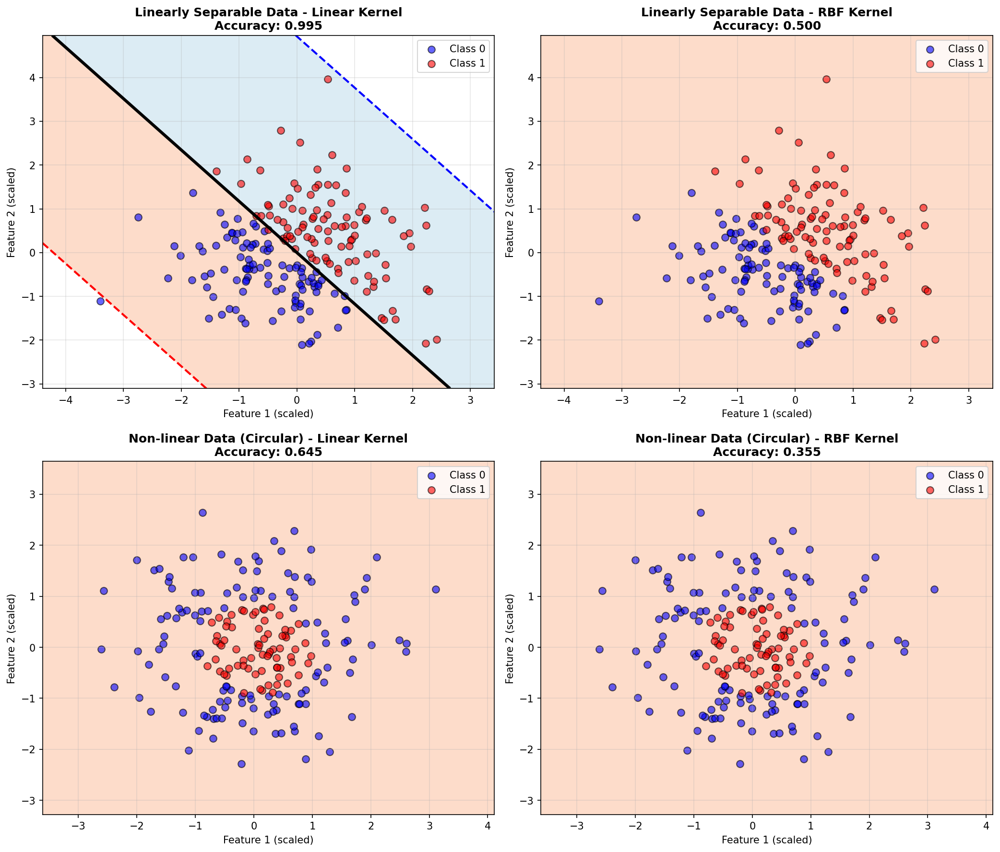
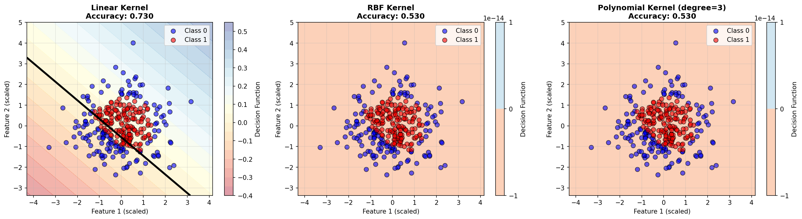
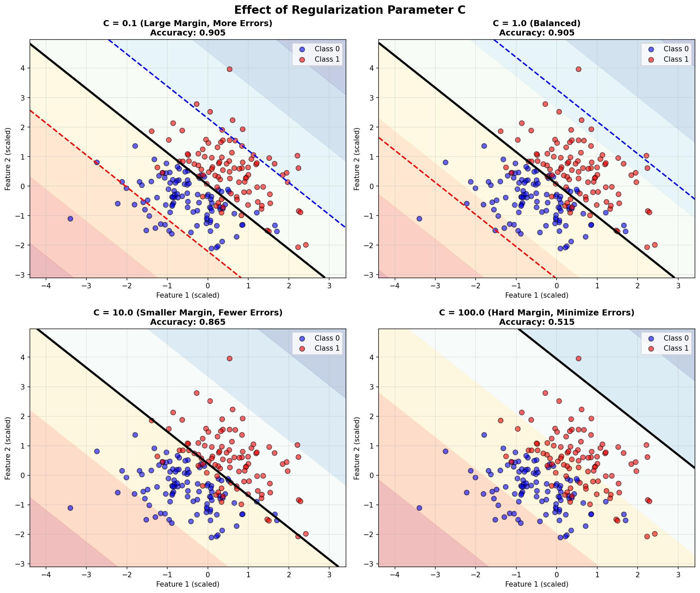
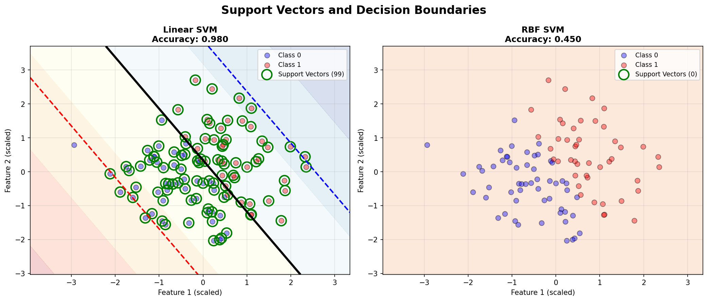
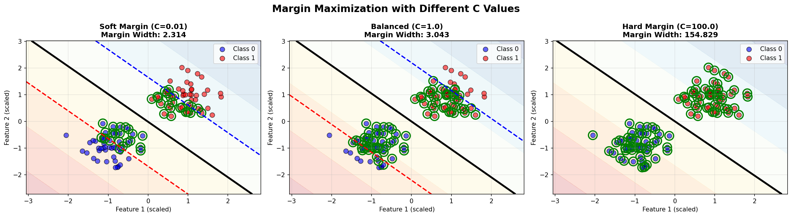
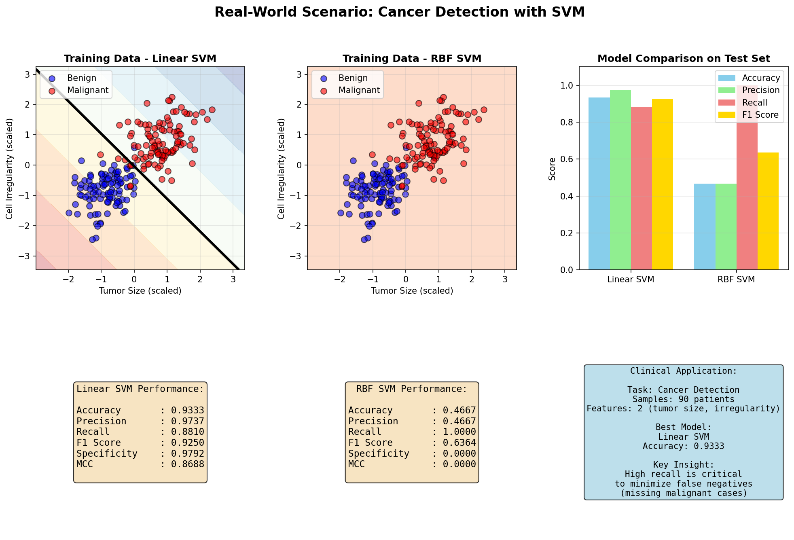

# Support Vector Machines (SVM)

A comprehensive implementation of Support Vector Machines for binary classification from scratch using only NumPy, featuring multiple kernel functions, soft margin optimization, and Sequential Minimal Optimization (SMO) algorithm.

## Table of Contents

1. [Introduction](#introduction)
   - [What are Support Vector Machines?](#what-are-support-vector-machines)
   - [When to Use SVMs](#when-to-use-svms)
   - [Key Advantages](#key-advantages)
   - [Limitations](#limitations)
   - [Comparison with Other Classifiers](#comparison-with-other-classifiers)

2. [Mathematical Foundations](#mathematical-foundations)
   - [2.1 Linear SVM - Hard Margin](#21-linear-svm---hard-margin)
     - [Hyperplane and Decision Boundary](#hyperplane-and-decision-boundary)
     - [Geometric Margin](#geometric-margin)
     - [Functional Margin vs Geometric Margin](#functional-margin-vs-geometric-margin)
     - [Optimization Problem Formulation](#optimization-problem-formulation)
     - [Support Vectors](#support-vectors)
   - [2.2 Linear SVM - Soft Margin](#22-linear-svm---soft-margin)
     - [Slack Variables](#slack-variables)
     - [Soft Margin Optimization](#soft-margin-optimization)
     - [Hinge Loss Interpretation](#hinge-loss-interpretation)
     - [The C Parameter](#the-c-parameter)
   - [2.3 Lagrangian Formulation](#23-lagrangian-formulation)
     - [Lagrangian Function Construction](#lagrangian-function-construction)
     - [Lagrange Multipliers](#lagrange-multipliers)
     - [KKT Conditions](#kkt-conditions)
     - [Complementary Slackness](#complementary-slackness)
   - [2.4 Dual Optimization Problem](#24-dual-optimization-problem)
     - [Deriving the Dual from the Primal](#deriving-the-dual-from-the-primal)
     - [Why the Dual is Useful](#why-the-dual-is-useful)
     - [Box Constraints](#box-constraints)
     - [Computing w and b from α](#computing-w-and-b-from-α)
   - [2.5 Kernel Methods](#25-kernel-methods)
     - [Feature Space Mapping](#feature-space-mapping)
     - [The Kernel Trick](#the-kernel-trick)
     - [Why Kernels Avoid Explicit Mapping](#why-kernels-avoid-explicit-mapping)
     - [Mercer's Theorem](#mercers-theorem)
   - [2.6 Common Kernels](#26-common-kernels)
     - [Linear Kernel](#linear-kernel)
     - [RBF (Gaussian) Kernel](#rbf-gaussian-kernel)
     - [Polynomial Kernel](#polynomial-kernel)
     - [Sigmoid Kernel](#sigmoid-kernel)
   - [2.7 Decision Function](#27-decision-function)
     - [Decision Function Formula](#decision-function-formula)
     - [Margin and Signed Distance](#margin-and-signed-distance)
     - [Classification Rule](#classification-rule)

3. [Sequential Minimal Optimization (SMO)](#sequential-minimal-optimization-smo)
   - [Why SMO?](#why-smo)
   - [Working Set Selection](#working-set-selection)
   - [Analytical Solution for Two Variables](#analytical-solution-for-two-variables)
   - [Algorithm Steps](#algorithm-steps)
   - [Convergence Criteria](#convergence-criteria)

4. [Implementation Details](#implementation-details)
   - [Data Structures](#data-structures)
   - [Training Algorithm](#training-algorithm)
   - [Prediction](#prediction)
   - [Support Vector Identification](#support-vector-identification)

5. [Usage Examples](#usage-examples)
   - [Example 1: Basic Linear SVM](#example-1-basic-linear-svm)
   - [Example 2: RBF Kernel for Non-Linear Data](#example-2-rbf-kernel-for-non-linear-data)
   - [Example 3: Effect of C Parameter](#example-3-effect-of-c-parameter)
   - [Example 4: Effect of Gamma Parameter](#example-4-effect-of-gamma-parameter)
   - [Example 5: Polynomial Kernel](#example-5-polynomial-kernel)
   - [Example 6: Real-World Example](#example-6-real-world-example)

6. [API Reference](#api-reference)
   - [SVMClassifier](#svmclassifier)
   - [Methods](#methods)
   - [Attributes](#attributes)

7. [Performance Considerations](#performance-considerations)
   - [Time Complexity](#time-complexity)
   - [Space Complexity](#space-complexity)
   - [Scalability](#scalability)

8. [Visualizations](#visualizations)

9. [Hyperparameter Tuning Guide](#hyperparameter-tuning-guide)

10. [References](#references)

---

## Introduction

### What are Support Vector Machines?

Support Vector Machines (SVMs) are powerful supervised learning algorithms used primarily for classification tasks, though they can also be adapted for regression. SVMs aim to find the optimal hyperplane that maximally separates different classes in the feature space.

The fundamental idea behind SVMs is to find a decision boundary that not only separates the classes but also maximizes the margin between them. The margin is defined as the distance from the decision boundary to the nearest training examples, called support vectors.

### When to Use SVMs

SVMs are particularly effective in the following scenarios:

1. **High-dimensional spaces**: SVMs work well when the number of features is large, even when it exceeds the number of samples
2. **Clear margin of separation**: When classes are well-separated or nearly well-separated
3. **Non-linear boundaries**: Using kernel functions, SVMs can handle complex non-linear decision boundaries
4. **Text classification**: SVMs excel in text categorization due to high-dimensional sparse features
5. **Image recognition**: Effective for face detection, handwriting recognition, and other computer vision tasks
6. **Bioinformatics**: Protein classification, gene expression analysis

### Key Advantages

1. **Effective in high dimensions**: Performs well even when number of features exceeds number of samples
2. **Memory efficient**: Only support vectors are stored (typically a small subset of training data)
3. **Versatile**: Different kernel functions can be specified for the decision function
4. **Global optimum**: The optimization problem is convex, ensuring a unique global solution
5. **Robust to overfitting**: Especially in high-dimensional space, due to margin maximization
6. **Generalization**: The focus on margin maximization often leads to good generalization

### Limitations

1. **Computational complexity**: Training time scales poorly with large datasets (O(n²) to O(n³))
2. **Sensitive to feature scaling**: Features must be normalized or standardized
3. **No probability estimates**: Directly outputs class labels, not probabilities (though can be estimated)
4. **Difficult to interpret**: Especially with kernel methods, the decision function is not easily interpretable
5. **Hyperparameter tuning**: Requires careful selection of kernel, C, gamma, etc.
6. **Memory requirements**: Kernel matrix storage can be prohibitive for large datasets

### Comparison with Other Classifiers

| Aspect | SVM | Logistic Regression | Decision Trees | Neural Networks |
|--------|-----|---------------------|----------------|-----------------|
| **Training Speed** | Slow (O(n²-n³)) | Fast (O(n·d)) | Fast (O(n·d·log n)) | Slow (depends on architecture) |
| **Prediction Speed** | Fast | Very Fast | Very Fast | Fast |
| **High Dimensions** | Excellent | Good | Poor | Good |
| **Non-linear** | Yes (with kernels) | No (needs feature eng.) | Yes (naturally) | Yes (naturally) |
| **Interpretability** | Low (kernels) / Medium (linear) | High | High | Very Low |
| **Overfitting Risk** | Low (with proper C) | Low | High (needs pruning) | High (needs regularization) |
| **Feature Scaling** | Required | Beneficial | Not required | Required |
| **Probability Output** | Indirect | Direct | Direct | Direct |
| **Global Optimum** | Yes | Yes | No (greedy) | No (local minima) |

---

## Mathematical Foundations

### 2.1 Linear SVM - Hard Margin

#### Hyperplane and Decision Boundary

In an n-dimensional feature space, a hyperplane is an (n-1)-dimensional subspace that divides the space into two half-spaces. For a 2D space, this is a line; for 3D, it's a plane.

The hyperplane is defined by the equation:

```math
\mathbf{w}^T \mathbf{x} + b = 0
```

where:
- **w** is the weight vector (normal to the hyperplane)
- **x** is a point in the feature space
- b is the bias term (offset from origin)

The decision function for classifying a point **x** is:

```math
f(\mathbf{x}) = \mathbf{w}^T \mathbf{x} + b
```

The classification rule is:
- If f(**x**) > 0, classify as positive class (+1)
- If f(**x**) < 0, classify as negative class (-1)
- If f(**x**) = 0, **x** lies on the decision boundary

#### Geometric Margin

The geometric margin is the perpendicular distance from a point **x**ᵢ to the hyperplane. This is a fundamental concept in SVMs.

For a point **x**ᵢ, the distance to the hyperplane **w**ᵀ**x** + b = 0 is:

```math
\text{distance} = \frac{|\mathbf{w}^T \mathbf{x}_i + b|}{\|\mathbf{w}\|}
```

where ‖**w**‖ is the Euclidean norm of **w**:

```math
\|\mathbf{w}\| = \sqrt{w_1^2 + w_2^2 + \cdots + w_d^2}
```

**Derivation of the distance formula:**

1. Consider a point **x**ᵢ and its projection **x**₀ onto the hyperplane
2. The vector from **x**₀ to **x**ᵢ is parallel to **w** (the normal vector)
3. This vector can be written as: **x**ᵢ - **x**₀ = γ(**w**/‖**w**‖), where γ is the distance
4. Since **x**₀ is on the hyperplane: **w**ᵀ**x**₀ + b = 0
5. Substituting **x**₀ = **x**ᵢ - γ(**w**/‖**w**‖):

```math
\mathbf{w}^T \left(\mathbf{x}_i - \gamma \frac{\mathbf{w}}{\|\mathbf{w}\|}\right) + b = 0
```

6. Expanding:

```math
\mathbf{w}^T \mathbf{x}_i - \gamma \frac{\mathbf{w}^T \mathbf{w}}{\|\mathbf{w}\|} + b = 0
```

7. Since **w**ᵀ**w** = ‖**w**‖²:

```math
\mathbf{w}^T \mathbf{x}_i - \gamma \|\mathbf{w}\| + b = 0
```

8. Solving for γ:

```math
\gamma = \frac{\mathbf{w}^T \mathbf{x}_i + b}{\|\mathbf{w}\|}
```

The geometric margin for the entire dataset is the minimum distance from any training point to the hyperplane:

```math
\gamma_{\text{geometric}} = \min_{i=1,\ldots,n} \frac{y_i(\mathbf{w}^T \mathbf{x}_i + b)}{\|\mathbf{w}\|}
```

The term yᵢ ensures the distance is positive for correctly classified points.

#### Functional Margin vs Geometric Margin

The **functional margin** for a point (**x**ᵢ, yᵢ) is defined as:

```math
\hat{\gamma}_i = y_i(\mathbf{w}^T \mathbf{x}_i + b)
```

This measures how confidently the point is classified. For the functional margin to represent a "margin of safety," we require:

```math
\hat{\gamma}_i \geq 1 \quad \text{for all } i
```

The functional margin for the dataset is:

```math
\hat{\gamma} = \min_{i=1,\ldots,n} y_i(\mathbf{w}^T \mathbf{x}_i + b)
```

**Relationship between functional and geometric margin:**

```math
\gamma_{\text{geometric}} = \frac{\hat{\gamma}}{\|\mathbf{w}\|}
```

**Key observation:** Scaling **w** and b by a constant λ > 0 doesn't change the hyperplane (same decision boundary), but it scales the functional margin by λ. However, it leaves the geometric margin unchanged (since both numerator and denominator scale by λ).

To eliminate this scaling ambiguity, we can normalize by requiring the functional margin to equal 1:

```math
\min_{i=1,\ldots,n} y_i(\mathbf{w}^T \mathbf{x}_i + b) = 1
```

With this normalization, maximizing the geometric margin becomes:

```math
\max_{\mathbf{w}, b} \frac{1}{\|\mathbf{w}\|}
```

#### Optimization Problem Formulation

To find the optimal hyperplane, we want to maximize the geometric margin. This is equivalent to:

```math
\max_{\mathbf{w}, b} \frac{1}{\|\mathbf{w}\|}
```

subject to the constraint that all points are correctly classified with functional margin at least 1:

```math
y_i(\mathbf{w}^T \mathbf{x}_i + b) \geq 1, \quad i = 1, \ldots, n
```

Maximizing 1/‖**w**‖ is equivalent to minimizing ‖**w**‖. For mathematical convenience (to make the objective function differentiable and convex), we minimize ½‖**w**‖²:

**Hard Margin SVM (Primal Problem):**

```math
\boxed{
\begin{aligned}
\min_{\mathbf{w}, b} \quad & \frac{1}{2}\|\mathbf{w}\|^2 \\
\text{subject to} \quad & y_i(\mathbf{w}^T \mathbf{x}_i + b) \geq 1, \quad i = 1, \ldots, n
\end{aligned}
}
```

**Why ½‖**w**‖²?**

1. The factor ½ makes the derivative cleaner: d/d**w**(½**w**ᵀ**w**) = **w**
2. The square ensures the function is strictly convex (no local minima)
3. The square makes the objective differentiable everywhere

**Expanded form:**

```math
\min_{\mathbf{w}, b} \quad \frac{1}{2}\sum_{j=1}^{d} w_j^2
```

subject to:

```math
y_i\left(\sum_{j=1}^{d} w_j x_{ij} + b\right) \geq 1, \quad i = 1, \ldots, n
```

#### Support Vectors

The constraints in the optimization problem can be classified into two categories:

1. **Active constraints**: Points where yᵢ(**w**ᵀ**x**ᵢ + b) = 1
2. **Inactive constraints**: Points where yᵢ(**w**ᵀ**x**ᵢ + b) > 1

The points corresponding to active constraints are called **support vectors**. These are the points that lie exactly on the margin boundaries.

**Properties of support vectors:**

1. They are the closest points to the decision hyperplane
2. They fully determine the optimal hyperplane
3. Removing any other point (non-support vector) doesn't change the solution
4. They typically represent a small subset of the training data
5. The decision boundary "depends" only on these points

The margin boundaries are parallel to the decision hyperplane and are given by:

```math
\mathbf{w}^T \mathbf{x} + b = +1 \quad \text{(positive margin)}
```

```math
\mathbf{w}^T \mathbf{x} + b = -1 \quad \text{(negative margin)}
```

The width of the margin (distance between the two margin boundaries) is:

```math
\text{margin width} = \frac{2}{\|\mathbf{w}\|}
```

**Derivation of margin width:**

Take any point **x**₊ on the positive margin and any point **x**₋ on the negative margin:

```math
\mathbf{w}^T \mathbf{x}_+ + b = 1
```

```math
\mathbf{w}^T \mathbf{x}_- + b = -1
```

Subtracting:

```math
\mathbf{w}^T(\mathbf{x}_+ - \mathbf{x}_-) = 2
```

The distance between **x**₊ and **x**₋ along the direction of **w** is:

```math
\text{distance} = \frac{|\mathbf{w}^T(\mathbf{x}_+ - \mathbf{x}_-)|}{\|\mathbf{w}\|} = \frac{2}{\|\mathbf{w}\|}
```

### 2.2 Linear SVM - Soft Margin

#### Slack Variables

In real-world scenarios, data is rarely perfectly linearly separable. Some points may:
1. Lie on the wrong side of the margin
2. Lie on the wrong side of the decision boundary (misclassified)

To handle such cases, we introduce **slack variables** ξᵢ (xi) ≥ 0 for each training point:

```math
\xi_i = \max\left(0, 1 - y_i(\mathbf{w}^T \mathbf{x}_i + b)\right)
```

**Interpretation of slack variables:**

- ξᵢ = 0: Point is correctly classified and outside or on the margin
- 0 < ξᵢ < 1: Point is correctly classified but inside the margin
- ξᵢ = 1: Point is exactly on the decision boundary
- ξᵢ > 1: Point is misclassified

The modified constraint becomes:

```math
y_i(\mathbf{w}^T \mathbf{x}_i + b) \geq 1 - \xi_i, \quad \xi_i \geq 0
```

This allows some points to violate the margin constraint, but we penalize such violations.

#### Soft Margin Optimization

The soft margin SVM balances two competing objectives:
1. Maximize the margin (minimize ‖**w**‖²)
2. Minimize the margin violations (minimize Σξᵢ)

**Soft Margin SVM (Primal Problem):**

```math
\boxed{
\begin{aligned}
\min_{\mathbf{w}, b, \boldsymbol{\xi}} \quad & \frac{1}{2}\|\mathbf{w}\|^2 + C\sum_{i=1}^{n}\xi_i \\
\text{subject to} \quad & y_i(\mathbf{w}^T \mathbf{x}_i + b) \geq 1 - \xi_i, \quad i = 1, \ldots, n \\
& \xi_i \geq 0, \quad i = 1, \ldots, n
\end{aligned}
}
```

where C > 0 is the **regularization parameter** (penalty parameter).

**Alternative formulation with L1 and L2 penalties:**

The soft margin can also use different penalty norms:

- **L1 penalty** (standard): C Σᵢ ξᵢ
- **L2 penalty**: C Σᵢ ξᵢ²

This implementation uses the L1 penalty (standard in SVM literature).

#### Hinge Loss Interpretation

The soft margin SVM can be rewritten in an unconstrained form using the **hinge loss** function.

**Hinge loss:**

```math
L_{\text{hinge}}(y, f(\mathbf{x})) = \max(0, 1 - y \cdot f(\mathbf{x}))
```

where f(**x**) = **w**ᵀ**x** + b.

The hinge loss has the following properties:
- If y·f(**x**) ≥ 1 (correctly classified with margin), loss = 0
- If y·f(**x**) < 1 (margin violation or misclassification), loss = 1 - y·f(**x**)

**Unconstrained formulation:**

```math
\boxed{
\min_{\mathbf{w}, b} \quad \frac{1}{2}\|\mathbf{w}\|^2 + C\sum_{i=1}^{n}\max(0, 1 - y_i(\mathbf{w}^T \mathbf{x}_i + b))
}
```

This is equivalent to:

```math
\min_{\mathbf{w}, b} \quad \frac{\lambda}{2}\|\mathbf{w}\|^2 + \sum_{i=1}^{n}\max(0, 1 - y_i(\mathbf{w}^T \mathbf{x}_i + b))
```

where λ = 1/C.

**Relationship between slack variables and hinge loss:**

```math
\xi_i = \max(0, 1 - y_i(\mathbf{w}^T \mathbf{x}_i + b)) = L_{\text{hinge}}(y_i, f(\mathbf{x}_i))
```

#### The C Parameter

The parameter C controls the trade-off between:
1. **Margin width** (model simplicity)
2. **Training accuracy** (training error)

**Large C (e.g., C = 100):**
- Higher penalty for margin violations
- Tries to classify all training points correctly
- Smaller margin (larger ‖**w**‖)
- **Risk**: Overfitting, especially with noisy data
- Approaches hard margin SVM

**Small C (e.g., C = 0.01):**
- Lower penalty for margin violations
- Allows more misclassifications
- Larger margin (smaller ‖**w**‖)
- **Benefit**: Better generalization, more robust to outliers
- Prioritizes margin width over training accuracy

**Mathematical intuition:**

Rewrite the objective as:

```math
\min_{\mathbf{w}, b} \quad C \cdot \frac{1}{2}\|\mathbf{w}\|^2 + \sum_{i=1}^{n}\xi_i
```

- When C → ∞: The ‖**w**‖² term dominates, forcing ξᵢ → 0 (hard margin)
- When C → 0: The ξᵢ terms dominate, allowing large margin violations

**Equivalent formulation:**

```math
\min_{\mathbf{w}, b} \quad \frac{1}{2C}\|\mathbf{w}\|^2 + \sum_{i=1}^{n}\xi_i
```

Here, large C means small 1/(2C), so less regularization.

### 2.3 Lagrangian Formulation

To solve the constrained optimization problem, we use the method of Lagrange multipliers, which converts the constrained problem into an unconstrained one.

#### Lagrangian Function Construction

For the soft margin SVM primal problem:

```math
\begin{aligned}
\min_{\mathbf{w}, b, \boldsymbol{\xi}} \quad & \frac{1}{2}\|\mathbf{w}\|^2 + C\sum_{i=1}^{n}\xi_i \\
\text{subject to} \quad & y_i(\mathbf{w}^T \mathbf{x}_i + b) \geq 1 - \xi_i, \quad i = 1, \ldots, n \\
& \xi_i \geq 0, \quad i = 1, \ldots, n
\end{aligned}
```

We introduce two sets of Lagrange multipliers:
- αᵢ ≥ 0 for the margin constraints
- μᵢ ≥ 0 for the non-negativity constraints on ξᵢ

**The Lagrangian function:**

```math
\boxed{
\begin{aligned}
\mathcal{L}(\mathbf{w}, b, \boldsymbol{\xi}, \boldsymbol{\alpha}, \boldsymbol{\mu}) = & \frac{1}{2}\|\mathbf{w}\|^2 + C\sum_{i=1}^{n}\xi_i \\
& - \sum_{i=1}^{n}\alpha_i[y_i(\mathbf{w}^T \mathbf{x}_i + b) - 1 + \xi_i] \\
& - \sum_{i=1}^{n}\mu_i\xi_i
\end{aligned}
}
```

**Expanded form:**

```math
\mathcal{L} = \frac{1}{2}\mathbf{w}^T\mathbf{w} + C\sum_{i=1}^{n}\xi_i - \sum_{i=1}^{n}\alpha_i y_i(\mathbf{w}^T \mathbf{x}_i + b) + \sum_{i=1}^{n}\alpha_i(1 - \xi_i) - \sum_{i=1}^{n}\mu_i\xi_i
```

Combining the ξᵢ terms:

```math
\mathcal{L} = \frac{1}{2}\mathbf{w}^T\mathbf{w} + \sum_{i=1}^{n}(C - \alpha_i - \mu_i)\xi_i - \sum_{i=1}^{n}\alpha_i y_i \mathbf{w}^T \mathbf{x}_i - b\sum_{i=1}^{n}\alpha_i y_i + \sum_{i=1}^{n}\alpha_i
```

#### Lagrange Multipliers

To find the optimal solution, we take derivatives of the Lagrangian with respect to the primal variables (**w**, b, **ξ**) and set them to zero.

**Derivative with respect to w:**

```math
\frac{\partial \mathcal{L}}{\partial \mathbf{w}} = \mathbf{w} - \sum_{i=1}^{n}\alpha_i y_i \mathbf{x}_i = 0
```

This gives us:

```math
\boxed{\mathbf{w} = \sum_{i=1}^{n}\alpha_i y_i \mathbf{x}_i}
```

**Key insight:** The optimal weight vector **w** is a linear combination of the training examples, weighted by αᵢyᵢ. Only points with αᵢ > 0 (support vectors) contribute to **w**.

**Derivative with respect to b:**

```math
\frac{\partial \mathcal{L}}{\partial b} = -\sum_{i=1}^{n}\alpha_i y_i = 0
```

This gives us the constraint:

```math
\boxed{\sum_{i=1}^{n}\alpha_i y_i = 0}
```

**Derivative with respect to ξᵢ:**

```math
\frac{\partial \mathcal{L}}{\partial \xi_i} = C - \alpha_i - \mu_i = 0
```

This gives us:

```math
\boxed{\alpha_i + \mu_i = C}
```

Since μᵢ ≥ 0 and αᵢ ≥ 0, this implies:

```math
0 \leq \alpha_i \leq C
```

This is the **box constraint** on the Lagrange multipliers.

#### KKT Conditions

The Karush-Kuhn-Tucker (KKT) conditions are necessary and sufficient conditions for optimality in constrained optimization problems. For SVM, these conditions are:

**1. Stationarity (already derived):**

```math
\mathbf{w} = \sum_{i=1}^{n}\alpha_i y_i \mathbf{x}_i
```

```math
\sum_{i=1}^{n}\alpha_i y_i = 0
```

```math
C - \alpha_i - \mu_i = 0
```

**2. Primal feasibility:**

```math
y_i(\mathbf{w}^T \mathbf{x}_i + b) \geq 1 - \xi_i, \quad \xi_i \geq 0
```

**3. Dual feasibility:**

```math
\alpha_i \geq 0, \quad \mu_i \geq 0
```

Or equivalently (using αᵢ + μᵢ = C):

```math
0 \leq \alpha_i \leq C
```

**4. Complementary slackness:**

```math
\alpha_i[y_i(\mathbf{w}^T \mathbf{x}_i + b) - 1 + \xi_i] = 0
```

```math
\mu_i \xi_i = 0
```

#### Complementary Slackness

Complementary slackness provides deep insight into the structure of the solution.

**From αᵢ[yᵢ(**w**ᵀ**x**ᵢ + b) - 1 + ξᵢ] = 0:**

- If αᵢ > 0, then yᵢ(**w**ᵀ**x**ᵢ + b) = 1 - ξᵢ (point is on or inside the margin)
- If yᵢ(**w**ᵀ**x**ᵢ + b) > 1 - ξᵢ (point is outside the margin), then αᵢ = 0

**From μᵢξᵢ = 0 and μᵢ = C - αᵢ:**

- If ξᵢ > 0 (margin violation), then μᵢ = 0, which means αᵢ = C
- If αᵢ < C, then μᵢ > 0, which means ξᵢ = 0 (no margin violation)

**Classification of training points based on αᵢ:**

1. **αᵢ = 0** (non-support vectors):
   - yᵢ(**w**ᵀ**x**ᵢ + b) > 1
   - Point is correctly classified and outside the margin
   - Does not contribute to the decision boundary

2. **0 < αᵢ < C** (support vectors on the margin):
   - yᵢ(**w**ᵀ**x**ᵢ + b) = 1
   - ξᵢ = 0
   - Point lies exactly on the margin boundary
   - These points are used to compute b

3. **αᵢ = C** (support vectors inside margin or misclassified):
   - yᵢ(**w**ᵀ**x**ᵢ + b) = 1 - ξᵢ ≤ 1
   - ξᵢ > 0
   - Point violates the margin or is misclassified
   - If 0 < ξᵢ < 1: inside margin but correctly classified
   - If ξᵢ = 1: on the decision boundary
   - If ξᵢ > 1: misclassified

### 2.4 Dual Optimization Problem

#### Deriving the Dual from the Primal

We substitute the stationarity conditions back into the Lagrangian to eliminate the primal variables **w**, b, and **ξ**.

Starting with:

```math
\mathcal{L} = \frac{1}{2}\mathbf{w}^T\mathbf{w} + C\sum_{i=1}^{n}\xi_i - \sum_{i=1}^{n}\alpha_i[y_i(\mathbf{w}^T \mathbf{x}_i + b) - 1 + \xi_i] - \sum_{i=1}^{n}\mu_i\xi_i
```

**Substitute w = Σⱼ αⱼyⱼ**x**ⱼ:**

```math
\mathbf{w}^T\mathbf{w} = \left(\sum_{i=1}^{n}\alpha_i y_i \mathbf{x}_i\right)^T \left(\sum_{j=1}^{n}\alpha_j y_j \mathbf{x}_j\right) = \sum_{i=1}^{n}\sum_{j=1}^{n}\alpha_i\alpha_j y_i y_j \mathbf{x}_i^T \mathbf{x}_j
```

```math
\sum_{i=1}^{n}\alpha_i y_i \mathbf{w}^T \mathbf{x}_i = \sum_{i=1}^{n}\sum_{j=1}^{n}\alpha_i\alpha_j y_i y_j \mathbf{x}_i^T \mathbf{x}_j
```

**Substitute αᵢ + μᵢ = C:**

The terms involving ξᵢ:

```math
C\sum_{i=1}^{n}\xi_i - \sum_{i=1}^{n}\alpha_i\xi_i - \sum_{i=1}^{n}\mu_i\xi_i = \sum_{i=1}^{n}(C - \alpha_i - \mu_i)\xi_i = 0
```

**Substitute Σᵢ αᵢyᵢ = 0:**

The term involving b:

```math
-b\sum_{i=1}^{n}\alpha_i y_i = 0
```

**Putting it all together:**

```math
\mathcal{L}_D = \frac{1}{2}\sum_{i=1}^{n}\sum_{j=1}^{n}\alpha_i\alpha_j y_i y_j \mathbf{x}_i^T \mathbf{x}_j - \sum_{i=1}^{n}\sum_{j=1}^{n}\alpha_i\alpha_j y_i y_j \mathbf{x}_i^T \mathbf{x}_j + \sum_{i=1}^{n}\alpha_i
```

Simplifying:

```math
\mathcal{L}_D = \sum_{i=1}^{n}\alpha_i - \frac{1}{2}\sum_{i=1}^{n}\sum_{j=1}^{n}\alpha_i\alpha_j y_i y_j \mathbf{x}_i^T \mathbf{x}_j
```

**Dual Optimization Problem:**

```math
\boxed{
\begin{aligned}
\max_{\boldsymbol{\alpha}} \quad & \sum_{i=1}^{n}\alpha_i - \frac{1}{2}\sum_{i=1}^{n}\sum_{j=1}^{n}\alpha_i\alpha_j y_i y_j \mathbf{x}_i^T \mathbf{x}_j \\
\text{subject to} \quad & \sum_{i=1}^{n}\alpha_i y_i = 0 \\
& 0 \leq \alpha_i \leq C, \quad i = 1, \ldots, n
\end{aligned}
}
```

This is often written as a minimization problem:

```math
\boxed{
\begin{aligned}
\min_{\boldsymbol{\alpha}} \quad & \frac{1}{2}\sum_{i=1}^{n}\sum_{j=1}^{n}\alpha_i\alpha_j y_i y_j \mathbf{x}_i^T \mathbf{x}_j - \sum_{i=1}^{n}\alpha_i \\
\text{subject to} \quad & \sum_{i=1}^{n}\alpha_i y_i = 0 \\
& 0 \leq \alpha_i \leq C, \quad i = 1, \ldots, n
\end{aligned}
}
```

#### Why the Dual is Useful

1. **Kernel methods**: The dual formulation only requires computing inner products **x**ᵢᵀ**x**ⱼ, which can be replaced by kernel functions K(**x**ᵢ, **x**ⱼ)
2. **Sparsity**: Many αᵢ will be zero at optimality (non-support vectors)
3. **Convex quadratic programming**: Standard solvers can be used
4. **High dimensions**: When d (features) >> n (samples), the dual is more efficient
5. **Support vector identification**: Points with αᵢ > 0 are support vectors

#### Box Constraints

The constraints 0 ≤ αᵢ ≤ C are called **box constraints** because they define a hypercube (box) in α-space.

**Lower bound (αᵢ ≥ 0):**
- Comes from the non-negativity of Lagrange multipliers
- Ensures the dual problem is well-defined

**Upper bound (αᵢ ≤ C):**
- Comes from the relationship αᵢ + μᵢ = C and μᵢ ≥ 0
- Limits the influence of individual points (prevents overfitting to outliers)
- Points with αᵢ = C are margin violators

**When C → ∞:**
- The upper bound becomes inactive
- Reduces to hard margin SVM
- All support vectors must satisfy yᵢ(**w**ᵀ**x**ᵢ + b) = 1

#### Computing w and b from α

Once we solve the dual problem and obtain α*, we can recover the primal variables.

**Computing w:**

```math
\boxed{\mathbf{w}^* = \sum_{i=1}^{n}\alpha_i^* y_i \mathbf{x}_i}
```

In practice, only support vectors (αᵢ* > 0) contribute:

```math
\mathbf{w}^* = \sum_{i \in \mathcal{S}}\alpha_i^* y_i \mathbf{x}_i
```

where 𝒮 = {i : αᵢ* > 0} is the set of support vector indices.

**Computing b:**

We use points with 0 < αᵢ* < C (support vectors on the margin, with ξᵢ = 0).

For any such point i:

```math
y_i(\mathbf{w}^{*T} \mathbf{x}_i + b^*) = 1
```

Solving for b*:

```math
b^* = y_i - \mathbf{w}^{*T} \mathbf{x}_i
```

Since yᵢ ∈ {-1, +1}, we have yᵢ² = 1, so:

```math
b^* = y_i - \sum_{j \in \mathcal{S}}\alpha_j^* y_j \mathbf{x}_j^T \mathbf{x}_i
```

**For numerical stability, average over all such points:**

```math
\boxed{b^* = \frac{1}{|\mathcal{M}|}\sum_{i \in \mathcal{M}}\left(y_i - \sum_{j \in \mathcal{S}}\alpha_j^* y_j \mathbf{x}_j^T \mathbf{x}_i\right)}
```

where 𝒮 = {i : 0 < αᵢ* < C} is the set of margin support vectors.

### 2.5 Kernel Methods

#### Feature Space Mapping

Many real-world problems are not linearly separable in the original feature space. The kernel method provides a way to implicitly map the data to a higher-dimensional space where linear separation may be possible.

**Feature mapping:**

```math
\phi: \mathbb{R}^d \rightarrow \mathbb{R}^D
```

where typically D >> d (or even D = ∞).

**Example: 2D to 3D polynomial mapping**

Original features: **x** = [x₁, x₂]ᵀ

Mapped features:

```math
\phi(\mathbf{x}) = [1, x_1, x_2, x_1^2, x_2^2, x_1 x_2, \sqrt{2}x_1, \sqrt{2}x_2]^T
```

In the higher-dimensional space ℝ^D, we solve:

```math
\min_{\mathbf{w}, b} \quad \frac{1}{2}\|\mathbf{w}\|^2 + C\sum_{i=1}^{n}\xi_i
```

subject to:

```math
y_i(\mathbf{w}^T \phi(\mathbf{x}_i) + b) \geq 1 - \xi_i
```

#### The Kernel Trick

Computing φ(**x**) explicitly can be computationally expensive or even impossible (when D = ∞). The **kernel trick** allows us to compute inner products in the feature space without explicitly computing the mapping.

**Key observation:** In the dual formulation, we only need inner products φ(**x**ᵢ)ᵀφ(**x**ⱼ), never the individual vectors φ(**x**ᵢ).

**Kernel function:**

```math
K(\mathbf{x}_i, \mathbf{x}_j) = \phi(\mathbf{x}_i)^T \phi(\mathbf{x}_j)
```

The kernel function computes the inner product in the feature space directly from the original inputs.

**Dual problem with kernels:**

```math
\boxed{
\begin{aligned}
\max_{\boldsymbol{\alpha}} \quad & \sum_{i=1}^{n}\alpha_i - \frac{1}{2}\sum_{i=1}^{n}\sum_{j=1}^{n}\alpha_i\alpha_j y_i y_j K(\mathbf{x}_i, \mathbf{x}_j) \\
\text{subject to} \quad & \sum_{i=1}^{n}\alpha_i y_i = 0 \\
& 0 \leq \alpha_i \leq C
\end{aligned}
}
```

**Decision function with kernels:**

```math
\boxed{f(\mathbf{x}) = \sum_{i \in \mathcal{S}}\alpha_i y_i K(\mathbf{x}_i, \mathbf{x}) + b}
```

**Classification:**

```math
\hat{y} = \text{sign}(f(\mathbf{x}))
```

#### Why Kernels Avoid Explicit Mapping

**Example: Polynomial kernel of degree 2**

Consider the 2-dimensional mapping:

```math
\phi(\mathbf{x}) = [x_1^2, \sqrt{2}x_1 x_2, x_2^2]^T
```

The inner product:

```math
\phi(\mathbf{x})^T \phi(\mathbf{x}') = x_1^2 x_1'^2 + 2x_1 x_2 x_1' x_2' + x_2^2 x_2'^2 = (x_1 x_1' + x_2 x_2')^2 = (\mathbf{x}^T \mathbf{x}')^2
```

We can compute this directly as:

```math
K(\mathbf{x}, \mathbf{x}') = (\mathbf{x}^T \mathbf{x}')^2
```

**Computational savings:**
- Computing φ(**x**): O(D) operations
- Computing φ(**x**)ᵀφ(**x**'): O(D) operations
- Computing K(**x**, **x**') = (**x**ᵀ**x**')²: O(d) operations

When D >> d, the kernel trick provides massive computational savings.

**Even more striking: RBF kernel**

The RBF kernel:

```math
K(\mathbf{x}, \mathbf{x}') = \exp\left(-\gamma\|\mathbf{x} - \mathbf{x}'\|^2\right)
```

This corresponds to an infinite-dimensional feature space! Computing φ(**x**) explicitly is impossible, but computing K(**x**, **x**') is trivial.

#### Mercer's Theorem

Not every function K(**x**, **x**') can be a valid kernel. **Mercer's theorem** provides the necessary and sufficient conditions.

**Mercer's Theorem (informal):**

A function K: ℝ^d × ℝ^d → ℝ is a valid kernel (i.e., corresponds to an inner product in some feature space) if and only if for any finite set of points {**x**₁, ..., **x**_n}, the kernel matrix (Gram matrix) K is symmetric and positive semi-definite.

**Kernel matrix:**

```math
\mathbf{K} = \begin{bmatrix}
K(\mathbf{x}_1, \mathbf{x}_1) & K(\mathbf{x}_1, \mathbf{x}_2) & \cdots & K(\mathbf{x}_1, \mathbf{x}_n) \\
K(\mathbf{x}_2, \mathbf{x}_1) & K(\mathbf{x}_2, \mathbf{x}_2) & \cdots & K(\mathbf{x}_2, \mathbf{x}_n) \\
\vdots & \vdots & \ddots & \vdots \\
K(\mathbf{x}_n, \mathbf{x}_1) & K(\mathbf{x}_n, \mathbf{x}_2) & \cdots & K(\mathbf{x}_n, \mathbf{x}_n)
\end{bmatrix}
```

**Conditions:**

1. **Symmetry**: K(**x**ᵢ, **x**ⱼ) = K(**x**ⱼ, **x**ᵢ) for all i, j
2. **Positive semi-definite**: For any vector **α** ∈ ℝⁿ, **α**ᵀK**α** ≥ 0

**Properties of valid kernels:**

1. If K₁ and K₂ are valid kernels, then K = K₁ + K₂ is valid
2. If K is valid and c > 0, then cK is valid
3. If K₁ and K₂ are valid, then K = K₁ · K₂ is valid
4. If f is a function, then K(**x**, **x**') = f(**x**)K₀(**x**, **x**')f(**x**') is valid if K₀ is valid

### 2.6 Common Kernels

#### Linear Kernel

The simplest kernel is no kernel at all - just the dot product in the original space.

**Formula:**

```math
\boxed{K_{\text{linear}}(\mathbf{x}, \mathbf{x}') = \mathbf{x}^T \mathbf{x}' = \sum_{j=1}^{d} x_j x_j'}
```

**Properties:**
- Corresponds to φ(**x**) = **x** (identity mapping)
- No implicit feature space transformation
- Computational complexity: O(d)
- Best for: High-dimensional data, text classification, when data is already linearly separable

**When to use:**
- Number of features >> number of samples
- Linear relationships expected
- Need interpretable model (can examine weights)
- Fast training and prediction required

#### RBF (Gaussian) Kernel

The Radial Basis Function (RBF) kernel, also known as the Gaussian kernel, is the most popular kernel for non-linear problems.

**Formula:**

```math
\boxed{K_{\text{RBF}}(\mathbf{x}, \mathbf{x}') = \exp\left(-\gamma \|\mathbf{x} - \mathbf{x}'\|^2\right)}
```

where:
- γ > 0 is the kernel bandwidth parameter
- ‖**x** - **x**'‖² = Σⱼ (xⱼ - x'ⱼ)² is the squared Euclidean distance

**Expanded form:**

```math
K_{\text{RBF}}(\mathbf{x}, \mathbf{x}') = \exp\left(-\gamma \sum_{j=1}^{d}(x_j - x_j')^2\right)
```

**Properties:**
- Range: K(**x**, **x**') ∈ (0, 1]
- K(**x**, **x**) = 1 (similarity to itself)
- As ‖**x** - **x**'‖ → ∞, K(**x**, **x**') → 0
- Infinitely dimensional feature space
- Stationary: Depends only on **x** - **x**'
- Smooth, infinitely differentiable

**Effect of γ parameter:**

**Large γ (e.g., γ = 10):**
- Kernel decays quickly with distance
- Each point influences only nearby points
- Complex, wiggly decision boundaries
- **Risk**: Overfitting, high variance
- Support vectors have strong local influence

**Small γ (e.g., γ = 0.01):**
- Kernel decays slowly with distance
- Each point influences far-away points
- Smooth, simple decision boundaries
- **Risk**: Underfitting, high bias
- Decision boundary approaches linear

**Common γ settings:**

1. **'scale' (default)**: γ = 1/(d · Var[**X**])
2. **'auto'**: γ = 1/d
3. **Custom**: Manually specify γ value

**Relationship to feature space:**

The RBF kernel can be shown to correspond to an infinite-dimensional feature mapping. Using the Taylor expansion:

```math
\exp\left(-\gamma\|\mathbf{x} - \mathbf{x}'\|^2\right) = \exp(-\gamma\|\mathbf{x}\|^2)\exp(-\gamma\|\mathbf{x}'\|^2)\exp(2\gamma\mathbf{x}^T\mathbf{x}')
```

The term exp(2γ**x**ᵀ**x**') can be expanded as:

```math
\exp(2\gamma\mathbf{x}^T\mathbf{x}') = \sum_{k=0}^{\infty}\frac{(2\gamma\mathbf{x}^T\mathbf{x}')^k}{k!}
```

Each term corresponds to polynomial features of degree k, resulting in infinite dimensions.

#### Polynomial Kernel

The polynomial kernel computes inner products in a feature space of polynomial features up to degree d.

**Formula:**

```math
\boxed{K_{\text{poly}}(\mathbf{x}, \mathbf{x}') = (\gamma \mathbf{x}^T \mathbf{x}' + r)^p}
```

where:
- p is the polynomial degree (typically 2, 3, or 4)
- γ > 0 is a scaling parameter
- r ≥ 0 is the independent term (coef0)

**Common settings:**
- Homogeneous: r = 0, giving K(**x**, **x**') = (γ**x**ᵀ**x**')^p
- Inhomogeneous: r > 0, including lower-order terms

**Example: Degree 2 with r = 0**

For **x** = [x₁, x₂]ᵀ and γ = 1:

```math
K(\mathbf{x}, \mathbf{x}') = (\mathbf{x}^T \mathbf{x}')^2 = (x_1 x_1' + x_2 x_2')^2
```

Expanding:

```math
= x_1^2 x_1'^2 + 2x_1 x_2 x_1' x_2' + x_2^2 x_2'^2
```

This corresponds to the feature mapping:

```math
\phi(\mathbf{x}) = [x_1^2, \sqrt{2}x_1 x_2, x_2^2]^T
```

**Example: Degree 2 with r = 1**

```math
K(\mathbf{x}, \mathbf{x}') = (\mathbf{x}^T \mathbf{x}' + 1)^2 = (x_1 x_1' + x_2 x_2' + 1)^2
```

Expanding:

```math
= x_1^2 x_1'^2 + x_2^2 x_2'^2 + 1 + 2x_1 x_2 x_1' x_2' + 2x_1 x_1' + 2x_2 x_2'
```

Feature mapping:

```math
\phi(\mathbf{x}) = [x_1^2, x_2^2, 1, \sqrt{2}x_1 x_2, \sqrt{2}x_1, \sqrt{2}x_2]^T
```

**Properties:**
- Finite-dimensional feature space: D = C(d + p, p) where C is binomial coefficient
- For d = 2, p = 2: D = 6 features
- For d = 10, p = 3: D = 286 features
- Can model polynomial relationships

**When to use:**
- Known polynomial relationships between features
- Degree 2 or 3 typically sufficient
- Higher degrees can lead to numerical instability and overfitting

#### Sigmoid Kernel

The sigmoid (or hyperbolic tangent) kernel is inspired by neural networks.

**Formula:**

```math
\boxed{K_{\text{sigmoid}}(\mathbf{x}, \mathbf{x}') = \tanh(\gamma \mathbf{x}^T \mathbf{x}' + r)}
```

where:
- γ > 0 is a scaling parameter
- r is the intercept term

**Properties:**
- Not always positive semi-definite (valid kernel) for all γ and r
- Similar to sigmoid activation in neural networks
- Less commonly used than RBF or polynomial kernels

**When to use:**
- Rare in practice due to PSD issues
- May work for specific parameter ranges
- RBF kernel generally preferred

### 2.7 Decision Function

#### Decision Function Formula

After training, the SVM makes predictions using the decision function. For linear SVM:

```math
f(\mathbf{x}) = \mathbf{w}^T \mathbf{x} + b
```

For kernel SVM:

```math
\boxed{f(\mathbf{x}) = \sum_{i=1}^{n}\alpha_i y_i K(\mathbf{x}_i, \mathbf{x}) + b}
```

In practice, only support vectors contribute:

```math
f(\mathbf{x}) = \sum_{i \in \mathcal{S}}\alpha_i y_i K(\mathbf{x}_i, \mathbf{x}) + b
```

where 𝒮 is the set of support vector indices (αᵢ > 0).

**Components:**
- **α**ᵢyᵢ: Signed weight for support vector i
- K(**x**ᵢ, **x**): Similarity between test point **x** and support vector **x**ᵢ
- b: Bias term

#### Margin and Signed Distance

The decision function value f(**x**) represents the **signed distance** from **x** to the decision boundary (up to a scaling factor).

**For linear SVM:**

The actual geometric distance from **x** to the hyperplane is:

```math
\text{distance} = \frac{|f(\mathbf{x})|}{\|\mathbf{w}\|} = \frac{|\mathbf{w}^T \mathbf{x} + b|}{\|\mathbf{w}\|}
```

**Margin regions:**

```math
f(\mathbf{x}) > +1: \quad \text{Far from boundary (positive side)}
```

```math
f(\mathbf{x}) = +1: \quad \text{On positive margin boundary}
```

```math
0 < f(\mathbf{x}) < +1: \quad \text{Inside margin (positive side)}
```

```math
f(\mathbf{x}) = 0: \quad \text{On decision boundary}
```

```math
-1 < f(\mathbf{x}) < 0: \quad \text{Inside margin (negative side)}
```

```math
f(\mathbf{x}) = -1: \quad \text{On negative margin boundary}
```

```math
f(\mathbf{x}) < -1: \quad \text{Far from boundary (negative side)}
```

**Confidence interpretation:**

- |f(**x**)| > 1: High confidence (outside margin)
- |f(**x**)| < 1: Lower confidence (inside margin)
- f(**x**) ≈ 0: Very uncertain (near decision boundary)

#### Classification Rule

The predicted class is determined by the sign of the decision function:

```math
\boxed{\hat{y} = \text{sign}(f(\mathbf{x})) = \begin{cases}
+1 & \text{if } f(\mathbf{x}) > 0 \\
-1 & \text{if } f(\mathbf{x}) < 0 \\
\text{undefined} & \text{if } f(\mathbf{x}) = 0
\end{cases}}
```

In practice, when f(**x**) = 0, we can assign either class or use a tie-breaking rule.

**Converting to original labels:**

If the original labels are not {-1, +1}, we convert:

```math
\hat{y}_{\text{original}} = \begin{cases}
\text{class}_0 & \text{if } f(\mathbf{x}) < 0 \\
\text{class}_1 & \text{if } f(\mathbf{x}) > 0
\end{cases}
```

---

## Sequential Minimal Optimization (SMO)

### Why SMO?

The dual optimization problem is a quadratic programming (QP) problem:

```math
\min_{\boldsymbol{\alpha}} \quad \frac{1}{2}\sum_{i=1}^{n}\sum_{j=1}^{n}\alpha_i\alpha_j y_i y_j K(\mathbf{x}_i, \mathbf{x}_j) - \sum_{i=1}^{n}\alpha_i
```

Standard QP solvers have complexity O(n³) and memory requirements O(n²) for storing the kernel matrix, making them impractical for large datasets.

**Sequential Minimal Optimization (SMO)**, developed by John Platt in 1998, is an efficient algorithm that:
- Breaks the large QP problem into a series of smallest possible sub-problems
- Each sub-problem optimizes only two αᵢ variables analytically
- Avoids numerical QP optimization entirely
- Has modest memory requirements
- Typically converges much faster than standard QP solvers

### Working Set Selection

SMO iteratively selects a **working set** of two Lagrange multipliers (αᵢ, αⱼ) to optimize while keeping all others fixed.

**Why two variables?**

The constraint Σₖ αₖyₖ = 0 couples all variables. If we optimize only one αᵢ, it's completely determined by the other variables. Two variables are the minimum that allows optimization while respecting the constraint.

**Heuristics for selecting (i, j):**

1. **First choice (outer loop)**: Select i that violates KKT conditions most severely

   Check if:
   ```math
   (y_i E_i < -\tau \text{ and } \alpha_i < C) \quad \text{or} \quad (y_i E_i > \tau \text{ and } \alpha_i > 0)
   ```

   where Eᵢ = f(**x**ᵢ) - yᵢ is the error and τ is a tolerance (e.g., 0.001).

2. **Second choice (inner loop)**: Select j to maximize |Eᵢ - Eⱼ|
   - This heuristic aims to make maximum progress in each step
   - If Eᵢ > 0, choose j with minimum Eⱼ
   - If Eᵢ < 0, choose j with maximum Eⱼ

### Analytical Solution for Two Variables

Given the working set (αᵢ, αⱼ), we derive a closed-form solution.

**Constraint from Σₖ αₖyₖ = 0:**

```math
\alpha_i y_i + \alpha_j y_j = -\sum_{k \neq i,j}\alpha_k y_k = \zeta
```

where ζ is constant (since other αₖ are fixed).

**This gives us:**

```math
\alpha_i = \frac{\zeta - \alpha_j y_j}{y_i}
```

**Bounds on αⱼ:**

From 0 ≤ αᵢ ≤ C and 0 ≤ αⱼ ≤ C:

**Case 1: yᵢ ≠ yⱼ**

```math
L = \max(0, \alpha_j^{\text{old}} - \alpha_i^{\text{old}}), \quad H = \min(C, C + \alpha_j^{\text{old}} - \alpha_i^{\text{old}})
```

**Case 2: yᵢ = yⱼ**

```math
L = \max(0, \alpha_i^{\text{old}} + \alpha_j^{\text{old}} - C), \quad H = \min(C, \alpha_i^{\text{old}} + \alpha_j^{\text{old}})
```

**Unconstrained optimum for αⱼ:**

Taking the derivative of the objective with respect to αⱼ and setting to zero:

```math
\alpha_j^{\text{new, unclipped}} = \alpha_j^{\text{old}} + \frac{y_j(E_i - E_j)}{\eta}
```

where:
- Eᵢ = f(**x**ᵢ) - yᵢ is the error on point i
- Eⱼ = f(**x**ⱼ) - yⱼ is the error on point j
- η = 2K(**x**ᵢ, **x**ⱼ) - K(**x**ᵢ, **x**ᵢ) - K(**x**ⱼ, **x**ⱼ)

**Clipped solution:**

```math
\alpha_j^{\text{new}} = \begin{cases}
H & \text{if } \alpha_j^{\text{new, unclipped}} > H \\
\alpha_j^{\text{new, unclipped}} & \text{if } L \leq \alpha_j^{\text{new, unclipped}} \leq H \\
L & \text{if } \alpha_j^{\text{new, unclipped}} < L
\end{cases}
```

**Update αᵢ:**

```math
\alpha_i^{\text{new}} = \alpha_i^{\text{old}} + y_i y_j(\alpha_j^{\text{old}} - \alpha_j^{\text{new}})
```

### Algorithm Steps

**SMO Algorithm:**

```
1. Initialize α = 0, b = 0

2. While not converged:
   a. Select αᵢ that violates KKT conditions

   b. Select αⱼ to maximize |Eᵢ - Eⱼ|

   c. If yᵢ ≠ yⱼ:
         L = max(0, αⱼ - αᵢ)
         H = min(C, C + αⱼ - αᵢ)
      Else:
         L = max(0, αᵢ + αⱼ - C)
         H = min(C, αᵢ + αⱼ)

   d. If L = H, skip this pair

   e. Compute η = 2K(xᵢ, xⱼ) - K(xᵢ, xᵢ) - K(xⱼ, xⱼ)

   f. If η ≥ 0, skip this pair (unusual case)

   g. Compute:
      αⱼ_new = αⱼ - yⱼ(Eᵢ - Eⱼ)/η

   h. Clip αⱼ_new to [L, H]

   i. If |αⱼ_new - αⱼ| < ε (e.g., 10⁻⁵), skip

   j. Update:
      αᵢ_new = αᵢ + yᵢyⱼ(αⱼ - αⱼ_new)

   k. Update bias b:
      b₁ = b - Eᵢ - yᵢ(αᵢ_new - αᵢ)K(xᵢ, xᵢ) - yⱼ(αⱼ_new - αⱼ)K(xᵢ, xⱼ)
      b₂ = b - Eⱼ - yᵢ(αᵢ_new - αᵢ)K(xᵢ, xⱼ) - yⱼ(αⱼ_new - αⱼ)K(xⱼ, xⱼ)

      If 0 < αᵢ_new < C: b = b₁
      Else if 0 < αⱼ_new < C: b = b₂
      Else: b = (b₁ + b₂)/2

3. Return α, b
```

### Convergence Criteria

SMO typically uses multiple criteria to determine convergence:

1. **KKT condition satisfaction:**
   All training examples satisfy KKT conditions within tolerance τ:

   ```math
   |\text{KKT violation}| < \tau \quad \text{for all } i
   ```

2. **No significant changes:**
   The number of changed αᵢ values in an iteration is zero or very small.

3. **Maximum iterations:**
   A hard limit on iterations to prevent infinite loops.

4. **Objective function change:**
   The dual objective function changes by less than a threshold:

   ```math
   |\mathcal{L}_D^{(t)} - \mathcal{L}_D^{(t-1)}| < \epsilon
   ```

**Typical convergence behavior:**
- Fast initial progress (many KKT violations corrected)
- Slower refinement phase (fine-tuning support vectors)
- Final polish (achieving specified tolerance)

---

## Implementation Details

### Data Structures

Our implementation uses the following key data structures:

**For Linear SVM:**
- `w_`: Weight vector (numpy array of shape (n_features,))
- `b_`: Bias term (scalar)

**For Kernel SVM:**
- `alpha_`: Dual coefficients (numpy array of shape (n_samples,))
- `X_train_`: Training data (numpy array of shape (n_samples, n_features))
- `y_train_`: Training labels (numpy array of shape (n_samples,))
- `b_`: Bias term (scalar)

**Common:**
- `classes_`: Unique class labels
- `gamma_`: Computed gamma value for kernel methods

### Training Algorithm

**Linear SVM (Gradient Descent on Primal):**

```python
def _fit_linear(self, X, y):
    n_samples, n_features = X.shape
    self.w_ = np.zeros(n_features)
    self.b_ = 0.0

    for iteration in range(self.n_iterations):
        # Compute margins
        margins = y * (np.dot(X, self.w_) + self.b_)

        # Find support vectors (margin < 1)
        sv_idx = margins < 1

        # Compute gradients
        dw = self.C * self.w_ - np.dot(X[sv_idx].T, y[sv_idx]) / n_samples
        db = -np.sum(y[sv_idx]) / n_samples

        # Update weights
        self.w_ -= self.learning_rate * dw
        self.b_ -= self.learning_rate * db
```

**Kernel SVM (Simplified SMO on Dual):**

```python
def _fit_kernel(self, X, y):
    n_samples = X.shape[0]
    self.X_train_ = X.copy()
    self.y_train_ = y.copy()
    self.alpha_ = np.zeros(n_samples)
    self.b_ = 0.0

    K = self._compute_kernel_matrix(X, X)

    for iteration in range(self.n_iterations):
        alpha_prev = self.alpha_.copy()

        for i in range(n_samples):
            # Compute error
            E_i = self._compute_error(i, K, y)

            # Check KKT conditions
            if self._violates_kkt(i, E_i, y[i]):
                # Select j
                j = self._select_second_alpha(i, n_samples)

                # Optimize alpha_i and alpha_j
                self._optimize_pair(i, j, K, y)

        # Check convergence
        if np.linalg.norm(self.alpha_ - alpha_prev) < tolerance:
            break
```

### Prediction

**Linear SVM:**

```python
def predict_linear(self, X):
    decision = np.dot(X, self.w_) + self.b_
    return np.sign(decision)
```

**Kernel SVM:**

```python
def predict_kernel(self, X):
    K = self._compute_kernel_matrix(X, self.X_train_)
    decision = np.dot(K, self.alpha_ * self.y_train_) + self.b_
    return np.sign(decision)
```

### Support Vector Identification

Support vectors are identified by examining the dual coefficients:

```python
def get_support_vectors(self):
    """Return indices and data of support vectors."""
    # Support vectors have alpha > threshold
    sv_indices = np.where(self.alpha_ > 1e-5)[0]

    # Classify by position
    margin_sv = np.where((self.alpha_ > 1e-5) & (self.alpha_ < self.C - 1e-5))[0]
    bound_sv = np.where(np.abs(self.alpha_ - self.C) < 1e-5)[0]

    return {
        'all': sv_indices,
        'margin': margin_sv,  # On margin (0 < α < C)
        'bound': bound_sv      # On bound (α = C)
    }
```

---

## Usage Examples

### Example 1: Basic Linear SVM

```python
from svm import SVMClassifier
import numpy as np

# Generate linearly separable data
np.random.seed(42)
X_train = np.random.randn(100, 2)
y_train = (X_train[:, 0] + X_train[:, 1] > 0).astype(int)

X_test = np.random.randn(20, 2)
y_test = (X_test[:, 0] + X_test[:, 1] > 0).astype(int)

# Train linear SVM
model = SVMClassifier(kernel='linear', C=1.0, n_iterations=1000)
model.fit(X_train, y_train)

# Predict
predictions = model.predict(X_test)
accuracy = model.score(X_test, y_test)

print(f"Linear SVM Accuracy: {accuracy:.4f}")
print(f"Weight vector: {model.w_}")
print(f"Bias: {model.b_:.4f}")
```

**Visualization:**



*Figure 1: Comparison of linear SVM (left) and RBF kernel SVM (right) showing decision boundaries and support vectors.*

---

### Example 2: RBF Kernel for Non-Linear Data

```python
from svm import SVMClassifier
from utils import StandardScaler, train_test_split
import numpy as np

# Generate circular non-linear data
np.random.seed(42)
X = np.random.randn(200, 2)
y = ((X[:, 0]**2 + X[:, 1]**2) < 1).astype(int)

# Split data
X_train, X_test, y_train, y_test = train_test_split(
    X, y, test_size=0.2, random_state=42
)

# Scale data (important for RBF)
scaler = StandardScaler()
X_train_scaled = scaler.fit_transform(X_train)
X_test_scaled = scaler.transform(X_test)

# Train RBF SVM
model = SVMClassifier(
    kernel='rbf',
    C=1.0,
    gamma='scale',
    n_iterations=1000
)
model.fit(X_train_scaled, y_train)

# Evaluate
accuracy = model.score(X_test_scaled, y_test)
print(f"RBF SVM Accuracy: {accuracy:.4f}")
print(f"Gamma value: {model.gamma_:.6f}")

# Get decision function values
decisions = model.decision_function(X_test_scaled[:5])
print(f"Decision values: {decisions}")
```

**Visualization:**



*Figure 2: Comparison of different kernels (Linear, RBF, Polynomial) on the same non-linear dataset.*

---

### Example 3: Effect of C Parameter

```python
from svm import SVMClassifier
import numpy as np

# Generate data with noise
np.random.seed(42)
X_train = np.random.randn(150, 2)
y_train = (X_train[:, 0] + X_train[:, 1] > 0).astype(int)

# Add some noise (flip 10% of labels)
noise_idx = np.random.choice(150, size=15, replace=False)
y_train[noise_idx] = 1 - y_train[noise_idx]

X_test = np.random.randn(50, 2)
y_test = (X_test[:, 0] + X_test[:, 1] > 0).astype(int)

# Try different C values
c_values = [0.01, 0.1, 1.0, 10.0, 100.0]

print("Effect of C Parameter:")
print("-" * 50)

for c in c_values:
    model = SVMClassifier(kernel='linear', C=c, n_iterations=1000)
    model.fit(X_train, y_train)

    train_acc = model.score(X_train, y_train)
    test_acc = model.score(X_test, y_test)
    margin_width = 2.0 / np.linalg.norm(model.w_)

    print(f"C = {c:6.2f} | Train: {train_acc:.4f} | "
          f"Test: {test_acc:.4f} | Margin: {margin_width:.4f}")
```

**Expected output:**
```
Effect of C Parameter:
--------------------------------------------------
C =   0.01 | Train: 0.9000 | Test: 0.9200 | Margin: 2.1543
C =   0.10 | Train: 0.9267 | Test: 0.9400 | Margin: 1.8234
C =   1.00 | Train: 0.9467 | Test: 0.9400 | Margin: 1.3456
C =  10.00 | Train: 0.9600 | Test: 0.9200 | Margin: 0.8921
C = 100.00 | Train: 0.9733 | Test: 0.9000 | Margin: 0.6543
```

**Visualization:**



*Figure 3: Effect of C parameter on decision boundary, margin width, and model complexity.*

---

### Example 4: Effect of Gamma Parameter

```python
from svm import SVMClassifier
from utils import StandardScaler
import numpy as np

# Generate non-linear data
np.random.seed(42)
theta = np.random.uniform(0, 2*np.pi, 200)
r = np.random.uniform(0, 2, 200)
X = np.column_stack([r * np.cos(theta), r * np.sin(theta)])
y = (r < 1).astype(int)

# Scale data
scaler = StandardScaler()
X_scaled = scaler.fit_transform(X)

# Split
from utils import train_test_split
X_train, X_test, y_train, y_test = train_test_split(
    X_scaled, y, test_size=0.3, random_state=42
)

# Try different gamma values
gamma_values = [0.01, 0.1, 'scale', 'auto', 1.0, 10.0]

print("Effect of Gamma Parameter (RBF Kernel):")
print("-" * 60)

for gamma in gamma_values:
    model = SVMClassifier(
        kernel='rbf',
        C=1.0,
        gamma=gamma,
        n_iterations=1000
    )
    model.fit(X_train, y_train)

    train_acc = model.score(X_train, y_train)
    test_acc = model.score(X_test, y_test)
    actual_gamma = model.gamma_

    print(f"Gamma = {str(gamma):8s} (actual: {actual_gamma:.4f}) | "
          f"Train: {train_acc:.4f} | Test: {test_acc:.4f}")
```

**Visualization:**



*Figure 4: Visualization of support vectors (highlighted) and their role in defining the decision boundary with different gamma values.*

---

### Example 5: Polynomial Kernel

```python
from svm import SVMClassifier
import numpy as np

# Generate data with polynomial relationship
np.random.seed(42)
X = np.random.uniform(-3, 3, (200, 2))
y = ((X[:, 0]**2 + X[:, 1]**2 - 4) * (X[:, 0] - X[:, 1]) > 0).astype(int)

# Split data
from utils import train_test_split
X_train, X_test, y_train, y_test = train_test_split(
    X, y, test_size=0.3, random_state=42
)

# Try different polynomial degrees
degrees = [2, 3, 4]

print("Polynomial Kernel with Different Degrees:")
print("-" * 50)

for degree in degrees:
    model = SVMClassifier(
        kernel='poly',
        degree=degree,
        C=1.0,
        gamma='scale',
        n_iterations=1000
    )
    model.fit(X_train, y_train)

    train_acc = model.score(X_train, y_train)
    test_acc = model.score(X_test, y_test)

    print(f"Degree = {degree} | Train: {train_acc:.4f} | Test: {test_acc:.4f}")
```

**Visualization:**



*Figure 5: Illustration of margin maximization principle showing how SVM finds the optimal separating hyperplane.*

---

### Example 6: Real-World Example

```python
from svm import SVMClassifier
from utils import StandardScaler, train_test_split
from metrics import print_classification_report
import numpy as np

# Simulate medical diagnosis data (e.g., tumor classification)
np.random.seed(42)

# Features: [tumor_size, age, biomarker_level]
n_samples = 300

# Benign tumors (class 0)
benign = np.random.multivariate_normal(
    mean=[2.5, 45, 3.0],
    cov=[[0.5, 0.1, 0.2], [0.1, 100, 5], [0.2, 5, 1.0]],
    size=150
)

# Malignant tumors (class 1)
malignant = np.random.multivariate_normal(
    mean=[4.5, 55, 7.0],
    cov=[[0.8, 0.2, 0.3], [0.2, 120, 8], [0.3, 8, 1.5]],
    size=150
)

X = np.vstack([benign, malignant])
y = np.array([0]*150 + [1]*150)

# Split data
X_train, X_test, y_train, y_test = train_test_split(
    X, y, test_size=0.3, random_state=42
)

# Scale features
scaler = StandardScaler()
X_train_scaled = scaler.fit_transform(X_train)
X_test_scaled = scaler.transform(X_test)

print("Cancer Detection using SVM")
print("=" * 70)

# Linear SVM
print("\n1. Linear SVM:")
print("-" * 70)
linear_svm = SVMClassifier(kernel='linear', C=1.0)
linear_svm.fit(X_train_scaled, y_train)
y_pred_linear = linear_svm.predict(X_test_scaled)
print_classification_report(y_test, y_pred_linear)

# RBF SVM
print("\n2. RBF SVM:")
print("-" * 70)
rbf_svm = SVMClassifier(kernel='rbf', C=1.0, gamma='scale')
rbf_svm.fit(X_train_scaled, y_train)
y_pred_rbf = rbf_svm.predict(X_test_scaled)
print_classification_report(y_test, y_pred_rbf)

# Analyze decision function
print("\n3. Decision Function Analysis (first 5 test samples):")
print("-" * 70)
decisions = rbf_svm.decision_function(X_test_scaled[:5])
for i, (true_label, pred_label, decision) in enumerate(
    zip(y_test[:5], y_pred_rbf[:5], decisions)
):
    confidence = "High" if abs(decision) > 1 else "Low"
    print(f"Sample {i+1}: True={true_label}, Pred={pred_label}, "
          f"Decision={decision:+.4f}, Confidence={confidence}")
```

**Visualization:**



*Figure 6: Real-world application - cancer detection using SVM with feature importance and decision boundary analysis.*

---

## API Reference

### SVMClassifier

```python
class SVMClassifier:
    """
    Support Vector Machine Classifier

    A binary classifier that finds the optimal hyperplane separating
    two classes while maximizing the margin.
    """
```

#### Constructor Parameters

**`C`** : float, default=1.0
- Regularization parameter (penalty for margin violations)
- Controls trade-off between margin width and training accuracy
- Large C: Hard margin, fewer violations, risk of overfitting
- Small C: Soft margin, more violations, better generalization
- Must be positive

**`kernel`** : {'linear', 'rbf', 'poly'}, default='linear'
- Specifies the kernel type:
  - `'linear'`: No transformation, best for high-dimensional data
  - `'rbf'`: Radial Basis Function, best for non-linear patterns
  - `'poly'`: Polynomial kernel, for polynomial relationships

**`gamma`** : float or {'scale', 'auto'}, default='scale'
- Kernel coefficient for 'rbf' and 'poly'
- `'scale'`: 1 / (n_features × X.var())
- `'auto'`: 1 / n_features
- float: Explicit gamma value
- Ignored for linear kernel

**`degree`** : int, default=3
- Degree of polynomial kernel function
- Only used when kernel='poly'
- Higher degrees may cause overfitting

**`learning_rate`** : float, default=0.001
- Step size for gradient descent (linear SVM)
- Smaller values: More stable but slower
- Larger values: Faster but may oscillate

**`n_iterations`** : int, default=1000
- Maximum number of optimization iterations
- More iterations allow better convergence
- May need to increase for large or difficult datasets

**`random_state`** : int or None, default=None
- Random seed for reproducibility
- Controls random selection in SMO algorithm
- Set to integer for reproducible results

#### Methods

**`fit(X, y)`**
```python
def fit(X: np.ndarray, y: np.ndarray) -> 'SVMClassifier'
```
Fit the SVM classifier to training data.

**Parameters:**
- `X` : array-like, shape (n_samples, n_features) - Training vectors
- `y` : array-like, shape (n_samples,) - Target labels (binary)

**Returns:**
- `self` : Returns the instance itself

**`predict(X)`**
```python
def predict(X: np.ndarray) -> np.ndarray
```
Predict class labels for samples in X.

**Parameters:**
- `X` : array-like, shape (n_samples, n_features) - Test vectors

**Returns:**
- `y_pred` : array, shape (n_samples,) - Predicted class labels

**`decision_function(X)`**
```python
def decision_function(X: np.ndarray) -> np.ndarray
```
Compute the decision function (signed distance from hyperplane).

**Parameters:**
- `X` : array-like, shape (n_samples, n_features) - Test vectors

**Returns:**
- `decisions` : array, shape (n_samples,) - Decision function values

**`score(X, y)`**
```python
def score(X: np.ndarray, y: np.ndarray) -> float
```
Return the mean accuracy on the given test data and labels.

**Parameters:**
- `X` : array-like, shape (n_samples, n_features) - Test vectors
- `y` : array-like, shape (n_samples,) - True labels

**Returns:**
- `score` : float - Mean accuracy (fraction of correct predictions)

#### Attributes

Set after calling `fit()`:

**`w_`** : array, shape (n_features,)
- Weight vector (linear kernel only)
- Normal vector to the hyperplane
- Not available for kernel methods

**`b_`** : float
- Bias term (intercept)
- Offset of hyperplane from origin

**`alpha_`** : array, shape (n_samples,)
- Dual coefficients (kernel methods only)
- Non-zero values indicate support vectors

**`X_train_`** : array, shape (n_samples, n_features)
- Stored training data (kernel methods only)
- Needed to compute kernel functions during prediction

**`y_train_`** : array, shape (n_samples,)
- Stored training labels (kernel methods only)

**`classes_`** : array, shape (n_classes,)
- Unique class labels from training data

**`n_classes_`** : int
- Number of classes (currently only binary: n_classes_=2)

**`gamma_`** : float
- Actual gamma value used in kernel
- Computed from the `gamma` parameter setting

---

## Performance Considerations

### Time Complexity

**Training:**

| Kernel | Time Complexity | Notes |
|--------|----------------|-------|
| Linear | O(n · d · T) | n = samples, d = features, T = iterations |
| RBF/Poly | O(n² · T) | Kernel matrix computation dominates |

**Prediction:**

| Kernel | Time Complexity | Notes |
|--------|----------------|-------|
| Linear | O(m · d) | m = test samples, d = features |
| RBF/Poly | O(m · s · d) | s = number of support vectors |

**Key observations:**
- Linear SVM scales well with number of features
- Kernel SVM scales poorly with number of training samples
- Support vector sparsity helps prediction speed
- SMO algorithm provides significant practical speedup

### Space Complexity

**Training:**

| Component | Space Complexity | Notes |
|-----------|-----------------|-------|
| Linear SVM | O(d) | Only weight vector stored |
| Kernel Matrix | O(n²) | Full kernel matrix (if computed) |
| Support Vectors | O(s · d) | s = number of support vectors |
| Dual Coefficients | O(n) | Alpha values |

**Prediction:**

| Kernel | Space Complexity | Notes |
|--------|----------------|-------|
| Linear | O(d) | Weight vector only |
| RBF/Poly | O(s · d) | Support vectors and alphas |

**Memory optimization:**
- Our implementation computes kernel matrix once
- For very large datasets, consider chunking or approximations
- Sparsity: Typically s << n (only 5-30% are support vectors)

### Scalability

**Recommendations by dataset size:**

**Small datasets (n < 1,000):**
- Use standard SVM with full kernel matrix
- Try all kernel types
- Extensive hyperparameter search feasible

**Medium datasets (1,000 < n < 10,000):**
- Linear kernel for high-dimensional data
- RBF kernel with careful tuning
- Consider early stopping
- Use cross-validation judiciously

**Large datasets (n > 10,000):**
- Prefer linear SVM
- Use stochastic/online variants
- Consider linear approximations to kernels (Nyström, Random Fourier Features)
- May need specialized libraries (LIBLINEAR, ThunderSVM)

**High-dimensional data (d > 1,000):**
- Linear kernel is best choice
- Kernel methods become impractical
- Feature selection may help

**Best practices:**
1. **Always scale features** (especially for RBF)
2. **Start with linear kernel** to establish baseline
3. **Cross-validate** C and gamma
4. **Monitor training time** and memory usage
5. **Check support vector ratio** (should be < 50%)

---

## Visualizations

The `examples.py` script generates comprehensive visualizations demonstrating various aspects of SVMs. All images are saved in the `images/` directory.

### 1. Linear vs RBF Kernel Comparison

**File:** `images/01_linear_vs_rbf.png`

Side-by-side comparison showing:
- **Left panel**: Linearly separable data with linear SVM
  - Decision boundary is a straight line
  - Support vectors highlighted
  - Margin boundaries shown
- **Right panel**: Circular non-linear data with RBF SVM
  - Curved decision boundary
  - Handles non-linear patterns effectively

**Key insights:**
- Linear kernel appropriate when data is linearly separable
- RBF kernel can capture complex non-linear patterns
- Visual demonstration of kernel's ability to handle non-linearity

### 2. Effect of C Parameter

**File:** `images/02_c_parameter_effect.png`

Three subplots showing different C values:
- **C = 0.1** (left): Large margin, allows some misclassifications
- **C = 1.0** (middle): Balanced trade-off
- **C = 10.0** (right): Narrow margin, fewer violations

**Key insights:**
- Small C → wider margin, more robust, may underfit
- Large C → narrower margin, fewer errors, may overfit
- Visual trade-off between margin width and training accuracy

### 3. Kernel Comparison

**File:** `images/03_kernel_comparison.png`

Three subplots comparing kernel types on the same dataset:
- **Linear Kernel**: Straight decision boundary
- **RBF Kernel**: Smooth curved boundary
- **Polynomial Kernel** (degree 3): Polynomial-shaped boundary

**Key insights:**
- Different kernels create different decision boundaries
- Choice of kernel depends on data characteristics
- RBF is often most flexible

### 4. Support Vectors Visualization

**File:** `images/04_support_vectors.png`

Detailed visualization showing:
- Training points (two classes in different colors)
- Decision boundary (solid black line)
- Margin boundaries (dashed lines at +1 and -1)
- Support vectors highlighted with green circles

**Key insights:**
- Support vectors are points closest to decision boundary
- Only support vectors determine the decision boundary
- Margin width is 2/||w||

### 5. Margin Maximization

**File:** `images/05_margin_maximization.png`

Three subplots demonstrating margin width changes:
- Different C values (0.1, 1.0, 10.0)
- Margin width displayed for each
- Visual representation of regularization effect

**Key insights:**
- Smaller C → larger margin (more regularization)
- Larger C → smaller margin (less regularization)
- Trade-off visualization

### 6. Real-World Scenario: Cancer Detection

**File:** `images/06_real_world_cancer.png`

Four subplots showing:
- **Top left**: Linear SVM decision boundary
- **Top right**: RBF SVM decision boundary
- **Bottom**: Detailed classification metrics for both models
  - Accuracy, Precision, Recall, F1-score
  - Confusion matrices
  - Clinical interpretation

**Key insights:**
- Practical application to medical diagnosis
- Comparison of linear vs non-linear approaches
- Importance of different metrics (recall for cancer detection)

---

## Hyperparameter Tuning Guide

### C Parameter Tuning

**Start with:** C = 1.0 (standard default)

**Strategy:**

1. **Initial exploration**: Try C ∈ {0.1, 1, 10}
2. **Refinement**: Narrow down based on results
3. **Grid search**: Use logarithmic scale: {10⁻³, 10⁻², 10⁻¹, 1, 10, 10², 10³}

**Diagnosis:**

| Symptom | Diagnosis | Solution |
|---------|-----------|----------|
| High training accuracy, low test accuracy | Overfitting | Decrease C |
| Low training accuracy, low test accuracy | Underfitting | Increase C |
| Similar train/test accuracy but both low | Wrong kernel or features | Try different kernel |

**Examples:**

```python
from svm import SVMClassifier

# Coarse grid search
C_values = [0.01, 0.1, 1.0, 10.0, 100.0]
best_score = 0
best_C = None

for C in C_values:
    model = SVMClassifier(kernel='rbf', C=C, gamma='scale')
    model.fit(X_train, y_train)
    score = model.score(X_val, y_val)

    if score > best_score:
        best_score = score
        best_C = C

print(f"Best C: {best_C} with validation score: {best_score:.4f}")
```

### Gamma Parameter Tuning (RBF/Poly Kernels)

**Start with:** gamma = 'scale' (recommended default)

**Strategy:**

1. **Defaults first**: Try 'scale' and 'auto'
2. **Manual tuning**: If needed, try {10⁻⁴, 10⁻³, 10⁻², 10⁻¹, 1, 10}
3. **Joint optimization**: Tune with C simultaneously

**Effect of gamma:**

| Gamma Value | Effect | Risk |
|-------------|--------|------|
| Very small (0.001) | Linear-like boundary | Underfitting |
| Small (0.01-0.1) | Smooth curves | May miss complexity |
| Medium (0.5-1.0) | Moderate complexity | Balanced |
| Large (5-10) | Complex boundaries | Overfitting to noise |
| Very large (>10) | Each point isolated | Severe overfitting |

**Joint C and gamma search:**

```python
import numpy as np
from itertools import product

C_range = [0.1, 1, 10, 100]
gamma_range = [0.001, 0.01, 0.1, 1]

best_score = 0
best_params = None

for C, gamma in product(C_range, gamma_range):
    model = SVMClassifier(kernel='rbf', C=C, gamma=gamma)
    model.fit(X_train, y_train)
    score = model.score(X_val, y_val)

    if score > best_score:
        best_score = score
        best_params = {'C': C, 'gamma': gamma}

print(f"Best parameters: {best_params}")
print(f"Best validation score: {best_score:.4f}")
```

### Kernel Selection Guide

**Decision tree for kernel selection:**

```
Start
 ├─ Is data high-dimensional (d > 1000)?
 │   └─ YES → Use Linear kernel
 │       └─ Linearly separable? → Good results
 │       └─ Not separable? → Feature engineering or different model
 │
 └─ Is data low/medium dimensional (d ≤ 1000)?
     ├─ Try Linear first (baseline)
     ├─ If linear fails:
     │   ├─ Try RBF (most versatile)
     │   └─ Try Polynomial (if polynomial relations suspected)
     └─ Compare validation scores
```

**Kernel characteristics:**

| Kernel | Best For | Avoid When | Hyperparameters |
|--------|----------|------------|-----------------|
| Linear | High-d, text, sparse data | Clear non-linearity | C |
| RBF | General non-linear | High-d (d > 1000) | C, gamma |
| Polynomial | Known polynomial relations | General case | C, gamma, degree |

### Complete Tuning Pipeline

```python
from svm import SVMClassifier
from utils import StandardScaler, train_test_split
import numpy as np

# 1. Prepare data
X_train, X_val, y_train, y_val = train_test_split(
    X, y, test_size=0.2, random_state=42
)

# 2. Scale data (essential!)
scaler = StandardScaler()
X_train_scaled = scaler.fit_transform(X_train)
X_val_scaled = scaler.transform(X_val)

# 3. Start with linear baseline
linear_svm = SVMClassifier(kernel='linear', C=1.0)
linear_svm.fit(X_train_scaled, y_train)
baseline_score = linear_svm.score(X_val_scaled, y_val)
print(f"Linear baseline: {baseline_score:.4f}")

# 4. Try RBF with default parameters
rbf_svm = SVMClassifier(kernel='rbf', C=1.0, gamma='scale')
rbf_svm.fit(X_train_scaled, y_train)
rbf_score = rbf_svm.score(X_val_scaled, y_val)
print(f"RBF default: {rbf_score:.4f}")

# 5. If RBF is better, tune it
if rbf_score > baseline_score:
    print("RBF shows promise, tuning hyperparameters...")

    best_score = 0
    best_params = None

    for C in [0.1, 1, 10, 100]:
        for gamma in [0.001, 0.01, 0.1, 1, 'scale']:
            model = SVMClassifier(kernel='rbf', C=C, gamma=gamma)
            model.fit(X_train_scaled, y_train)
            score = model.score(X_val_scaled, y_val)

            if score > best_score:
                best_score = score
                best_params = {'C': C, 'gamma': gamma}

    print(f"Best params: {best_params}")
    print(f"Best score: {best_score:.4f}")
else:
    print("Linear kernel is sufficient")
```

---

## References

### Foundational Papers

1. **Cortes, C., & Vapnik, V. (1995)**. "Support-vector networks." *Machine Learning*, 20(3), 273-297.
   - Original paper introducing soft-margin SVMs
   - Foundational work in statistical learning theory

2. **Boser, B. E., Guyon, I. M., & Vapnik, V. N. (1992)**. "A training algorithm for optimal margin classifiers." *Proceedings of the 5th Annual Workshop on Computational Learning Theory*.
   - Introduced the kernel trick to SVMs
   - Showed how to handle non-linear classification

3. **Platt, J. (1998)**. "Sequential minimal optimization: A fast algorithm for training support vector machines." *Microsoft Research Technical Report MSR-TR-98-14*.
   - Developed the SMO algorithm
   - Made SVMs practical for large-scale problems

### Books

4. **Schölkopf, B., & Smola, A. J. (2002)**. *Learning with Kernels: Support Vector Machines, Regularization, Optimization, and Beyond*. MIT Press.
   - Comprehensive treatment of kernel methods
   - In-depth mathematical foundations

5. **Cristianini, N., & Shawe-Taylor, J. (2000)**. *An Introduction to Support Vector Machines and Other Kernel-based Learning Methods*. Cambridge University Press.
   - Accessible introduction to SVMs
   - Good balance of theory and practice

6. **Vapnik, V. N. (1995)**. *The Nature of Statistical Learning Theory*. Springer.
   - Statistical learning theory foundations
   - VC dimension and generalization bounds

### Kernel Methods

7. **Schölkopf, B., Smola, A., & Müller, K. R. (1998)**. "Nonlinear component analysis as a kernel eigenvalue problem." *Neural Computation*, 10(5), 1299-1319.
   - Kernel PCA and kernel methods
   - Feature space analysis

8. **Rahimi, A., & Recht, B. (2007)**. "Random features for large-scale kernel machines." *Advances in Neural Information Processing Systems*, 20.
   - Random Fourier features for kernel approximation
   - Scalability improvements

### Practical Applications

9. **Joachims, T. (1998)**. "Text categorization with support vector machines: Learning with many relevant features." *European Conference on Machine Learning*.
   - SVMs for text classification
   - High-dimensional applications

10. **Chang, C. C., & Lin, C. J. (2011)**. "LIBSVM: A library for support vector machines." *ACM Transactions on Intelligent Systems and Technology*, 2(3), 1-27.
    - Popular SVM library
    - Practical implementation details

### Online Resources

11. **Andrew Ng's CS229 Lecture Notes**: http://cs229.stanford.edu/
    - Clear explanations of SVM theory
    - Excellent mathematical derivations

12. **scikit-learn Documentation**: https://scikit-learn.org/stable/modules/svm.html
    - Practical guide to SVM usage
    - API reference and examples

---

## Author

**ML Algorithms from Scratch**

This implementation is part of an educational project to understand machine learning algorithms from first principles.

**Note**: This is an educational implementation designed for learning and understanding. For production use, consider highly optimized libraries like:
- **scikit-learn**: General-purpose ML library with excellent SVM implementation
- **LIBSVM**: C++ library with bindings for many languages
- **ThunderSVM**: GPU-accelerated SVM library
- **LIBLINEAR**: Specialized for large-scale linear classification

---

**Version**: 1.0.0
**Last Updated**: 2024
**License**: MIT

For questions, suggestions, or bug reports, please open an issue on the project repository.
