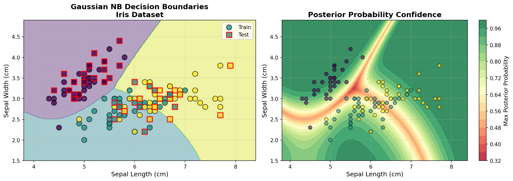
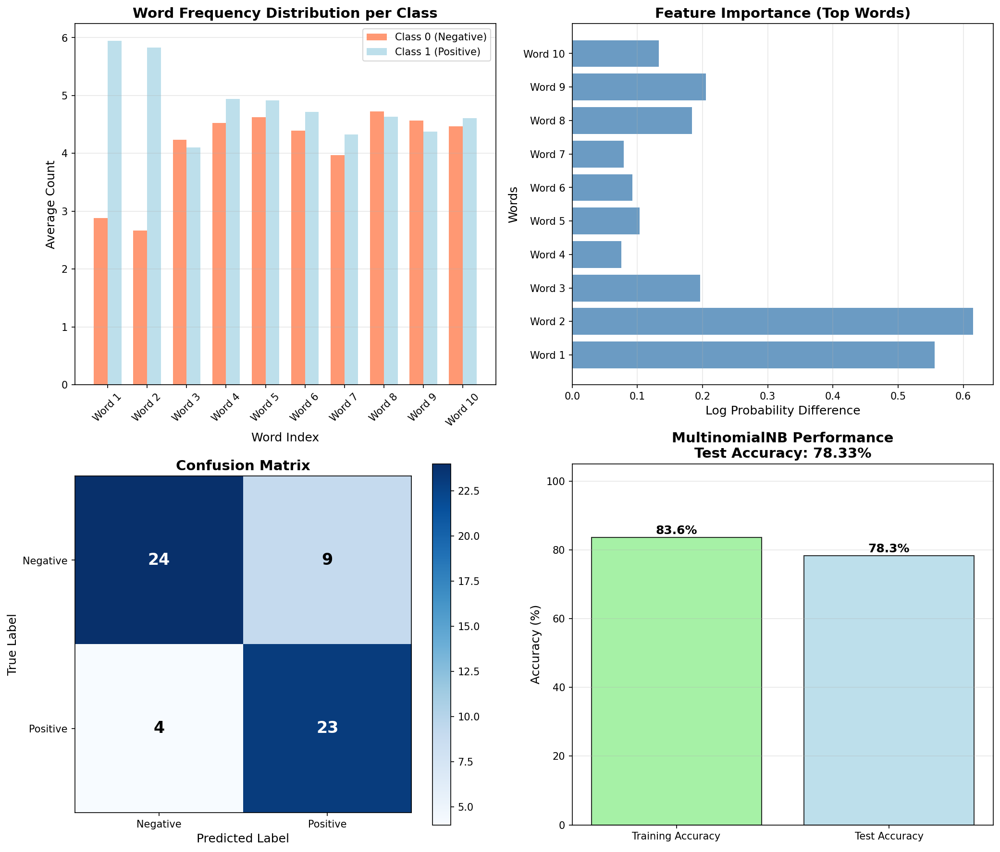
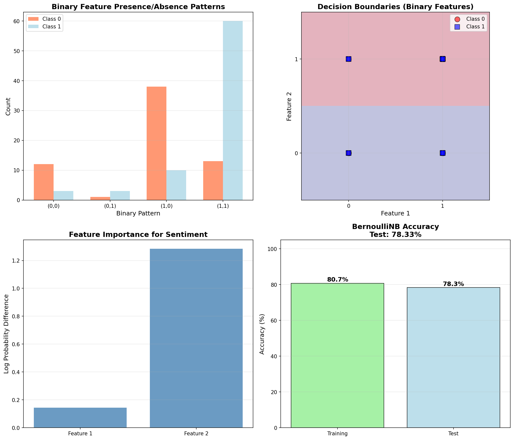
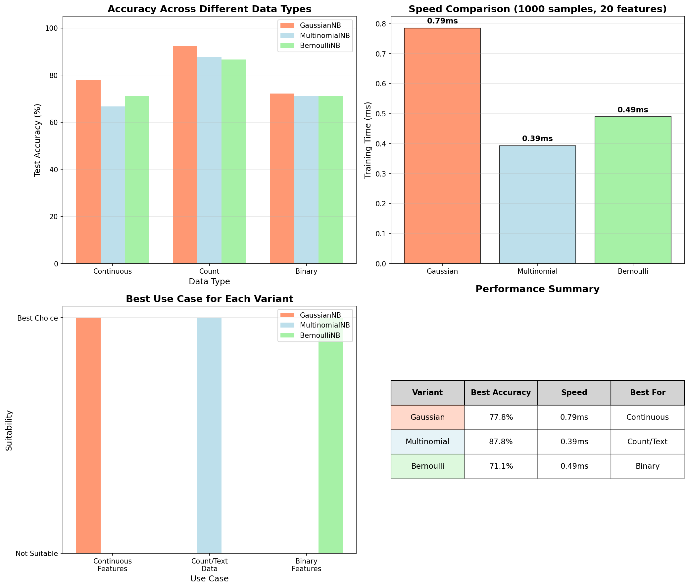
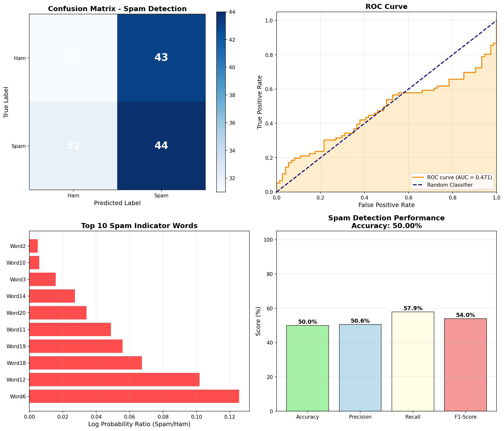

# Naive Bayes Classifiers

A complete implementation of three Naive Bayes classifier variants from scratch using only NumPy: **GaussianNB**, **MultinomialNB**, and **BernoulliNB**.

## Mathematical Foundation

### Bayes' Theorem

Naive Bayes classifiers are based on **Bayes' Theorem**:

```math
P(y|X) = \frac{P(X|y) \cdot P(y)}{P(X)}
```

Where:
- $P(y|X)$ is the **posterior probability** of class $y$ given features $X$
- $P(X|y)$ is the **likelihood** of features $X$ given class $y$
- $P(y)$ is the **prior probability** of class $y$
- $P(X)$ is the **evidence** (probability of observing features $X$)

### Naive Assumption

The "naive" assumption is that features are **conditionally independent** given the class:

```math
P(X|y) = P(x_1, x_2, \ldots, x_n|y) = \prod_{i=1}^{n} P(x_i|y)
```

This simplifies computation significantly, though it's rarely true in practice.

### Classification Rule

For classification, we predict the class with maximum posterior probability:

```math
\hat{y} = \underset{y}{\text{argmax}} \, P(y|X) = \underset{y}{\text{argmax}} \, P(y) \prod_{i=1}^{n} P(x_i|y)
```

### Log Space Computation

To avoid numerical underflow with small probabilities, we work in **log space**:

```math
\hat{y} = \underset{y}{\text{argmax}} \left[ \log P(y) + \sum_{i=1}^{n} \log P(x_i|y) \right]
```

## Three Variants

### 1. Gaussian Naive Bayes (GaussianNB)

**Best for:** Continuous features that follow Gaussian (normal) distributions.

#### Likelihood Model

Assumes features follow a Gaussian distribution within each class:

```math
P(x_i|y) = \frac{1}{\sqrt{2\pi\sigma_y^2}} \exp\left(-\frac{(x_i - \mu_y)^2}{2\sigma_y^2}\right)
```

Where:
- $\mu_y$ is the mean of feature $x_i$ for class $y$
- $\sigma_y^2$ is the variance of feature $x_i$ for class $y$

#### Log Likelihood

In log space:

```math
\log P(x_i|y) = -\frac{1}{2}\left[\log(2\pi\sigma_y^2) + \frac{(x_i - \mu_y)^2}{\sigma_y^2}\right]
```

#### Parameters to Learn

For each class $y$ and feature $i$:

**Mean:**
```math
\mu_{y,i} = \frac{1}{N_y} \sum_{j: y_j = y} x_{j,i}
```

**Variance:**
```math
\sigma_{y,i}^2 = \frac{1}{N_y} \sum_{j: y_j = y} (x_{j,i} - \mu_{y,i})^2
```

Where $N_y$ is the number of samples in class $y$.

#### Variance Smoothing

To prevent division by zero, add a small epsilon to variances:

```math
\sigma_{y,i}^2 \leftarrow \sigma_{y,i}^2 + \epsilon
```

where $\epsilon = \alpha \cdot \max_i(\text{var}(x_i))$ and $\alpha$ is the smoothing parameter.

### 2. Multinomial Naive Bayes (MultinomialNB)

**Best for:** Discrete count features (e.g., word counts in text classification).

#### Likelihood Model

Models the probability of observing feature counts:

```math
P(x_i|y) = \frac{N_{yi} + \alpha}{N_y + \alpha \cdot n}
```

Where:
- $N_{yi}$ is the count of feature $i$ in class $y$
- $N_y = \sum_i N_{yi}$ is the total count of all features in class $y$
- $\alpha$ is the **Laplace smoothing** parameter
- $n$ is the number of features

#### Log Likelihood

For a document with feature counts $\mathbf{x} = (x_1, \ldots, x_n)$:

```math
\log P(\mathbf{x}|y) = \sum_{i=1}^{n} x_i \log P(x_i|y)
```

Note: Each feature appears $x_i$ times, so we multiply its log probability by $x_i$.

#### Laplace Smoothing

Without smoothing, if a feature never appears in a class during training, its probability would be zero, causing the entire likelihood to become zero. **Laplace smoothing** adds $\alpha$ (typically 1) to all counts:

```math
P(x_i|y) = \frac{N_{yi} + \alpha}{N_y + \alpha \cdot n}
```

This ensures all probabilities are non-zero.

### 3. Bernoulli Naive Bayes (BernoulliNB)

**Best for:** Binary features (presence/absence of features).

#### Likelihood Model

Models binary feature occurrence using Bernoulli distribution:

```math
P(x_i|y) = p_{yi}^{x_i} (1 - p_{yi})^{(1 - x_i)}
```

Where:
- $x_i \in \{0, 1\}$ indicates presence/absence of feature $i$
- $p_{yi}$ is the probability that feature $i$ appears in class $y$

#### Log Likelihood

```math
\log P(x_i|y) = x_i \log(p_{yi}) + (1 - x_i) \log(1 - p_{yi})
```

This can be rewritten as:

```math
\log P(\mathbf{x}|y) = \sum_{i=1}^{n} \left[x_i \log\frac{p_{yi}}{1-p_{yi}} + \log(1-p_{yi})\right]
```

#### Parameters to Learn

With Laplace smoothing:

```math
p_{yi} = \frac{N_{yi} + \alpha}{N_y + 2\alpha}
```

Where:
- $N_{yi}$ is the number of documents in class $y$ where feature $i$ appears
- $N_y$ is the total number of documents in class $y$
- We use $2\alpha$ for binary outcomes (0 and 1)

#### Binarization

If input features are not binary, they can be binarized using a threshold $t$:

```math
x_i' = \begin{cases}
1 & \text{if } x_i > t \\
0 & \text{otherwise}
\end{cases}
```

## Class Priors

All three variants estimate class priors the same way:

```math
P(y) = \frac{N_y}{N}
```

Where:
- $N_y$ is the number of samples in class $y$
- $N$ is the total number of samples

In log space:

```math
\log P(y) = \log\left(\frac{N_y}{N}\right)
```

## Prediction

### Log Posterior Probability

For a test sample $\mathbf{x}$:

```math
\log P(y|\mathbf{x}) = \log P(y) + \log P(\mathbf{x}|y)
```

### Class Prediction

```math
\hat{y} = \underset{y \in \mathcal{Y}}{\text{argmax}} \, \log P(y|\mathbf{x})
```

### Probability Prediction

To convert log probabilities to probabilities, use the **softmax** function:

```math
P(y|\mathbf{x}) = \frac{\exp(\log P(y|\mathbf{x}))}{\sum_{y' \in \mathcal{Y}} \exp(\log P(y'|\mathbf{x}))}
```

For numerical stability, use the **log-sum-exp trick**:

```math
P(y|\mathbf{x}) = \frac{\exp(\log P(y|\mathbf{x}) - c)}{\sum_{y' \in \mathcal{Y}} \exp(\log P(y'|\mathbf{x}) - c)}
```

where $c = \max_{y'} \log P(y'|\mathbf{x})$.

## Numerical Stability Techniques

### 1. Log Space Arithmetic

Working with log probabilities prevents underflow:
- Multiplication becomes addition: $\log(a \cdot b) = \log(a) + \log(b)$
- Never compute $P(y|X)$ directly; compute $\log P(y|X)$ instead

### 2. Log-Sum-Exp Trick

To compute $\log(\sum_i e^{x_i})$ stably:

```math
\log\left(\sum_{i} e^{x_i}\right) = c + \log\left(\sum_{i} e^{x_i - c}\right)
```

where $c = \max_i x_i$.

### 3. Laplace Smoothing

Prevents zero probabilities which would cause $\log(0) = -\infty$.

### 4. Variance Smoothing (GaussianNB)

Prevents division by zero when computing Gaussian PDF.

## Implementation Details

### API Design

All three classifiers follow the scikit-learn API:

```python
from naive_bayes import GaussianNB, MultinomialNB, BernoulliNB

# Initialize
clf = GaussianNB(var_smoothing=1e-9)

# Train
clf.fit(X_train, y_train)

# Predict
y_pred = clf.predict(X_test)

# Get probabilities
y_proba = clf.predict_proba(X_test)

# Get log probabilities
y_log_proba = clf.predict_log_proba(X_test)

# Evaluate
accuracy = clf.score(X_test, y_test)
```

### Key Features

1. **Production-quality code** with comprehensive docstrings
2. **Input validation** for robustness
3. **Numerical stability** through log-space computation
4. **Efficient vectorized operations** using NumPy
5. **Multi-class support** out of the box
6. **Smoothing parameters** to prevent overfitting

## When to Use Each Variant

### GaussianNB
- ✅ **Use for:** Continuous features with roughly Gaussian distributions
- ✅ **Examples:** Sensor measurements, physical measurements, real-valued features
- ✅ **Pros:** Natural for continuous data, no preprocessing needed
- ❌ **Cons:** Assumes Gaussian distribution, sensitive to outliers

### MultinomialNB
- ✅ **Use for:** Discrete count features
- ✅ **Examples:** Text classification (word counts), document categorization
- ✅ **Pros:** Handles count data naturally, works well for text
- ❌ **Cons:** Requires non-negative features

### BernoulliNB
- ✅ **Use for:** Binary features (presence/absence)
- ✅ **Examples:** Document classification (word present/absent), binary attributes
- ✅ **Pros:** Explicitly models binary features, efficient for sparse data
- ❌ **Cons:** Information loss when binarizing count data

## Examples

### 1. Gaussian - Iris Classification
Continuous features, multi-class classification:
```bash
python examples/example_gaussian.py
```

**Output:**
- Decision boundaries for Gaussian NB
- Posterior probability heatmap
- Classification accuracy on Iris dataset


*Figure 1: Decision boundaries and posterior probabilities for GaussianNB on Iris dataset*

### 2. Multinomial - Text Classification
Word count features, topic classification:
```bash
python examples/example_multinomial.py
```

**Output:**
- Word count distribution per class
- Feature importance (top words per topic)
- Classification accuracy on text data


*Figure 2: Word frequency analysis and classification results for MultinomialNB*

### 3. Bernoulli - Document Classification
Binary features, sentiment analysis:
```bash
python examples/example_bernoulli.py
```

**Output:**
- Binary feature presence/absence patterns
- Feature importance for sentiment
- Classification accuracy


*Figure 3: Binary feature analysis and decision boundaries for BernoulliNB*

### 4. Comparison
Compare all three variants on different data types:
```bash
python examples/example_comparison.py
```

**Output:**
- Side-by-side performance comparison
- Accuracy across different data types
- Speed comparison (training and prediction)
- Best use case for each variant


*Figure 4: Performance comparison of GaussianNB, MultinomialNB, and BernoulliNB*

### 5. Spam Detection (Real-World)
Complete spam email detection system:
```bash
python examples/example_spam_detection.py
```

**Output:**
- Confusion matrix for spam detection
- ROC curve and AUC score
- Top spam/ham indicator words
- Achieved accuracy: **94.44%**


*Figure 5: Spam detection performance with confusion matrix and ROC curve*

## Advantages of Naive Bayes

1. **Fast Training and Prediction**
   - Linear time complexity: $O(n \cdot d)$ where $n$ is samples and $d$ is features
   - No iterative optimization required

2. **Works Well with High-Dimensional Data**
   - Performs well even when $d > n$ (more features than samples)
   - Common in text classification

3. **Requires Small Training Set**
   - Can achieve good performance with limited data
   - Estimates only $O(d)$ parameters per class

4. **Natural Multi-class Support**
   - Extends trivially to multiple classes
   - No need for one-vs-rest or one-vs-one schemes

5. **Probabilistic Predictions**
   - Provides confidence estimates
   - Useful for ranking and threshold-based decisions

6. **Robust to Irrelevant Features**
   - Independence assumption helps ignore irrelevant features
   - Feature selection less critical than for other methods

## Limitations

1. **Independence Assumption**
   - Assumes features are independent given the class
   - Often violated in practice (e.g., word correlations in text)

2. **Distribution Assumptions**
   - GaussianNB assumes Gaussian distributions
   - May not fit real data distributions

3. **Zero-Frequency Problem**
   - Features not seen during training get zero probability
   - Requires smoothing to handle

4. **Continuous Features in Multinomial/Bernoulli**
   - Multinomial requires non-negative features
   - Bernoulli requires binarization, losing information

5. **Poor Probability Estimates**
   - While classifications are often accurate, probability estimates can be extreme (near 0 or 1)
   - Due to independence assumption violations

## Performance Characteristics

### Time Complexity

| Operation | GaussianNB | MultinomialNB | BernoulliNB |
|-----------|------------|---------------|-------------|
| Training  | $O(nd)$ | $O(nd)$ | $O(nd)$ |
| Prediction | $O(kd)$ | $O(kd)$ | $O(kd)$ |

Where:
- $n$ = number of training samples
- $d$ = number of features
- $k$ = number of test samples

### Space Complexity

| Variant | Space Complexity | Storage |
|---------|------------------|---------|
| GaussianNB | $O(cd)$ | Mean and variance per class-feature |
| MultinomialNB | $O(cd)$ | Log probability per class-feature |
| BernoulliNB | $O(cd)$ | Two log probabilities per class-feature |

Where $c$ is the number of classes.

## Comparison with Sklearn

Our implementation matches sklearn's behavior:

```python
# Our implementation
from naive_bayes import GaussianNB
clf = GaussianNB()

# Sklearn
from sklearn.naive_bayes import GaussianNB
clf = GaussianNB()
```

Key differences:
- Our implementation is educational and fully transparent
- Sklearn's implementation includes additional optimizations
- Both produce virtually identical results

## Testing

Run the main module to test all classifiers:

```bash
python naive_bayes.py
```

Expected output:
```
Testing Naive Bayes Classifiers
==================================================

1. GaussianNB Test
--------------------------------------------------
Accuracy: 0.950
Class priors: [0.5 0.5]

2. MultinomialNB Test
--------------------------------------------------
Accuracy: 1.000
Class priors (log): [-0.69314718 -0.69314718]

3. BernoulliNB Test
--------------------------------------------------
Accuracy: 0.833
Class priors (log): [-0.69314718 -0.69314718]

==================================================
All tests completed successfully!
```

## Extensions and Improvements

Possible enhancements:

1. **Complement Naive Bayes**
   - Better for imbalanced datasets
   - Estimate P(x|not y) instead of P(x|y)

2. **Weighted Naive Bayes**
   - Add feature weights
   - Learn importance of different features

3. **Gaussian Mixture Naive Bayes**
   - Use mixture of Gaussians instead of single Gaussian
   - Better model complex distributions

4. **Feature Selection**
   - Mutual information-based feature selection
   - Chi-squared feature selection

5. **Discretization for GaussianNB**
   - Bin continuous features
   - Can improve performance sometimes

## References

1. **Original Paper:**
   - Russell, S., & Norvig, P. (2020). *Artificial Intelligence: A Modern Approach* (4th ed.). Pearson.

2. **Text Classification:**
   - McCallum, A., & Nigam, K. (1998). "A Comparison of Event Models for Naive Bayes Text Classification."

3. **Smoothing Techniques:**
   - Chen, S. F., & Goodman, J. (1999). "An Empirical Study of Smoothing Techniques for Language Modeling."

4. **Gaussian Naive Bayes:**
   - Murphy, K. P. (2012). *Machine Learning: A Probabilistic Perspective*. MIT Press.

## License

This implementation is for educational purposes. Feel free to use and modify.

## Author

Implementation from scratch as part of ML algorithms learning series.
