# Decision Tree Classifier - From Scratch Implementation

A complete implementation of a Decision Tree classifier using only NumPy, following the CART (Classification and Regression Trees) algorithm.

## Table of Contents
1. [Features](#features)
2. [Mathematical Foundation](#mathematical-foundation)
3. [The CART Algorithm](#the-cart-algorithm)
4. [Installation](#installation)
5. [Usage](#usage)
6. [Examples](#examples)
7. [Comparison with sklearn](#comparison-with-sklearn)
8. [Advantages and Limitations](#advantages-and-limitations)

## Features

- **Binary and Multi-class Classification**: Naturally handles both binary and multi-class problems
- **Multiple Split Criteria**: Gini impurity, Entropy (Information Gain), and Misclassification Error
- **Pre-pruning**: Controls tree growth with `max_depth`, `min_samples_split`, and `min_samples_leaf`
- **Cost-Complexity Pruning**: Post-pruning with `ccp_alpha` parameter
- **Feature Importance**: Calculates importance based on weighted impurity decrease
- **Tree Visualization**: Text-based tree structure display
- **sklearn-compatible API**: Familiar `fit()`, `predict()`, and `predict_proba()` methods

## Mathematical Foundation

### 1. Overview: Decision Trees

Decision trees are **non-parametric supervised learning algorithms** used for classification and regression. They work by recursively partitioning the feature space into regions, where each region corresponds to a leaf node that makes a prediction.

**Key Concept**: The tree learns a **hierarchical decision rule** by asking a series of questions about the features:

```
Is feature X₁ > threshold θ₁?
    ├─ YES → Is feature X₃ > threshold θ₃?
    │           ├─ YES → Predict Class A
    │           └─ NO  → Predict Class B
    └─ NO  → Predict Class C
```

### 2. Formal Problem Setup

**Given:**
- Training set: $\mathcal{D} = \{(\mathbf{x}_1, y_1), (\mathbf{x}_2, y_2), \ldots, (\mathbf{x}_n, y_n)\}$
- Features: $\mathbf{x}_i \in \mathbb{R}^d$
- Labels: $y_i \in \{1, 2, \ldots, K\}$ for $K$ classes

**Goal:**
Learn a tree $T$ that minimizes prediction error on unseen data.

### 3. Node Impurity Measures

A crucial concept in decision trees is **node impurity** - a measure of how "mixed" the classes are at a node. A pure node (all samples from one class) has impurity = 0.

#### 3.1 Gini Impurity

The **Gini impurity** measures the probability of incorrectly classifying a randomly chosen element if it were randomly labeled according to the class distribution at node $t$:

```math
\boxed{\text{Gini}(t) = 1 - \sum_{k=1}^{K} p_k^2}
```

where:
- $p_k = \frac{n_k}{n_t}$ is the proportion of class $k$ samples at node $t$
- $n_k$ = number of samples of class $k$ at node $t$
- $n_t$ = total number of samples at node $t$
- $K$ = number of classes

**Intuition**: If we randomly pick a sample from node $t$ and randomly assign it a label according to the class distribution, $\text{Gini}(t)$ is the probability we mislabel it.

**Derivation of the Gini Formula:**

The probability of picking a sample of class $k$ is $p_k$. The probability of misclassifying it as another class is $1 - p_k$. Summing over all classes:

```math
\text{Gini}(t) = \sum_{k=1}^{K} p_k (1 - p_k) = \sum_{k=1}^{K} p_k - \sum_{k=1}^{K} p_k^2 = 1 - \sum_{k=1}^{K} p_k^2
```

since $\sum_{k=1}^{K} p_k = 1$.

**Properties:**
1. **Range**: $[0, 1 - \frac{1}{K}]$
   - Minimum (pure node): $\text{Gini}(t) = 0$ when $p_k = 1$ for some $k$
   - Maximum (balanced): $\text{Gini}(t) = 1 - \frac{1}{K}$ when $p_k = \frac{1}{K}$ for all $k$

2. **Computational Efficiency**: No logarithms → faster than entropy

3. **For Binary Classification** ($K=2$):

```math
\text{Gini}(t) = 1 - (p^2 + (1-p)^2) = 2p(1-p)
```

Maximum at $p = 0.5$: $\text{Gini}_{\max} = 0.5$

**Example Calculation:**

Consider a node with 100 samples:
- Class A: 70 samples → $p_A = 0.7$
- Class B: 20 samples → $p_B = 0.2$
- Class C: 10 samples → $p_C = 0.1$

```math
\text{Gini}(t) = 1 - (0.7^2 + 0.2^2 + 0.1^2) = 1 - (0.49 + 0.04 + 0.01) = 0.46
```

#### 3.2 Entropy (Information Gain)

**Entropy** measures the amount of information or uncertainty in the dataset. It comes from **information theory** (Shannon, 1948).

```math
\boxed{H(t) = -\sum_{k=1}^{K} p_k \log_2(p_k)}
```

where:
- $H(t)$ is the entropy at node $t$
- $p_k$ is the proportion of class $k$ samples
- $\log_2$ is the logarithm base 2

**Intuition**: Entropy measures the average number of bits needed to encode the class label at node $t$. Higher entropy means more uncertainty.

**Information Theory Background:**

In information theory, the **information content** of an event with probability $p$ is:

```math
I(p) = -\log_2(p) \text{ bits}
```

Rare events ($p$ small) carry more information when they occur. The entropy is the **expected information content**:

```math
H(t) = \mathbb{E}[I(p)] = \sum_{k=1}^{K} p_k \cdot (-\log_2(p_k))
```

**Properties:**
1. **Range**: $[0, \log_2(K)]$
   - Minimum (pure node): $H(t) = 0$ when $p_k = 1$ for some $k$
   - Maximum (uniform): $H(t) = \log_2(K)$ when $p_k = \frac{1}{K}$ for all $k$

2. **For Binary Classification** ($K=2$):

```math
H(t) = -p\log_2(p) - (1-p)\log_2(1-p)
```

Maximum at $p = 0.5$: $H_{\max} = 1$ bit

**Example Calculation:**

Same node as before (70-20-10 split):

```math
\begin{align}
H(t) &= -0.7 \log_2(0.7) - 0.2 \log_2(0.2) - 0.1 \log_2(0.1) \\
&= -0.7 \times (-0.515) - 0.2 \times (-2.322) - 0.1 \times (-3.322) \\
&= 0.360 + 0.464 + 0.332 \\
&= 1.156 \text{ bits}
\end{align}
```

**Relationship Between Gini and Entropy:**

For binary classification, Gini and Entropy are related:

```math
\text{Gini}(p) = 2p(1-p) \quad \text{vs.} \quad H(p) = -p\log_2(p) - (1-p)\log_2(1-p)
```

Both are concave functions maximized at $p = 0.5$. Entropy is more sensitive to probability changes than Gini.

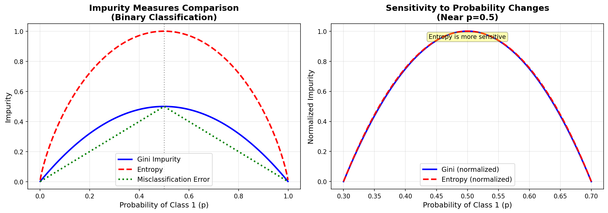
*Figure 1: Comparison of Gini impurity and Entropy for binary classification*

#### 3.3 Misclassification Error

The simplest criterion, measuring the fraction of misclassified samples if we assign all samples to the majority class:

```math
\boxed{\text{Error}(t) = 1 - \max_k(p_k)}
```

**Properties:**
1. **Range**: $[0, 1 - \frac{1}{K}]$
2. **Less sensitive** to probability changes than Gini or Entropy
3. **Rarely used in practice** because it doesn't differentiate well between splits

**Example:**
- Node with 70-20-10 split: $\text{Error}(t) = 1 - 0.7 = 0.3$
- Node with 51-49 split: $\text{Error}(t) = 1 - 0.51 = 0.49$

**Comparison of All Three Criteria:**

| Node Distribution | Gini | Entropy | Error |
|-------------------|------|---------|-------|
| Pure (100-0) | 0.000 | 0.000 | 0.000 |
| Balanced (50-50) | 0.500 | 1.000 | 0.500 |
| Imbalanced (90-10) | 0.180 | 0.469 | 0.100 |
| Multi (70-20-10) | 0.460 | 1.156 | 0.300 |

### 4. Information Gain (Split Quality)

**Information Gain** measures how much a split reduces impurity. It's the key criterion for selecting the best split.

#### 4.1 Definition

For a split of node $t$ into left child $t_L$ and right child $t_R$:

```math
\boxed{\Delta(t, s) = I(t) - \frac{n_L}{n_t} I(t_L) - \frac{n_R}{n_t} I(t_R)}
```

where:
- $\Delta(t, s)$ = information gain from split $s$
- $I(t)$ = impurity at parent node (Gini, Entropy, or Error)
- $n_t$ = number of samples at parent node
- $n_L$ = number of samples in left child
- $n_R$ = number of samples in right child
- $I(t_L)$, $I(t_R)$ = impurities of child nodes

**Interpretation**: Information gain is the weighted reduction in impurity achieved by the split.

#### 4.2 Finding the Optimal Split

For a feature $j$ and threshold $\theta$, the split is:

```math
\begin{align}
t_L &= \{\mathbf{x}_i \in t : x_{ij} \leq \theta\} \\
t_R &= \{\mathbf{x}_i \in t : x_{ij} > \theta\}
\end{align}
```

The **optimal split** maximizes information gain:

```math
\boxed{(j^*, \theta^*) = \arg\max_{j, \theta} \Delta(t, (j, \theta))}
```

**Algorithm**: For each feature $j$:
1. Sort samples by feature $j$
2. Try all unique values as thresholds $\theta$
3. Calculate information gain for each threshold
4. Keep the split with maximum gain

**Computational Complexity:**
- $O(n d \log n)$ for finding best split at one node
- $O(d)$ features, each requiring $O(n \log n)$ sorting and $O(n)$ gain calculation

#### 4.3 Example: Manual Split Calculation

**Setup:**
Node with 10 samples, 2 features:

| Sample | $x_1$ | $x_2$ | Class |
|--------|-------|-------|-------|
| 1 | 1.0 | 2.0 | A |
| 2 | 1.5 | 3.0 | A |
| 3 | 2.0 | 1.5 | A |
| 4 | 2.5 | 2.5 | A |
| 5 | 3.0 | 3.5 | B |
| 6 | 3.5 | 2.0 | B |
| 7 | 4.0 | 3.0 | B |
| 8 | 4.5 | 1.5 | B |
| 9 | 5.0 | 2.5 | B |
| 10 | 5.5 | 3.0 | B |

**Step 1**: Calculate parent impurity (50-50 split, $K=2$)

```math
\text{Gini}(t) = 1 - (0.5^2 + 0.5^2) = 0.5
```

**Step 2**: Try split on $x_1 \leq 3.25$
- Left: samples 1-5 (4A, 1B) → $p_A = 0.8$, $p_B = 0.2$
- Right: samples 6-10 (0A, 5B) → $p_A = 0$, $p_B = 1$

```math
\text{Gini}(t_L) = 1 - (0.8^2 + 0.2^2) = 0.32
```

```math
\text{Gini}(t_R) = 1 - (0^2 + 1^2) = 0
```

**Step 3**: Calculate information gain

```math
\begin{align}
\Delta &= 0.5 - \frac{5}{10} \times 0.32 - \frac{5}{10} \times 0 \\
&= 0.5 - 0.16 - 0 \\
&= 0.34
\end{align}
```

**Interpretation**: This split reduces Gini impurity by 0.34, a 68% reduction!

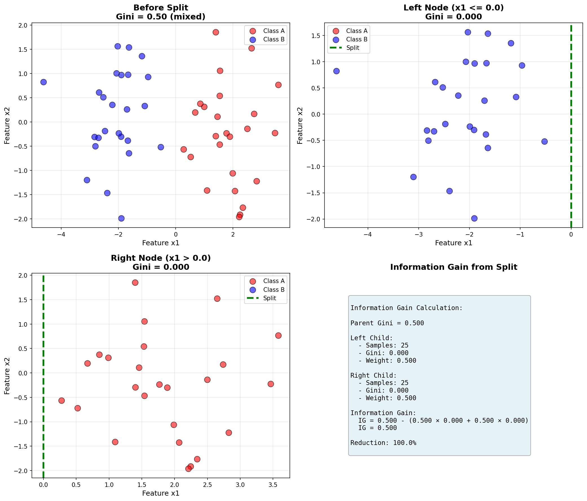
*Figure 2: Visual representation of optimal split*

### 5. The CART Algorithm (Classification and Regression Trees)

CART is a **recursive binary splitting** algorithm that builds the tree top-down.

#### 5.1 Pseudocode

```
function BuildTree(D, depth):
    # Check stopping criteria
    if depth == max_depth or |D| < min_samples_split or IsPure(D):
        return LeafNode(MajorityClass(D))

    # Find best split
    best_gain = -∞
    for each feature j in {1, ..., d}:
        for each threshold θ in UniqueValues(D, j):
            D_left = {(x, y) ∈ D : x_j ≤ θ}
            D_right = {(x, y) ∈ D : x_j > θ}

            # Check minimum leaf size
            if |D_left| < min_samples_leaf or |D_right| < min_samples_leaf:
                continue

            gain = InformationGain(D, D_left, D_right)

            if gain > best_gain:
                best_gain = gain
                (j*, θ*) = (j, θ)

    # No valid split found
    if best_gain == -∞:
        return LeafNode(MajorityClass(D))

    # Create node and recurse
    node = InternalNode(j*, θ*)
    node.left = BuildTree(D_left, depth + 1)
    node.right = BuildTree(D_right, depth + 1)

    return node
```

#### 5.2 Stopping Criteria

The tree construction stops when **any** of these conditions is met:

1. **Maximum depth reached**: `depth == max_depth`
   - Prevents trees from becoming too deep
   - Typical values: 3-10

2. **Node is pure**: All samples belong to same class
   - $I(t) = 0$
   - No further split can improve purity

3. **Too few samples to split**: `|D| < min_samples_split`
   - Avoids unreliable splits on small data
   - Typical values: 2-20

4. **Child would be too small**: `|D_left| < min_samples_leaf` or `|D_right| < min_samples_leaf`
   - Ensures leaves have sufficient samples
   - Typical values: 1-10

5. **No information gain**: No split improves impurity
   - `best_gain ≤ 0`

6. **Minimum impurity decrease**: `best_gain < min_impurity_decrease`
   - Fine-grained control (not implemented in basic version)

**Effect of Stopping Criteria:**

```math
\begin{align}
\text{Shallow trees (strict criteria)} &\rightarrow \text{High bias, Low variance} \\
\text{Deep trees (loose criteria)} &\rightarrow \text{Low bias, High variance}
\end{align}
```

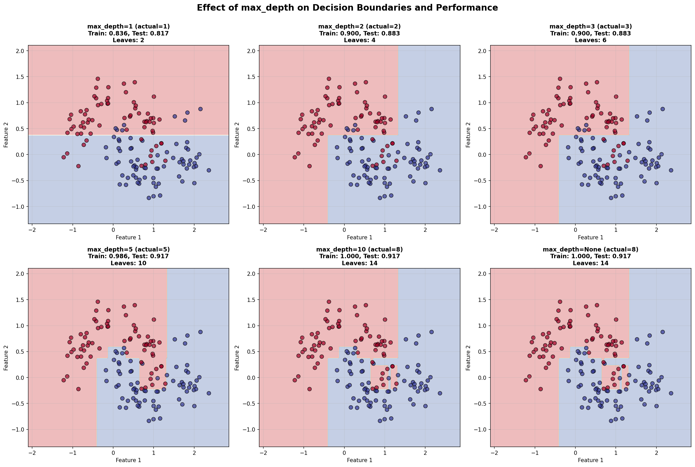
*Figure 3: Effect of max_depth on decision boundaries*

#### 5.3 Prediction

For a new sample $\mathbf{x}_{\text{new}}$, traverse the tree from root to leaf:

```
function Predict(x, node):
    if node is LeafNode:
        return node.class_label

    if x[node.feature] ≤ node.threshold:
        return Predict(x, node.left)
    else:
        return Predict(x, node.right)
```

**Time Complexity**: $O(\log n)$ on average, $O(n)$ worst case (unbalanced tree)

#### 5.4 Probability Prediction

Decision trees can output **class probabilities** based on the class distribution at the leaf node:

```math
P(y = k | \mathbf{x}) = \frac{n_k}{n_{\text{leaf}}}
```

where:
- $n_k$ = number of training samples of class $k$ at the leaf
- $n_{\text{leaf}}$ = total training samples at the leaf

**Example:**
Leaf node with 8 samples: 5 Class A, 3 Class B

```math
P(y = A | \mathbf{x}) = \frac{5}{8} = 0.625, \quad P(y = B | \mathbf{x}) = \frac{3}{8} = 0.375
```

### 6. Pruning Techniques

**Problem**: Fully grown trees tend to **overfit** the training data.

**Solution**: **Pruning** removes parts of the tree that don't improve generalization.

#### 6.1 Pre-pruning (Early Stopping)

Applied **during** tree construction. Uses constraints:
- `max_depth`: Limit tree depth
- `min_samples_split`: Minimum samples required to split
- `min_samples_leaf`: Minimum samples required at leaf
- `max_features`: Limit features considered at each split

**Advantages:**
- Fast (stops tree growth early)
- Easy to implement
- Effective in practice

**Disadvantages:**
- May stop too early (miss good splits later)
- Requires hyperparameter tuning

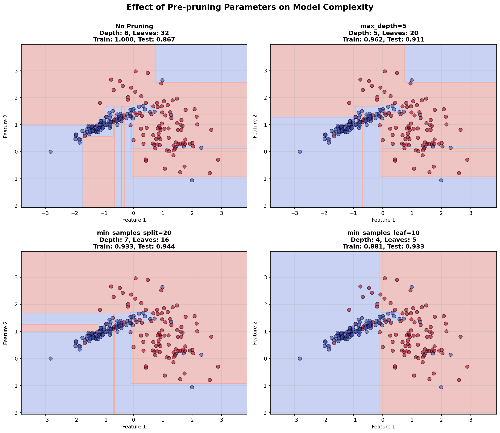
*Figure 4: Effect of pre-pruning parameters on model complexity*

#### 6.2 Cost-Complexity Pruning (Post-pruning)

Applied **after** tree is fully grown. Removes branches that don't significantly improve performance.

**Cost-Complexity Measure:**

For a tree $T$ with $|T|$ leaf nodes:

```math
\boxed{R_\alpha(T) = R(T) + \alpha |T|}
```

where:
- $R(T) = \sum_{t \in \text{leaves}} n_t \cdot I(t)$ is the training error
- $\alpha \geq 0$ is the complexity parameter (`ccp_alpha`)
- $|T|$ is the number of leaf nodes

**Interpretation:**
- $R(T)$: How well the tree fits training data
- $\alpha |T|$: Penalty for tree complexity
- Trade-off: Small $\alpha$ → complex trees, Large $\alpha$ → simple trees

**Pruning Algorithm:**

1. Start with fully grown tree $T_{\max}$
2. For each internal node $t$:
   - Calculate impurity reduction per leaf: $g(t) = \frac{R(t) - R(T_t)}{|T_t| - 1}$
   - where $T_t$ is the subtree rooted at $t$
3. Prune the node with smallest $g(t)$ (least informative)
4. Repeat until we have a single leaf (root only)
5. Use cross-validation to select optimal $\alpha$

**Example:**

Consider a subtree with:
- Parent node: 100 samples, Gini = 0.4
- Left leaf: 60 samples, Gini = 0.3
- Right leaf: 40 samples, Gini = 0.2

```math
\begin{align}
R(\text{subtree}) &= 60 \times 0.3 + 40 \times 0.2 = 26 \\
R(\text{parent}) &= 100 \times 0.4 = 40 \\
\text{Impurity reduction} &= 40 - 26 = 14
\end{align}
```

If $\alpha \times 1$ (cost of 2 leaves vs 1) $> 14$, prune this subtree.

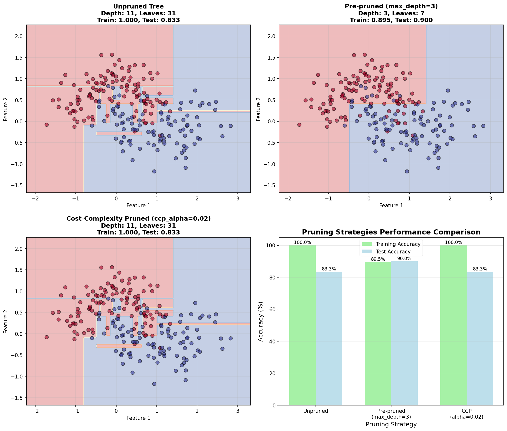
*Figure 5: Comparison of unpruned vs pruned trees*

#### 6.3 Choosing the Right Pruning Strategy

| Aspect | Pre-pruning | Post-pruning |
|--------|-------------|--------------|
| **When applied** | During construction | After full growth |
| **Speed** | Fast ⚡ | Slower 🐌 |
| **Simplicity** | Simple | More complex |
| **Optimality** | May miss good splits | More thorough |
| **Typical use** | Default approach | When max performance needed |

**Recommendation**: Start with pre-pruning (`max_depth=5`, `min_samples_leaf=5`), then try cost-complexity pruning if needed.

### 7. Feature Importance

Feature importance quantifies **how useful each feature is** for prediction.

#### 7.1 Impurity-Based Importance

For feature $j$:

```math
\boxed{\text{Importance}(j) = \frac{1}{n_{\text{total}}} \sum_{t: \text{split on } j} n_t \cdot \Delta I(t)}
```

where:
- Sum is over all nodes $t$ that split on feature $j$
- $n_t$ = number of samples at node $t$
- $\Delta I(t)$ = impurity decrease from split at node $t$
- $n_{\text{total}}$ = total training samples

**Normalization**: Scale so importances sum to 1:

```math
\text{Importance}_{\text{normalized}}(j) = \frac{\text{Importance}(j)}{\sum_{j'=1}^{d} \text{Importance}(j')}
```

#### 7.2 Detailed Calculation Example

**Tree structure:**
```
                 Root (100 samples)
                 Split on x₁ ≤ 5
                 Gini: 0.5 → 0.3
                 Gain: 0.2
           ┌──────────┴──────────┐
     Left (60)               Right (40)
  Split on x₂ ≤ 3        Split on x₁ ≤ 8
  Gini: 0.4 → 0.2       Gini: 0.3 → 0.1
  Gain: 0.12            Gain: 0.08
```

**Feature $x_1$:**
- Root split: $100 \times 0.2 = 20$
- Right split: $40 \times 0.08 = 3.2$
- Total: $20 + 3.2 = 23.2$

**Feature $x_2$:**
- Left split: $60 \times 0.12 = 7.2$

**Normalization:**
```math
\begin{align}
\text{Importance}(x_1) &= \frac{23.2}{23.2 + 7.2} = 0.763 \\
\text{Importance}(x_2) &= \frac{7.2}{23.2 + 7.2} = 0.237
\end{align}
```

**Interpretation**: Feature $x_1$ is **3.2× more important** than $x_2$ for prediction.

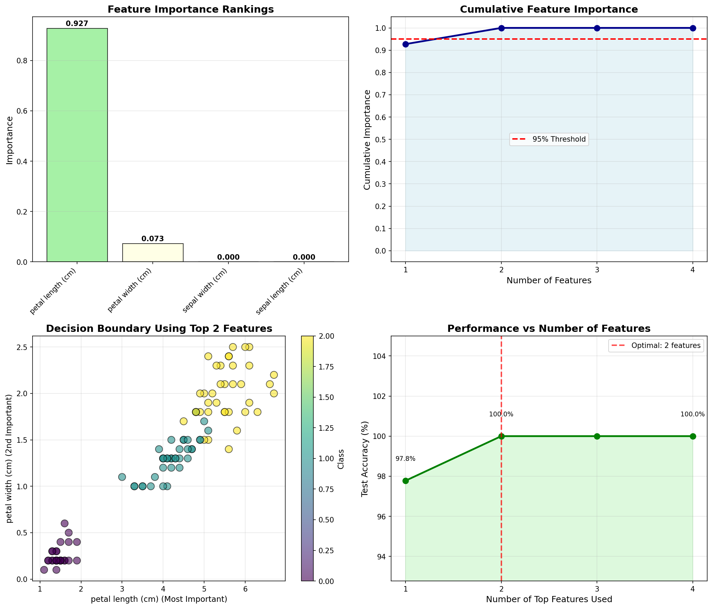
*Figure 6: Feature importance visualization*

#### 7.3 Properties and Caveats

**Advantages:**
- Fast to compute (during training)
- Interpretable
- Useful for feature selection

**Disadvantages:**
- **Biased** towards features with more unique values
- **Unstable** - small data changes → big importance changes
- **Doesn't account for feature interactions** properly

**Better Alternatives:**
1. **Permutation Importance**: Shuffle feature and measure performance drop
2. **SHAP Values**: Game-theory based importance
3. **Ensemble Importances**: Average over many trees (Random Forest)

### 8. Multi-class Classification

Decision trees **naturally handle multi-class problems** without modification!

**For $K$ classes:**

All formulas generalize directly:

```math
\text{Gini}(t) = 1 - \sum_{k=1}^{K} p_k^2
```

```math
H(t) = -\sum_{k=1}^{K} p_k \log_2(p_k)
```

**Prediction**: Each leaf stores a probability distribution over all $K$ classes:

```math
P(y = k | \mathbf{x}) = \frac{n_k}{n_{\text{leaf}}}, \quad k = 1, \ldots, K
```

**Example**: 3-class classification (Iris dataset)

Leaf node with 30 samples:
- Setosa: 20 samples → $P(y = \text{Setosa}) = \frac{20}{30} = 0.67$
- Versicolor: 8 samples → $P(y = \text{Versicolor}) = \frac{8}{30} = 0.27$
- Virginica: 2 samples → $P(y = \text{Virginica}) = \frac{2}{30} = 0.07$

Prediction: Setosa (highest probability)

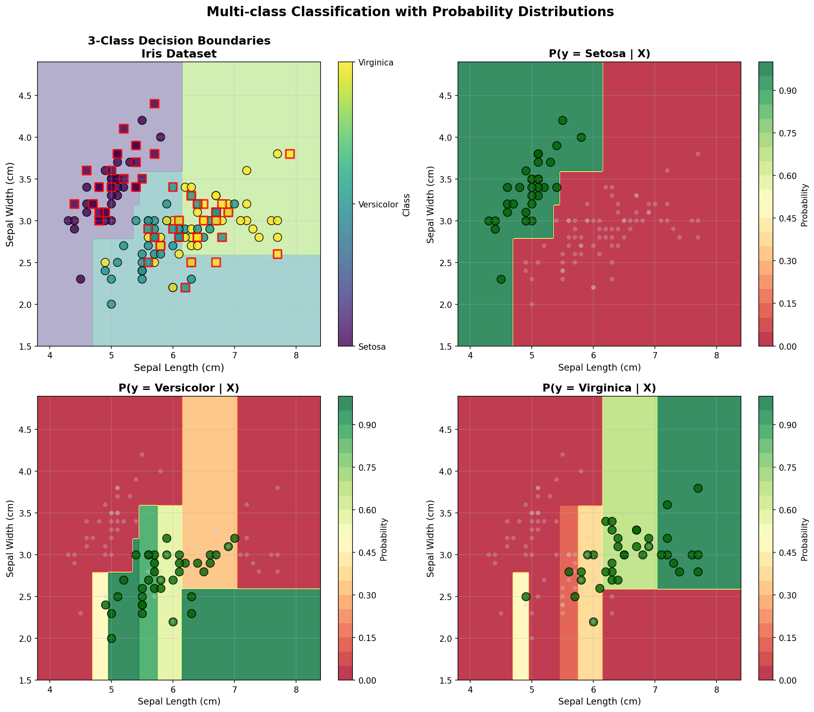
*Figure 7: Decision boundaries for 3-class classification*

### 9. Bias-Variance Tradeoff

Decision trees can be tuned from **high bias** (shallow) to **high variance** (deep).

**Shallow Trees (max_depth = 1-3):**
```math
\text{High Bias, Low Variance} \rightarrow \text{Underfitting}
```
- Simple decision boundaries
- May miss complex patterns
- Consistent across training sets

**Deep Trees (max_depth = None):**
```math
\text{Low Bias, High Variance} \rightarrow \text{Overfitting}
```
- Complex decision boundaries
- Memorizes training data
- Sensitive to small data changes

**Optimal Tree:**
```math
\text{Balanced Bias-Variance} \rightarrow \text{Good Generalization}
```
- Captures true patterns
- Ignores noise
- Use cross-validation to find optimal depth

**Mathematical Relationship:**

Expected test error can be decomposed:

```math
\mathbb{E}[(\hat{y} - y)^2] = \underbrace{\text{Bias}^2[\hat{y}]}_{\text{Underfitting}} + \underbrace{\text{Var}[\hat{y}]}_{\text{Overfitting}} + \underbrace{\sigma^2}_{\text{Irreducible}}
```

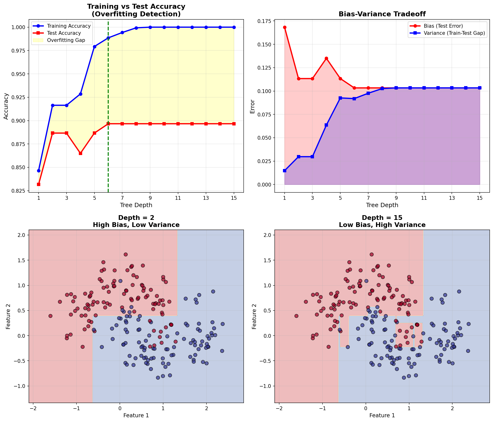
*Figure 8: Training vs test accuracy as depth increases*

### 10. Decision Tree vs Other Algorithms

| Algorithm | Linear Boundaries | Probability Output | Feature Interactions | Interpretability | Training Speed |
|-----------|-------------------|-------------------|---------------------|------------------|----------------|
| **Decision Tree** | ❌ Step-like | ✅ Yes | ✅ Automatic | ✅✅✅ Excellent | ⚡⚡ Fast |
| **Logistic Regression** | ✅ Linear | ✅ Yes | ❌ Manual | ✅✅ Good | ⚡⚡⚡ Very Fast |
| **SVM** | ✅ With kernel | ❌ No | ✅ With kernel | ❌ Poor | 🐌 Slow |
| **KNN** | ❌ Complex | ✅ Yes | ✅ Automatic | ✅ Fair | ⚡⚡⚡ Instant |
| **Naive Bayes** | ✅ Linear | ✅ Yes | ❌ Assumes independence | ✅✅ Good | ⚡⚡⚡ Very Fast |

**Key Insights:**
- Decision Trees: Best for **interpretability** and **non-linear patterns**
- Logistic Regression: Best for **linear relationships** and **speed**
- Ensemble methods (Random Forest, Gradient Boosting): Combine many trees to reduce variance while keeping low bias

## Installation

No installation required! Just NumPy:

```bash
pip install numpy matplotlib
```

## Usage

### Basic Example

```python
from decision_tree import DecisionTreeClassifier
import numpy as np

# Create data
X = np.array([[0, 0], [1, 1], [0, 1], [1, 0]])
y = np.array([0, 1, 1, 0])

# Create and train classifier
clf = DecisionTreeClassifier(max_depth=3, criterion='gini')
clf.fit(X, y)

# Make predictions
predictions = clf.predict(X)
print(f"Predictions: {predictions}")

# Get probabilities
probabilities = clf.predict_proba(X)
print(f"Probabilities:\n{probabilities}")

# Print tree structure
clf.print_tree()
```

### With Pruning

```python
# Pre-pruning
clf = DecisionTreeClassifier(
    max_depth=5,
    min_samples_split=10,
    min_samples_leaf=5
)
clf.fit(X_train, y_train)

# Cost-complexity pruning
clf = DecisionTreeClassifier(
    ccp_alpha=0.01
)
clf.fit(X_train, y_train)
```

### Feature Importance

```python
clf = DecisionTreeClassifier()
clf.fit(X_train, y_train)

# Get feature importances
importances = clf.feature_importances_
for i, imp in enumerate(importances):
    print(f"Feature {i}: {imp:.4f}")
```

### Different Criteria

```python
# Gini impurity (default, faster)
clf_gini = DecisionTreeClassifier(criterion='gini')

# Entropy (information gain)
clf_entropy = DecisionTreeClassifier(criterion='entropy')

# Misclassification error
clf_error = DecisionTreeClassifier(criterion='error')
```

## API Reference

### DecisionTreeClassifier

```python
DecisionTreeClassifier(
    criterion='gini',           # 'gini', 'entropy', or 'error'
    max_depth=None,             # Maximum tree depth
    min_samples_split=2,        # Minimum samples to split
    min_samples_leaf=1,         # Minimum samples in leaf
    max_features=None,          # Features to consider for split
    random_state=None,          # Random seed
    ccp_alpha=0.0              # Pruning parameter
)
```

#### Parameters

- **criterion** : `str`, default='gini'
  - Function to measure split quality
  - Options: `'gini'`, `'entropy'`, `'error'`

- **max_depth** : `int` or `None`, default=None
  - Maximum depth of the tree
  - `None` means unlimited depth

- **min_samples_split** : `int`, default=2
  - Minimum number of samples required to split an internal node
  - Must be at least 2

- **min_samples_leaf** : `int`, default=1
  - Minimum number of samples required to be at a leaf node
  - Must be at least 1

- **max_features** : `int`, `float`, `str`, or `None`, default=None
  - Number of features to consider for best split:
    - `int`: Consider `max_features` features
    - `float`: Consider `int(max_features * n_features)` features
    - `'sqrt'`: Consider `sqrt(n_features)` features
    - `'log2'`: Consider `log2(n_features)` features
    - `None`: Consider all features

- **random_state** : `int` or `None`, default=None
  - Random seed for reproducibility

- **ccp_alpha** : `float`, default=0.0
  - Complexity parameter for cost-complexity pruning
  - Larger values mean more aggressive pruning

#### Methods

**fit(X, y)**
- Train the decision tree on data
- **Parameters:**
  - `X` : array-like, shape (n_samples, n_features)
  - `y` : array-like, shape (n_samples,)
- **Returns:** `self`

**predict(X)**
- Predict class labels
- **Parameters:**
  - `X` : array-like, shape (n_samples, n_features)
- **Returns:** array, shape (n_samples,)

**predict_proba(X)**
- Predict class probabilities
- **Parameters:**
  - `X` : array-like, shape (n_samples, n_features)
- **Returns:** array, shape (n_samples, n_classes)

**score(X, y)**
- Return accuracy score
- **Parameters:**
  - `X` : array-like, shape (n_samples, n_features)
  - `y` : array-like, shape (n_samples,)
- **Returns:** float

**get_depth()**
- Get the maximum depth of the tree
- **Returns:** int

**get_n_leaves()**
- Get the number of leaf nodes
- **Returns:** int

**print_tree()**
- Print text representation of tree structure
- **Returns:** None

#### Attributes

- **tree_** : Node
  - The root node of the fitted tree

- **n_features_** : int
  - Number of features in training data

- **n_classes_** : int
  - Number of classes

- **classes_** : array
  - Array of class labels

- **feature_importances_** : array, shape (n_features,)
  - Normalized feature importance scores

## Visualizations

This implementation includes comprehensive visualizations showing how decision trees work:

### Tree Structure Diagrams

Beautiful hierarchical tree diagrams showing the decision flow:

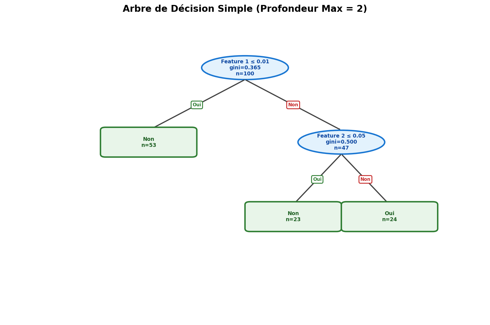
*Figure 1: Simple binary tree with hierarchical structure (max_depth=2)*

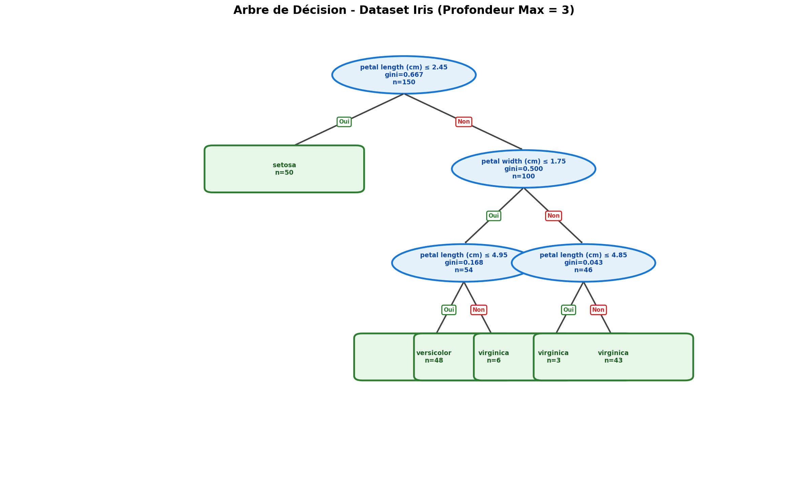
*Figure 2: Decision tree on Iris dataset showing multi-class decisions (max_depth=3)*

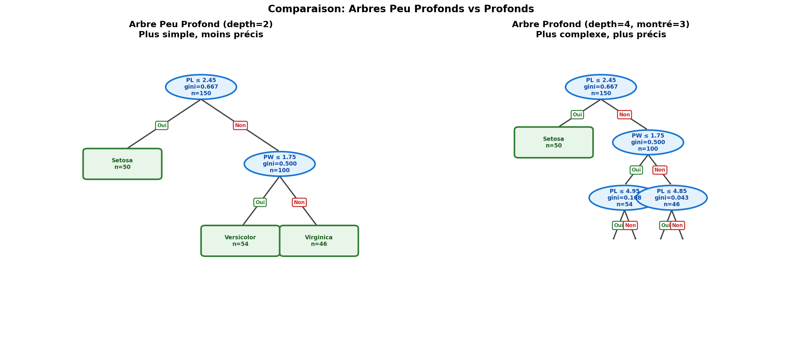
*Figure 3: Comparison between shallow (depth=2) and deep (depth=4) trees*

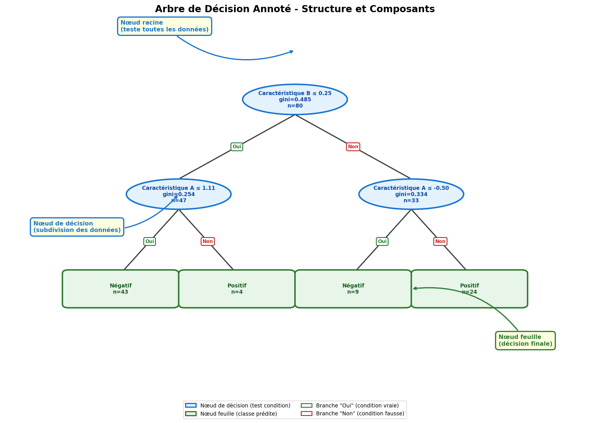
*Figure 4: Annotated tree showing components (root node, decision nodes, leaf nodes)*

### Tree Decomposition

Step-by-step visualizations showing how trees split the feature space:

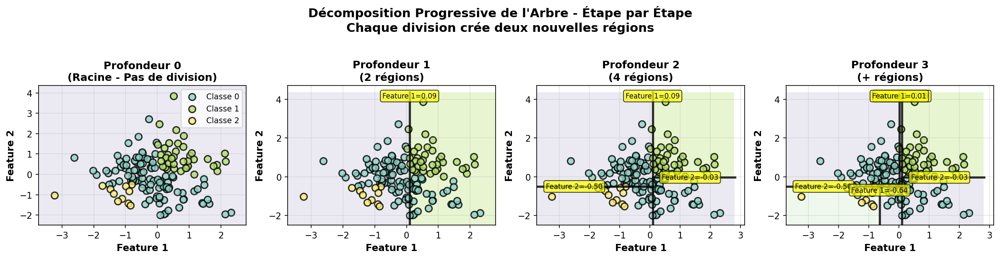
*Figure 5: Progressive splits from depth 0 to 3, showing recursive partitioning*

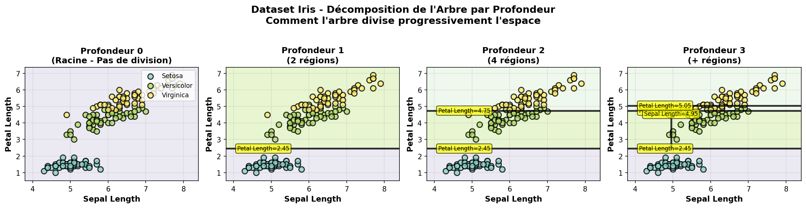
*Figure 6: Iris dataset decomposition at each depth level*

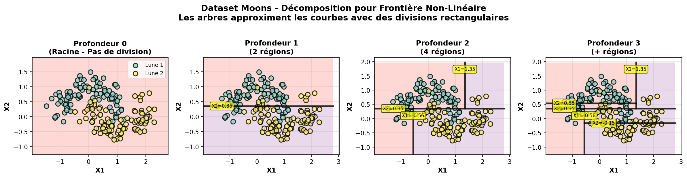
*Figure 7: How trees approximate non-linear boundaries with rectangular splits*

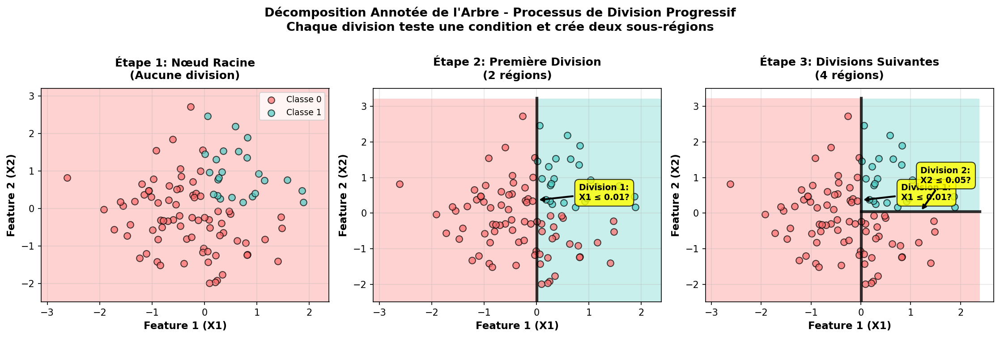
*Figure 8: Step-by-step decomposition with split annotations*

### Other Visualizations

Run the visualization scripts to generate all images:

```bash
# Tree structure visualizations
python visualize_tree_structure.py

# Hierarchical tree diagrams
python draw_tree_diagrams.py

# Tree decomposition visualizations
python visualize_tree_decomposition.py

# General image generation
python generate_images.py
```

## Examples

All examples are in the `examples/` directory:

### 1. Binary Classification (`example_binary.py`)
- Basic 2-class classification
- Decision boundary visualization
- Tree structure printing

**Run:**
```bash
cd examples
python example_binary.py
```

**Output:**
- Training and test accuracy
- Tree depth and number of leaves
- Feature importance scores
- Visual decision boundary plot

### 2. Multi-class Classification (`example_multiclass.py`)
- 3+ class classification
- Confusion matrix
- Per-class metrics (precision, recall, F1)
- Probability predictions

**Run:**
```bash
python example_multiclass.py
```

**Output:**
- Confusion matrix heatmap
- Decision boundaries for all classes
- Per-class performance metrics

### 3. Depth Comparison (`example_depths.py`)
- Compare trees of different depths
- Demonstrate overfitting
- Show bias-variance tradeoff

**Run:**
```bash
python example_depths.py
```

**Output:**
- Accuracy vs depth curves
- Visual comparison of different depths
- Identification of optimal depth

### 4. Criteria Comparison (`example_criteria.py`)
- Compare Gini, Entropy, and Error
- Show mathematical formulas
- Performance comparison

**Run:**
```bash
python example_criteria.py
```

**Output:**
- Side-by-side criterion comparison
- Impurity calculation demonstrations
- Performance metrics for each criterion

### 5. Pruning Techniques (`example_pruning.py`)
- Pre-pruning with different parameters
- Cost-complexity pruning
- Effect on model complexity

**Run:**
```bash
python example_pruning.py
```

**Output:**
- Comparison of pruning strategies
- Accuracy vs complexity plots
- Recommendations for pruning

### 6. Feature Importance (`example_feature_importance.py`)
- Feature importance calculation
- Permutation importance
- Feature selection using importance

**Run:**
```bash
python example_feature_importance.py
```

**Output:**
- Feature importance rankings
- Comparison with permutation importance
- Optimal number of features

## Comparison with sklearn

This implementation closely matches sklearn's `DecisionTreeClassifier`:

| Feature | This Implementation | sklearn |
|---------|-------------------|---------|
| Binary Classification | ✅ | ✅ |
| Multi-class Classification | ✅ | ✅ |
| Gini Criterion | ✅ | ✅ |
| Entropy Criterion | ✅ | ✅ |
| Pre-pruning | ✅ | ✅ |
| Cost-complexity Pruning | ✅ (simplified) | ✅ (full) |
| Feature Importance | ✅ | ✅ |
| predict_proba | ✅ | ✅ |
| Multi-output | ❌ | ✅ |
| Sample Weights | ❌ | ✅ |
| Class Weights | ❌ | ✅ |
| min_impurity_decrease | ❌ | ✅ |

**Note:** This implementation focuses on core functionality and educational clarity. For production use with advanced features, use sklearn.

## Advantages and Limitations

### Advantages

✅ **Easy to understand and interpret**
- Tree structure is human-readable
- Visual representations are intuitive
- No need for feature scaling

✅ **Handles non-linear relationships**
- Can model complex decision boundaries
- Automatically discovers interactions

✅ **Supports both numerical and categorical features**
- No preprocessing required
- Natural handling of missing values (not implemented here)

✅ **Fast prediction**
- O(log n) time complexity for prediction
- Efficient for real-time applications

✅ **Feature importance**
- Automatic feature selection
- Identifies most informative features

### Limitations

❌ **Prone to overfitting**
- Can create overly complex trees
- Needs careful pruning
- High variance in predictions

❌ **Instability**
- Small changes in data can lead to very different trees
- Not robust to noisy data
- Solution: Use ensemble methods (Random Forest, Gradient Boosting)

❌ **Biased towards features with more values**
- Features with many unique values are preferred
- Can lead to unfair splits

❌ **Cannot extrapolate**
- Predictions are limited to training data range
- Cannot predict values outside training distribution

❌ **Greedy algorithm**
- Locally optimal splits may not lead to globally optimal tree
- No backtracking

## When to Use Decision Trees

### Good Use Cases

✅ **Classification with interpretability requirements**
- Medical diagnosis
- Credit scoring
- Fraud detection (when explanations needed)

✅ **Feature selection**
- Identifying important variables
- Reducing dimensionality

✅ **Baseline model**
- Quick first model
- Establishing performance benchmarks

✅ **Part of ensemble**
- Building blocks for Random Forests
- Base learners for Gradient Boosting

### When to Avoid

❌ **When high accuracy is critical**
- Use ensemble methods instead
- Or deep learning for complex patterns

❌ **When features have smooth relationships**
- Linear/Logistic Regression may work better
- Decision trees create step-like boundaries

❌ **When data is very noisy**
- Trees are sensitive to noise
- Regularization is limited

❌ **Small datasets**
- High risk of overfitting
- Not enough data to create reliable splits

## Performance Tips

1. **Start with shallow trees** (`max_depth=3-5`)
2. **Use Gini criterion** (faster than entropy)
3. **Set `min_samples_leaf`** to prevent tiny leaves
4. **Try `max_features='sqrt'`** for high-dimensional data
5. **Use cross-validation** to find optimal pruning parameters
6. **Consider Random Forests** for better performance
7. **Monitor train-test gap** to detect overfitting

## Further Reading

- [Breiman et al., 1984: "Classification and Regression Trees"](https://www.routledge.com/Classification-and-Regression-Trees/Breiman-Friedman-Stone-Olshen/p/book/9780412048418) - Original CART paper
- [Quinlan, 1986: "Induction of Decision Trees"](https://link.springer.com/article/10.1007/BF00116251) - ID3 algorithm
- [sklearn Documentation](https://scikit-learn.org/stable/modules/tree.html) - Decision Trees in sklearn
- [A Visual Introduction to Decision Trees](https://explained.ai/decision-tree-viz/) - Interactive visualizations

## License

MIT License - Feel free to use for educational and commercial purposes.

## Author

ML Algorithms from Scratch - 2026

---

**Note:** This implementation is designed for educational purposes to understand how Decision Trees work internally. For production use, consider using scikit-learn's optimized implementation.
