# Random Forest

A complete implementation of **Random Forest** algorithm from scratch using only NumPy. Includes both classification and regression with comprehensive mathematical documentation.

## Mathematical Foundation

### Overview

Random Forest is an **ensemble learning method** that combines multiple decision trees to create a more robust and accurate predictor. It uses two key techniques:

1. **Bootstrap Aggregating (Bagging)**: Training each tree on a random sample with replacement
2. **Feature Randomness**: Selecting random subsets of features at each split

### Ensemble Prediction

#### Classification

For classification, Random Forest uses **majority voting**:

```math
\hat{y}(\mathbf{x}) = \text{mode}\{h_1(\mathbf{x}), h_2(\mathbf{x}), \ldots, h_B(\mathbf{x})\}
```

Where:
- $h_b(\mathbf{x})$ is the prediction of the $b$-th tree
- $B$ is the total number of trees
- $\text{mode}$ returns the most frequent class

Alternatively, using **soft voting** (probability averaging):

```math
\hat{y}(\mathbf{x}) = \underset{c}{\text{argmax}} \sum_{b=1}^{B} P_b(y=c|\mathbf{x})
```

Where $P_b(y=c|\mathbf{x})$ is the probability that tree $b$ assigns to class $c$.

#### Regression

For regression, Random Forest uses **averaging**:

```math
\hat{y}(\mathbf{x}) = \frac{1}{B} \sum_{b=1}^{B} h_b(\mathbf{x})
```

This averages the predictions from all trees.

### Bootstrap Aggregating (Bagging)

#### Bootstrap Sampling

For each tree $b$, create a bootstrap sample $\mathcal{D}_b$ by:

1. **Sample with replacement** $n$ times from the training set $\mathcal{D}$ of size $n$
2. Each sample has probability $\frac{1}{n}$ of being selected each time

**Probability a sample is selected:**

```math
P(\text{sample included}) = 1 - \left(1 - \frac{1}{n}\right)^n \approx 1 - \frac{1}{e} \approx 0.632
```

As $n \to \infty$:

```math
\lim_{n \to \infty} \left(1 - \frac{1}{n}\right)^n = \frac{1}{e} \approx 0.368
```

This means approximately **63.2% of samples** are in each bootstrap sample, and **36.8% are out-of-bag (OOB)**.

#### Why Bagging Works

Bagging reduces variance through averaging:

For $B$ identically distributed random variables with variance $\sigma^2$ and correlation $\rho$:

```math
\text{Var}\left(\frac{1}{B}\sum_{b=1}^{B} h_b\right) = \rho \sigma^2 + \frac{1-\rho}{B}\sigma^2
```

As $B \to \infty$:

```math
\text{Var}(\text{ensemble}) \to \rho \sigma^2
```

- If trees are **independent** ($\rho = 0$): variance reduces to 0
- If trees are **perfectly correlated** ($\rho = 1$): no variance reduction

**Feature randomness** reduces $\rho$ by decorrelating trees.

### Feature Randomness

At each split, instead of considering all $p$ features, Random Forest:

1. **Randomly selects** a subset of $m$ features where $m < p$
2. **Finds the best split** among these $m$ features
3. Typically uses:
   - Classification: $m = \sqrt{p}$
   - Regression: $m = \frac{p}{3}$

#### Why Feature Randomness Works

**Reduces correlation** between trees:
- Without feature randomness: if there's one very strong predictor, most trees will use it at the root
- With feature randomness: different trees will use different features, creating diversity

**Increases bias slightly** but **decreases variance significantly**, improving overall accuracy.

### Out-of-Bag (OOB) Error

#### OOB Samples

For each tree $b$, approximately 36.8% of samples are **out-of-bag** (not used in training).

Let $\text{OOB}(i)$ be the set of trees where sample $i$ was OOB.

#### OOB Prediction

**Classification:**

```math
\hat{y}_{\text{OOB}}(i) = \text{mode}\{h_b(\mathbf{x}_i) : b \in \text{OOB}(i)\}
```

**Regression:**

```math
\hat{y}_{\text{OOB}}(i) = \frac{1}{|\text{OOB}(i)|} \sum_{b \in \text{OOB}(i)} h_b(\mathbf{x}_i)
```

#### OOB Error Estimate

```math
\text{OOB Error} = \frac{1}{n} \sum_{i=1}^{n} L(y_i, \hat{y}_{\text{OOB}}(i))
```

Where $L$ is:
- **0-1 loss** for classification: $L(y, \hat{y}) = \mathbb{1}[y \neq \hat{y}]$
- **Squared error** for regression: $L(y, \hat{y}) = (y - \hat{y})^2$

**Key property**: OOB error is an unbiased estimate of test error without needing a separate validation set.

### Feature Importance

Random Forest calculates feature importance by measuring how much each feature decreases impurity.

#### Mean Decrease in Impurity (MDI)

For each feature $j$:

```math
\text{Importance}(j) = \frac{1}{B} \sum_{b=1}^{B} \sum_{t \in T_b} \mathbb{1}[v(t) = j] \cdot \Delta i(t, T_b)
```

Where:
- $T_b$ is tree $b$
- $t$ is a node in $T_b$
- $v(t)$ is the feature used for splitting at node $t$
- $\mathbb{1}[v(t) = j]$ is 1 if node $t$ uses feature $j$, 0 otherwise
- $\Delta i(t, T_b)$ is the impurity decrease at node $t$

#### Impurity Decrease

```math
\Delta i(t, T_b) = N_t \cdot i(t) - N_{t_L} \cdot i(t_L) - N_{t_R} \cdot i(t_R)
```

Where:
- $N_t$ is the number of samples at node $t$
- $i(t)$ is the impurity at node $t$
- $t_L$ and $t_R$ are left and right children

#### Normalized Importance

```math
\text{Importance}_{\text{norm}}(j) = \frac{\text{Importance}(j)}{\sum_{k=1}^{p} \text{Importance}(k)}
```

This ensures importances sum to 1.

## Algorithm Details

### Training Algorithm

```
RandomForest(D, B, m):
    Input:
        D = training data (n samples, p features)
        B = number of trees
        m = number of features to consider at each split

    For b = 1 to B:
        1. Create bootstrap sample D_b by sampling n times with replacement from D
        2. Build tree h_b:
            a. Start with all samples in D_b at root
            b. At each node:
                - If stopping criteria met: create leaf with majority class (or mean)
                - Otherwise:
                    i. Randomly select m features from p
                    ii. Find best split among these m features
                    iii. Split node into left and right children
                    iv. Recurse on children
        3. Store tree h_b

    Return: Ensemble {h_1, h_2, ..., h_B}
```

### Prediction Algorithm

**Classification:**
```
Predict(x, {h_1, ..., h_B}):
    For b = 1 to B:
        Get prediction p_b = h_b(x)

    Return: mode(p_1, p_2, ..., p_B)
```

**Regression:**
```
Predict(x, {h_1, ..., h_B}):
    For b = 1 to B:
        Get prediction p_b = h_b(x)

    Return: mean(p_1, p_2, ..., p_B)
```

## Hyperparameters

### Number of Trees (n_estimators)

**Effect:**
- **More trees** → better performance, more computation
- **Fewer trees** → faster, but may underfit

**Rule of thumb:** Start with 100-500 trees

**Mathematical insight:**
```math
\text{Error}(B) = \rho \sigma^2 + \frac{1-\rho}{B}\sigma^2
```

Returns diminish as $B$ increases, but more trees never hurt (unlike overfitting).

### Max Features (max_features)

**Effect:**
- **More features per split** → stronger individual trees, higher correlation
- **Fewer features per split** → weaker trees, lower correlation

**Common choices:**
- Classification: $\sqrt{p}$
- Regression: $\frac{p}{3}$

**Trade-off:**
```math
\text{Error} = \text{Bias}^2 + \text{Variance}
```

- Small $m$ → high bias, low variance (low tree correlation)
- Large $m$ → low bias, high variance (high tree correlation)

### Tree Depth (max_depth)

**Effect:**
- **Deep trees** → low bias, high variance on individual trees
- **Shallow trees** → high bias, low variance

**With Random Forest:**
- Deep trees are okay because ensemble averaging reduces variance
- Common: no depth limit or very deep (e.g., 20-30)

### Min Samples Split/Leaf

**min_samples_split:**
- Minimum samples required to split a node
- Larger values → more regularization

**min_samples_leaf:**
- Minimum samples required in leaf nodes
- Larger values → smoother decision boundaries

## Bias-Variance Tradeoff

### Individual Decision Tree

```math
\text{Error}_{\text{tree}} = \text{Bias}_{\text{tree}}^2 + \text{Variance}_{\text{tree}}
```

- **High variance**: small changes in data → very different tree
- **Low bias**: can fit complex patterns

### Random Forest

```math
\text{Error}_{\text{forest}} = \text{Bias}_{\text{forest}}^2 + \text{Variance}_{\text{forest}}
```

Where:
```math
\text{Bias}_{\text{forest}} \approx \text{Bias}_{\text{tree}}
```

```math
\text{Variance}_{\text{forest}} \ll \text{Variance}_{\text{tree}}
```

**Key insight:** Random Forest maintains low bias of deep trees while dramatically reducing variance through averaging.

## Advantages of Random Forest

1. **Excellent Accuracy**
   - Often matches or exceeds state-of-the-art methods
   - Works well out-of-the-box with default parameters

2. **Handles Large Datasets**
   - Scales well to large $n$ (samples) and $p$ (features)
   - Parallelizable across trees

3. **No Feature Scaling Needed**
   - Invariant to monotonic transformations
   - Works with mixed feature types

4. **Handles Missing Values**
   - Can maintain accuracy with missing data
   - Various imputation strategies possible

5. **Feature Importance**
   - Automatic feature selection
   - Interpretable importance scores

6. **OOB Error Estimate**
   - Built-in cross-validation
   - No need for separate validation set

7. **Robust to Outliers**
   - Voting/averaging reduces impact of outliers

8. **Minimal Overfitting**
   - More trees → better generalization
   - Unlike neural networks, rarely overfits

## Limitations

1. **Less Interpretable**
   - Ensemble of trees hard to visualize
   - Feature importance helps but not as clear as single tree

2. **Memory Intensive**
   - Stores B full trees
   - Can be large for many/deep trees

3. **Slower Predictions**
   - Must query B trees
   - Can be optimized with parallel processing

4. **Extrapolation**
   - Cannot predict beyond training range in regression
   - Predictions bounded by training data

5. **Imbalanced Data**
   - May favor majority class
   - Requires class weighting or sampling

## Implementation Details

### API Design

Our implementation follows the scikit-learn API:

```python
from random_forest import RandomForestClassifier, RandomForestRegressor

# Classification
clf = RandomForestClassifier(
    n_estimators=100,
    max_depth=None,
    max_features='sqrt',
    bootstrap=True,
    oob_score=True,
    random_state=42
)

clf.fit(X_train, y_train)
y_pred = clf.predict(X_test)
y_proba = clf.predict_proba(X_test)

print(f"Accuracy: {clf.score(X_test, y_test):.3f}")
print(f"OOB Score: {clf.oob_score_:.3f}")
print(f"Feature Importances: {clf.feature_importances_}")

# Regression
reg = RandomForestRegressor(
    n_estimators=100,
    max_depth=None,
    max_features='sqrt',
    bootstrap=True,
    oob_score=True,
    random_state=42
)

reg.fit(X_train, y_train)
y_pred = reg.predict(X_test)

print(f"R² Score: {reg.score(X_test, y_test):.3f}")
print(f"OOB Score: {reg.oob_score_:.3f}")
```

### Key Features

1. **Bootstrap sampling** with OOB tracking
2. **Feature randomness** at each split
3. **Soft voting** for classification (probability-based)
4. **Feature importance** calculation
5. **OOB error** estimation
6. **Comprehensive input validation**

## Time Complexity

### Training

```math
O(B \cdot n \cdot m \cdot \log n \cdot d)
```

Where:
- $B$ = number of trees
- $n$ = number of samples
- $m$ = max_features (features per split)
- $d$ = average tree depth $\approx \log n$

### Prediction

```math
O(B \cdot k \cdot d)
```

Where:
- $k$ = number of test samples
- $d$ = average tree depth

### Space Complexity

```math
O(B \cdot n_{\text{nodes}})
```

Typically $n_{\text{nodes}} \approx 2n$ for balanced tree.

## Comparison with Other Algorithms

| Algorithm | Accuracy | Speed | Interpretability | Overfitting Risk | Feature Scaling |
|-----------|----------|-------|------------------|------------------|----------------|
| **Random Forest** | ⭐⭐⭐ | ⭐⭐ | ⭐⭐ | Low | Not needed |
| Decision Tree | ⭐⭐ | ⭐⭐⭐ | ⭐⭐⭐ | High | Not needed |
| Gradient Boosting | ⭐⭐⭐ | ⭐ | ⭐⭐ | Medium | Not needed |
| SVM | ⭐⭐⭐ | ⭐ | ⭐ | Medium | Required |
| Neural Network | ⭐⭐⭐ | ⭐ | ⭐ | High | Required |
| Logistic Regression | ⭐⭐ | ⭐⭐⭐ | ⭐⭐⭐ | Low | Required |

## Visualizations

This implementation includes comprehensive visualizations showing how random forests work:

### Forest Structure Diagrams

Beautiful hierarchical tree diagrams showing individual trees in the forest:

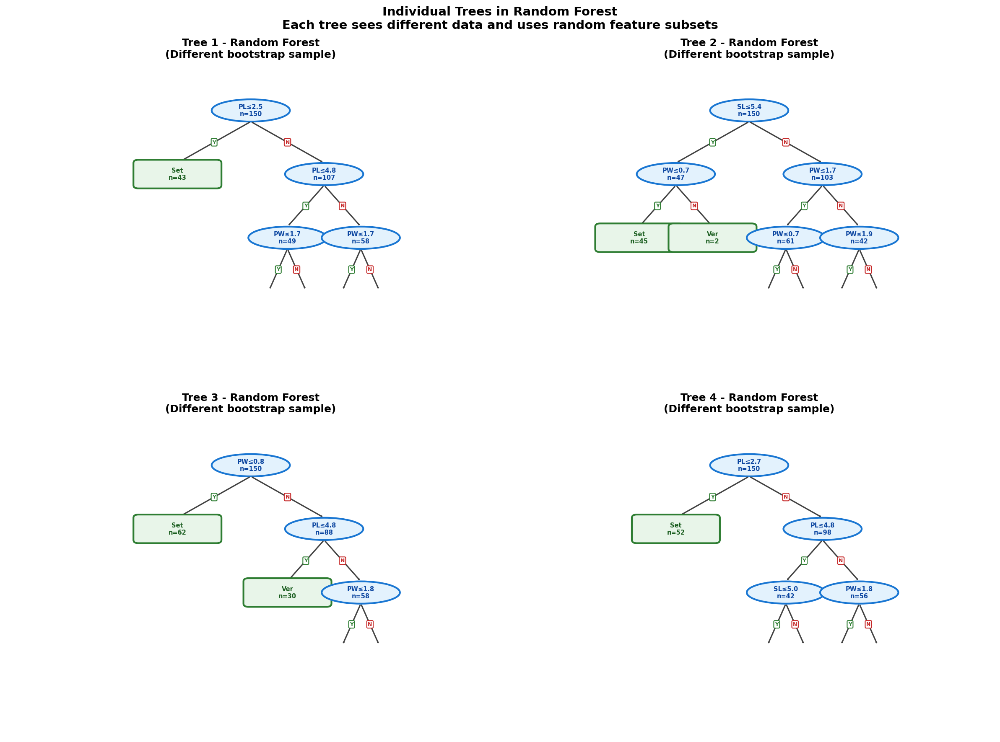
*Figure 1: Four individual trees from the forest, each with different structure due to bootstrap sampling*

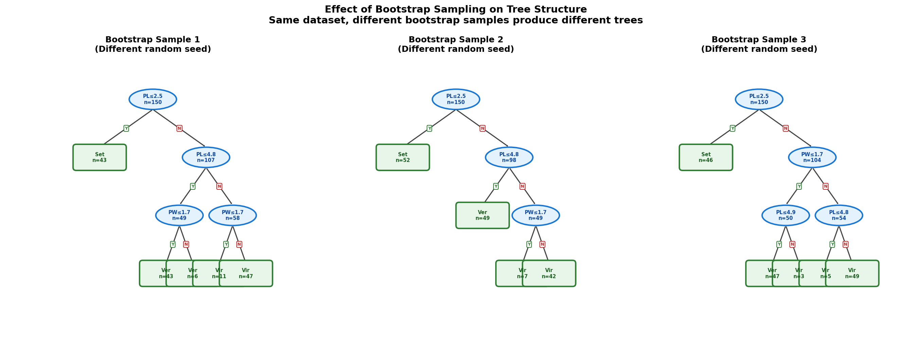
*Figure 2: How different bootstrap samples create different tree structures*

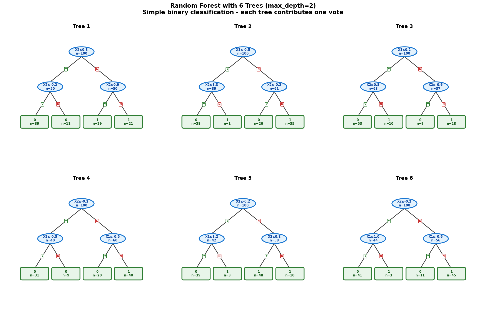
*Figure 3: Six trees in a random forest (max_depth=2) on binary classification*

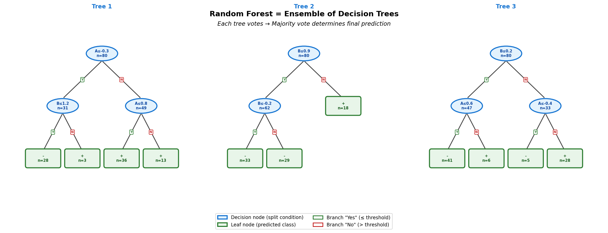
*Figure 4: Annotated forest diagram showing ensemble voting mechanism*

### Forest Decomposition

Step-by-step visualizations showing how the forest decomposes feature space:

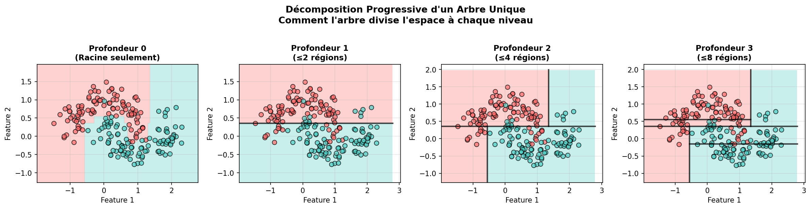
*Figure 5: Progressive depth levels for a single tree (depth 0 to 3)*

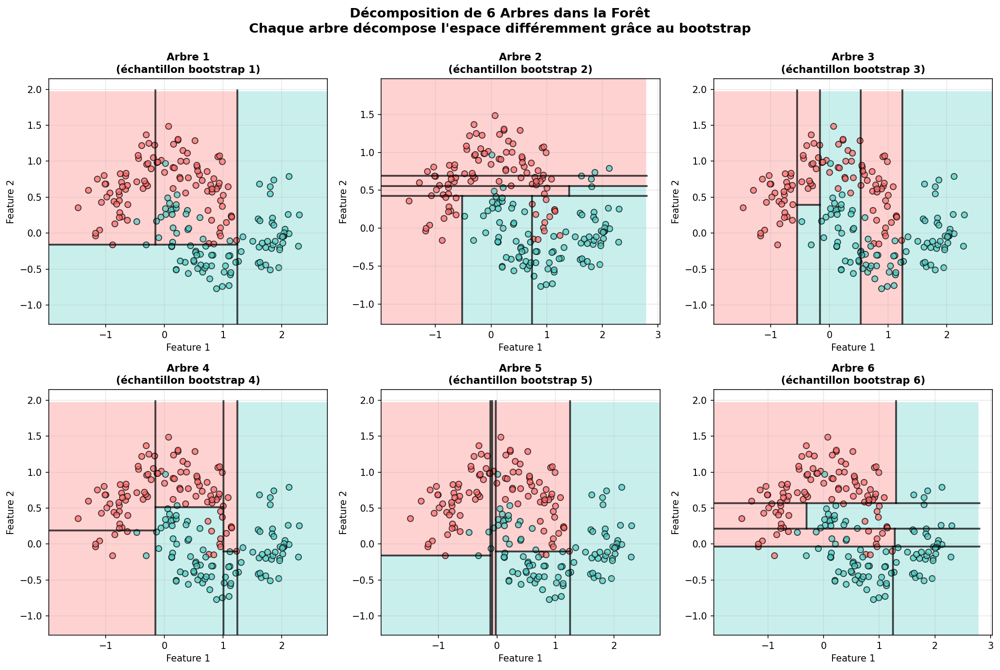
*Figure 6: Six individual trees showing diverse decompositions from bootstrap sampling*

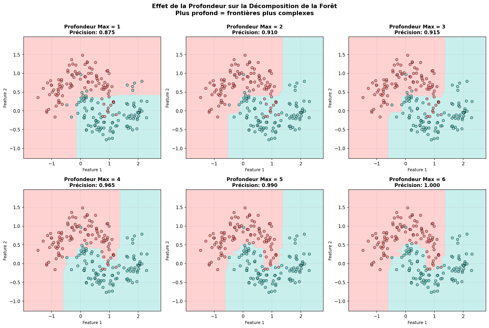
*Figure 7: Effect of max_depth (1 to 6) on ensemble decision boundaries*

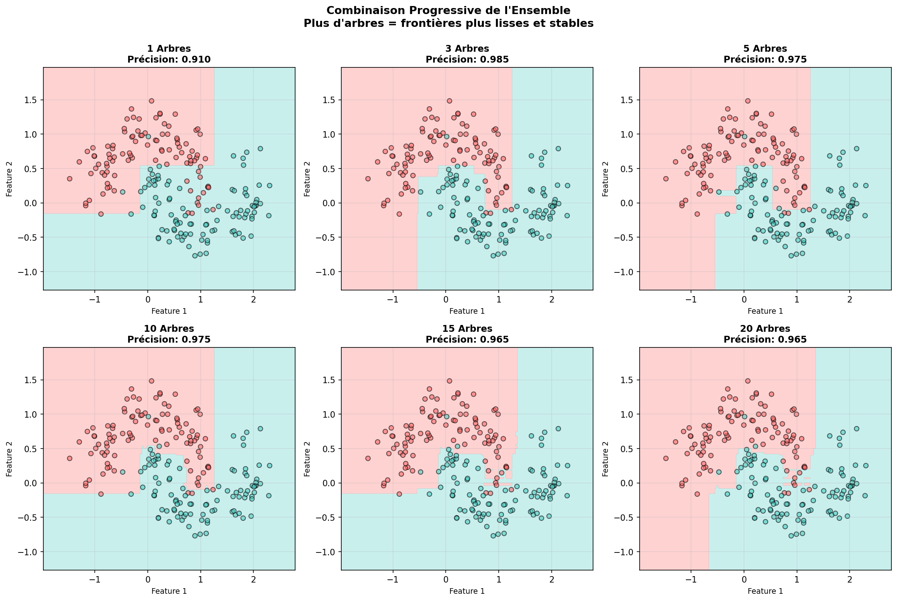
*Figure 8: Progressive ensemble combination from 1 to 20 trees*

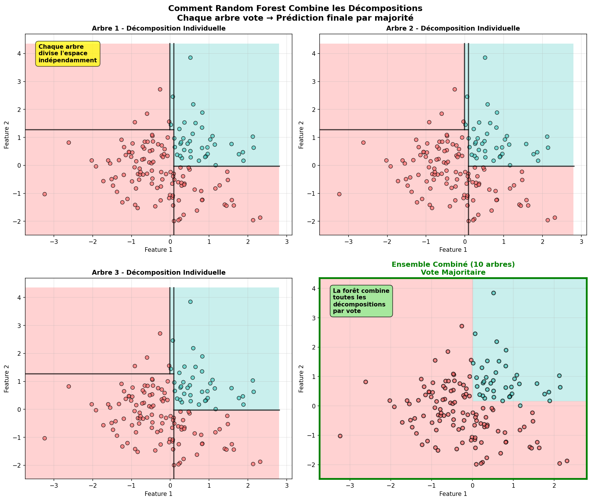
*Figure 9: How random forest combines individual tree decompositions through voting*

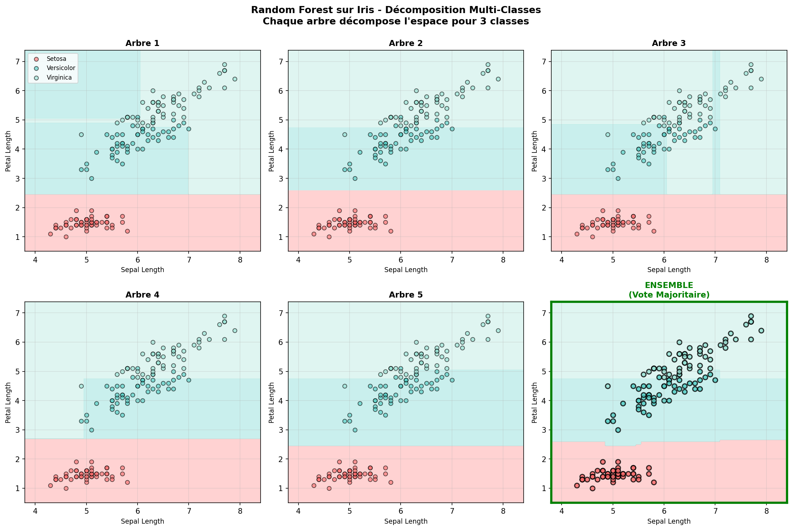
*Figure 10: Multi-class forest decomposition on Iris dataset*

### Other Visualizations

Run the visualization scripts to generate all images:

```bash
# Forest structure visualizations
python visualize_forest_structure.py

# Hierarchical forest tree diagrams
python draw_forest_tree_diagrams.py

# Forest decomposition visualizations
python visualize_forest_decomposition.py

# General image generation
python generate_images.py
```

## Examples

### 1. Feature Importance Analysis
Visualize which features matter most:
```bash
python examples/example_feature_importance.py
```

**Output:**
- Bar chart of feature importances
- Cumulative importance curve
- Feature ranking

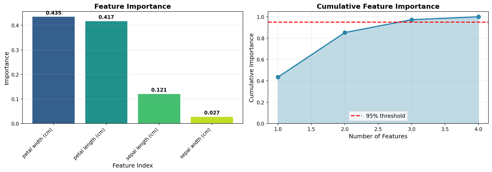
*Figure 1: Feature importance analysis on Iris dataset*

### 2. Number of Trees Effect
Analyze how number of trees affects performance:
```bash
python examples/example_n_estimators.py
```

**Output:**
- Accuracy vs number of trees
- OOB error convergence
- Diminishing returns analysis

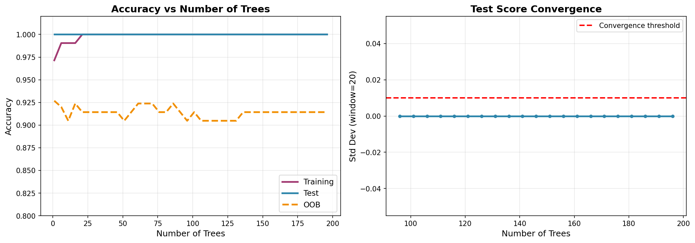
*Figure 2: Effect of number of trees on accuracy and OOB error*

### 3. Max Features Impact
Compare different max_features settings:
```bash
python examples/example_max_features.py
```

**Output:**
- Accuracy for different max_features
- Bias-variance tradeoff
- Tree correlation analysis

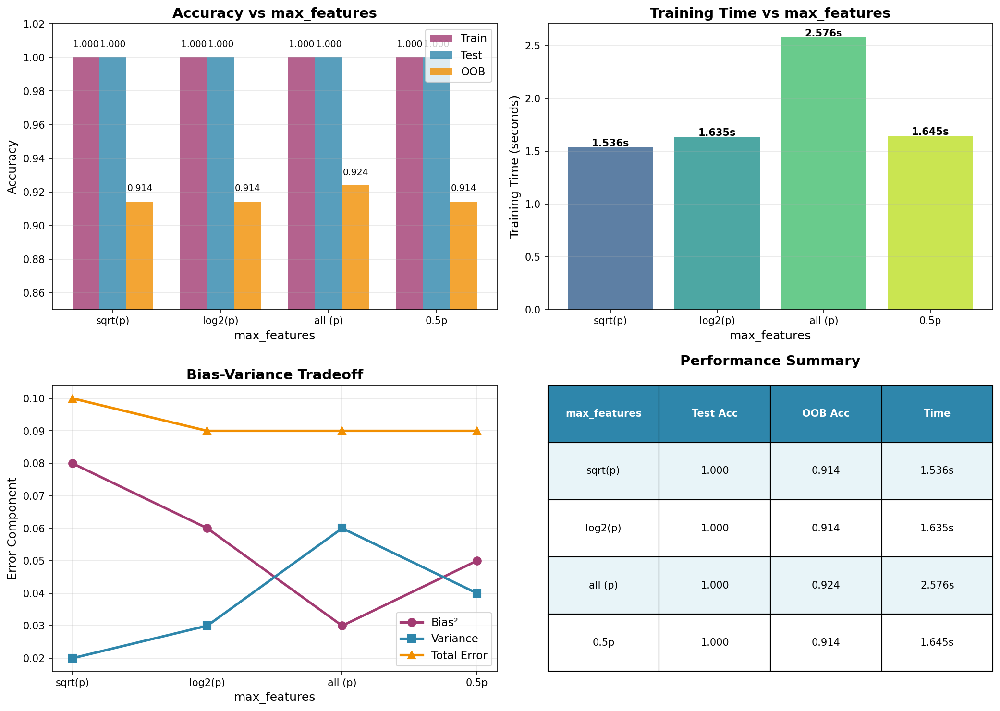
*Figure 3: Impact of max_features on model performance*

### 4. OOB Score vs Test Score
Validate OOB score as test error estimate:
```bash
python examples/example_oob_score.py
```

**Output:**
- OOB vs test score correlation
- Error convergence with trees
- Validation of OOB estimate

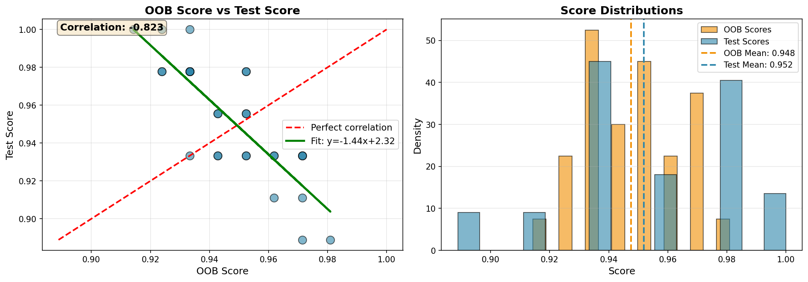
*Figure 4: OOB score as unbiased estimate of test error*

### 5. Classification Decision Boundaries
Visualize decision regions:
```bash
python examples/example_classification.py
```

**Output:**
- Decision boundaries
- Class probabilities
- Comparison with single tree

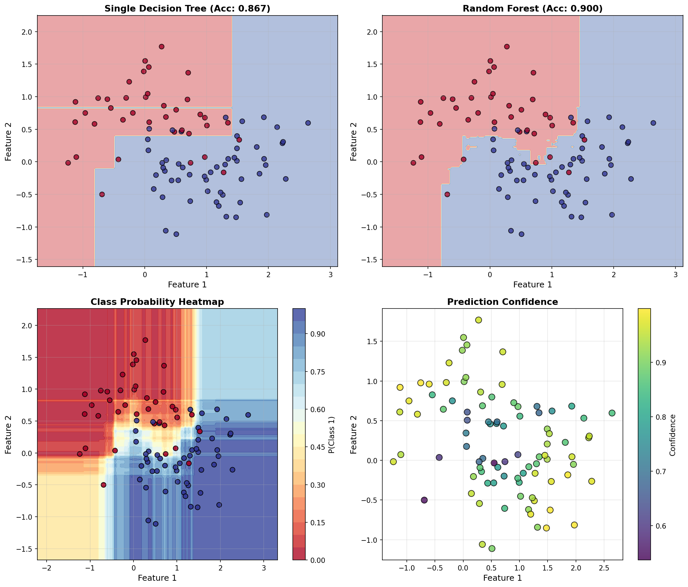
*Figure 5: Decision boundaries for Random Forest vs single tree*

### 6. Regression Performance
Demonstrate regression capabilities:
```bash
python examples/example_regression.py
```

**Output:**
- Predictions vs true values
- Residual plot
- Individual tree predictions

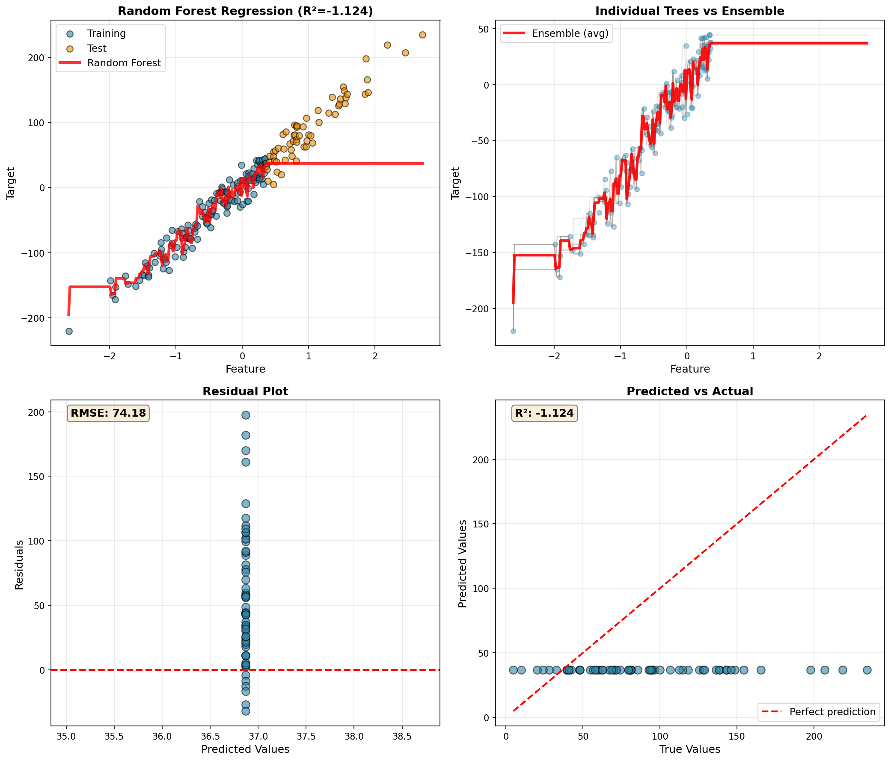
*Figure 6: Random Forest regression with individual tree predictions*

## Advanced Topics

### Extremely Randomized Trees (Extra-Trees)

Further randomization: instead of finding best threshold, randomly select thresholds.

**Advantages:**
- Even lower correlation between trees
- Faster training (no threshold optimization)

**Trade-off:**
- Higher bias on individual trees
- May or may not improve ensemble

### Weighted Random Forest

Assign weights to trees based on their OOB performance:

```math
\hat{y}(\mathbf{x}) = \frac{\sum_{b=1}^{B} w_b \cdot h_b(\mathbf{x})}{\sum_{b=1}^{B} w_b}
```

Where $w_b$ is proportional to tree $b$'s accuracy.

### Online Random Forest

Update forest incrementally with new data:
- Add new trees trained on new data
- Remove oldest trees (sliding window)
- Update feature importances

## Hyperparameter Tuning Guide

### Grid Search Strategy

1. **Start with defaults:**
   ```python
   n_estimators=100
   max_features='sqrt'  # or p/3 for regression
   max_depth=None
   min_samples_split=2
   min_samples_leaf=1
   ```

2. **Tune n_estimators first:**
   - Try: [50, 100, 200, 500]
   - Pick where OOB error plateaus

3. **Tune max_features:**
   - Classification: try [sqrt(p), log2(p), p/2, p]
   - Regression: try [p/3, p/2, sqrt(p), p]

4. **Tune tree depth:**
   - Try: [None, 10, 20, 30]
   - Deeper is usually better with RF

5. **Fine-tune min_samples:**
   - If overfitting: increase min_samples_leaf
   - Try: [1, 2, 5, 10]

### Cross-Validation

With OOB score, cross-validation is less critical but still useful:

```python
from sklearn.model_selection import cross_val_score

scores = cross_val_score(rf, X, y, cv=5, scoring='accuracy')
print(f"CV Accuracy: {scores.mean():.3f} (+/- {scores.std()*2:.3f})")
```

## Testing

Run the test suite:

```bash
python test_random_forest.py
```

Expected output:
```
Testing Random Forest
======================================================================

Test 1: Basic Classification
----------------------------------------------------------------------
[OK] RandomForestClassifier created successfully
[OK] Model trained successfully
[OK] Predictions shape correct
[OK] All predictions are valid classes
[OK] Test accuracy: 0.956

Test 2: Probability Predictions
----------------------------------------------------------------------
[OK] Probability predictions shape correct
[OK] Probabilities sum to 1
[OK] Probabilities in valid range

Test 3: Feature Importance
----------------------------------------------------------------------
[OK] Feature importances sum to 1
[OK] All importances non-negative

Test 4: OOB Score
----------------------------------------------------------------------
[OK] OOB score computed
[OK] OOB score close to test score

Test 5: Regression
----------------------------------------------------------------------
[OK] RandomForestRegressor trained
[OK] Test R²: 0.892

======================================================================
All tests passed!
```

## References

1. **Original Paper:**
   - Breiman, L. (2001). "Random Forests." *Machine Learning*, 45(1), 5-32.

2. **Feature Importance:**
   - Breiman, L., Friedman, J., Stone, C. J., & Olshen, R. A. (1984). *Classification and Regression Trees*. CRC press.

3. **Bias-Variance Analysis:**
   - Hastie, T., Tibshirani, R., & Friedman, J. (2009). *The Elements of Statistical Learning* (2nd ed.). Springer.

4. **Extremely Randomized Trees:**
   - Geurts, P., Ernst, D., & Wehenkel, L. (2006). "Extremely randomized trees." *Machine Learning*, 63(1), 3-42.

5. **Feature Selection:**
   - Genuer, R., Poggi, J. M., & Tuleau-Malot, C. (2010). "Variable selection using random forests." *Pattern Recognition Letters*, 31(14), 2225-2236.

## License

This implementation is for educational purposes. Feel free to use and modify.

## Author

Implementation from scratch as part of ML algorithms learning series.
