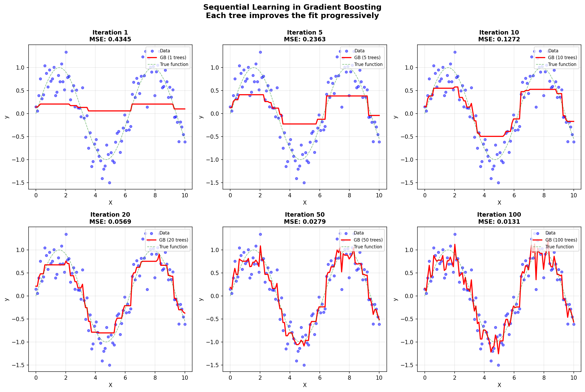
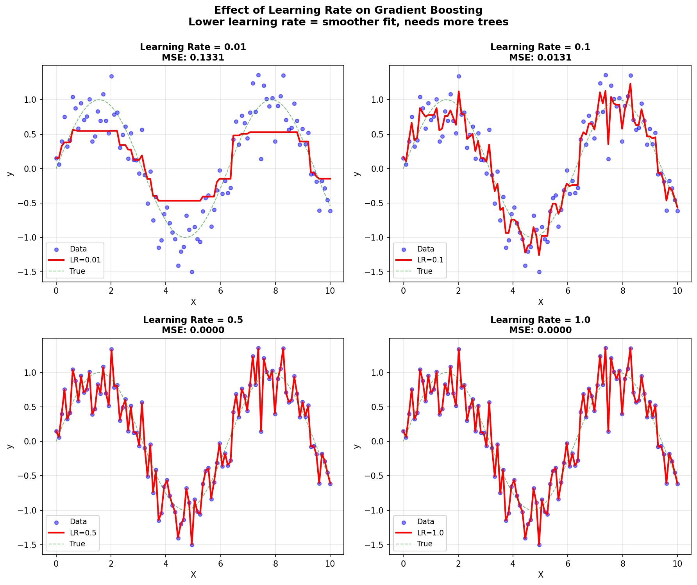
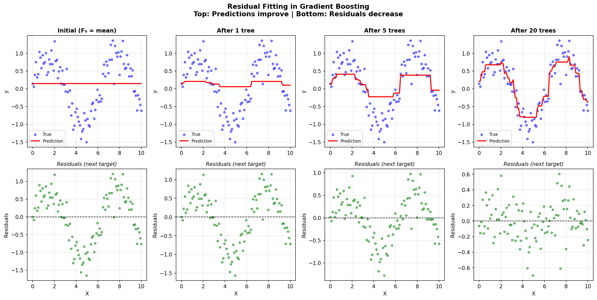
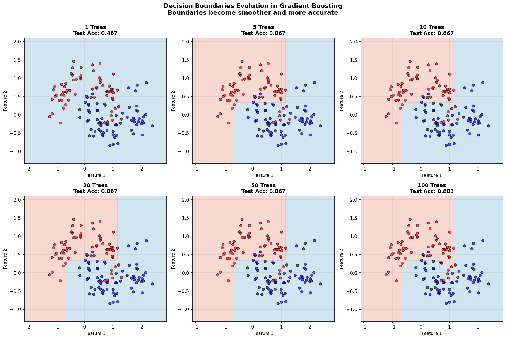
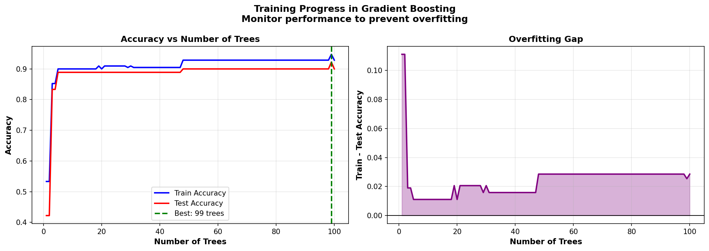
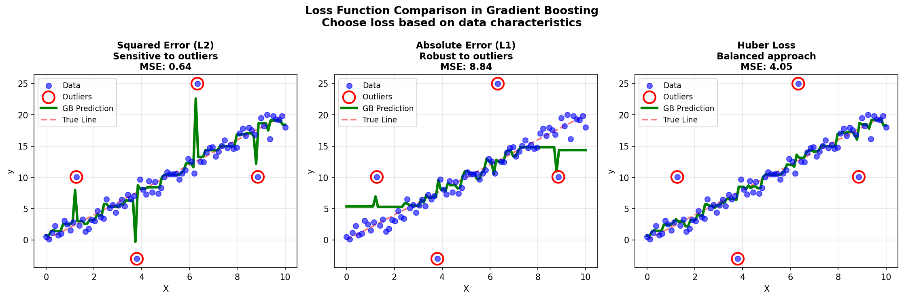
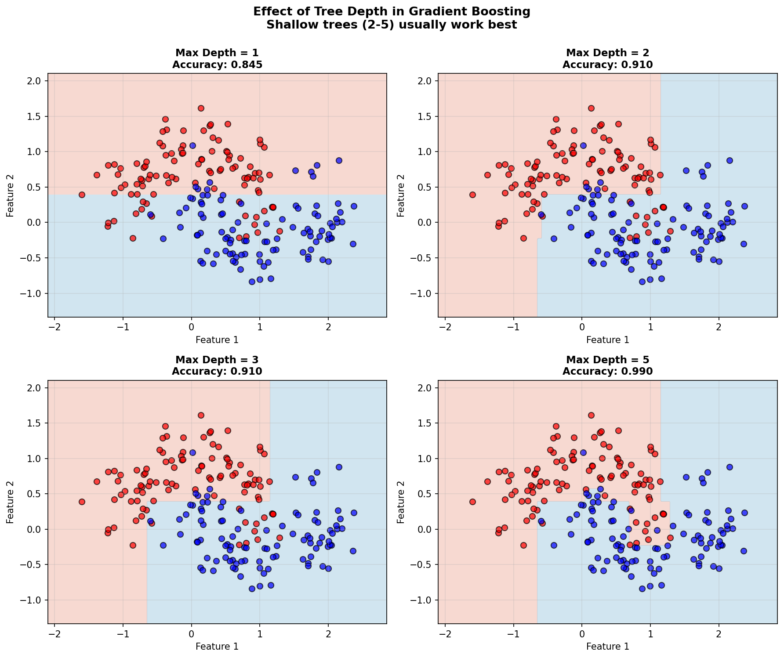
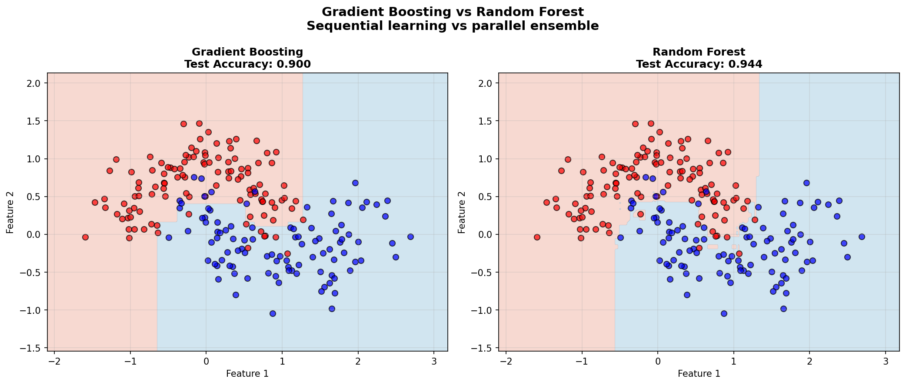

# Gradient Boosting Machine (GBM) - From Scratch Implementation

A complete implementation of Gradient Boosting for classification and regression using only NumPy. This implementation builds an ensemble of decision trees sequentially, where each tree corrects the errors of the previous trees.

## Table of Contents
1. [Features](#features)
2. [Mathematical Foundation](#mathematical-foundation)
3. [The Gradient Boosting Algorithm](#the-gradient-boosting-algorithm)
4. [Installation](#installation)
5. [Usage](#usage)
6. [Examples](#examples)
7. [Comparison with sklearn](#comparison-with-sklearn)
8. [Advantages and Limitations](#advantages-and-limitations)

## Features

- **Binary Classification**: GradientBoostingClassifier with log loss and exponential loss
- **Regression**: GradientBoostingRegressor with squared error, absolute error, and Huber loss
- **Learning Rate (Shrinkage)**: Control overfitting with learning rate parameter
- **Stochastic Gradient Boosting**: Subsample training data for each tree
- **Staged Predictions**: Monitor performance after each boosting iteration
- **Multiple Loss Functions**: Choose the appropriate loss for your problem
- **sklearn-compatible API**: Familiar `fit()`, `predict()`, and `predict_proba()` methods

## Mathematical Foundation

### 1. Overview: Gradient Boosting

Gradient Boosting is a **sequential ensemble method** that builds models **additively**. Unlike bagging (Random Forest) where models are independent, boosting builds each new model to correct the mistakes of previous models.

**Key Concept**: Gradient Boosting performs **gradient descent in function space**. Instead of optimizing parameters, it optimizes the prediction function itself.

### 2. The Core Idea

**Given:**
- Training data: $\mathcal{D} = \{(\mathbf{x}_i, y_i)\}_{i=1}^n$
- A differentiable loss function: $L(y, F(\mathbf{x}))$

**Goal:**
Find a function $F^*(\mathbf{x})$ that minimizes expected loss:

```math
F^*(\mathbf{x}) = \underset{F}{\arg\min} \mathbb{E}_{y, \mathbf{x}}[L(y, F(\mathbf{x}))]
```

### 3. Additive Model

Gradient Boosting builds $F(\mathbf{x})$ as a sum of weak learners (typically decision trees):

```math
F_M(\mathbf{x}) = F_0(\mathbf{x}) + \sum_{m=1}^{M} \nu \cdot h_m(\mathbf{x})
```

Where:
- $F_0(\mathbf{x})$ = Initial prediction (constant)
- $h_m(\mathbf{x})$ = Weak learner at iteration $m$ (usually a shallow decision tree)
- $\nu$ = Learning rate (shrinkage parameter)
- $M$ = Number of boosting iterations

### 4. The Gradient Boosting Algorithm

At each iteration $m$, we want to add a function $h_m$ that reduces the loss:

```math
F_m(\mathbf{x}) = F_{m-1}(\mathbf{x}) + \nu \cdot h_m(\mathbf{x})
```

#### Step 1: Compute Negative Gradient

The optimal direction to move in function space is the **negative gradient** of the loss:

```math
r_{im} = -\left[\frac{\partial L(y_i, F(\mathbf{x}_i))}{\partial F(\mathbf{x}_i)}\right]_{F = F_{m-1}}
```

These $r_{im}$ are called **pseudo-residuals**. They represent how much we should adjust our predictions.

#### Step 2: Fit a Tree to the Negative Gradient

Train a regression tree $h_m(\mathbf{x})$ to predict the pseudo-residuals:

```math
h_m = \underset{h}{\arg\min} \sum_{i=1}^{n} (r_{im} - h(\mathbf{x}_i))^2
```

#### Step 3: Update the Model

Add the new tree with shrinkage:

```math
F_m(\mathbf{x}) = F_{m-1}(\mathbf{x}) + \nu \cdot h_m(\mathbf{x})
```

### 5. Loss Functions

#### For Classification (Binary):

**Log Loss (Logistic Loss):**

```math
L(y, F) = -y \log(p) - (1-y) \log(1-p)
```

where $p = \sigma(F) = \frac{1}{1 + e^{-F}}$ (sigmoid function)

**Negative Gradient:**

```math
-\frac{\partial L}{\partial F} = y - \sigma(F)
```

**Exponential Loss (AdaBoost):**

```math
L(y, F) = \exp(-yF) \quad \text{where } y \in \{-1, 1\}
```

**Negative Gradient:**

```math
-\frac{\partial L}{\partial F} = y \exp(-yF)
```

#### For Regression:

**Squared Error (L2 Loss):**

```math
L(y, F) = \frac{1}{2}(y - F)^2
```

**Negative Gradient:**

```math
-\frac{\partial L}{\partial F} = y - F
```

(The residual itself!)

**Absolute Error (L1 Loss):**

```math
L(y, F) = |y - F|
```

**Negative Gradient:**

```math
-\frac{\partial L}{\partial F} = \text{sign}(y - F)
```

**Huber Loss (Robust to Outliers):**

```math
L_\delta(y, F) = \begin{cases}
\frac{1}{2}(y - F)^2 & \text{if } |y - F| \leq \delta \\
\delta(|y - F| - \frac{\delta}{2}) & \text{otherwise}
\end{cases}
```

Combines L2 loss (near zero) and L1 loss (far from zero).

### 6. Why Gradient Boosting Works

**Intuition:**
1. Each tree fits the **mistakes** (residuals) of the previous ensemble
2. By following the negative gradient, we move in the direction that decreases loss
3. The learning rate $\nu$ prevents overfitting by making small steps
4. Shallow trees (high bias, low variance) + boosting = low bias, low variance

**Mathematical View:**
- Gradient Boosting = **Functional Gradient Descent**
- Trees approximate the negative gradient direction
- Learning rate = step size in function space
- More iterations = more refined approximation

### 7. Learning Rate (Shrinkage)

The learning rate $\nu \in (0, 1]$ controls the contribution of each tree:

```math
F_m(\mathbf{x}) = F_{m-1}(\mathbf{x}) + \nu \cdot h_m(\mathbf{x})
```

**Effects:**
- **Small $\nu$** (e.g., 0.01-0.1):
  - Requires more trees ($M$)
  - Better generalization
  - More resistant to overfitting

- **Large $\nu$** (e.g., 0.5-1.0):
  - Fewer trees needed
  - Faster training
  - Risk of overfitting

**Trade-off:** $\nu$ and $M$ are inversely related. Lower learning rate requires more iterations.

### 8. Stochastic Gradient Boosting

Subsample the training data for each tree (like Random Forest):

**Algorithm:**
For each iteration $m$:
1. Sample $\text{subsample} \times n$ examples without replacement
2. Fit tree $h_m$ on this sample
3. Update full model with contributions from $h_m$

**Benefits:**
- Reduces variance (regularization)
- Speeds up training
- Can improve generalization

Typical subsample values: 0.5 - 0.8

### 9. Regularization in Gradient Boosting

**Multiple regularization techniques:**

1. **Learning Rate** ($\nu$): Shrinkage
2. **Number of Trees** ($M$): Early stopping
3. **Tree Depth** (`max_depth`): Complexity of base learners
4. **Subsampling**: Stochastic gradient boosting
5. **Min Samples per Leaf**: Prevents overfitting individual trees

**Optimal Strategy:**
- Use shallow trees (depth 3-5)
- Low learning rate (0.01-0.1)
- Many iterations with early stopping
- Subsample around 0.5-0.8

## Installation

No installation required beyond NumPy. The implementation uses:
- `numpy` for numerical operations
- Decision tree implementations from `09_DECISION_TREE` and `10_RANDOM_FOREST`

## Quick Start

```python
from gradient_boosting import GradientBoostingClassifier

# Load data
X_train, y_train = ...  # Your training data
X_test, y_test = ...    # Your test data

# Create and train model (recommended defaults)
gb = GradientBoostingClassifier(
    n_estimators=100,      # Number of trees
    learning_rate=0.1,     # Shrinkage factor
    max_depth=3,           # Shallow trees work best
    subsample=0.8,         # Stochastic boosting
    random_state=42
)
gb.fit(X_train, y_train)

# Make predictions
y_pred = gb.predict(X_test)
y_proba = gb.predict_proba(X_test)

# Evaluate
accuracy = gb.score(X_test, y_test)
print(f"Accuracy: {accuracy:.3f}")
```

## Usage

### Classification Example

```python
from gradient_boosting import GradientBoostingClassifier
import numpy as np

# Generate data
X = np.random.randn(1000, 10)
y = (X[:, 0] + X[:, 1] > 0).astype(int)

# Split data
X_train, X_test = X[:800], X[800:]
y_train, y_test = y[:800], y[800:]

# Train model
gb = GradientBoostingClassifier(
    n_estimators=100,
    learning_rate=0.1,
    max_depth=3,
    subsample=0.8,
    random_state=42
)
gb.fit(X_train, y_train)

# Predictions
y_pred = gb.predict(X_test)
y_proba = gb.predict_proba(X_test)

# Accuracy
accuracy = gb.score(X_test, y_test)
print(f"Test Accuracy: {accuracy:.3f}")
```

### Regression Example

```python
from gradient_boosting import GradientBoostingRegressor
from sklearn.datasets import make_regression

# Generate data
X, y = make_regression(n_samples=1000, n_features=10, noise=10, random_state=42)

# Split data
X_train, X_test = X[:800], X[800:]
y_train, y_test = y[:800], y[800:]

# Train model
gb = GradientBoostingRegressor(
    n_estimators=100,
    learning_rate=0.1,
    max_depth=3,
    loss='squared_error',
    random_state=42
)
gb.fit(X_train, y_train)

# Predictions
y_pred = gb.predict(X_test)

# R² score
r2 = gb.score(X_test, y_test)
print(f"Test R²: {r2:.3f}")
```

### Staged Predictions (Early Stopping)

```python
# Monitor performance after each iteration
for i, y_pred in enumerate(gb.staged_predict(X_test)):
    if (i + 1) % 10 == 0:
        acc = np.mean(y_pred == y_test)
        print(f"Iteration {i + 1}: Accuracy = {acc:.3f}")
```

## Visualizations

This implementation includes comprehensive visualizations demonstrating how Gradient Boosting works:

### Sequential Learning Process

How predictions improve as more trees are added:


*Figure 1: Sequential learning process - Each iteration adds a tree that improves the fit*

### Learning Rate Effect

Impact of different learning rates on the final model:


*Figure 2: Learning rate effect - Lower rates need more trees but generalize better*

### Residual Fitting

How Gradient Boosting fits residuals at each iteration:


*Figure 3: Residual fitting demonstration - Each tree targets the remaining errors*

### Decision Boundaries Evolution

How decision boundaries improve with more trees:


*Figure 4: Decision boundaries evolution - Boundaries become smoother and more accurate*

### Training Progress

Monitoring training and test accuracy to prevent overfitting:


*Figure 5: Training progress - Use staged predictions for early stopping*

### Loss Function Comparison

Different loss functions for handling outliers:


*Figure 6: Loss function comparison - Huber loss balances L1 and L2*

### Max Depth Effect

Impact of tree depth on model complexity:


*Figure 7: Max depth effect - Shallow trees (2-5) usually work best*

### Gradient Boosting vs Random Forest

Comparison between sequential and parallel ensemble methods:


*Figure 8: Gradient Boosting vs Random Forest - Different ensemble strategies*

### Generate All Visualizations

Run the visualization script to generate all images:

```bash
python generate_images.py
```

## Examples

Run the test file to see all features in action:

```bash
python test_gradient_boosting.py
```

**Test Results:**
- Test 1: Basic Classification ✓
- Test 2: Iris Dataset Classification ✓
- Test 3: Probability Predictions ✓
- Test 4: Learning Rate Effect ✓
- Test 5: Number of Estimators Effect ✓
- Test 6: Max Depth Effect ✓
- Test 7: Subsampling (Stochastic GB) ✓
- Test 8: Different Loss Functions ✓
- Test 9: Staged Predictions ✓
- Test 10: Basic Regression ✓
- Test 11: Regression Loss Functions ✓
- Test 12: Regression Staged Predictions ✓

## Comparison with sklearn

This implementation closely matches sklearn's `GradientBoostingClassifier` and `GradientBoostingRegressor`:

| Feature | This Implementation | sklearn |
|---------|-------------------|---------|
| Binary Classification | ✅ | ✅ |
| Multi-class | ❌ (future) | ✅ |
| Regression | ✅ | ✅ |
| Learning Rate | ✅ | ✅ |
| Subsample | ✅ | ✅ |
| Multiple Loss Functions | ✅ | ✅ |
| Staged Predictions | ✅ | ✅ |
| Feature Importance | ❌ (future) | ✅ |

## Advantages and Limitations

### Advantages

1. **High Predictive Accuracy**: Often wins Kaggle competitions
2. **Flexible**: Works with any differentiable loss function
3. **Handles Mixed Data**: Numerical and categorical features
4. **Robust to Outliers**: Especially with Huber loss
5. **Feature Importance**: Can compute (future feature)
6. **Less Prone to Overfitting**: Than individual deep trees

### Limitations

1. **Sensitive to Hyperparameters**: Requires careful tuning
2. **Sequential Training**: Cannot parallelize tree building
3. **Memory Intensive**: Stores all trees
4. **Slow Prediction**: Must evaluate all trees sequentially
5. **Can Overfit**: Without proper regularization

### When to Use Gradient Boosting

**Use When:**
- High accuracy is critical
- Tabular/structured data
- Mixed feature types
- Have time for hyperparameter tuning
- Interpretability not the main concern

**Avoid When:**
- Very high-dimensional data (use linear models)
- Need fast real-time predictions
- Training time is constrained
- Simple model is sufficient

## Comparison: Gradient Boosting vs Random Forest

| Aspect | Gradient Boosting | Random Forest |
|--------|------------------|---------------|
| **Training** | Sequential (slow) | Parallel (fast) |
| **Accuracy** | ⭐⭐⭐ (Often better) | ⭐⭐ (Good) |
| **Overfitting Risk** | ⭐⭐ (Medium) | ⭐ (Low) |
| **Hyperparameter Sensitivity** | ⭐⭐⭐ (High) | ⭐ (Low) |
| **Training Speed** | Slower | Faster |
| **Prediction Speed** | Slower | Faster |
| **Robustness** | Needs tuning | Very robust |
| **Use Case** | Competitions, max accuracy | Production, baseline |

## Key Hyperparameters

### `n_estimators`
- **Effect**: Number of boosting iterations
- **Typical**: 100-1000 (depends on learning_rate)
- **Higher**: Better fit, but risk of overfitting

### `learning_rate`
- **Effect**: Shrinkage factor
- **Typical**: 0.01-0.1
- **Lower**: Needs more trees, better generalization
- **Higher**: Fewer trees, faster training, risk of overfitting

### `max_depth`
- **Effect**: Tree complexity
- **Typical**: 3-5 (shallow trees)
- **Lower**: Less overfitting, needs more trees
- **Higher**: More complex model, risk of overfitting

### `subsample`
- **Effect**: Fraction of samples per tree
- **Typical**: 0.5-1.0
- **Lower**: More regularization, stochastic boosting
- **Higher**: Less regularization, deterministic

### `loss`
- **Classification**: 'log_loss' (default), 'exponential'
- **Regression**: 'squared_error' (default), 'absolute_error', 'huber'
- **Choose**: Based on problem requirements and outliers

## References

1. Friedman, J. H. (2001). "Greedy function approximation: a gradient boosting machine."
2. Friedman, J. H. (2002). "Stochastic gradient boosting."
3. Hastie, T., Tibshirani, R., & Friedman, J. (2009). "The Elements of Statistical Learning."

## License

This implementation is for educational purposes.

---

**Note**: This is a from-scratch implementation for learning. For production use, consider scikit-learn's `GradientBoostingClassifier`/`GradientBoostingRegressor` or modern libraries like XGBoost, LightGBM, or CatBoost.
