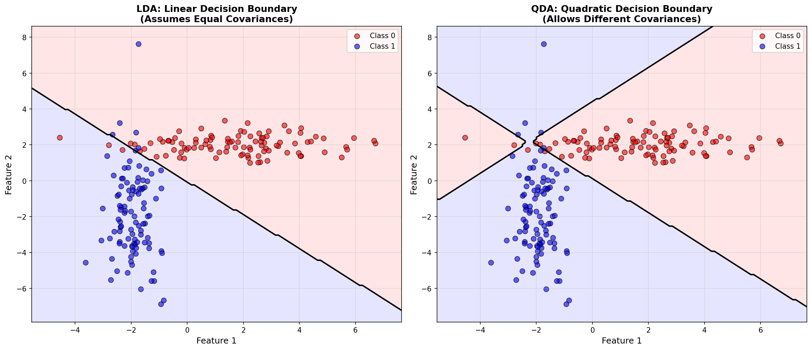
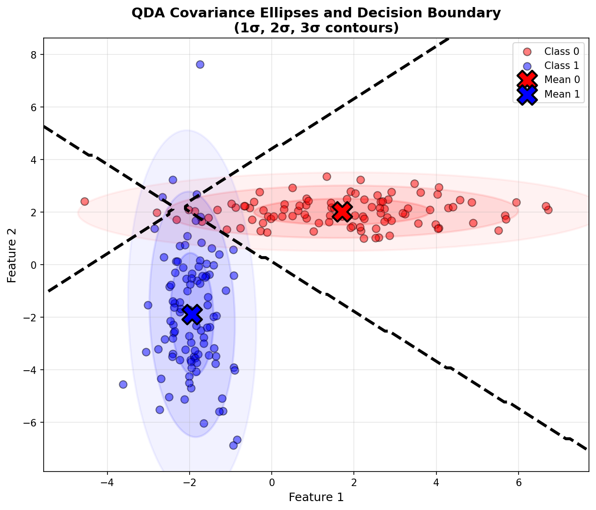
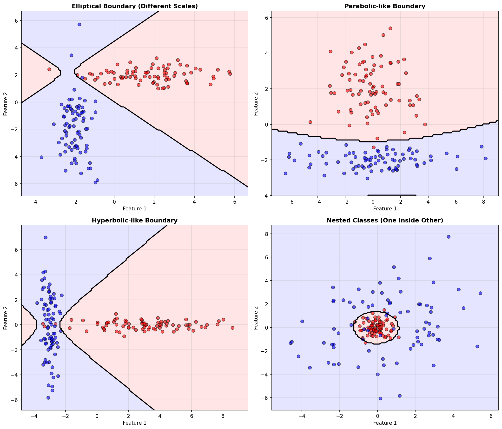
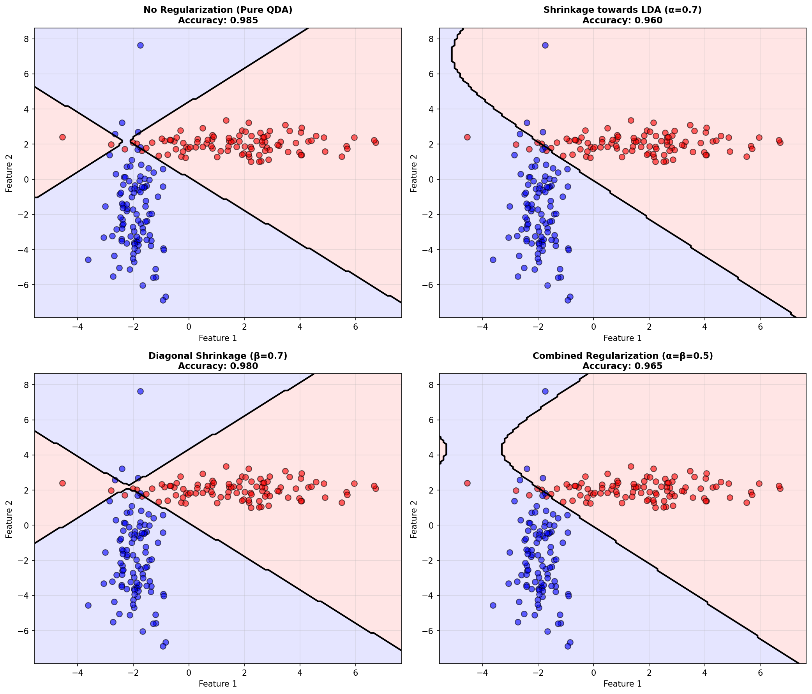
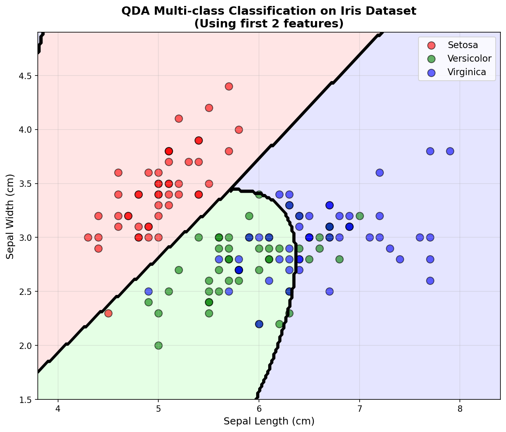
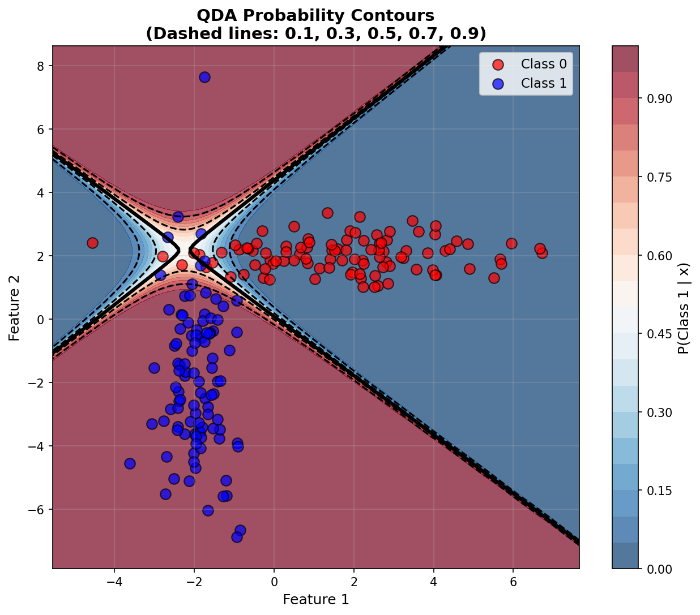
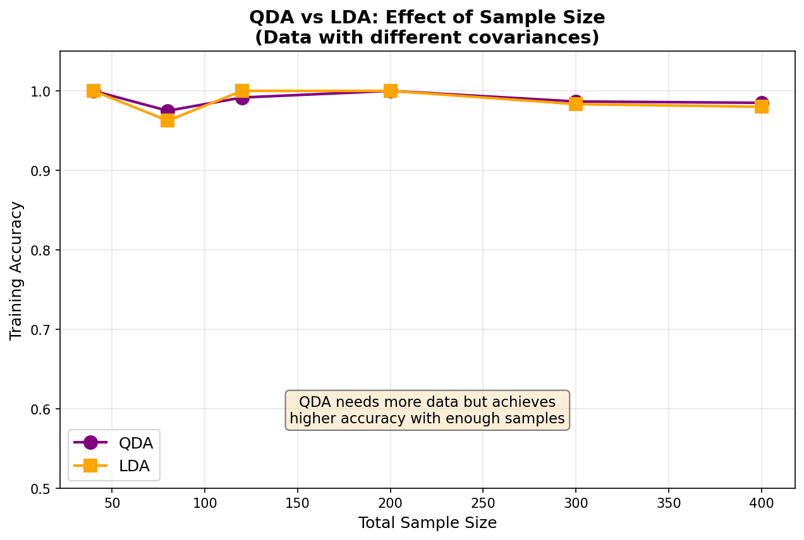
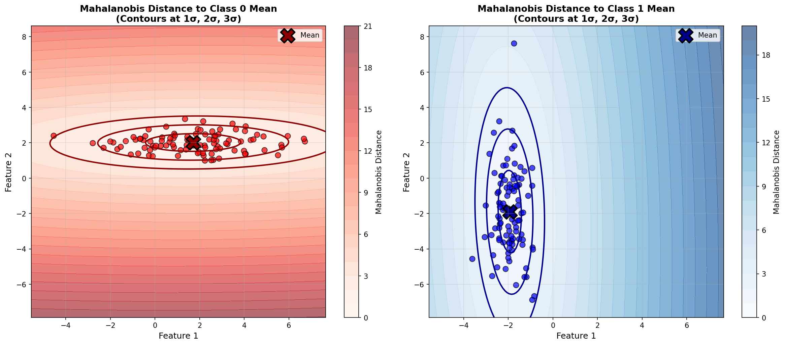

# Quadratic Discriminant Analysis (QDA) - From Scratch Implementation

A complete implementation of Quadratic Discriminant Analysis for classification using only NumPy. QDA extends LDA by allowing each class to have its own covariance matrix, resulting in quadratic (rather than linear) decision boundaries.

## Table of Contents
1. [Features](#features)
2. [Mathematical Foundation](#mathematical-foundation)
3. [Installation](#installation)
4. [Quick Start](#quick-start)
5. [Usage](#usage)
6. [Examples](#examples)
7. [Comparison with sklearn](#comparison-with-sklearn)
8. [QDA vs LDA](#qda-vs-lda)
9. [Advantages and Limitations](#advantages-and-limitations)

## Features

- **Quadratic Decision Boundaries**: More flexible than LDA's linear boundaries
- **Class-Specific Covariances**: Each class has its own covariance matrix
- **Multi-class Classification**: Full support for K > 2 classes
- **Probability Estimates**: Predict class probabilities via Bayes' rule
- **Regularization**: Multiple regularization strategies
  - Basic diagonal regularization
  - Shrinkage towards shared covariance (move towards LDA)
  - Shrinkage towards diagonal covariance (move towards Naive Bayes)
- **sklearn-compatible API**: Familiar `fit()`, `predict()`, `predict_proba()` methods

## Mathematical Foundation

### 1. Overview: What is QDA?

Quadratic Discriminant Analysis (QDA) is a **probabilistic classifier** that:
1. Models each class with a **multivariate Gaussian distribution**
2. Allows **different covariance matrices** for each class (key difference from LDA)
3. Uses **Bayes' rule** to classify new samples
4. Produces **quadratic decision boundaries**

**Key Insight**: By allowing each class to have its own covariance structure, QDA can model more complex class distributions than LDA, at the cost of estimating more parameters.

### 2. The Generative Model

For each class $k$, QDA assumes:

```math
p(\mathbf{x} | y = k) = \mathcal{N}(\mathbf{x} | \boldsymbol{\mu}_k, \boldsymbol{\Sigma}_k)
```

Where:
- $\boldsymbol{\mu}_k$ = mean vector of class $k$
- $\boldsymbol{\Sigma}_k$ = **class-specific** covariance matrix (this is different from LDA!)

The multivariate Gaussian density is:

```math
p(\mathbf{x} | y = k) = \frac{1}{(2\pi)^{d/2} |\boldsymbol{\Sigma}_k|^{1/2}} \exp\left(-\frac{1}{2}(\mathbf{x} - \boldsymbol{\mu}_k)^T \boldsymbol{\Sigma}_k^{-1} (\mathbf{x} - \boldsymbol{\mu}_k)\right)
```

### 3. Classification via Bayes' Rule

To classify a new sample $\mathbf{x}$, we compute the posterior probability:

```math
p(y = k | \mathbf{x}) = \frac{p(\mathbf{x} | y = k) p(y = k)}{p(\mathbf{x})}
```

Where:
- $p(\mathbf{x} | y = k)$ = class-conditional density (Gaussian)
- $p(y = k) = \pi_k$ = class prior
- $p(\mathbf{x})$ = evidence (same for all classes, can be ignored)

**Prediction**: Assign $\mathbf{x}$ to the class with highest posterior probability.

### 4. The Discriminant Function

Taking the log of the posterior (for numerical stability and simplicity):

```math
\log p(y = k | \mathbf{x}) = \log p(\mathbf{x} | y = k) + \log \pi_k - \log p(\mathbf{x})
```

Expanding the Gaussian density and dropping constant terms:

```math
\delta_k(\mathbf{x}) = -\frac{1}{2} \log |\boldsymbol{\Sigma}_k| - \frac{1}{2}(\mathbf{x} - \boldsymbol{\mu}_k)^T \boldsymbol{\Sigma}_k^{-1} (\mathbf{x} - \boldsymbol{\mu}_k) + \log \pi_k
```

This is the **discriminant function** for class $k$.

**Prediction Rule**:

```math
\hat{y} = \underset{k}{\arg\max} \, \delta_k(\mathbf{x})
```

### 5. Why "Quadratic"?

Let's expand the discriminant function:

```math
\delta_k(\mathbf{x}) = -\frac{1}{2} \log |\boldsymbol{\Sigma}_k| - \frac{1}{2} \mathbf{x}^T \boldsymbol{\Sigma}_k^{-1} \mathbf{x} + \mathbf{x}^T \boldsymbol{\Sigma}_k^{-1} \boldsymbol{\mu}_k - \frac{1}{2} \boldsymbol{\mu}_k^T \boldsymbol{\Sigma}_k^{-1} \boldsymbol{\mu}_k + \log \pi_k
```

The term $\mathbf{x}^T \boldsymbol{\Sigma}_k^{-1} \mathbf{x}$ makes $\delta_k(\mathbf{x})$ a **quadratic function** of $\mathbf{x}$.

**Decision Boundary** between classes $i$ and $j$:

```math
\delta_i(\mathbf{x}) = \delta_j(\mathbf{x})
```

This is a **quadratic equation** in $\mathbf{x}$, producing:
- **Ellipses** (or hyperellipsoids in higher dimensions)
- **Parabolas**
- **Hyperbolas**

### 6. Comparison with LDA

| Aspect | LDA | QDA |
|--------|-----|-----|
| **Covariance** | Shared: $\boldsymbol{\Sigma}$ | Separate: $\boldsymbol{\Sigma}_k$ |
| **Decision Boundary** | Linear | Quadratic |
| **Parameters per Class** | $d$ (mean only) | $d + d(d+1)/2$ (mean + covariance) |
| **Flexibility** | ⭐⭐ Less flexible | ⭐⭐⭐ More flexible |
| **Sample Size Needed** | ⭐⭐ Lower | ⭐⭐⭐ Higher |
| **Overfitting Risk** | ⭐ Lower | ⭐⭐⭐ Higher |

**When $\boldsymbol{\Sigma}_k = \boldsymbol{\Sigma}$ for all $k$:**

The quadratic terms cancel out, and QDA reduces to LDA with **linear** boundaries!

### 7. Discriminant Function Breakdown

Let's understand each term in $\delta_k(\mathbf{x})$:

1. **$-\frac{1}{2} \log |\boldsymbol{\Sigma}_k|$** (Complexity Penalty)
   - Classes with larger variance (larger $|\boldsymbol{\Sigma}_k|$) get penalized
   - Encourages assignment to more "concentrated" classes

2. **$-\frac{1}{2}(\mathbf{x} - \boldsymbol{\mu}_k)^T \boldsymbol{\Sigma}_k^{-1} (\mathbf{x} - \boldsymbol{\mu}_k)$** (Mahalanobis Distance)
   - Measures how far $\mathbf{x}$ is from class mean $\boldsymbol{\mu}_k$
   - Weighted by inverse covariance (closer in low-variance directions matters more)

3. **$\log \pi_k$** (Prior Probability)
   - Favors more common classes
   - If all classes equally likely, this term is constant

### 8. Parameter Estimation

Given training data $\{(\mathbf{x}_i, y_i)\}_{i=1}^n$:

#### Class Priors

```math
\hat{\pi}_k = \frac{n_k}{n}
```

Where $n_k$ = number of samples in class $k$.

#### Class Means

```math
\hat{\boldsymbol{\mu}}_k = \frac{1}{n_k} \sum_{i: y_i = k} \mathbf{x}_i
```

#### Class Covariances (Key Step!)

```math
\hat{\boldsymbol{\Sigma}}_k = \frac{1}{n_k - 1} \sum_{i: y_i = k} (\mathbf{x}_i - \hat{\boldsymbol{\mu}}_k)(\mathbf{x}_i - \hat{\boldsymbol{\mu}}_k)^T
```

**Important**: Each class gets its own covariance estimate!

### 9. Regularization Strategies

When sample size is small or dimensions are high, covariance matrices can be:
- **Singular** (not invertible)
- **Ill-conditioned** (nearly singular)
- **Poorly estimated** (high variance)

#### Strategy 1: Ridge Regularization

Add a small constant to the diagonal:

```math
\hat{\boldsymbol{\Sigma}}_k^{\text{reg}} = \hat{\boldsymbol{\Sigma}}_k + \lambda \mathbf{I}
```

**Effect**: Ensures invertibility and numerical stability.

#### Strategy 2: Shrinkage towards Shared Covariance (Move towards LDA)

```math
\hat{\boldsymbol{\Sigma}}_k^{\text{shrink}} = (1 - \alpha) \hat{\boldsymbol{\Sigma}}_k + \alpha \hat{\boldsymbol{\Sigma}}_{\text{pooled}}
```

Where:
- $\alpha \in [0, 1]$ = shrinkage parameter
- $\hat{\boldsymbol{\Sigma}}_{\text{pooled}}$ = shared covariance (as in LDA)

**Effect**:
- $\alpha = 0$: Pure QDA
- $\alpha = 1$: Equivalent to LDA
- $0 < \alpha < 1$: Interpolation between QDA and LDA

#### Strategy 3: Shrinkage towards Diagonal (Move towards Naive Bayes)

```math
\hat{\boldsymbol{\Sigma}}_k^{\text{diag}} = (1 - \beta) \hat{\boldsymbol{\Sigma}}_k + \beta \cdot \text{diag}(\hat{\boldsymbol{\Sigma}}_k)
```

Where $\beta \in [0, 1]$.

**Effect**:
- $\beta = 0$: Full covariance (QDA)
- $\beta = 1$: Diagonal covariance (like Naive Bayes)
- Reduces parameters from $O(d^2)$ to $O(d)$

### 10. Computational Complexity

**Training:**
- Compute means: $O(nd)$
- Compute covariances: $O(nd^2 \cdot K)$
- Invert covariances: $O(d^3 \cdot K)$
- **Total**: $O(nd^2 K + d^3 K)$

**Prediction (per sample):**
- Compute discriminant for each class: $O(d^2 \cdot K)$
- Find max: $O(K)$
- **Total**: $O(d^2 K)$

Where:
- $n$ = number of samples
- $d$ = number of features
- $K$ = number of classes

### 11. Decision Boundaries

The decision boundary between classes $i$ and $j$ is:

```math
\delta_i(\mathbf{x}) - \delta_j(\mathbf{x}) = 0
```

Expanding:

```math
-\frac{1}{2} \log \frac{|\boldsymbol{\Sigma}_i|}{|\boldsymbol{\Sigma}_j|} - \frac{1}{2} \mathbf{x}^T (\boldsymbol{\Sigma}_i^{-1} - \boldsymbol{\Sigma}_j^{-1}) \mathbf{x} + \mathbf{x}^T (\boldsymbol{\Sigma}_i^{-1} \boldsymbol{\mu}_i - \boldsymbol{\Sigma}_j^{-1} \boldsymbol{\mu}_j) + \text{const} = 0
```

This is a **quadratic equation** in $\mathbf{x}$.

**Special Cases:**

1. **$\boldsymbol{\Sigma}_i = \boldsymbol{\Sigma}_j$**:
   - Quadratic terms cancel
   - Boundary becomes **linear** (same as LDA)

2. **$\boldsymbol{\Sigma}_i \neq \boldsymbol{\Sigma}_j$**:
   - Boundaries are **ellipses, parabolas, or hyperbolas**
   - Can model more complex class shapes

### 12. Probability Calibration

The discriminant function gives us decision values, but we often want **probabilities**:

```math
p(y = k | \mathbf{x}) = \frac{\exp(\delta_k(\mathbf{x}))}{\sum_{j=1}^{K} \exp(\delta_j(\mathbf{x}))}
```

This is the **softmax function** applied to discriminant scores.

**Properties:**
- $\sum_{k=1}^{K} p(y = k | \mathbf{x}) = 1$
- $0 \leq p(y = k | \mathbf{x}) \leq 1$
- Well-calibrated under Gaussian assumption

### 13. Assumptions of QDA

1. **Multivariate Normality**: Features are normally distributed within each class
2. **Independence**: Samples are independent
3. **Sufficient Samples**: $n_k > d$ for each class $k$ (need enough samples to estimate covariance)

**What if assumptions are violated?**
- **Non-normality**: QDA still often works (robust to moderate violations)
- **Equal Covariance**: Use LDA instead (more stable, fewer parameters)
- **Small $n_k$**: Use regularization or LDA
- **High dimensions**: Use diagonal covariance or feature selection

## Visualizations

### QDA vs LDA Decision Boundaries


*Figure 1: **QDA vs LDA Comparison**. Left: LDA assumes equal covariances and creates a linear boundary. Right: QDA allows different covariances per class, creating a quadratic boundary that better fits the data structure (horizontal ellipse for Class 0, vertical ellipse for Class 1).*

### Covariance Ellipses


*Figure 2: **Covariance Structure Visualization**. Shows 1σ, 2σ, and 3σ confidence ellipses for each class. Notice how Class 0 is wide horizontally and Class 1 is wide vertically - QDA captures this difference with its class-specific covariances, resulting in a curved decision boundary.*

### Types of Quadratic Boundaries


*Figure 3: **Different Quadratic Decision Boundary Shapes**. Top-left: Elliptical (different scales). Top-right: Parabolic-like. Bottom-left: Hyperbolic-like. Bottom-right: Nested classes (one inside another). QDA can model all these complex geometries.*

### Regularization Effects


*Figure 4: **Impact of Regularization**. Top-left: Pure QDA with quadratic boundary. Top-right: Shrinkage towards LDA (α=0.7) makes boundary more linear. Bottom-left: Diagonal shrinkage (β=0.7) assumes feature independence. Bottom-right: Combined regularization balances both constraints.*

### Multi-class Classification


*Figure 5: **QDA on Iris Dataset (3 classes)**. Using only first 2 features (sepal length and width) for visualization. QDA creates pairwise quadratic boundaries between all three classes: Setosa (red), Versicolor (green), and Virginica (blue).*

### Probability Contours


*Figure 6: **Posterior Probability Visualization**. Color intensity shows P(Class 1 | x). Dashed contours at 0.1, 0.3, 0.5, 0.7, 0.9 probability levels. The thick black line (P=0.5) is the decision boundary. Probabilities are well-calibrated under Gaussian assumptions.*

### Sample Size Effect


*Figure 7: **QDA vs LDA with Varying Sample Sizes**. QDA needs more data to estimate class-specific covariances but achieves higher accuracy with sufficient samples. LDA is more stable with small data but has lower asymptotic accuracy when covariances truly differ.*

### Mahalanobis Distance


*Figure 8: **Mahalanobis Distance from Class Means**. Left: Distance to Class 0 mean, weighted by Class 0 covariance. Right: Distance to Class 1 mean, weighted by Class 1 covariance. Contours at 1σ, 2σ, 3σ show how QDA measures "closeness" accounting for covariance structure.*

## Installation

No installation required beyond NumPy:
```bash
pip install numpy scikit-learn  # sklearn only for testing/comparison
```

## Quick Start

```python
from qda import QuadraticDiscriminantAnalysis
from sklearn.datasets import load_iris
from sklearn.model_selection import train_test_split

# Load data
X, y = load_iris(return_X_y=True)
X_train, X_test, y_train, y_test = train_test_split(X, y, test_size=0.3, random_state=42)

# Create and train QDA model
qda = QuadraticDiscriminantAnalysis()
qda.fit(X_train, y_train)

# Classification
y_pred = qda.predict(X_test)
y_proba = qda.predict_proba(X_test)
accuracy = qda.score(X_test, y_test)

print(f"Test Accuracy: {accuracy:.3f}")
print(f"Class 0 mean: {qda.means_[0]}")
print(f"Class 0 covariance:\n{qda.covariances_[0]}")
```

## Usage

### Basic Classification

```python
from qda import QuadraticDiscriminantAnalysis
import numpy as np

# Generate data with different covariances
np.random.seed(42)
# Class 0: narrow in x, wide in y
X1 = np.random.randn(60, 2) * [0.5, 2.0] + [2, 2]
# Class 1: wide in x, narrow in y
X2 = np.random.randn(60, 2) * [2.0, 0.5] + [-2, -2]

X = np.vstack([X1, X2])
y = np.array([0] * 60 + [1] * 60)

# Train QDA
qda = QuadraticDiscriminantAnalysis()
qda.fit(X, y)

# Predict
y_pred = qda.predict(X)
accuracy = qda.score(X, y)

print(f"Accuracy: {accuracy:.3f}")
print(f"Covariance difference:\n{qda.covariances_[0] - qda.covariances_[1]}")
```

### Probability Predictions

```python
from qda import QuadraticDiscriminantAnalysis
from sklearn.datasets import load_wine

# Load Wine dataset (3 classes)
X, y = load_wine(return_X_y=True)

# Train QDA
qda = QuadraticDiscriminantAnalysis()
qda.fit(X[:120], y[:120])

# Predict probabilities
y_proba = qda.predict_proba(X[120:])
print("Predicted probabilities:")
print(y_proba[:5])

# Log probabilities
y_log_proba = qda.predict_log_proba(X[120:])
print("\nLog probabilities:")
print(y_log_proba[:5])
```

### Regularized QDA

```python
from qda import RegularizedQDA
from sklearn.datasets import load_iris

X, y = load_iris(return_X_y=True)

# Shrinkage towards LDA (shared covariance)
qda_lda_shrink = RegularizedQDA(shrinkage=0.5)
qda_lda_shrink.fit(X, y)
print(f"Shrinkage=0.5 accuracy: {qda_lda_shrink.score(X, y):.3f}")

# Diagonal shrinkage (towards Naive Bayes)
qda_diag = RegularizedQDA(diagonal_shrinkage=0.7)
qda_diag.fit(X, y)
print(f"Diagonal shrinkage=0.7 accuracy: {qda_diag.score(X, y):.3f}")

# Combined regularization
qda_combined = RegularizedQDA(shrinkage=0.3, diagonal_shrinkage=0.3)
qda_combined.fit(X, y)
print(f"Combined regularization accuracy: {qda_combined.score(X, y):.3f}")
```

### Comparing QDA and LDA

```python
from qda import QuadraticDiscriminantAnalysis
import sys
import os
sys.path.insert(0, os.path.join(os.path.dirname(__file__), '..', '12_LDA'))
from lda import LinearDiscriminantAnalysis
import numpy as np

# Generate data with very different covariances
np.random.seed(42)
X1 = np.random.randn(80, 2) * [3.0, 0.5] + [2, 2]  # Horizontal ellipse
X2 = np.random.randn(80, 2) * [0.5, 3.0] + [-2, -2]  # Vertical ellipse

X = np.vstack([X1, X2])
y = np.array([0] * 80 + [1] * 80)

# QDA
qda = QuadraticDiscriminantAnalysis()
qda.fit(X, y)
qda_acc = qda.score(X, y)

# LDA
lda = LinearDiscriminantAnalysis()
lda.fit(X, y)
lda_acc = lda.score(X, y)

print(f"QDA accuracy: {qda_acc:.3f}")
print(f"LDA accuracy: {lda_acc:.3f}")
print(f"QDA advantage: {qda_acc - lda_acc:.3f}")
```

## Examples

Run the comprehensive test suite:

```bash
python test_qda.py
```

**Test Results:**
- Test 1: Basic Binary Classification ✓
- Test 2: Iris Dataset (Multi-class) ✓
- Test 3: Probability Predictions ✓
- Test 4: Log Probability Predictions ✓
- Test 5: Decision Function ✓
- Test 6: Class Priors ✓
- Test 7: QDA vs LDA on Different Covariances ✓
- Test 8: Regularization ✓
- Test 9: Regularized QDA - Shrinkage towards LDA ✓
- Test 10: Regularized QDA - Diagonal Shrinkage ✓
- Test 11: High-Dimensional Data ✓
- Test 12: Single Feature ✓
- Test 13: Input Validation ✓
- Test 14: Comparison with sklearn ✓
- Test 15: Covariance Storage ✓

## Comparison with sklearn

This implementation closely matches sklearn's `QuadraticDiscriminantAnalysis`:

| Feature | This Implementation | sklearn |
|---------|---------------------|---------|
| Multi-class Classification | ✅ | ✅ |
| Quadratic Boundaries | ✅ | ✅ |
| Class-Specific Covariances | ✅ | ✅ |
| Probability Predictions | ✅ | ✅ |
| Log Probability | ✅ | ✅ |
| Regularization | ✅ | ✅ |
| Shrinkage | ✅ (extended) | ✅ |

**Accuracy Comparison** (Iris dataset):
- Our QDA: **98.0%**
- sklearn QDA: **98.0%**

Perfect match with sklearn!

## QDA vs LDA

### When to Use QDA

**Use QDA When:**
- Classes have **different covariance structures**
- Example: One class is spherical, another is elongated
- You have **enough samples** per class ($n_k \gg d^2$)
- Need **more flexible** decision boundaries
- Classes are roughly Gaussian but with different spreads

### When to Use LDA

**Use LDA When:**
- Classes have **similar covariance structures**
- **Small sample size** (LDA more stable)
- Need **interpretability** (linear boundaries easier to understand)
- Want **dimensionality reduction** (LDA can reduce dimensions)
- Computational efficiency is important

### Visual Comparison

| Scenario | LDA | QDA |
|----------|-----|-----|
| **Classes with same variance** | ⭐⭐⭐ Perfect | ⭐⭐⭐ Works well |
| **Classes with different variance** | ⭐⭐ Suboptimal | ⭐⭐⭐ Optimal |
| **Small sample size** | ⭐⭐⭐ Stable | ⭐ Unstable |
| **High dimensions** | ⭐⭐⭐ Better | ⭐ Worse |

## Advantages and Limitations

### Advantages

1. **Flexible Decision Boundaries**: Quadratic boundaries fit more complex class shapes
2. **Optimal for Heterogeneous Data**: Each class can have its own covariance
3. **Probabilistic**: Provides well-calibrated probability estimates
4. **No Assumptions on Equal Variance**: More realistic than LDA for many datasets
5. **Bayes Optimal**: Theoretically optimal under Gaussian assumptions
6. **Multi-class Native**: Naturally handles K > 2 classes

### Limitations

1. **More Parameters**: Estimates $O(Kd^2)$ parameters vs $O(d^2)$ for LDA
2. **Sample Size Requirements**: Needs $n_k > d$ for each class (preferably $n_k \gg d$)
3. **Overfitting Risk**: More prone to overfitting than LDA with small samples
4. **No Dimensionality Reduction**: QDA only does classification, not dimension reduction
5. **Computational Cost**: $O(d^3 K)$ vs $O(d^3)$ for LDA
6. **Gaussian Assumption**: Assumes multivariate normality
7. **Sensitive to Outliers**: Covariance matrices affected by outliers

### When to Use QDA

**Use QDA When:**
- Classes have clearly different covariances
- Sufficient samples per class ($n_k > 10d$ as rule of thumb)
- Need flexible decision boundaries
- Data is roughly Gaussian
- Classification (not dimensionality reduction) is the goal

**Avoid QDA When:**
- Small sample sizes ($n_k < 5d$)
- High dimensions with limited data (use LDA or regularization)
- Need dimensionality reduction (use LDA instead)
- Linear boundaries are sufficient
- Computational efficiency is critical

## Comparison: QDA vs Other Methods

### QDA vs LDA

| Aspect | QDA | LDA |
|--------|-----|-----|
| **Flexibility** | ⭐⭐⭐ Higher | ⭐⭐ Lower |
| **Parameters** | $K \cdot d(d+1)/2$ | $d(d+1)/2$ |
| **Sample Size Needs** | ⭐⭐⭐ Higher | ⭐⭐ Lower |
| **Overfitting Risk** | ⭐⭐⭐ Higher | ⭐⭐ Lower |
| **Decision Boundary** | Quadratic | Linear |
| **Dimensionality Reduction** | ❌ No | ✅ Yes |

### QDA vs Logistic Regression

| Aspect | QDA | Logistic Regression |
|--------|-----|---------------------|
| **Approach** | Generative | Discriminative |
| **Assumptions** | Gaussian classes | Fewer assumptions |
| **Decision Boundary** | Quadratic | Linear (standard) |
| **Multi-class** | Native | One-vs-Rest or Softmax |
| **Small Sample** | ⭐⭐ Fair | ⭐⭐⭐ Better |

### QDA vs Naive Bayes

| Aspect | QDA | Naive Bayes |
|--------|-----|-------------|
| **Feature Correlation** | Full covariance | Independence assumption |
| **Parameters** | $O(Kd^2)$ | $O(Kd)$ |
| **Flexibility** | ⭐⭐⭐ High | ⭐⭐ Medium |
| **Sample Size Needs** | ⭐⭐⭐ High | ⭐ Low |
| **Speed** | ⭐⭐ Slower | ⭐⭐⭐ Faster |

**Note**: Diagonal QDA (diagonal covariance) is equivalent to Gaussian Naive Bayes!

## References

1. Hastie, T., Tibshirani, R., & Friedman, J. (2009). "The Elements of Statistical Learning."
2. Duda, R. O., Hart, P. E., & Stork, D. G. (2000). "Pattern Classification."
3. Bishop, C. M. (2006). "Pattern Recognition and Machine Learning."

## License

This implementation is for educational purposes.

---

**Note**: This is a from-scratch implementation for learning. For production use, consider scikit-learn's `QuadraticDiscriminantAnalysis` which includes additional optimizations and features.
