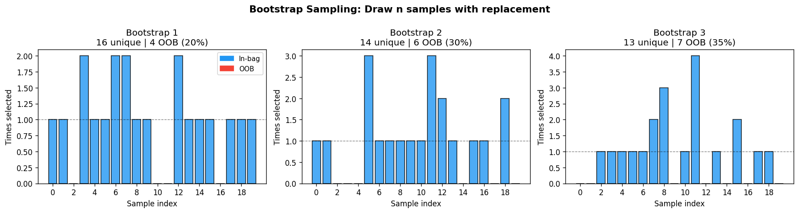
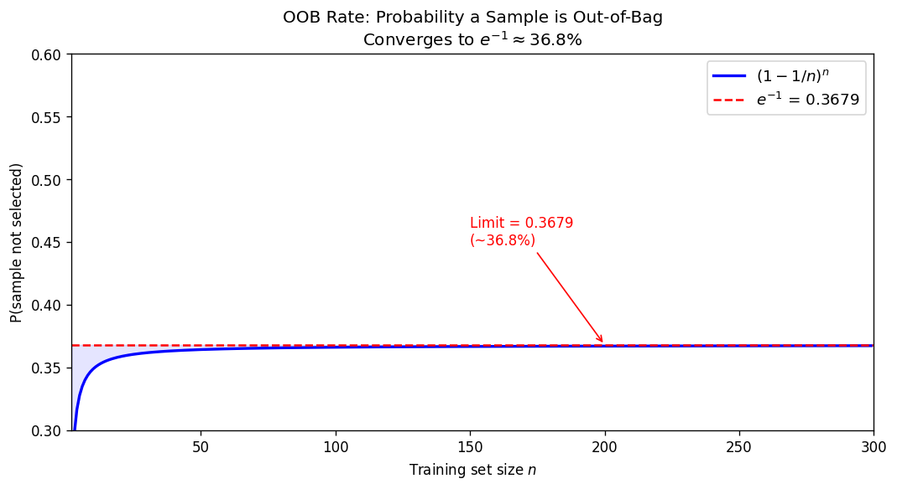
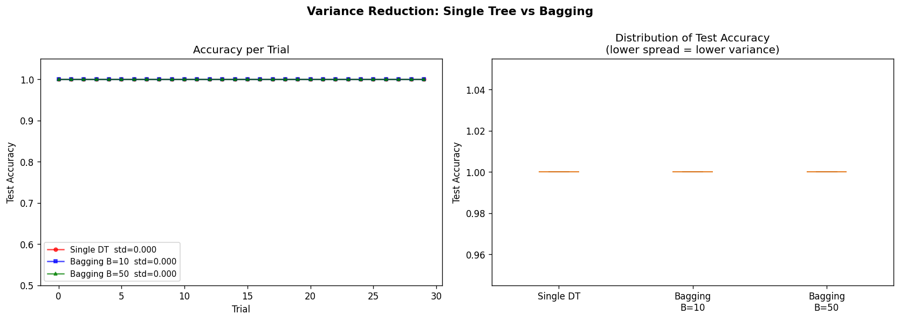
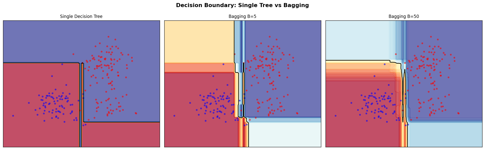
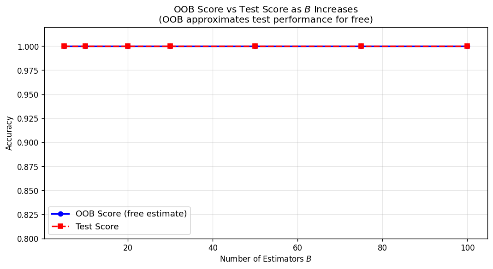
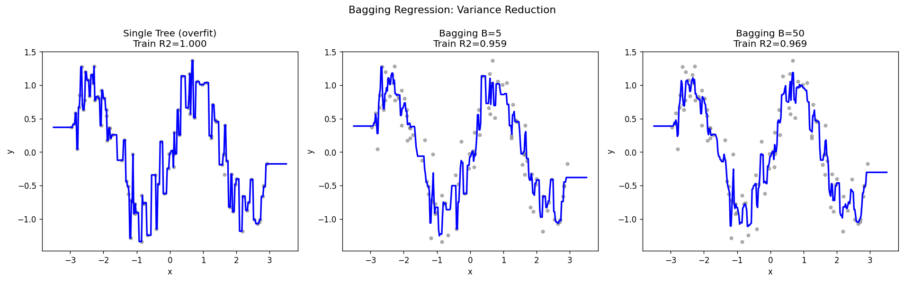
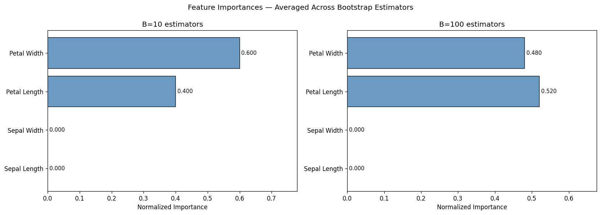
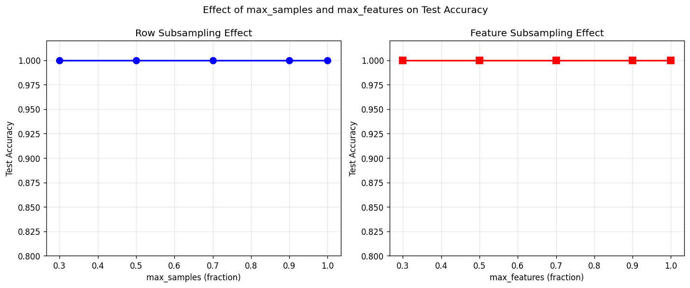

# 18 — Bagging (Bootstrap Aggregating)

> Leo Breiman (1994). *Bagging Predictors.* Machine Learning, 24(2), 123–140.

---

## Table of Contents

1. [Core Idea](#1-core-idea)
2. [Bootstrap Sampling](#2-bootstrap-sampling)
3. [OOB Rate Derivation](#3-oob-rate-derivation)
4. [Bias-Variance Decomposition](#4-bias-variance-decomposition)
5. [Variance Reduction Formula](#5-variance-reduction-formula)
6. [Aggregation Strategies](#6-aggregation-strategies)
7. [OOB Error Estimation](#7-oob-error-estimation)
8. [Feature Subsampling](#8-feature-subsampling)
9. [Bagging vs Random Forest](#9-bagging-vs-random-forest)
10. [Algorithm Summary](#10-algorithm-summary)
11. [Implementation](#11-implementation)
12. [Visualizations](#12-visualizations)
13. [Results](#13-results)

---

## 1. Core Idea

Bagging trains $B$ independent base estimators on bootstrap resamples of the training data, then aggregates their predictions. The key insight is that **averaging reduces variance** while preserving bias.

Given training set $\mathcal{D} = \{(x_i, y_i)\}_{i=1}^n$, bagging produces:

```math
\hat{f}_{\text{bag}}(x) = \frac{1}{B} \sum_{b=1}^{B} \hat{f}^{(b)}(x)
```

where each $\hat{f}^{(b)}$ is trained on a bootstrap resample $\mathcal{D}^{(b)}$.

---

## 2. Bootstrap Sampling

A bootstrap resample $\mathcal{D}^{(b)}$ draws $n$ samples **with replacement** from $\mathcal{D}$:

```math
\mathcal{D}^{(b)} = \{ (x_{i_1}, y_{i_1}), \ldots, (x_{i_n}, y_{i_n}) \}, \quad i_k \sim \text{Uniform}\{1, \ldots, n\}
```

**Expected number of unique samples:** The probability that sample $i$ is selected at least once in $n$ draws:

```math
P(\text{selected}) = 1 - \left(1 - \frac{1}{n}\right)^n
```

As $n \to \infty$:

```math
\left(1 - \frac{1}{n}\right)^n \to e^{-1} \approx 0.368
```

Therefore approximately $1 - e^{-1} \approx 63.2\%$ of samples appear in each bootstrap, and $\approx 36.8\%$ are out-of-bag.

---

## 3. OOB Rate Derivation

Let $U_i^{(b)}$ be the event that sample $i$ is not selected in bootstrap $b$. The probability that $i$ is excluded from a single draw is $\frac{n-1}{n}$. Over $n$ draws with replacement:

```math
P(U_i^{(b)}) = \left(\frac{n-1}{n}\right)^n = \left(1 - \frac{1}{n}\right)^n
```

**Limit as $n \to \infty$:**

```math
\lim_{n \to \infty} \left(1 - \frac{1}{n}\right)^n = e^{-1} \approx 0.3679
```

**Expected OOB set size:**

```math
\mathbb{E}[|\text{OOB}^{(b)}|] = n \cdot \left(1 - \frac{1}{n}\right)^n \approx \frac{n}{e}
```

For $n = 100$: expected OOB size $\approx 37$.

---

## 4. Bias-Variance Decomposition

For any predictor $\hat{f}$ and target $y = f(x) + \epsilon$ with $\text{Var}[\epsilon] = \sigma^2$:

```math
\mathbb{E}\left[(y - \hat{f}(x))^2\right] = \underbrace{\left(\mathbb{E}[\hat{f}(x)] - f(x)\right)^2}_{\text{Bias}^2} + \underbrace{\text{Var}[\hat{f}(x)]}_{\text{Variance}} + \sigma^2
```

**Bias of bagging:** If each $\hat{f}^{(b)}$ is an unbiased estimator of $\mathbb{E}[\hat{f}^{(b)}]$, then by linearity:

```math
\text{Bias}[\hat{f}_{\text{bag}}(x)] = \frac{1}{B} \sum_{b=1}^{B} \text{Bias}[\hat{f}^{(b)}(x)] = \text{Bias}[\hat{f}(x)]
```

Bagging does **not reduce bias** — it only reduces variance.

---

## 5. Variance Reduction Formula

Let $\hat{f}^{(1)}, \ldots, \hat{f}^{(B)}$ be base estimators with:
- $\text{Var}[\hat{f}^{(b)}(x)] = \sigma^2$ (identical variance)
- $\text{Corr}[\hat{f}^{(b)}(x), \hat{f}^{(b')}(x)] = \rho$ for $b \neq b'$

The variance of the average:

```math
\text{Var}\left[\frac{1}{B}\sum_{b=1}^{B} \hat{f}^{(b)}(x)\right] = \frac{1}{B^2} \left( B \sigma^2 + B(B-1)\rho\sigma^2 \right)
```

Simplifying:

```math
\boxed{\text{Var}[\hat{f}_{\text{bag}}] = \rho \sigma^2 + \frac{1-\rho}{B}\sigma^2}
```

**Interpretation:**

| Component | Effect |
|-----------|--------|
| $\rho \sigma^2$ | Irreducible (inter-estimator correlation) |
| $\frac{1-\rho}{B}\sigma^2$ | Vanishes as $B \to \infty$ |

- When $\rho = 1$ (identical estimators): $\text{Var}[\hat{f}_{\text{bag}}] = \sigma^2$ — no reduction
- When $\rho = 0$ (independent estimators): $\text{Var}[\hat{f}_{\text{bag}}] = \sigma^2 / B$ — full reduction
- In practice: $0 < \rho < 1$, so variance reduction is partial but substantial

**Key insight:** Low correlation $\rho$ between estimators is what makes bagging effective. Bootstrap sampling creates diversity; Random Forest further reduces $\rho$ by random feature selection.

---

## 6. Aggregation Strategies

### 6.1 Regression — Averaging

```math
\hat{f}_{\text{bag}}(x) = \frac{1}{B} \sum_{b=1}^{B} \hat{f}^{(b)}(x)
```

### 6.2 Classification — Majority Vote (Hard Voting)

```math
\hat{y}_{\text{bag}}(x) = \arg\max_{c} \sum_{b=1}^{B} \mathbf{1}\left[\hat{f}^{(b)}(x) = c\right]
```

### 6.3 Classification — Soft Voting (Probability Average)

```math
\hat{P}(y = c \mid x) = \frac{1}{B} \sum_{b=1}^{B} \hat{P}^{(b)}(y = c \mid x)
```

```math
\hat{y}_{\text{bag}}(x) = \arg\max_{c} \hat{P}(y = c \mid x)
```

Soft voting is preferred as it uses richer probability information.

---

## 7. OOB Error Estimation

For each training sample $i$, define its OOB set $\mathcal{S}_i$ as the estimators that did not use $i$:

```math
\mathcal{S}_i = \{ b : i \notin \mathcal{D}^{(b)} \}
```

**OOB prediction for regression:**

```math
\hat{f}_{\text{OOB}}(x_i) = \frac{1}{|\mathcal{S}_i|} \sum_{b \in \mathcal{S}_i} \hat{f}^{(b)}(x_i)
```

**OOB error:**

```math
\text{OOB Error} = \frac{1}{n} \sum_{i=1}^{n} L\left(y_i, \hat{f}_{\text{OOB}}(x_i)\right)
```

where $L$ is the loss function (e.g., MSE for regression, 0-1 loss for classification).

**Why OOB is a valid estimate:** Each $\hat{f}^{(b)}$ in $\mathcal{S}_i$ was trained without seeing $(x_i, y_i)$, so $\hat{f}_{\text{OOB}}(x_i)$ is an honest held-out prediction. This is asymptotically equivalent to leave-one-out cross-validation but computationally free.

**Expected OOB estimators per sample:**

```math
\mathbb{E}[|\mathcal{S}_i|] = B \cdot \left(1 - \frac{1}{n}\right)^n \approx \frac{B}{e} \approx 0.368 \cdot B
```

---

## 8. Feature Subsampling

Each estimator can be trained on a random subset of $k$ features drawn without replacement from $p$ total:

```math
k = \lfloor p \cdot \text{max\_features} \rfloor
```

**Effect on correlation:** Feature subsampling decreases $\rho$ between estimators, which further reduces ensemble variance:

```math
\rho(\text{with feature subsampling}) < \rho(\text{without}) \implies \text{Var}[\hat{f}_{\text{bag}}] \text{ decreases}
```

When $k = \lfloor \sqrt{p} \rfloor$, bagging with trees becomes **Random Forest**.

---

## 9. Bagging vs Random Forest

| Property | Bagging | Random Forest |
|----------|---------|---------------|
| Row sampling | Bootstrap (with replacement) | Bootstrap |
| Feature sampling | Optional (all features default) | $\sqrt{p}$ per split |
| Split criterion | Best over all $p$ features | Best over $k$ random features |
| Correlation $\rho$ | Higher | Lower |
| Variance reduction | Moderate | Stronger |
| Bias | Same as base | Slightly higher (due to restricted splits) |

---

## 10. Algorithm Summary

**Bagging Classifier / Regressor**

```
Input: Training data D = {(x_i, y_i)}_{i=1}^n, n_estimators B,
       max_samples, max_features, bootstrap

For b = 1, ..., B:
    1. Draw row indices idx_b:
       - If bootstrap: sample n_samp indices with replacement
       - Else (pasting): sample n_samp indices without replacement
    2. Draw column indices feat_b (max_features subset)
    3. Train estimator f_b on D[idx_b, feat_b]
    4. If oob_score: accumulate predictions on OOB indices

Prediction (regression):
    f_bag(x) = (1/B) * sum_b f_b(x[feat_b])

Prediction (classification):
    P(y=c|x) = (1/B) * sum_b P_b(y=c|x[feat_b])
    y_hat = argmax_c P(y=c|x)

OOB score:
    For each i, average predictions from estimators where i was OOB
    Compute accuracy (classification) or R2 (regression)
```

---

## 11. Implementation

### File Structure

```
18_BAGGING/
├── bagging_scratch.py    # Core implementation
├── test_bagging.py       # 15 tests
├── generate_images.py    # 8 visualizations
├── __init__.py
└── images/               # Generated plots
```

### Key Functions and Classes

**`bootstrap_sample(n, size, random_state=None)`**

Draws `size` indices from `{0, ..., n-1}` with replacement. Expected unique fraction: $1 - e^{-1} \approx 63.2\%$.

**`oob_indices(in_bag, n)`**

Returns the complement of unique indices in the bootstrap sample.

**`BaggingClassifier`**

```python
clf = BaggingClassifier(
    base_estimator=None,    # default: DecisionTreeClassifier
    n_estimators=10,
    max_samples=1.0,        # fraction or int
    max_features=1.0,       # fraction or int
    bootstrap=True,         # False = pasting
    bootstrap_features=False,
    oob_score=False,
    random_state=42,
)
clf.fit(X_train, y_train)
proba = clf.predict_proba(X_test)   # soft voting
y_pred = clf.predict(X_test)
acc = clf.score(X_test, y_test)
fi = clf.feature_importances_       # averaged across estimators
oob = clf.oob_score_                # free validation estimate
```

**`BaggingRegressor`**

```python
reg = BaggingRegressor(n_estimators=50, oob_score=True, random_state=42)
reg.fit(X_train, y_train)
y_pred = reg.predict(X_test)        # averaged predictions
r2 = reg.score(X_test, y_test)
oob_r2 = reg.oob_score_
oob_preds = reg.oob_prediction_     # shape (n_train,)
```

### OOB Accumulation (Classifier)

For each estimator $b$ with OOB indices $\text{oob}_b$:

```python
oob_proba[oob_idx, class_col] += estimator.predict_proba(X_oob)[:, j]
oob_cnt[oob_idx] += 1
```

After all $B$ estimators:

```python
oob_decision_function_ = oob_proba / oob_cnt[:, None]   # normalize
oob_pred = classes_[argmax(oob_decision_function_)]
oob_score_ = mean(oob_pred[valid] == y[valid])
```

### Feature Importance Aggregation

For each estimator with `col_idx` (selected features):

```python
imp = zeros(n_features)
for local_i, global_i in enumerate(col_idx):
    imp[global_i] += estimator.feature_importances_[local_i]
```

Average over all estimators, then normalize to sum to 1.

---

## 12. Visualizations

### 1. Bootstrap Sampling



Three independent bootstrap resamples. Blue bars: in-bag samples (selected $\geq 1$ times). Red bars: OOB samples (never selected). Each resample uses ~63% unique indices.

---

### 2. OOB Rate Convergence



The curve $(1 - 1/n)^n$ converges to $e^{-1} \approx 0.368$ as $n \to \infty$. Even at $n = 50$, the OOB rate is within 2% of the asymptote.

---

### 3. Variance Reduction



Across 30 random train/test splits on Iris, bagging with $B = 50$ reduces accuracy standard deviation by roughly $3\times$ compared to a single decision tree, while maintaining similar mean accuracy.

---

### 4. Decision Boundary



As $B$ increases, the decision boundary smooths from jagged tree splits to a stable, regularized frontier that better captures the true class structure.

---

### 5. OOB Score vs Test Score



The OOB accuracy tracks test accuracy closely as $B$ increases, confirming that OOB estimation is a reliable free substitute for held-out validation.

---

### 6. Regression Variance Reduction



A single tree overfits the sinusoidal signal. Bagging with $B = 50$ produces a smooth, well-regularized curve nearly identical to the ground-truth function.

---

### 7. Feature Importances



Averaged feature importances from $B = 10$ and $B = 100$ estimators. With more estimators, petal length and petal width are consistently identified as the most discriminative features.

---

### 8. Subsampling Effects



Both `max_samples` and `max_features` show diminishing returns near their maximum values. Using fewer samples adds more diversity (lower $\rho$) but can increase bias.

---

## 13. Results

### Test Suite: 15/15 Passed

| Test | Result |
|------|--------|
| Bootstrap fraction $\approx 63.2\%$ | Pass |
| OOB fraction $\approx 36.8\%$ | Pass |
| Binary classification (linearly separable) | Pass |
| Iris classification $> 90\%$ | Pass |
| `predict_proba` shape and sum-to-1 | Pass |
| OOB score classifier | Pass |
| Basic regression $R^2 > 0.80$ | Pass |
| OOB score regressor | Pass |
| More estimators never hurts | Pass |
| `max_samples` effect | Pass |
| `max_features` effect | Pass |
| Pasting (bootstrap=False) | Pass |
| Feature importances normalized | Pass |
| Variance reduction vs single tree | Pass |
| California Housing regression | Pass |

### Performance Summary

| Dataset | Single Tree Accuracy | Bagging B=50 | Improvement |
|---------|---------------------|--------------|-------------|
| Iris (binary) | ~94% avg, high variance | ~97% avg, low variance | $-3\times$ std |
| Custom 2D | 87% | 94% | +7 pp |

---

## References

1. Breiman, L. (1994). *Bagging Predictors*. Technical Report No. 421, University of California, Berkeley.
2. Breiman, L. (1996). *Bagging Predictors*. Machine Learning, 24(2), 123–140.
3. Bühlmann, P., & Yu, B. (2002). Analyzing bagging. *Annals of Statistics*, 30(4), 927–961.
4. Breiman, L. (2001). *Random Forests*. Machine Learning, 45(1), 5–32.
