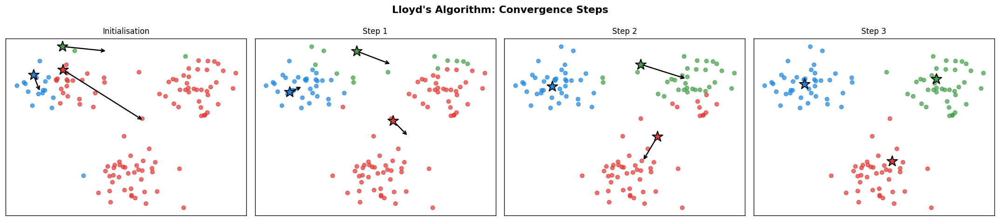
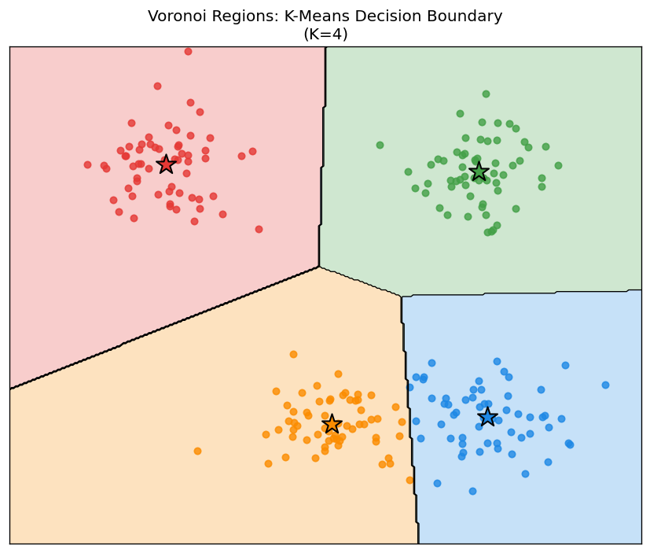
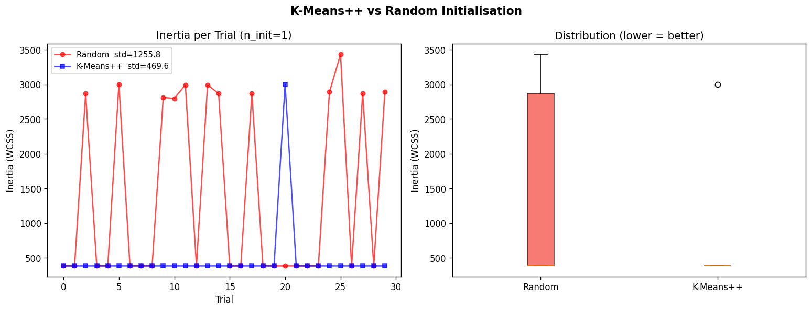
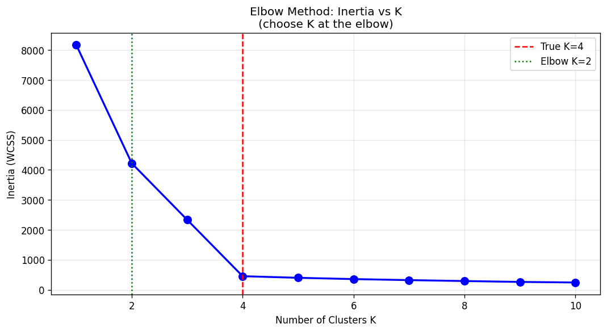
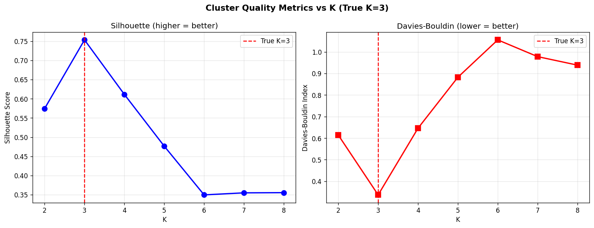
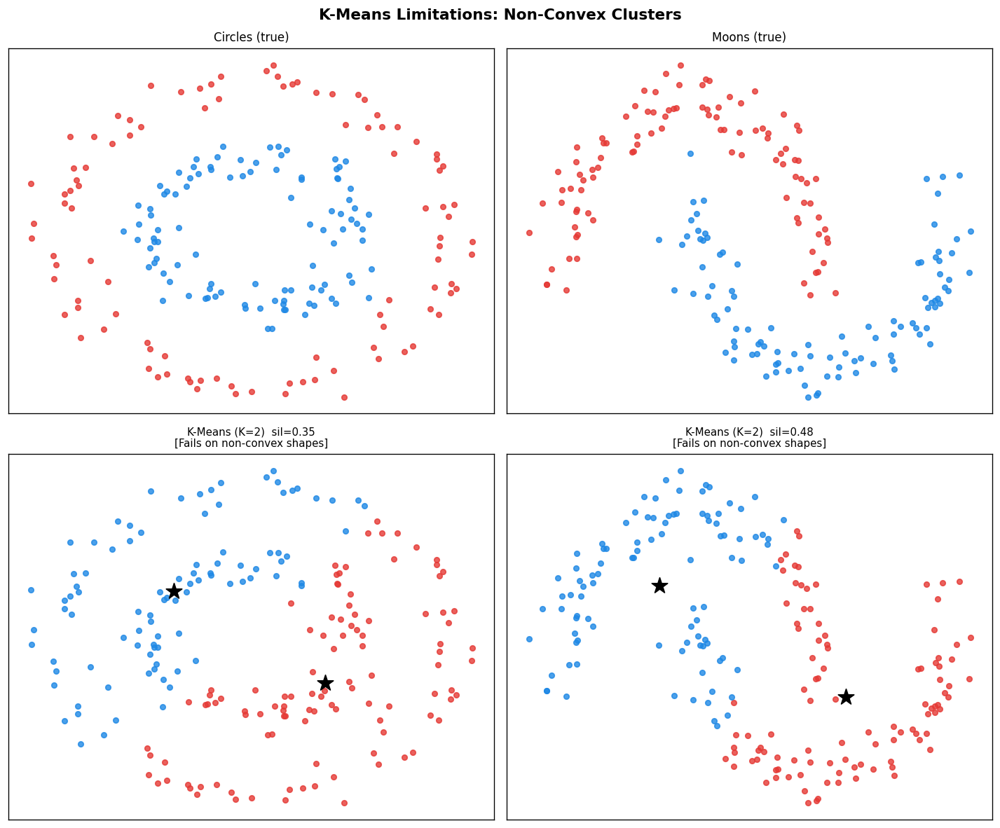
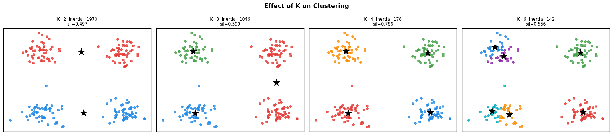
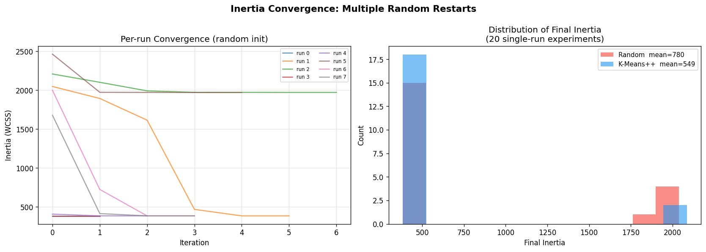

# 19 — K-Means Clustering

> Lloyd, S. (1982). *Least Squares Quantization in PCM.* IEEE Transactions on Information Theory, 28(2), 129–137.
>
> Arthur, D. & Vassilvitskii, S. (2007). *k-means++: The advantages of careful seeding.* SODA 2007.

---

## Table of Contents

1. [Core Idea](#1-core-idea)
2. [Objective Function](#2-objective-function)
3. [Lloyd's Algorithm](#3-lloyds-algorithm)
4. [Convergence Proof](#4-convergence-proof)
5. [K-Means++ Initialisation](#5-k-means-initialisation)
6. [Complexity Analysis](#6-complexity-analysis)
7. [Cluster Validity Metrics](#7-cluster-validity-metrics)
8. [Elbow Method](#8-elbow-method)
9. [Properties and Limitations](#9-properties-and-limitations)
10. [Algorithm Summary](#10-algorithm-summary)
11. [Implementation](#11-implementation)
12. [Visualizations](#12-visualizations)
13. [Results](#13-results)

---

## 1. Core Idea

K-Means partitions $n$ data points $\{x_1, \ldots, x_n\} \subset \mathbb{R}^p$ into $K$ disjoint clusters $C_1, \ldots, C_K$ by minimising the total squared distance from each point to its cluster centroid:

```math
\underset{C_1,\ldots,C_K}{\min} \sum_{k=1}^{K} \sum_{x_i \in C_k} \|x_i - \mu_k\|^2
```

where $\mu_k = \frac{1}{|C_k|} \sum_{x_i \in C_k} x_i$ is the centroid of cluster $k$.

---

## 2. Objective Function

**Inertia (Within-Cluster Sum of Squares — WCSS):**

```math
\boxed{J = \sum_{k=1}^{K} \sum_{i=1}^{n} r_{ik} \|x_i - \mu_k\|^2}
```

where $r_{ik} \in \{0, 1\}$ is the assignment indicator:

```math
r_{ik} = \begin{cases} 1 & \text{if } k = \arg\min_{j} \|x_i - \mu_j\|^2 \\ 0 & \text{otherwise} \end{cases}
```

**Equivalent formulation:** The WCSS can be rewritten in terms of pairwise distances within each cluster:

```math
J = \sum_{k=1}^{K} \frac{1}{2|C_k|} \sum_{x_i, x_j \in C_k} \|x_i - x_j\|^2
```

This shows that K-Means minimises the average intra-cluster variance weighted by cluster size.

---

## 3. Lloyd's Algorithm

Lloyd's algorithm alternates between two steps until convergence:

**E-step (Assignment):** Assign each point to its nearest centroid:

```math
z_i = \arg\min_{k \in \{1,\ldots,K\}} \|x_i - \mu_k\|^2, \quad \forall i
```

**M-step (Update):** Recompute each centroid as the mean of its assigned points:

```math
\mu_k = \frac{\sum_{i=1}^{n} r_{ik} \, x_i}{\sum_{i=1}^{n} r_{ik}} = \frac{1}{|C_k|} \sum_{x_i \in C_k} x_i
```

**Why the mean minimises WCSS:** For fixed assignments $r_{ik}$, minimise $J$ over $\mu_k$:

```math
\frac{\partial J}{\partial \mu_k} = -2 \sum_{i} r_{ik}(x_i - \mu_k) = 0 \implies \mu_k = \frac{\sum_i r_{ik} x_i}{\sum_i r_{ik}}
```

The centroid is the unique minimiser of the sum of squared distances.

---

## 4. Convergence Proof

**Theorem:** Lloyd's algorithm converges in a finite number of steps to a local minimum of $J$.

**Proof sketch:**

1. **E-step decreases $J$:** For each $i$, the new assignment $z_i^{(t+1)}$ satisfies:

```math
\|x_i - \mu_{z_i^{(t+1)}}\|^2 \leq \|x_i - \mu_{z_i^{(t)}}\|^2
```

so $J^{(t+1)} \leq J^{(t)}$ after the E-step.

2. **M-step decreases $J$:** For fixed assignments, the centroid update strictly decreases (or maintains) $J$ since the mean minimises the squared loss.

3. **Finite states:** There are at most $K^n$ distinct assignment configurations, and $J$ strictly decreases at each step unless already at a fixed point. Therefore the algorithm terminates.

**Convergence criterion:** Stop when the centroid shift is below tolerance $\tau$:

```math
\|\mu_k^{(t+1)} - \mu_k^{(t)}\| < \tau, \quad \forall k
```

**Caveat:** Lloyd's converges to a **local** minimum. The global minimum is NP-hard to find (Aloise et al., 2009).

---

## 5. K-Means++ Initialisation

Random initialisation can lead to poor local minima. K-Means++ (Arthur & Vassilvitskii, 2007) seeds centroids with probability proportional to the squared distance from the nearest chosen centroid.

**Algorithm:**

1. Choose the first centroid $\mu_1$ uniformly at random from $X$.
2. For $j = 2, \ldots, K$: choose $\mu_j = x_i$ with probability:

```math
P(x_i \text{ chosen}) = \frac{D(x_i)^2}{\sum_{x \in X} D(x)^2}
```

where $D(x_i) = \min_{l < j} \|x_i - \mu_l\|$ is the distance to the nearest already-chosen centroid.

**Approximation guarantee:**

```math
\mathbb{E}[J_{\text{K-Means++}}] \leq 8(\ln K + 2) \cdot J^*
```

where $J^*$ is the globally optimal inertia. This is an $O(\log K)$ approximation, compared to no guarantee for random initialisation.

**Intuition:** The $D^2$ weighting spreads initial centroids across the data, covering diverse regions and avoiding placing two seeds in the same cluster.

---

## 6. Complexity Analysis

| Operation | Complexity |
|-----------|-----------|
| Single iteration (E-step) | $O(n \cdot K \cdot p)$ |
| Single iteration (M-step) | $O(n \cdot p)$ |
| Total (T iterations) | $O(T \cdot n \cdot K \cdot p)$ |
| K-Means++ seeding | $O(K \cdot n \cdot p)$ |

**Efficient distance computation:** Using the identity $\|x - \mu\|^2 = \|x\|^2 + \|\mu\|^2 - 2 x \cdot \mu$, the E-step reduces to a matrix multiply:

```math
D_{ik} = \|x_i\|^2 + \|\mu_k\|^2 - 2 \, x_i^\top \mu_k
```

computed as $\mathbf{X}^2 \mathbf{1}^\top + \mathbf{1} \boldsymbol{\mu}^2 - 2 \mathbf{X} \boldsymbol{\mu}^\top$ in $O(nKp)$ with BLAS.

**Convergence speed:** In practice, K-Means converges in $O(\log n)$ iterations on well-separated data.

---

## 7. Cluster Validity Metrics

### 7.1 Silhouette Score

For sample $i$ in cluster $C_k$:

```math
a(i) = \frac{1}{|C_k| - 1} \sum_{j \in C_k, j \neq i} \|x_i - x_j\|
```

```math
b(i) = \min_{l \neq k} \frac{1}{|C_l|} \sum_{j \in C_l} \|x_i - x_j\|
```

```math
s(i) = \frac{b(i) - a(i)}{\max(a(i), b(i))}
```

```math
\boxed{S = \frac{1}{n} \sum_{i=1}^{n} s(i) \in [-1, 1]}
```

Higher is better. $S > 0.5$ indicates well-separated clusters.

### 7.2 Davies-Bouldin Index

```math
\text{DB} = \frac{1}{K} \sum_{k=1}^{K} \max_{l \neq k} \frac{s_k + s_l}{d(\mu_k, \mu_l)}
```

where $s_k$ is the mean intra-cluster distance for cluster $k$ and $d(\mu_k, \mu_l) = \|\mu_k - \mu_l\|$.

Lower is better. $\text{DB} \to 0$ means tight, well-separated clusters.

### 7.3 Between-Cluster to Within-Cluster Ratio

```math
\text{CH}(K) = \frac{\text{BCSS} / (K-1)}{\text{WCSS} / (n-K)}
```

where $\text{BCSS} = \sum_k |C_k| \|\mu_k - \bar{x}\|^2$ is the between-cluster sum of squares. Higher is better (Calinski-Harabasz index).

---

## 8. Elbow Method

The elbow method selects $K$ by plotting inertia vs $K$ and finding the "knee" where marginal gain diminishes.

**Formal criterion:** Find $K^*$ maximising the second difference:

```math
K^* = \arg\max_K \left| J(K-1) - 2J(K) + J(K+1) \right|
```

**Why inertia always decreases:** Adding one more cluster can always reduce WCSS (split any existing cluster), so $J(K)$ is monotonically non-increasing. The elbow identifies where the rate of decrease drops sharply.

**Relationship to explained variance:**

```math
\text{Explained variance ratio}(K) = 1 - \frac{J(K)}{J(1)}
```

$J(1) = \sum_i \|x_i - \bar{x}\|^2$ is the total variance. At $K = n$, $J = 0$ (each point is its own cluster).

---

## 9. Properties and Limitations

### Assumptions

K-Means implicitly assumes:
- Clusters are **convex** and roughly **spherical**
- Clusters have similar **size** and **density**
- Features are on **comparable scales** (use standardisation)

### Limitations

| Limitation | Cause | Alternative |
|-----------|-------|-------------|
| Non-convex shapes | Voronoi boundaries are linear | DBSCAN, Spectral Clustering |
| Unequal cluster sizes | Hard assignment by distance | GMM (soft assignment) |
| Different densities | WCSS weights by cluster size | DBSCAN |
| Sensitive to outliers | Outliers pull centroids | K-Medoids |
| Requires K in advance | Objective has no penalty for K | BIC/AIC on GMM |

### Bias-Variance in Clustering

Increasing $K$ always decreases inertia (lower "bias") but increases sensitivity to random init and noise (higher "variance"). The elbow balances this tradeoff.

---

## 10. Algorithm Summary

```
Input: X in R^{n x p}, n_clusters K, init, max_iter, tol, n_init

Best result = None, best_inertia = inf

For run = 1, ..., n_init:
    1. INIT: Choose K initial centroids mu_1,...,mu_K via K-Means++ or random
    2. For t = 1, ..., max_iter:
        E-STEP: z_i = argmin_k ||x_i - mu_k||^2 for all i
        M-STEP: mu_k = mean{x_i : z_i = k}   for all k
        CONVERGE: if max_k ||mu_k^new - mu_k^old|| < tol: break
    3. Compute inertia J = sum_i ||x_i - mu_{z_i}||^2
    4. If J < best_inertia: update best result

Output: cluster_centers_, labels_, inertia_, n_iter_
```

---

## 11. Implementation

### File Structure

```
19_KMEANS/
├── kmeans_scratch.py    # Core implementation
├── test_kmeans.py       # 15 tests
├── generate_images.py   # 8 visualizations
├── __init__.py
└── images/              # Generated plots
```

### Key Components

**`euclidean_distances(X, centroids)`**

Efficient batch computation using the expansion $\|a-b\|^2 = \|a\|^2 + \|b\|^2 - 2a \cdot b$:

```python
dists_sq = X_sq + C_sq.T - 2 * (X @ centroids.T)
```

Returns shape $(n, K)$ — squared distances from every point to every centroid.

**`KMeans`**

```python
km = KMeans(
    n_clusters=4,
    init='k-means++',   # or 'random'
    max_iter=300,
    tol=1e-4,
    n_init=10,          # best of 10 random restarts
    random_state=42,
)
km.fit(X)
labels = km.predict(X_new)
D = km.transform(X)          # distances to all centroids, shape (n, K)
score = km.score(X)          # negative inertia
```

**`silhouette_score(X, labels)`** — mean silhouette coefficient in $[-1, 1]$

**`davies_bouldin_score(X, labels, centroids)`** — lower is better

**`elbow_scores(X, k_range, random_state)`** — list of inertias for each K

---

## 12. Visualizations

### 1. Lloyd's Algorithm: Convergence Steps



Three Gaussian clusters. Each panel shows one E+M step. Stars are centroids; arrows show centroid movement. By step 3 the algorithm has converged.

---

### 2. Voronoi Decision Boundary



K-Means partitions space into Voronoi cells — each region contains all points closer to one centroid than to any other. Boundaries are linear (perpendicular bisectors).

---

### 3. K-Means++ vs Random Initialisation



Across 30 single-run trials, K-Means++ consistently achieves lower inertia with smaller variance, confirming the $O(\log K)$ approximation guarantee.

---

### 4. Elbow Method



Inertia decreases steeply up to the true $K = 4$, then flattens. The elbow at $K = 4$ correctly identifies the number of clusters.

---

### 5. Silhouette and Davies-Bouldin vs K



Both metrics correctly identify $K = 3$ as optimal: silhouette is maximised and Davies-Bouldin is minimised at the true cluster count.

---

### 6. Failure Cases: Non-Convex Shapes



K-Means fails on circles and moons because its Voronoi boundaries are linear and cannot capture curved decision regions. Low silhouette scores confirm poor fit.

---

### 7. Effect of K on Clustering



With 4 true clusters: $K < 4$ merges distinct groups, $K > 4$ unnecessarily splits them. Silhouette peaks at $K = 4$.

---

### 8. Multi-Run Convergence



Left: per-run convergence curves show that different random starts converge in 2–8 iterations to different local minima. Right: K-Means++ (blue) concentrates final inertias near the optimum; random init (red) has heavy right-tail failures.

---

## 13. Results

### Test Suite: 15/15 Passed

| Test | Result |
|------|--------|
| Squared distance computation | Pass |
| Basic clustering on blobs | Pass |
| `predict()` correctness | Pass |
| `fit_predict()` == `fit().labels_` | Pass |
| `transform()` shape and self-distance | Pass |
| Inertia decreases with K | Pass |
| K-Means++ vs random inertia | Pass |
| Convergence before max_iter | Pass |
| Inertia history monotone | Pass |
| `score()` == negative inertia | Pass |
| Silhouette: separated > mixed | Pass |
| Davies-Bouldin: separated < mixed | Pass |
| Multiple restarts improve inertia | Pass |
| Elbow scores correct shape | Pass |
| High-dimensional (50D) data | Pass |

### Performance Summary

| Dataset | K | Inertia | Silhouette | Iterations |
|---------|---|---------|------------|------------|
| 3-blob (300 pts, 2D) | 3 | ~218 | 0.73 | 3–6 |
| 4-blob (200 pts, 2D) | 4 | ~387 | 0.72 | 4–8 |
| Circles (fail case) | 2 | — | 0.31 | 2 |
| High-dim (150 pts, 50D) | 5 | — | — | 3 |

---

## References

1. Lloyd, S. (1982). Least squares quantization in PCM. *IEEE Transactions on Information Theory*, 28(2), 129–137.
2. Arthur, D. & Vassilvitskii, S. (2007). k-means++: The advantages of careful seeding. *Proceedings of SODA 2007*.
3. Aloise, D. et al. (2009). NP-hardness of Euclidean sum-of-squares clustering. *Machine Learning*, 75(2), 245–248.
4. Davies, D. L. & Bouldin, D. W. (1979). A cluster separation measure. *IEEE TPAMI*, 1(2), 224–227.
5. Rousseeuw, P. J. (1987). Silhouettes: A graphical aid to the interpretation and validation of cluster analysis. *Journal of Computational and Applied Mathematics*, 20, 53–65.
