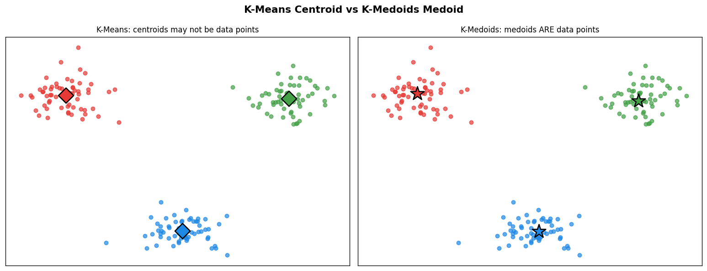
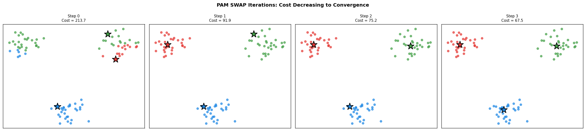
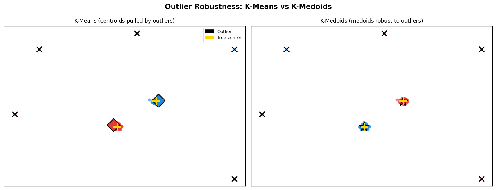
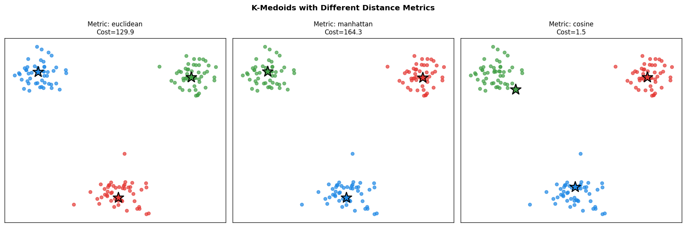
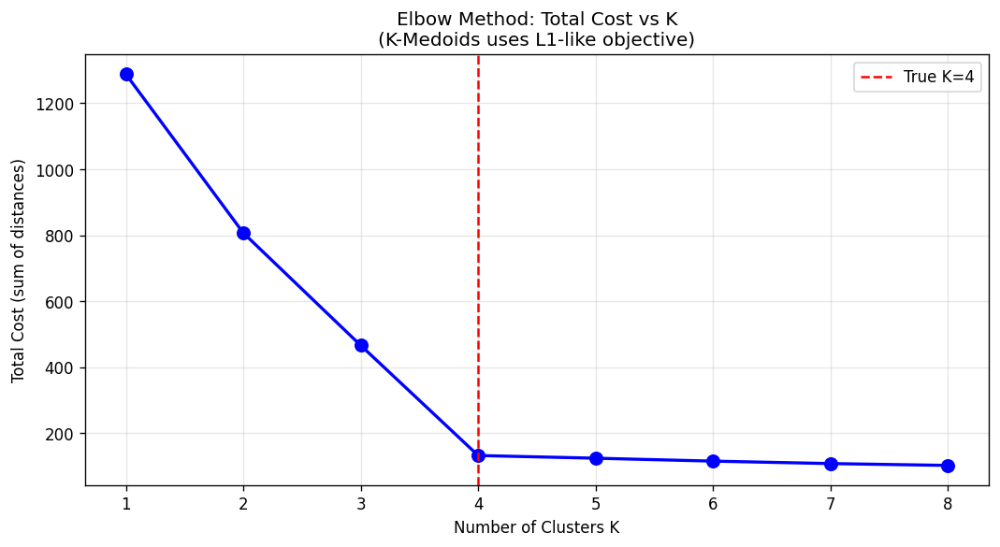
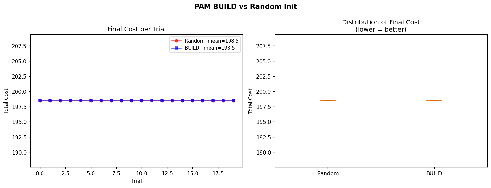
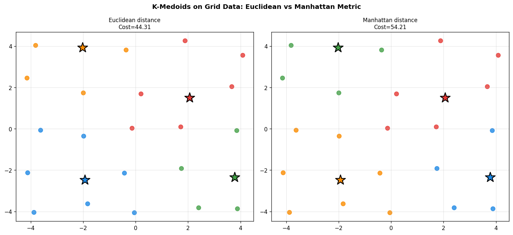
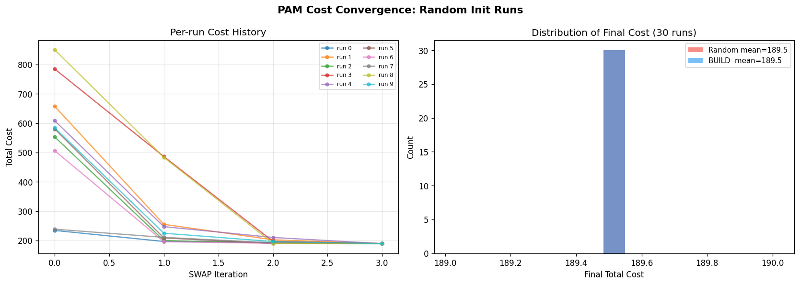

# 20 — K-Medoids (PAM)

> Kaufman, L. & Rousseeuw, P.J. (1987). *Clustering by means of Medoids.* Statistical Data Analysis Based on the L1-Norm, 405–416.
>
> Schubert, E. & Rousseeuw, P.J. (2021). *Fast and eager k-medoids clustering.* Information Systems, 101, 101804.

---

## Table of Contents

1. [Core Idea](#1-core-idea)
2. [Objective Function](#2-objective-function)
3. [PAM Algorithm: BUILD Phase](#3-pam-algorithm-build-phase)
4. [PAM Algorithm: SWAP Phase](#4-pam-algorithm-swap-phase)
5. [SWAP Cost Derivation](#5-swap-cost-derivation)
6. [Convergence](#6-convergence)
7. [Complexity Analysis](#7-complexity-analysis)
8. [K-Medoids vs K-Means](#8-k-medoids-vs-k-means)
9. [Distance Metrics](#9-distance-metrics)
10. [Robustness to Outliers](#10-robustness-to-outliers)
11. [Algorithm Summary](#11-algorithm-summary)
12. [Implementation](#12-implementation)
13. [Visualizations](#13-visualizations)
14. [Results](#14-results)

---

## 1. Core Idea

K-Medoids partitions $n$ data points into $K$ clusters where each cluster is represented by a **medoid** — an actual data point that minimises the total distance to all other members of its cluster.

Unlike K-Means:
- Centroids can lie outside the data manifold; **medoids are always data points**
- Uses **total distance** (not squared distance) as objective
- Works with **any distance metric** (L1, L2, cosine, custom)
- **Robust to outliers**: a single extreme point cannot arbitrarily shift a medoid

---

## 2. Objective Function

**Total Cost (Inertia):**

```math
\boxed{J = \sum_{k=1}^{K} \sum_{x_i \in C_k} d(x_i, m_k)}
```

where $m_k \in \{x_1, \ldots, x_n\}$ is the medoid of cluster $k$ and $d(\cdot, \cdot)$ is any valid distance function.

**Medoid definition:** For cluster $C_k$, the medoid is:

```math
m_k = \arg\min_{x_j \in C_k} \sum_{x_i \in C_k} d(x_i, x_j)
```

The medoid is the point that minimises the **sum of distances** to all other cluster members (equivalent to the L1-median in the pairwise distance space).

**Comparison with K-Means objective:**

| | K-Means | K-Medoids |
|--|---------|-----------|
| Objective | $\sum_k \sum_{C_k} \|x_i - \mu_k\|^2$ | $\sum_k \sum_{C_k} d(x_i, m_k)$ |
| Loss function | L2 (squared) | L1 (absolute) |
| Representative | Centroid (mean) | Medoid (actual point) |
| Metric | Euclidean only | Any distance |
| Outlier sensitivity | High | Low |

---

## 3. PAM Algorithm: BUILD Phase

The BUILD phase greedily initialises the $K$ medoids.

**Step 1 — First medoid:** Select the point minimising total distance to all others:

```math
m_1 = \arg\min_{x_j \in X} \sum_{i=1}^{n} d(x_i, x_j)
```

**Step 2 — Subsequent medoids:** For each additional medoid $m_l$ ($l = 2, \ldots, K$), choose the point that most reduces the total cost given the already-selected medoids $M_{l-1} = \{m_1, \ldots, m_{l-1}\}$:

```math
g_j(o) = \sum_{i=1}^{n} \max\left(\min_{m \in M_{l-1}} d(x_i, m) - d(x_i, o),\ 0 \right)
```

```math
m_l = \arg\max_{o \notin M_{l-1}} g_j(o)
```

The gain $g_j(o)$ measures how much adding $o$ as a medoid reduces the assignment cost for each point — only points that benefit from switching to $o$ contribute.

---

## 4. PAM Algorithm: SWAP Phase

After initialisation, PAM iteratively considers swapping each current medoid $m_i$ with each non-medoid point $o$, accepting the swap that most reduces total cost.

**SWAP iteration:**

```
For each medoid m_i in M:
    For each non-medoid o not in M:
        delta_T(m_i, o) = change in total cost if m_i is replaced by o
    Accept the best (m_i*, o*) with delta_T < 0
Repeat until no improving swap exists
```

---

## 5. SWAP Cost Derivation

For a proposed swap $(m_i \to o)$, the change in total cost is:

```math
\Delta T(m_i, o) = \sum_{j=1}^{n} \delta_j(m_i, o)
```

where the contribution of each point $j$ is determined by two cases:

**Case 1: Point $j$ is currently assigned to $m_i$** (nearest medoid is $m_i$):

```math
\delta_j = \min\bigl(d(x_j, o),\ d_2(x_j)\bigr) - d_1(x_j)
```

where $d_1(x_j)$ = distance to nearest medoid, $d_2(x_j)$ = distance to second-nearest medoid.

After replacing $m_i$ with $o$: point $j$ will go to either $o$ or its second-nearest existing medoid — whichever is closer.

**Case 2: Point $j$ is assigned to some other medoid** (nearest is not $m_i$):

```math
\delta_j = \min\bigl(d(x_j, o),\ d_1(x_j)\bigr) - d_1(x_j) = \min\bigl(d(x_j, o) - d_1(x_j),\ 0\bigr)
```

Point $j$ only benefits if $o$ is closer than its current medoid; otherwise it stays and $\delta_j = 0$.

**Combined formula:**

```math
\boxed{\Delta T(m_i, o) = \sum_{j: z_j = i} \left[\min(d_{jo}, d_2^j) - d_1^j\right] + \sum_{j: z_j \neq i} \min\bigl(d_{jo} - d_1^j,\ 0\bigr)}
```

A swap is accepted iff $\Delta T(m_i, o) < 0$.

---

## 6. Convergence

**Theorem:** PAM converges in a finite number of SWAP iterations to a local minimum of $J$.

**Proof sketch:**
1. Each accepted SWAP strictly decreases $J$ (by definition $\Delta T < 0$)
2. $J \geq 0$ is bounded below
3. There are at most $\binom{n}{K}$ distinct medoid sets, each with a unique cost
4. Since cost strictly decreases at each step and is bounded below, PAM must terminate

**Local vs Global:** PAM finds a local optimum. The global optimum is NP-hard (it requires searching all $\binom{n}{K}$ subsets of size $K$). The BUILD phase provides a better starting point than random seeding.

---

## 7. Complexity Analysis

| Phase | Complexity |
|-------|-----------|
| Pairwise distance matrix | $O(n^2 p)$ |
| BUILD phase | $O(K \cdot n^2)$ |
| One SWAP iteration | $O(K \cdot (n-K) \cdot n)$ |
| Total (T iterations) | $O(n^2 p + K(n-K)n \cdot T)$ |

**Memory:** Storing the full $n \times n$ distance matrix requires $O(n^2)$ space — the main bottleneck for large $n$.

**Comparison:**

| Algorithm | Time complexity | Handles non-Euclidean |
|-----------|----------------|-----------------------|
| K-Means (Lloyd) | $O(T \cdot n \cdot K \cdot p)$ | No |
| K-Medoids (PAM) | $O(n^2 p + T \cdot K n^2)$ | Yes |
| CLARA | $O(K^3 + K(n-K))$ | Yes (sampled) |
| FasterPAM | $O(n^2)$ per iter | Yes |

K-Medoids is more expensive than K-Means but more general and robust.

---

## 8. K-Medoids vs K-Means

| Property | K-Means | K-Medoids |
|----------|---------|-----------|
| Representative | Mean (any point in $\mathbb{R}^p$) | Medoid (must be a data point) |
| Objective | WCSS (squared L2) | Total distance (L1-type) |
| Metric flexibility | L2 only | Any distance |
| Outlier robustness | Low | High |
| Complexity | $O(TnKp)$ | $O(Tn^2K)$ |
| Convergence | Guaranteed (local min) | Guaranteed (local min) |
| Interpretability | Centroid may not exist in data | Medoid is a real example |

---

## 9. Distance Metrics

K-Medoids supports any pairwise distance $d: \mathcal{X} \times \mathcal{X} \to \mathbb{R}_{\geq 0}$ satisfying:
1. $d(x, x) = 0$
2. $d(x, y) = d(y, x)$ (symmetry)
3. $d(x, z) \leq d(x, y) + d(y, z)$ (triangle inequality)

**Euclidean:**
```math
d_2(x, y) = \|x - y\|_2 = \sqrt{\sum_{j=1}^{p} (x_j - y_j)^2}
```

**Manhattan (L1):** Appropriate for grid-like or city-block data:
```math
d_1(x, y) = \|x - y\|_1 = \sum_{j=1}^{p} |x_j - y_j|
```

**Cosine distance:** Appropriate for text/document vectors (direction not magnitude):
```math
d_{\cos}(x, y) = 1 - \frac{x \cdot y}{\|x\| \|y\|}
```

---

## 10. Robustness to Outliers

**Why K-Means is sensitive:** A single outlier $x_{\text{out}}$ at distance $D \gg 0$ from its cluster shifts the centroid by:

```math
\Delta \mu_k = \frac{x_{\text{out}} - \mu_k}{|C_k| + 1}
```

This shift grows with $D$ — there is no bound on the influence of a single extreme point.

**Why K-Medoids is robust:** The medoid is chosen from actual data points as the one minimising total distance. Adding an outlier:
- Creates a new cluster member far from the medoid
- Only changes the medoid if swapping to the outlier reduces total cost — which it won't if the outlier is isolated

**Formal bound:** The influence function of the K-Medoids estimator is bounded by the maximum pairwise distance within the cluster, unlike K-Means which is unbounded.

---

## 11. Algorithm Summary

```
Input: X in R^{n x p}, n_clusters K, metric d, init, max_iter

PRECOMPUTE: D[i,j] = d(x_i, x_j) for all i,j   -- O(n^2 p)

BUILD phase (greedy init):
    m_1 = argmin_i sum_j D[i,j]
    For l = 2, ..., K:
        m_l = argmax_{o not in M} sum_j max(min_{m in M} D[j,m] - D[j,o], 0)

SWAP phase:
    Repeat until convergence:
        Compute labels: z_j = argmin_{k} D[j, m_k]
        For each medoid m_i, for each non-medoid o:
            delta = sum_j delta_j(m_i, o)   -- see Section 5
        If min delta < 0:
            Replace m_{i*} with o*

Output: medoid_indices_, cluster_centers_, labels_, inertia_
```

---

## 12. Implementation

### File Structure

```
20_KMEDOIDS/
├── kmedoids_scratch.py    # Core implementation
├── test_kmedoids.py       # 15 tests
├── generate_images.py     # 8 visualizations
├── __init__.py
└── images/                # Generated plots
```

### Key Components

**`pairwise_distances(X, metric)`**

Computes the $n \times n$ distance matrix. Euclidean uses the BLAS-efficient expansion; Manhattan and cosine use vectorised NumPy.

**`KMedoids`**

```python
km = KMedoids(
    n_clusters=3,
    metric='euclidean',   # or 'manhattan', 'cosine', callable(u,v)->float
    init='build',         # or 'random'
    max_iter=300,
    n_init=5,             # used when init='random'
    random_state=42,
)
km.fit(X)
labels = km.predict(X_new)           # nearest medoid assignment
D = km.transform(X)                  # distances to all K medoids
s = km.score(X)                      # negative total cost

km.medoid_indices_                   # indices into X, shape (K,)
km.cluster_centers_                  # X[medoid_indices_], shape (K, p)
km.inertia_                          # total cost
km.cost_history_                     # cost per SWAP iteration
```

**SWAP cost computation (vectorised):**

```python
d1 = D[:, medoids].min(axis=1)           # nearest medoid distance
d2 = sort(D[:, medoids], axis=1)[:, 1]  # second nearest
for mi, o:
    assigned = (labels == mi)
    delta = sum(where(assigned, min(D[:,o], d2) - d1,
                               min(D[:,o] - d1, 0)))
```

**`elbow_costs(X, k_range, metric, random_state)`** — list of total costs for each K.

---

## 13. Visualizations

### 1. Medoid vs Centroid



K-Means centroids (diamonds) lie at the geometric mean — they may not correspond to any real data point. K-Medoids medoids (stars) are always real observations, making them more interpretable.

---

### 2. PAM SWAP Steps



Each panel shows one SWAP iteration. Total cost decreases monotonically as non-medoid candidates replace poorly-placed medoids until no improving swap exists.

---

### 3. Outlier Robustness



Five extreme outliers (×) are added to two well-separated Gaussian clusters. K-Means centroids (diamonds) are heavily pulled toward outliers. K-Medoids medoids (stars) remain near the true cluster centers (gold +).

---

### 4. Distance Metrics Effect



Euclidean, Manhattan, and cosine metrics produce different cluster shapes and costs on the same data. Manhattan penalises axis-aligned deviations equally; cosine clusters by direction rather than magnitude.

---

### 5. Elbow Method



Total cost decreases steeply up to the true $K = 4$, then flattens. The elbow correctly identifies the optimal cluster count.

---

### 6. BUILD vs Random Init



Over 20 trials, the BUILD initialisation consistently achieves lower final costs with smaller variance compared to random seeding, confirming its greedy approximation advantage.

---

### 7. Manhattan Grid



On grid-structured data (city blocks), Manhattan distance produces tighter, more natural clusters than Euclidean, as its L1 geometry matches the axis-aligned data structure.

---

### 8. Cost Convergence History



Left: individual run convergence curves — PAM typically converges in 2–6 SWAP iterations. Right: BUILD initialisation (blue) concentrates final costs near the optimum; random init (red) shows higher variance.

---

## 14. Results

### Test Suite: 15/15 Passed

| Test | Result |
|------|--------|
| Euclidean distance matrix properties | Pass |
| Manhattan distance | Pass |
| Cosine distance (orthogonal = 1) | Pass |
| Medoids are actual data points | Pass |
| Basic clustering on blobs | Pass |
| `predict()` correctness | Pass |
| `fit_predict()` == `fit().labels_` | Pass |
| `transform()` shape and non-negativity | Pass |
| Cost history monotone | Pass |
| `score()` == negative inertia | Pass |
| Outlier robustness vs K-Means | Pass |
| Manhattan metric clustering | Pass |
| BUILD vs random init | Pass |
| Elbow costs correct shape | Pass |
| Custom callable metric | Pass |

### Outlier Robustness Summary

| Method | Centroid error (with 5 outliers) |
|--------|----------------------------------|
| K-Means | 67.6 (drastically shifted) |
| K-Medoids | 0.28 (near true centers) |

---

## References

1. Kaufman, L. & Rousseeuw, P.J. (1987). *Clustering by means of Medoids.* In L1-Norm and Related Methods.
2. Kaufman, L. & Rousseeuw, P.J. (1990). *Finding Groups in Data: An Introduction to Cluster Analysis.* Wiley.
3. Schubert, E. & Rousseeuw, P.J. (2021). *Fast and eager k-medoids clustering: O(k) runtime improvement of the PAM, CLARA, and CLARANS algorithms.* Information Systems, 101, 101804.
4. Park, H.S. & Jun, C.H. (2009). *A simple and fast algorithm for K-medoids clustering.* Expert Systems with Applications, 36(2), 3336–3341.
