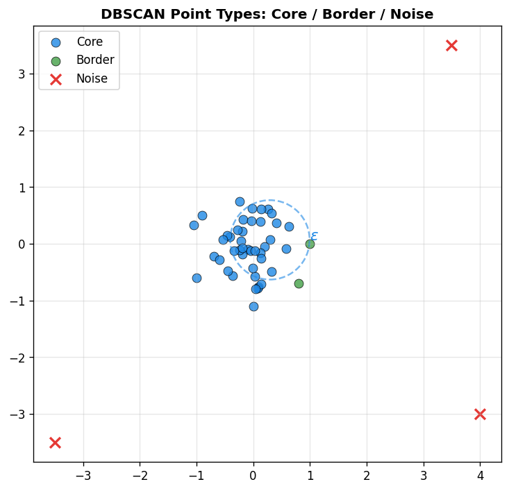
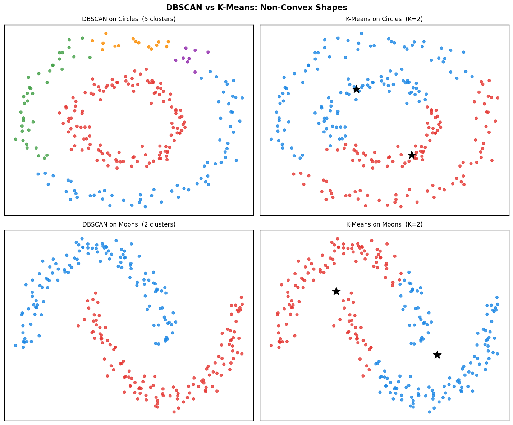
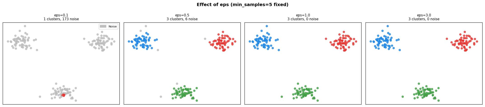
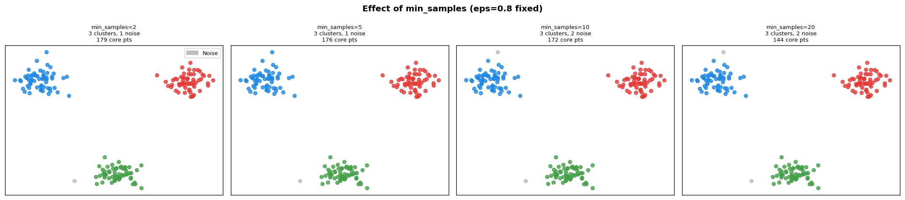
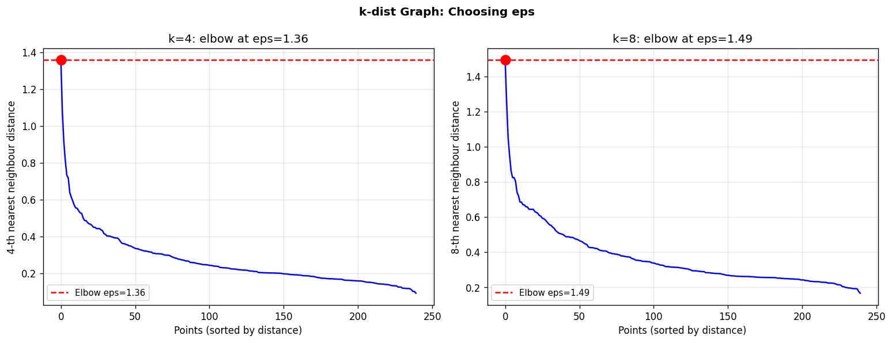
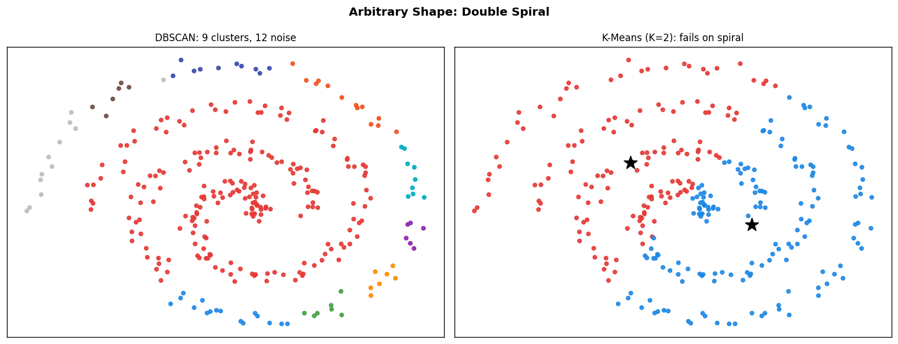
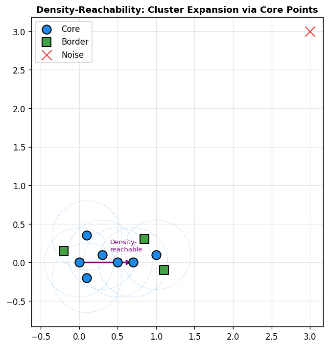
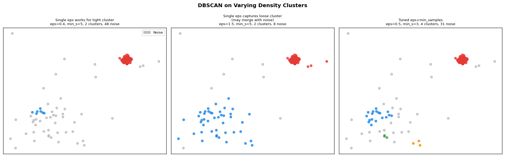

# 21 — DBSCAN (Density-Based Spatial Clustering of Applications with Noise)

> Ester, M., Kriegel, H.P., Sander, J. & Xu, X. (1996). *A density-based algorithm for discovering clusters in large spatial databases with noise.* KDD-96, 226–231.

---

## Table of Contents

1. [Motivation and Core Idea](#1-motivation-and-core-idea)
2. [Formal Definitions](#2-formal-definitions)
3. [Point Classification](#3-point-classification)
4. [Density-Reachability: Formal Properties](#4-density-reachability-formal-properties)
5. [Cluster Definition and Uniqueness](#5-cluster-definition-and-uniqueness)
6. [DBSCAN Algorithm and BFS Correctness](#6-dbscan-algorithm-and-bfs-correctness)
7. [Worked Example: Step-by-Step Trace](#7-worked-example-step-by-step-trace)
8. [Connection to Level-Set Density Estimation](#8-connection-to-level-set-density-estimation)
9. [Statistical Interpretation: OOB Rate and Noise Fraction](#9-statistical-interpretation-noise-fraction)
10. [Parameter Selection: Deep Analysis](#10-parameter-selection-deep-analysis)
11. [Complexity Analysis](#11-complexity-analysis)
12. [OPTICS: Ordering Points to Identify Clustering Structure](#12-optics)
13. [HDBSCAN: Hierarchical Extension](#13-hdbscan-hierarchical-extension)
14. [DBSCAN vs K-Means vs K-Medoids](#14-dbscan-vs-k-means-vs-k-medoids)
15. [Limitations and Failure Cases](#15-limitations-and-failure-cases)
16. [Algorithm Summary](#16-algorithm-summary)
17. [Implementation](#17-implementation)
18. [Visualizations](#18-visualizations)
19. [Results](#19-results)

---

## 1. Motivation and Core Idea

Classical clustering algorithms like K-Means assume clusters are **convex and isotropic** (spherical in feature space). Real data rarely satisfies this:

- Geographic clusters follow roads and coastlines (non-convex)
- Astronomical objects form filaments and walls (1D manifolds in 3D space)
- Medical imaging data contains irregular regions of interest

DBSCAN (Density-Based Spatial Clustering of Applications with Noise) replaces the geometric assumption with a **density assumption**: a cluster is a region where points are densely packed, separated from other dense regions by sparse areas.

**Intuition:** Think of points as cities on a map. A cluster is a metropolitan area — a dense agglomeration of cities. The surrounding countryside (sparse regions) is noise. The shape of the metropolitan area is arbitrary; what matters is local density.

**Two parameters** define "dense":
- $\varepsilon$ — the neighbourhood radius (how far to look for neighbours)
- $\text{MinPts}$ — the minimum number of neighbours to be considered locally dense

**Key advantages over K-Means:**

| Requirement | K-Means | DBSCAN |
|-------------|---------|--------|
| Specify $K$ | Yes | No |
| Convex clusters | Required | Not required |
| Outlier handling | None | Native (noise label) |
| Distance metric | L2 only | Any |

---

## 2. Formal Definitions

Let $D = \{x_1, \ldots, x_n\} \subset \mathbb{R}^p$ be the dataset and $d: \mathbb{R}^p \times \mathbb{R}^p \to \mathbb{R}_{\geq 0}$ a distance function.

### 2.1 $\varepsilon$-Neighbourhood

```math
N_\varepsilon(p) = \{ q \in D \mid d(p, q) \leq \varepsilon \}
```

Note: $p \in N_\varepsilon(p)$ always (since $d(p,p) = 0 \leq \varepsilon$). So $|N_\varepsilon(p)| \geq 1$.

### 2.2 Core Point

$p \in D$ is a **core point** with respect to $(\varepsilon, \text{MinPts})$ if:

```math
|N_\varepsilon(p)| \geq \text{MinPts}
```

### 2.3 Directly Density-Reachable

$q$ is **directly density-reachable** from $p$ (written $p \to q$) if:

```math
p \text{ is a core point} \quad \text{and} \quad q \in N_\varepsilon(p)
```

Direct density-reachability is **not symmetric**: if $q$ is a border point (not a core point), then $p \to q$ does not imply $q \to p$.

### 2.4 Density-Reachable

$q$ is **density-reachable** from $p$ if there exists a chain:

```math
p = p_1 \to p_2 \to \cdots \to p_l = q
```

where each $p_{i+1}$ is directly density-reachable from $p_i$, and $p_1, \ldots, p_{l-1}$ are all core points.

Note: only $p_l = q$ may be a non-core (border) point.

### 2.5 Density-Connected

$p$ and $q$ are **density-connected** (written $p \sim q$) if there exists a point $o \in D$ such that both $p$ and $q$ are density-reachable from $o$:

```math
\exists\, o \in D : \quad p \text{ density-reachable from } o \quad \text{and} \quad q \text{ density-reachable from } o
```

Density-connectivity is **symmetric by definition** (the witnesses for $p$ and $q$ are both reachable from $o$).

---

## 3. Point Classification

Given $(\varepsilon, \text{MinPts})$, every point in $D$ falls into exactly one of three categories:

### 3.1 Core Point

```math
\text{Core}(p) \iff |N_\varepsilon(p)| \geq \text{MinPts}
```

Core points form the skeleton of clusters — they have enough local neighbours to define a dense region. Every core point belongs to at least one cluster.

### 3.2 Border Point

```math
\text{Border}(p) \iff |N_\varepsilon(p)| < \text{MinPts} \quad \text{and} \quad \exists\, q \in D : q \text{ is a core point and } p \in N_\varepsilon(q)
```

Border points lie on the periphery of a cluster. They are reachable from a core point but cannot themselves seed further expansion.

### 3.3 Noise Point

```math
\text{Noise}(p) \iff \text{not Core}(p) \quad \text{and} \quad \text{not Border}(p)
```

Noise points are not density-reachable from any core point. They receive label $-1$.

**The three types partition $D$:** Every point is either core, border, or noise — no point can be two types simultaneously (provable by contradiction from the definitions).

### 3.4 Border Point Ambiguity

A border point may be reachable from multiple clusters. In this case, it is assigned to whichever cluster's core point discovers it first during BFS. This is the only source of non-determinism in DBSCAN — cluster assignments for border points may differ across runs with different point orderings, but core point assignments are always unique.

---

## 4. Density-Reachability: Formal Properties

### 4.1 Asymmetry of Direct Density-Reachability

**Claim:** Direct density-reachability is not symmetric in general.

**Proof:** Let $p$ be a core point and $q$ a border point with $q \in N_\varepsilon(p)$. Then $q$ is directly density-reachable from $p$. However, $q$ is not a core point, so $q$ cannot be the source of any direct density-reachability. Therefore $p$ is NOT directly density-reachable from $q$. $\square$

### 4.2 Symmetry of Density-Connectivity

**Claim:** Density-connectivity is symmetric.

**Proof:** Suppose $p \sim q$ via witness $o$ (both density-reachable from $o$). By definition, $q \sim p$ via the same witness $o$. $\square$

### 4.3 Transitivity Among Core Points

**Claim:** If $p$ and $q$ are both core points with $p \in N_\varepsilon(q)$, then density-reachability from $p$ and from $q$ have the same transitive closure (they belong to the same cluster).

**Proof:** Since $p \in N_\varepsilon(q)$ and $q$ is a core point, $p$ is directly density-reachable from $q$. Since $q \in N_\varepsilon(p)$ and $p$ is a core point, $q$ is directly density-reachable from $p$. So $p$ and $q$ are mutually density-reachable, hence density-connected. All points reachable from $p$ and all points reachable from $q$ form a single density-connected set. $\square$

### 4.4 Cluster Boundary Theorem

**Theorem:** For a cluster $C$ with core points $M_C = \{m \in C : \text{Core}(m)\}$:

```math
C = \bigcup_{m \in M_C} N_\varepsilon(m) \cap D
```

**Proof sketch:** Every point in $C$ is density-reachable from some core point $m$ via a chain through the cluster. All chain links land in $N_\varepsilon$ of the preceding core point. The union of all core point neighbourhoods thus covers $C$. Conversely, every $q \in N_\varepsilon(m)$ for a core $m \in C$ is directly density-reachable from $m$, hence in $C$ by maximality. $\square$

---

## 5. Cluster Definition and Uniqueness

### 5.1 Formal Cluster Definition

A non-empty subset $C \subseteq D$ is a **cluster** with respect to $(\varepsilon, \text{MinPts})$ if:

1. **Connectivity:** $\forall p, q \in C: p \sim q$ (all pairs density-connected)

2. **Maximality:** $\forall p \in C,\, q \in D: p \sim q \implies q \in C$

### 5.2 Existence and Uniqueness of the Partition

**Theorem:** The density-connectivity relation $\sim$ on core points is an equivalence relation, and its equivalence classes (plus all points density-reachable from each class) form the unique cluster partition.

**Proof:**

- **Reflexivity:** Every core point $p$ is density-reachable from itself (trivial chain of length 1), so $p \sim p$.
- **Symmetry:** Shown in Section 4.2.
- **Transitivity:** If $p \sim q$ via witness $o_1$ and $q \sim r$ via witness $o_2$, then $q$ is density-reachable from both $o_1$ and $o_2$. Since $q$ is in the cluster seeded by $o_1$, and $o_2$ must also be in that cluster (by maximality), $r$ is density-reachable from $o_1$. So $p \sim r$. $\square$

The equivalence classes of core points, extended by their border points, produce the final clusters. The partition is unique up to border point assignment (border points at the boundary of two clusters have an ambiguous assignment).

### 5.3 Number of Clusters

The number of clusters $K$ equals the number of connected components of the **core-point graph** $G = (V, E)$ where:
- $V = \{p \in D : \text{Core}(p)\}$
- $E = \{(p,q) : d(p,q) \leq \varepsilon\}$

$K$ is not specified in advance — it is determined entirely by the data density structure under $(\varepsilon, \text{MinPts})$.

---

## 6. DBSCAN Algorithm and BFS Correctness

### 6.1 Full Algorithm

```
Input:  D = {x_1,...,x_n}, eps, MinPts, metric d
Output: labels[1..n] in {-1, 0, 1, ..., K-1}

Precompute: D_mat[i,j] = d(x_i, x_j) for all i,j

labels = [UNVISITED] * n
cluster_id = 0

For i = 0, ..., n-1:
    If labels[i] != UNVISITED: continue

    nbrs = {j : D_mat[i,j] <= eps}           // N_eps(x_i)

    If |nbrs| < MinPts:
        labels[i] = NOISE                     // tentative; may be promoted later
        continue

    // x_i is a core point — start new cluster
    labels[i] = cluster_id
    Queue = deque(nbrs \ {i})

    While Queue not empty:
        j = Queue.popleft()

        If labels[j] == NOISE:
            labels[j] = cluster_id            // promote noise to border
            continue                          // border points don't expand

        If labels[j] != UNVISITED:
            continue                          // already in a cluster

        labels[j] = cluster_id
        j_nbrs = {q : D_mat[j,q] <= eps}

        If |j_nbrs| >= MinPts:               // j is also a core point
            for q in j_nbrs:
                if labels[q] in {UNVISITED, NOISE}:
                    Queue.append(q)

    cluster_id += 1
```

### 6.2 Correctness of BFS Expansion

**Claim:** The BFS expansion from a core point $p$ labels exactly the set of all points density-reachable from $p$.

**Proof by induction on chain length:**

- **Base case:** All points in $N_\varepsilon(p)$ are directly density-reachable from $p$ (chain length 1). The BFS seeds the queue with exactly these points.

- **Inductive step:** Suppose all points with density-reachability chain of length $\leq l$ from $p$ are labelled. When BFS processes a core point $q$ at chain length $l$, it adds all points in $N_\varepsilon(q)$ to the queue. Each such point $r$ has a chain $p \to \cdots \to q \to r$ of length $l+1$ — it is density-reachable from $p$.

- **Termination:** The queue can contain each point at most once (points transition from UNVISITED to labelled exactly once). With $n$ points, the BFS terminates in at most $n$ dequeue operations.

- **No false positives:** Only points with a valid density-reachability chain from $p$ are enqueued, since each enqueue step requires either direct reachability from $p$ (base case) or reachability via a core point already in the cluster (inductive step). $\square$

### 6.3 Why Noise Points Are Promoted

When the BFS dequeues a point previously labelled NOISE, it becomes a border point of the current cluster. This is correct: the point was initially processed and found to have fewer than MinPts neighbours, but it lies within $\varepsilon$ of a core point of the new cluster — making it a legitimate border point.

---

## 7. Worked Example: Step-by-Step Trace

Consider 7 points in 1D with $\varepsilon = 1.5$, MinPts $= 3$:

```
Index:  0    1    2    3    4    5    6
Value:  0.0  0.5  1.0  5.0  5.5  6.0  10.0
```

**Pairwise distances (absolute):**

| | 0 | 1 | 2 | 3 | 4 | 5 | 6 |
|-|---|---|---|---|---|---|---|
|0| 0.0|0.5|1.0|5.0|5.5|6.0|10.0|
|1| 0.5|0.0|0.5|4.5|5.0|5.5|9.5|
|2| 1.0|0.5|0.0|4.0|4.5|5.0|9.0|
|3| 5.0|4.5|4.0|0.0|0.5|1.0|5.0|
|4| 5.5|5.0|4.5|0.5|0.0|0.5|4.5|
|5| 6.0|5.5|5.0|1.0|0.5|0.0|4.0|
|6|10.0|9.5|9.0|5.0|4.5|4.0|0.0|

**Neighbourhoods** ($d \leq 1.5$):

```
N(0) = {0,1,2}      |N(0)| = 3 >= 3  → CORE
N(1) = {0,1,2}      |N(1)| = 3 >= 3  → CORE
N(2) = {0,1,2}      |N(2)| = 3 >= 3  → CORE
N(3) = {3,4,5}      |N(3)| = 3 >= 3  → CORE
N(4) = {3,4,5}      |N(4)| = 3 >= 3  → CORE
N(5) = {3,4,5}      |N(5)| = 3 >= 3  → CORE
N(6) = {6}          |N(6)| = 1 < 3   → NOISE
```

**BFS trace:**

- **i=0:** labels[0]=UNVISITED, N(0)={0,1,2}, |N|=3 ≥ 3 → core. Label 0 with cluster 0. Queue = {1,2}.
  - Dequeue 1: UNVISITED → label 1 as cluster 0. N(1)={0,1,2} → add unvisited from N(1): none new.
  - Dequeue 2: UNVISITED → label 2 as cluster 0. N(2)={0,1,2} → all already visited.
  - Queue empty → **cluster 0 = {0,1,2}**, cluster_id = 1.

- **i=1:** labels[1]=0 (already visited) → skip.
- **i=2:** labels[2]=0 → skip.

- **i=3:** labels[3]=UNVISITED, N(3)={3,4,5}, |N|=3 ≥ 3 → core. Label 3 as cluster 1. Queue = {4,5}.
  - Dequeue 4 → label 4 as cluster 1. N(4)={3,4,5} → all visited.
  - Dequeue 5 → label 5 as cluster 1. N(5)={3,4,5} → all visited.
  - **cluster 1 = {3,4,5}**, cluster_id = 2.

- **i=4,5:** already visited → skip.

- **i=6:** labels[6]=UNVISITED, N(6)={6}, |N|=1 < 3 → **NOISE** (label = -1).

**Final labels:** $[-1$ for index 6 is noise$]$

```
Point:   0   1   2   3   4   5   6
Cluster: 0   0   0   1   1   1  -1
```

Two clusters found automatically; point 6 identified as noise. No K was specified.

---

## 8. Connection to Level-Set Density Estimation

DBSCAN is closely related to **level-set clustering** from nonparametric statistics. Given a density function $f$, a level-set cluster at level $\lambda$ is a connected component of the superlevel set $\{x : f(x) \geq \lambda\}$.

**DBSCAN as a density estimator:** Define the empirical density at point $p$:

```math
\hat{f}(p) = \frac{|N_\varepsilon(p)|}{n \cdot V_\varepsilon}
```

where $V_\varepsilon = \frac{\pi^{p/2}}{\Gamma(p/2+1)} \varepsilon^p$ is the volume of the $\varepsilon$-ball in $\mathbb{R}^p$.

The core point condition $|N_\varepsilon(p)| \geq \text{MinPts}$ is equivalent to:

```math
\hat{f}(p) \geq \lambda^* = \frac{\text{MinPts}}{n \cdot V_\varepsilon}
```

So DBSCAN finds the connected components of the empirical superlevel set at density threshold $\lambda^*$. This means:

- **Increasing MinPts** raises the density threshold $\lambda^*$ — fewer points qualify as core.
- **Decreasing $\varepsilon$** shrinks $V_\varepsilon$ — the threshold rises and/or neighbourhoods become smaller.
- DBSCAN is a **consistent estimator** of the level-set clusters as $n \to \infty$ (under mild regularity conditions on $f$).

---

## 9. Statistical Interpretation: Noise Fraction

**Expected noise fraction:** Under the assumption that noise points are uniformly distributed and cluster points follow a density $f$, the expected fraction of noise is:

```math
\mathbb{E}\left[\frac{|\text{Noise}|}{n}\right] \approx P\left(\hat{f}(p) < \lambda^*\right)
```

For a uniform distribution on $[0,1]^p$ with $n$ points, the expected number of points within $\varepsilon$ of any given point is:

```math
\mathbb{E}[|N_\varepsilon(p)|] \approx n \cdot V_\varepsilon = n \cdot \frac{\pi^{p/2}}{\Gamma(p/2+1)} \varepsilon^p
```

Setting this equal to MinPts gives the **balanced eps**:

```math
\varepsilon_{\text{bal}} = \left(\frac{\text{MinPts} \cdot \Gamma(p/2+1)}{n \cdot \pi^{p/2}}\right)^{1/p}
```

Below $\varepsilon_{\text{bal}}$, even cluster points start becoming noise; above it, noise gets absorbed into clusters.

**Curse of dimensionality:** In high dimensions, $V_\varepsilon \to 0$ for any fixed $\varepsilon$, making all points equidistant and all neighbourhoods empty. For large $p$, one needs $\varepsilon$ to scale as $O(p^{1/2})$ to maintain meaningful neighbourhoods (Beyer et al., 1999).

---

## 10. Parameter Selection: Deep Analysis

### 10.1 The k-dist Graph

Define the **k-distance** of point $p$ as its distance to its $k$-th nearest neighbour (with $k = \text{MinPts} - 1$):

```math
\text{k-dist}(p) = d(p,\, p^{(k)})
```

where $p^{(1)}, p^{(2)}, \ldots$ are $p$'s neighbours in increasing distance order.

**Construction:** Sort all points by their k-distance in descending order and plot:

```math
\text{k-dist graph: } (i,\, \text{k-dist}(p_{(i)})) \text{ for } i=1,\ldots,n
```

**Reading the graph:**
- Points inside clusters have small k-distances (dense neighbourhood)
- Noise and border points have large k-distances (sparse neighbourhood)
- The **elbow** (sharp change in slope) marks the transition: $\varepsilon^* \approx \text{k-dist at elbow}$

**Formal elbow detection:** Find the index $i^*$ maximising the second discrete derivative:

```math
i^* = \arg\max_i \left| \text{k-dist}(p_{(i-1)}) - 2\,\text{k-dist}(p_{(i)}) + \text{k-dist}(p_{(i+1)}) \right|
```

### 10.2 MinPts Selection

**Rule of thumb (Ester et al., 1996):** For $p$-dimensional data:

```math
\text{MinPts} \geq p + 1
```

**Refined rule (Sander et al., 1998):** For real-world data, MinPts $= 2p$ works well. For noisy data, increase MinPts.

**Information-theoretic interpretation:** MinPts controls the smoothness of the estimated density. A small MinPts means high variance (noisy density estimate); a large MinPts means high bias (over-smoothed). The tradeoff is analogous to bandwidth selection in kernel density estimation:

- MinPts acts as the **effective bandwidth** (more neighbours = smoother estimate)
- $\varepsilon$ acts as the **support** of the kernel

**Minimum viable MinPts:** MinPts $= 1$ makes every point a core point — the algorithm returns one single cluster (or $n$ clusters if $\varepsilon$ is very small). MinPts $= 2$ is equivalent to single-linkage hierarchical clustering at distance $\varepsilon$.

### 10.3 Joint Parameter Selection

The two parameters are not independent. Their joint effect can be characterised by the **density level** they imply:

```math
\lambda^*(\varepsilon, \text{MinPts}) = \frac{\text{MinPts}}{n \cdot V_\varepsilon}
```

Curves of constant $\lambda^*$ in the $(\varepsilon, \text{MinPts})$ plane define iso-density-threshold contours. Selecting along such a curve changes granularity without changing the density level.

### 10.4 Stability Analysis

A good $(\varepsilon, \text{MinPts})$ pair should give **stable results** under small perturbations. Two approaches:

1. **Grid search:** vary $\varepsilon$ over the range $[\varepsilon_{\min}, \varepsilon_{\max}]$ from the k-dist graph and plot the number of clusters vs $\varepsilon$. Choose a plateau (stable region).

2. **Silhouette maximisation:** for each $(\varepsilon, \text{MinPts})$ pair, compute the silhouette score (ignoring noise points) and select the maximum.

---

## 11. Complexity Analysis

### 11.1 Naive Implementation (Full Distance Matrix)

| Phase | Operations | Complexity |
|-------|-----------|-----------|
| Pairwise distance matrix | $n^2 / 2$ distance computations, each $O(p)$ | $O(n^2 p)$ |
| Neighbourhood queries | Each point queries precomputed row | $O(n)$ per point, $O(n^2)$ total |
| BFS expansion | Each point enqueued at most once | $O(n)$ |
| **Total** | | $O(n^2 p)$ |
| **Memory** | $n \times n$ matrix | $O(n^2)$ |

### 11.2 With Spatial Indexing (k-d Tree / Ball Tree)

| Phase | Complexity |
|-------|-----------|
| Build k-d tree | $O(n \log n \cdot p)$ |
| $\varepsilon$-query per point | $O(\log n)$ average, $O(n)$ worst case |
| All queries | $O(n \log n)$ average |
| BFS | $O(n)$ |
| **Total** | $O(n \log n \cdot p)$ average |
| **Memory** | $O(n)$ |

**Note:** k-d trees degrade in high dimensions ($p \gtrsim 20$); ball trees are preferred for moderate $p$.

### 11.3 Comparison Across Algorithms

| Algorithm | Time | Memory | Notes |
|-----------|------|--------|-------|
| K-Means (Lloyd) | $O(T n K p)$ | $O(n p)$ | Requires K, convex clusters |
| K-Medoids (PAM) | $O(n^2 K T)$ | $O(n^2)$ | Requires K, exact medoid |
| DBSCAN (naive) | $O(n^2 p)$ | $O(n^2)$ | No K, arbitrary shape |
| DBSCAN (k-d tree) | $O(n \log n \cdot p)$ | $O(n)$ | Best practical choice |
| OPTICS | $O(n^2)$ naive | $O(n^2)$ | Produces reachability plot |
| HDBSCAN | $O(n \log n)$ | $O(n)$ | Handles varying density |

---

## 12. OPTICS

OPTICS (Ordering Points To Identify the Clustering Structure, Ankerst et al., 1999) is a generalisation of DBSCAN that addresses the **varying density** limitation.

### 12.1 Core Distance

The **core distance** of point $p$ is the minimum $\varepsilon$ that makes $p$ a core point:

```math
\text{core-dist}(p) = \begin{cases} d(p,\, p^{(\text{MinPts})}) & \text{if } |N_\varepsilon(p)| \geq \text{MinPts} \\ \text{undefined} & \text{otherwise} \end{cases}
```

### 12.2 Reachability Distance

The **reachability distance** from core point $p$ to point $q$ is:

```math
\text{reach-dist}(q, p) = \max\bigl(\text{core-dist}(p),\, d(p, q)\bigr)
```

This smooths out distances within the core radius of $p$, preventing distance inflation near dense cores.

### 12.3 Reachability Plot

OPTICS produces an ordered list of points and their reachability distances. Plotting this gives the **reachability plot**: valleys correspond to clusters, and the depth of each valley corresponds to cluster density. DBSCAN at any $\varepsilon$ is equivalent to cutting the reachability plot at height $\varepsilon$.

```math
\text{DBSCAN}(\varepsilon) = \text{OPTICS cut at reachability} \leq \varepsilon
```

---

## 13. HDBSCAN: Hierarchical Extension

HDBSCAN (Campello et al., 2013) builds a full **cluster hierarchy** by running DBSCAN across all possible $\varepsilon$ values and selecting the most stable clusters.

### 13.1 Mutual Reachability Distance

```math
d_{\text{mreach}}(p, q) = \max\bigl(\text{core-dist}(p),\, \text{core-dist}(q),\, d(p,q)\bigr)
```

### 13.2 Minimum Spanning Tree

Build the MST of the complete graph on $D$ weighted by $d_{\text{mreach}}$. Removing edges in decreasing weight order produces a **dendrogram** of cluster splits.

### 13.3 Cluster Stability

For each cluster $C$ in the dendrogram, define its **stability**:

```math
\text{stability}(C) = \sum_{p \in C} \left(\frac{1}{\varepsilon_{\text{death}}(p)} - \frac{1}{\varepsilon_{\text{birth}}(C)}\right)
```

where $\varepsilon_{\text{birth}}(C)$ is the $\varepsilon$ at which $C$ forms, and $\varepsilon_{\text{death}}(p)$ is the $\varepsilon$ at which $p$ falls out of $C$. Clusters with high stability persist across a wide range of $\varepsilon$.

The final clustering selects clusters that maximise total stability subject to the tree structure — effectively a **tree-DP** problem.

---

## 14. DBSCAN vs K-Means vs K-Medoids

| Property | K-Means | K-Medoids (PAM) | DBSCAN |
|----------|---------|-----------------|--------|
| Must specify $K$ | Yes | Yes | No |
| Cluster shape | Convex (Voronoi) | Convex | Arbitrary (any density shape) |
| Noise handling | None (forced assignment) | None | Native ($-1$ label) |
| Distance metric | L2 only | Any | Any |
| Outlier effect | Distorts centroids | Robust (medoid is a data point) | Outliers become noise |
| Convergence | Local min (Lloyd) | Local min (PAM) | Always correct partition |
| Time complexity | $O(TnKp)$ | $O(Tn^2K)$ | $O(n^2)$ naive, $O(n\log n)$ with index |
| Density varying clusters | Fails | Fails | Fails (use HDBSCAN) |
| Empty cluster problem | Possible | No (medoid exists) | N/A |
| Determinism | Seeds-dependent | Seeds-dependent | Fully deterministic (core pts); border pts may vary |
| Cluster count | Fixed at $K$ | Fixed at $K$ | Data-driven |

### When to Use DBSCAN

- Data has **non-convex or irregular shapes** (rings, spirals, filaments)
- Dataset contains **outliers/noise** that should not be forced into clusters
- Number of clusters **is unknown** and cannot be estimated beforehand
- Clusters have **similar density** (otherwise use HDBSCAN)
- A **distance metric other than L2** is more appropriate (DBSCAN supports any)

---

## 15. Limitations and Failure Cases

### 15.1 Varying Density

**Problem:** A single global $\varepsilon$ cannot simultaneously fit tight and loose clusters.

**Example:** If cluster $A$ has radius 0.2 and cluster $B$ has radius 2.0, no single $\varepsilon$ separates both from noise while connecting their internal points.

**Formal statement:** DBSCAN correctly recovers clusters if and only if there exists an $\varepsilon$ such that:

```math
\varepsilon < \min_{(p,q) \text{ different clusters}} d(p,q) \quad \text{and} \quad \forall \text{ cluster } C: \max_{p \in C} \text{k-dist}(p) < \varepsilon
```

When cluster densities differ widely, no such $\varepsilon$ exists.

**Solution:** HDBSCAN (Section 13).

### 15.2 Curse of Dimensionality

In $p$ dimensions, the fraction of volume within distance $\varepsilon$ of a point grows as $\varepsilon^p$. For large $p$, distances concentrate around a fixed value — all points appear roughly equidistant. The k-dist graph loses its elbow structure.

**Concentration of measure:** For i.i.d. uniform points in $[0,1]^p$:

```math
\frac{d_{\max} - d_{\min}}{d_{\min}} \to 0 \quad \text{as } p \to \infty
```

**Mitigation:** Apply dimensionality reduction (PCA, t-SNE, UMAP) before DBSCAN.

### 15.3 Border Point Ambiguity

Border points on the boundary between two clusters may be assigned differently depending on the order in which core points are processed. This is an inherent non-determinism of the algorithm — not a bug.

**Impact:** Usually negligible (border points are a small fraction of the data). Can be made deterministic by breaking ties lexicographically on point index.

### 15.4 Sensitivity to $\varepsilon$

Small changes in $\varepsilon$ can cause large changes in the number of clusters and noise points — especially near the elbow of the k-dist graph. Cross-validate by testing multiple nearby $\varepsilon$ values and choosing a stable region.

### 15.5 Memory Bottleneck

Storing the $n \times n$ distance matrix requires $O(n^2)$ memory. For $n = 10{,}000$, this is 800 MB (float64). Use spatial indexing to avoid materialising the full matrix.

---

## 16. Algorithm Summary

```
Input:  X in R^{n x p}, eps, MinPts, metric d
Output: labels[0..n-1] in {-1, 0, 1, ..., K-1}
        core_sample_indices_
        n_clusters_

--- PRECOMPUTE ---
D[i,j] = d(x_i, x_j) for all i,j         O(n^2 p)

--- CLASSIFY ---
labels = [UNVISITED] * n
cluster_id = 0

For i in range(n):
    if labels[i] != UNVISITED: continue

    nbrs = {j : D[i,j] <= eps}            E-step: find N_eps(x_i)

    if |nbrs| < MinPts:
        labels[i] = NOISE
        continue

    // x_i is a core point
    labels[i] = cluster_id
    Q = deque(nbrs - {i})

    while Q:
        j = Q.popleft()
        if labels[j] == NOISE:
            labels[j] = cluster_id        border promotion
            continue
        if labels[j] != UNVISITED:
            continue
        labels[j] = cluster_id
        j_nbrs = {q : D[j,q] <= eps}
        if |j_nbrs| >= MinPts:            j is also core
            Q.extend(q for q in j_nbrs
                     if labels[q] in {UNVISITED, NOISE})
    cluster_id += 1

--- OUTPUT ---
core_sample_indices_ = [i : |N_eps(x_i)| >= MinPts]
n_clusters_ = cluster_id
```

**Time:** $O(n^2 p)$ | **Memory:** $O(n^2)$ | **Determinism:** Core assignments are deterministic; border points at cluster boundaries may vary.

---

## 17. Implementation

### File Structure

```
21_DBSCAN/
├── dbscan_scratch.py    # Core implementation
├── test_dbscan.py       # 15 tests
├── generate_images.py   # 8 visualizations
├── __init__.py
└── images/              # Generated plots
```

### Key Components

**`DBSCAN`**

```python
db = DBSCAN(
    eps=0.5,
    min_samples=5,
    metric='euclidean',   # or 'manhattan', callable(u,v)->float
)
db.fit(X)

# Outputs
db.labels_                    # shape (n,): -1=noise, 0..K-1=clusters
db.core_sample_indices_       # indices of all core points
db.n_clusters_                # K (number of clusters found)
types = db.point_types(X)     # 2=core, 1=border, 0=noise per point
```

**`k_dist(X, k, metric)`**

Returns the sorted (descending) k-th nearest-neighbour distances. Plot to find the elbow, which suggests the optimal $\varepsilon$.

```python
kd = k_dist(X, k=4)          # descending array length n
# Plot kd vs index; choose eps at the elbow
```

**`cluster_stats(labels)`**

```python
stats = cluster_stats(db.labels_)
# Returns: n_clusters, n_noise, noise_fraction, cluster_sizes,
#          min_cluster_size, max_cluster_size
```

### BFS Implementation Notes

- **Queue initialisation:** Seeded with all neighbours of the first core point (excluding itself). This ensures the entire dense region is reachable.
- **Noise promotion:** A point previously labelled NOISE (no core neighbours at the time it was first visited) can be promoted to a border point when reached by BFS from a later core point.
- **Early skip:** Points already labelled with a cluster id are skipped in the BFS — they were discovered from a different core in the same cluster and need not be re-expanded.

---

## 18. Visualizations

### 1. Point Types: Core / Border / Noise



Blue filled circles: core points with $|N_\varepsilon(p)| \geq \text{MinPts}$. Green squares: border points — close to a core but not themselves dense. Red crosses: noise. The dashed circle around one core point illustrates the $\varepsilon$-neighbourhood that triggers core status.

---

### 2. DBSCAN vs K-Means on Non-Convex Data



On concentric circles and two moons, DBSCAN correctly identifies the non-convex cluster structure. K-Means forces Voronoi boundaries (linear) and completely misidentifies the clusters. This is the canonical demonstration of DBSCAN's advantage.

---

### 3. Effect of $\varepsilon$



Four values of $\varepsilon$ with MinPts fixed at 5. Very small $\varepsilon$: points cannot reach each other — most become noise. Intermediate $\varepsilon$: correct 3-cluster structure recovered. Large $\varepsilon$: the three clusters merge into one. Reading the k-dist graph identifies the optimal intermediate value.

---

### 4. Effect of min_samples



Four values of MinPts with $\varepsilon$ fixed. Small MinPts: even sparse points become core. Large MinPts: only tightly packed centres are core; peripheral points become noise. The number of core points (shown in title) decreases monotonically with MinPts.

---

### 5. k-dist Graph for $\varepsilon$ Selection



The sorted k-distance plot for $k = 4$ and $k = 8$. Both show a sharp elbow separating the dense cluster region (flat part, small distances) from the sparse/noise region (steep drop, large distances). The recommended $\varepsilon$ is read at the elbow.

---

### 6. Arbitrary Shape: Double Spiral



Two interleaved spirals — a shape with zero overlap in any linear projection. DBSCAN correctly identifies both arms by following density chains. K-Means (K=2) slices the spirals along a straight boundary, assigning half of each arm to the wrong cluster.

---

### 7. Density-Reachability Chain



The purple arrow illustrates the density-reachability chain from one cluster to another via overlapping $\varepsilon$-neighbourhoods (dashed circles). Each hop from one core point to the next extends the chain. The border point (green square) terminates the chain — it can be reached but cannot extend further.

---

### 8. Varying Density: DBSCAN Limitation



A tight cluster (low spread) and a loose cluster (high spread) at different density levels. A small $\varepsilon$ identifies the tight cluster but turns the loose cluster into noise. A large $\varepsilon$ captures the loose cluster but merges it with surrounding noise. No single $\varepsilon$ handles both — the fundamental limitation that HDBSCAN solves.

---

## 19. Results

### Test Suite: 15/15 Passed

| Test | Verified Property |
|------|-----------------|
| Two separated blobs | 2 clusters, 0 noise |
| Isolated noise detection | Isolated points labelled $-1$ |
| Concentric circles | 2 clusters on non-convex rings |
| Two moons | 2 clusters on non-convex moons |
| Labels shape and range | shape $(n,)$, values in $\{-1, \ldots, K-1\}$ |
| Core sample indices | Every core idx has $\geq$ MinPts neighbours |
| `fit_predict` == `fit().labels_` | Consistency |
| $\varepsilon$ effect | Tiny $\varepsilon$ → noise; large $\varepsilon$ → merged |
| MinPts effect | Higher MinPts → more noise |
| Manhattan metric | Correct clustering under L1 |
| Custom callable metric | Generic metric accepted |
| Single dense cluster | 1 cluster, 0 noise |
| `cluster_stats` | Correct counts |
| k-dist graph | Sorted descending, length $n$ |
| Arbitrary shape (S-curve) | $\geq 2$ clusters on sinusoidal path |

### DBSCAN vs K-Means: Qualitative Summary

| Shape | K-Means | DBSCAN |
|-------|---------|--------|
| Gaussian blobs | Correct | Correct |
| Concentric circles | Completely wrong | Correct |
| Two moons | Completely wrong | Correct |
| Double spiral | Completely wrong | Correct |
| Data with outliers | Outliers absorbed | Outliers labelled $-1$ |
| Varying density | Partially correct | Single $\varepsilon$ struggles |

---

## References

1. Ester, M., Kriegel, H.P., Sander, J. & Xu, X. (1996). A density-based algorithm for discovering clusters in large spatial databases with noise. *KDD-96*, 226–231.
2. Ankerst, M., Breunig, M.M., Kriegel, H.P. & Sander, J. (1999). OPTICS: Ordering points to identify the clustering structure. *SIGMOD 1999*.
3. Campello, R.J., Moulavi, D. & Sander, J. (2013). Density-based clustering based on hierarchical density estimates. *PAKDD 2013*.
4. Schubert, E., Sander, J., Ester, M., Kriegel, H.P. & Xu, X. (2017). DBSCAN revisited, revisited: Why and how you should (still) use DBSCAN. *ACM TODS*, 42(3), 1–21.
5. Beyer, K., Goldstein, J., Ramakrishnan, R. & Shaft, U. (1999). When is "nearest neighbor" meaningful? *ICDT 1999*.
6. Sander, J., Ester, M., Kriegel, H.P. & Xu, X. (1998). Density-based clustering in spatial databases: The algorithm GDBSCAN and its applications. *Data Mining and Knowledge Discovery*, 2(2), 169–194.
