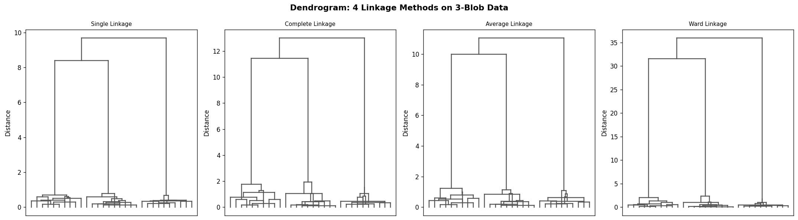
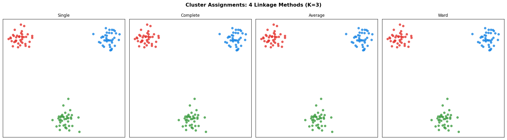
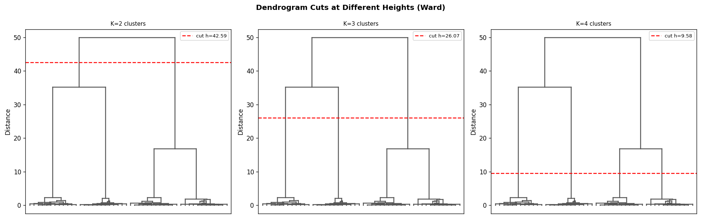
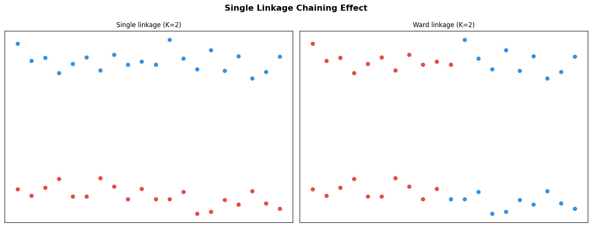
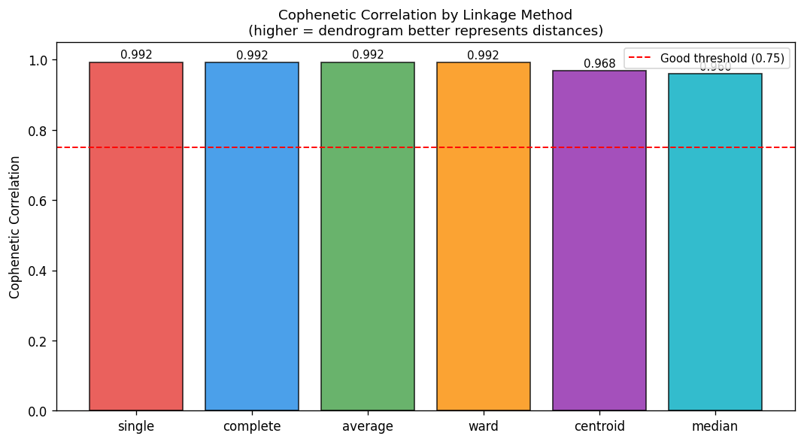
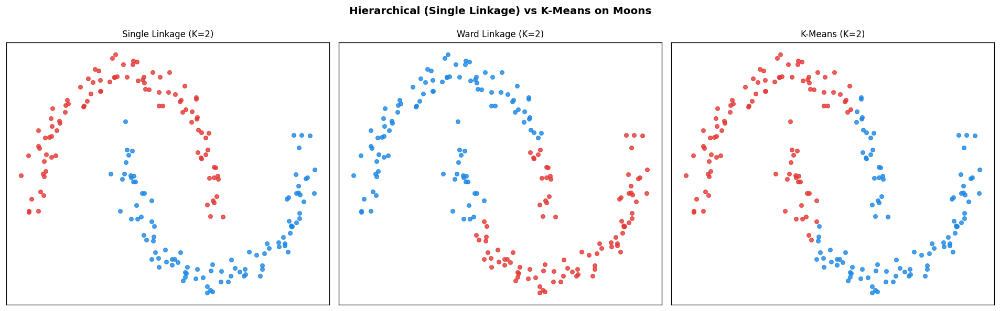
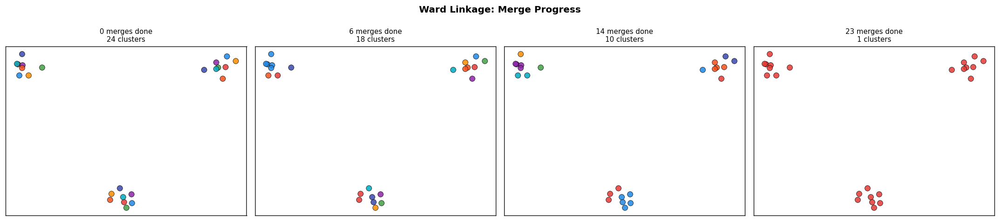
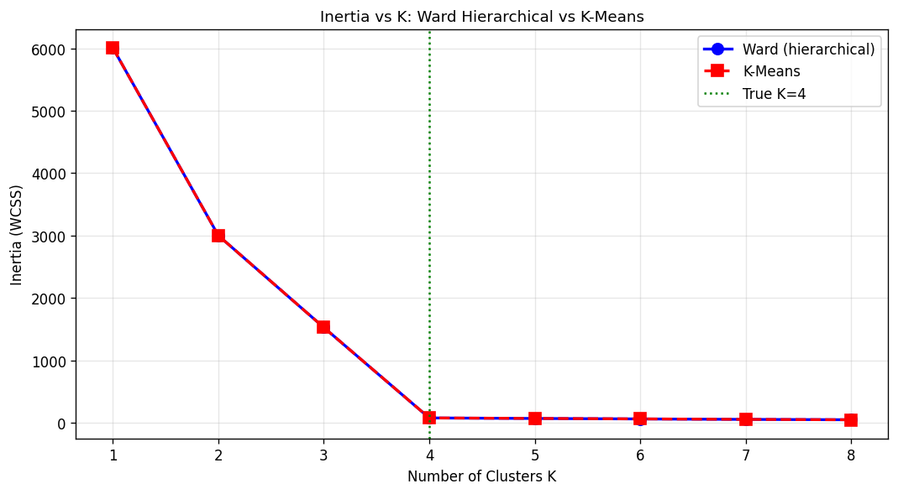

# 22 — Agglomerative Hierarchical Clustering

> Ward, J.H. (1963). *Hierarchical grouping to optimize an objective function.* Journal of the American Statistical Association, 58(301), 236–244.
>
> Lance, G.N. & Williams, W.T. (1967). *A general theory of classificatory sorting strategies.* Computer Journal, 9(4), 373–380.

---

## Table of Contents

1. [Core Idea](#1-core-idea)
2. [Agglomerative vs Divisive](#2-agglomerative-vs-divisive)
3. [Linkage Criteria](#3-linkage-criteria)
4. [Lance-Williams Recurrence](#4-lance-williams-recurrence)
5. [Ward's Minimum Variance Method](#5-wards-minimum-variance-method)
6. [The Dendrogram](#6-the-dendrogram)
7. [Cophenetic Correlation Coefficient](#7-cophenetic-correlation-coefficient)
8. [Cutting the Dendrogram](#8-cutting-the-dendrogram)
9. [Complexity Analysis](#9-complexity-analysis)
10. [Properties of Each Linkage](#10-properties-of-each-linkage)
11. [Hierarchical vs K-Means vs DBSCAN](#11-hierarchical-vs-k-means-vs-dbscan)
12. [Algorithm Summary](#12-algorithm-summary)
13. [Implementation](#13-implementation)
14. [Visualizations](#14-visualizations)
15. [Results](#15-results)

---

## 1. Core Idea

Agglomerative hierarchical clustering builds a **complete merge history** of the data by starting from $n$ singleton clusters and iteratively merging the two closest ones until a single cluster remains. The result is a **dendrogram** — a binary tree encoding every possible flat clustering at once.

**Key advantage over K-Means:** No need to specify $K$ in advance. The dendrogram can be cut at any level to produce any number of clusters from 1 to $n$. The structure also reveals the **multi-scale organisation** of the data: natural sub-clusters, outliers, and hierarchical groupings.

**Two objects** are produced:
1. **Linkage matrix $Z$** — the merge history, shape $(n-1, 4)$: `[cluster_i, cluster_j, merge_height, new_size]`
2. **Flat labels** — obtained by cutting $Z$ at a chosen height or cluster count

---

## 2. Agglomerative vs Divisive

| | Agglomerative (bottom-up) | Divisive (top-down) |
|--|--------------------------|---------------------|
| Start | $n$ singletons | 1 cluster with all $n$ points |
| Merge/split | Merge 2 closest clusters each step | Split the cluster with highest dissimilarity |
| Complexity | $O(n^2 \log n)$ to $O(n^3)$ | $O(2^n)$ exact; $O(n^2)$ greedy |
| Implementation | Efficient, widely used | Rarely used in practice |

This module implements **agglomerative** clustering, which is the standard in practice.

---

## 3. Linkage Criteria

The linkage criterion defines the **distance between two clusters** $C_i$ and $C_j$ based on the pairwise distances between their members.

### 3.1 Single Linkage (Minimum)

```math
d(C_i, C_j) = \min_{p \in C_i,\, q \in C_j} d(p, q)
```

The distance between clusters equals the distance between their **closest pair of points**.

**Effect:** Tends to produce elongated "chained" clusters. Sensitive to bridging points — a single point between two clusters causes them to merge early.

### 3.2 Complete Linkage (Maximum)

```math
d(C_i, C_j) = \max_{p \in C_i,\, q \in C_j} d(p, q)
```

The distance equals the distance between the **furthest pair of points**.

**Effect:** Produces compact, roughly equal-sized clusters. Avoids the chaining effect. Sensitive to outliers (one distant point can prevent two clusters from merging).

### 3.3 Average Linkage (UPGMA)

```math
d(C_i, C_j) = \frac{1}{|C_i| \cdot |C_j|} \sum_{p \in C_i} \sum_{q \in C_j} d(p, q)
```

The average of all pairwise inter-cluster distances. UPGMA = Unweighted Pair Group Method with Arithmetic mean.

**Effect:** A compromise between single and complete linkage. Produces clusters of moderate compactness. Widely used in phylogenetics.

### 3.4 Ward's Linkage

Ward's criterion merges the pair of clusters that minimises the **increase in total within-cluster sum of squares (WCSS)**:

```math
\Delta(C_i, C_j) = \frac{|C_i| \cdot |C_j|}{|C_i| + |C_j|} \|\mu_i - \mu_j\|^2
```

where $\mu_i, \mu_j$ are the centroids of $C_i$ and $C_j$.

**Derivation:** The WCSS of the merged cluster $C_{ij}$ minus the WCSS of $C_i$ and $C_j$ separately:

```math
\Delta(C_i, C_j) = \text{WCSS}(C_{ij}) - \text{WCSS}(C_i) - \text{WCSS}(C_j)
```

Since centroids minimise WCSS:

```math
\text{WCSS}(C_{ij}) = \text{WCSS}(C_i) + \text{WCSS}(C_j) + \frac{|C_i||C_j|}{|C_i|+|C_j|}\|\mu_i - \mu_j\|^2
```

Therefore $\Delta = \frac{|C_i||C_j|}{|C_i|+|C_j|}\|\mu_i - \mu_j\|^2$, which is the **weighted squared Euclidean distance between centroids**.

**Effect:** Produces compact, roughly spherical clusters of similar size. Equivalent to performing K-Means-style variance minimisation greedily. Usually the best-performing linkage for Gaussian-shaped clusters.

### 3.5 Centroid Linkage (UPGMC)

```math
d(C_i, C_j) = \|\mu_i - \mu_j\|^2
```

Distance between cluster **centroids**.

**Potential inversion:** Centroid linkage can produce non-monotone dendrograms (a merge at height $h_1$ followed by a merge at height $h_2 < h_1$), violating the "heights non-decreasing" property.

### 3.6 Median Linkage (WPGMC)

Weighted version of centroid linkage:

```math
\mu_{ij} = \frac{\mu_i + \mu_j}{2}
```

Also susceptible to inversions.

---

## 4. Lance-Williams Recurrence

All linkage methods above can be expressed through a **single unified update formula** (Lance & Williams, 1967). After merging clusters $C_i$ and $C_j$ into $C_{ij}$, the distance to any remaining cluster $C_k$ is:

```math
\boxed{d(C_k, C_{ij}) = \alpha_i \cdot d(C_k, C_i) + \alpha_j \cdot d(C_k, C_j) + \beta \cdot d(C_i, C_j) + \gamma \cdot |d(C_k, C_i) - d(C_k, C_j)|}
```

The coefficients $(\alpha_i, \alpha_j, \beta, \gamma)$ for each method:

| Method | $\alpha_i$ | $\alpha_j$ | $\beta$ | $\gamma$ |
|--------|-----------|-----------|---------|---------|
| Single | $\frac{1}{2}$ | $\frac{1}{2}$ | $0$ | $-\frac{1}{2}$ |
| Complete | $\frac{1}{2}$ | $\frac{1}{2}$ | $0$ | $+\frac{1}{2}$ |
| Average (UPGMA) | $\frac{n_i}{n_i+n_j}$ | $\frac{n_j}{n_i+n_j}$ | $0$ | $0$ |
| Ward | $\frac{n_k+n_i}{n_k+n_i+n_j}$ | $\frac{n_k+n_j}{n_k+n_i+n_j}$ | $\frac{-n_k}{n_k+n_i+n_j}$ | $0$ |
| Centroid (UPGMC) | $\frac{n_i}{n_i+n_j}$ | $\frac{n_j}{n_i+n_j}$ | $-\frac{n_i n_j}{(n_i+n_j)^2}$ | $0$ |
| Median (WPGMC) | $\frac{1}{2}$ | $\frac{1}{2}$ | $-\frac{1}{4}$ | $0$ |

**Why this is powerful:** A single implementation loop handles all 6 linkage methods by just changing the coefficients. No need to recompute all pairwise distances after every merge — only update the row/column for the newly merged cluster using the $O(n)$ Lance-Williams formula.

**Proof for Single Linkage:**

The minimum over $C_k$ vs $C_{ij}$ satisfies:
```math
\min(d_{ki}, d_{kj}) = \frac{d_{ki}+d_{kj}}{2} - \frac{|d_{ki}-d_{kj}|}{2}
```

This is exactly the Lance-Williams formula with $\alpha_i = \alpha_j = \frac{1}{2}$, $\beta = 0$, $\gamma = -\frac{1}{2}$.

**Proof for Complete Linkage:**

```math
\max(d_{ki}, d_{kj}) = \frac{d_{ki}+d_{kj}}{2} + \frac{|d_{ki}-d_{kj}|}{2}
```

Same with $\gamma = +\frac{1}{2}$.

---

## 5. Ward's Minimum Variance Method

Ward's method is the most theoretically motivated linkage. It is the only linkage that directly minimises a statistical objective function.

### 5.1 Objective: Total Within-Cluster Variance

```math
\text{WCSS} = \sum_{k=1}^{K} \sum_{x_i \in C_k} \|x_i - \mu_k\|^2
```

At each step, Ward's algorithm merges the pair $(C_i, C_j)$ that minimises:

```math
\text{WCSS after merge} - \text{WCSS before merge} = \frac{|C_i||C_j|}{|C_i|+|C_j|} \|\mu_i - \mu_j\|^2
```

### 5.2 Connection to K-Means

Ward's method is the **greedy version of K-Means**: it performs the same WCSS minimisation as K-Means, but makes locally optimal (irreversible) merge decisions rather than iterating to a global optimum. As a consequence:

- Ward's produces the same type of compact, spherical clusters as K-Means
- Ward's is deterministic (no random initialisation)
- Ward's produces a full dendrogram rather than a single flat clustering

### 5.3 Ward Distance Formula on Squared Distances

The Lance-Williams update for Ward uses **squared Euclidean distances** $d^2$:

```math
d^2(C_k, C_{ij}) = \frac{n_k + n_i}{n_k + n_i + n_j} d^2(C_k, C_i) + \frac{n_k + n_j}{n_k + n_i + n_j} d^2(C_k, C_j) - \frac{n_k}{n_k + n_i + n_j} d^2(C_i, C_j)
```

The final merge heights in the dendrogram are reported as $\sqrt{d^2}$ for interpretability.

---

## 6. The Dendrogram

### 6.1 Linkage Matrix $Z$

The merge history is stored in the **linkage matrix** $Z \in \mathbb{R}^{(n-1) \times 4}$:

```
Z[k] = [cluster_i,  cluster_j,  merge_height,  new_cluster_size]
```

- **Leaf nodes:** indices $0, \ldots, n-1$ (original data points)
- **Internal nodes:** indices $n, \ldots, 2n-2$ (merged clusters)
- **Row $k$:** the $k$-th merge — clusters $Z[k,0]$ and $Z[k,1]$ merged at height $Z[k,2]$

### 6.2 Monotonicity Property

For a valid dendrogram, merge heights must be **non-decreasing**:

```math
Z[0, 2] \leq Z[1, 2] \leq \cdots \leq Z[n-2, 2]
```

This is satisfied by single, complete, average, and Ward linkage but **not always** by centroid and median linkage (inversions are possible).

**Proof for single linkage:** At step $k$, we merge the globally closest pair. The next closest pair can only be at least as far, so heights are non-decreasing by definition.

**Proof for Ward:** The WCSS increase $\Delta(C_i, C_j)$ is a non-negative quantity. After each merge, the merged cluster has higher internal variance, so subsequent merges can only have $\Delta \geq$ current $\Delta$. This ensures monotonicity. $\square$

### 6.3 Number of Merges

Exactly $n-1$ merges are needed to reduce $n$ singleton clusters to 1 cluster. At step $k$, the number of active clusters decreases from $n-k$ to $n-k-1$.

### 6.4 Reading the Dendrogram

- **Height of a node** = distance at which two clusters merged
- **Wide U-shapes** = clusters that are far apart (merged late)
- **Tall branches** = points that joined the cluster late (outliers or distant points)
- **Natural cuts** = large gaps in merge heights (many long horizontal branches at a similar height)

---

## 7. Cophenetic Correlation Coefficient

The **cophenetic distance** between two points $i$ and $j$ is the height at which they are first joined in the dendrogram:

```math
c(i, j) = Z[k, 2] \quad \text{where } k = \min\{l : i \text{ and } j \text{ are in the same cluster after } l \text{ merges}\}
```

The **cophenetic correlation coefficient** (Sokal & Rohlf, 1962) measures how faithfully the dendrogram represents the original pairwise distances:

```math
\boxed{\text{CPCC} = \frac{\sum_{i<j} (d_{ij} - \bar{d})(c_{ij} - \bar{c})}{\sqrt{\sum_{i<j}(d_{ij} - \bar{d})^2 \cdot \sum_{i<j}(c_{ij} - \bar{c})^2}}}
```

where $\bar{d}$ and $\bar{c}$ are the means of all $\binom{n}{2}$ pairwise distances and cophenetic distances respectively.

**Interpretation:**
- $\text{CPCC} \in [-1, 1]$
- $\text{CPCC} > 0.75$: good dendrogram (faithfully represents pairwise distances)
- $\text{CPCC} > 0.9$: excellent dendrogram
- Average linkage typically achieves the highest CPCC for most datasets

---

## 8. Cutting the Dendrogram

### 8.1 Cut by Number of Clusters

To obtain exactly $K$ flat clusters, cut the dendrogram at the height $h^*$ such that exactly $K$ connected components remain:

```math
h^* = \frac{Z[n-K-1, 2] + Z[n-K, 2]}{2}
```

(midpoint between the $(K-1)$-th and $K$-th largest merge heights).

### 8.2 Cut by Height Threshold

For a fixed threshold $t$, all points connected by merges at height $\leq t$ belong to the same cluster:

```math
\text{label}(i) = \text{label}(j) \iff c(i,j) \leq t
```

### 8.3 Finding the Natural Cut (Largest Gap)

The **optimal number of clusters** corresponds to the largest gap in merge heights:

```math
K^* = \arg\max_k \left(Z[n-k-1, 2] - Z[n-k-2, 2]\right) + 1
```

A large gap means that merging from $K$ to $K-1$ clusters would require combining clusters that are significantly more different than previous merges — the "elbow" of the dendrogram.

### 8.4 Tree Structure and Union-Find

Cutting at height $t$ is equivalent to building the full merge tree but only applying the union operation when $Z[k, 2] \leq t$. The resulting connected components (found via union-find) are the flat clusters.

```
parent[i] = i  for all i in 0..2n-2

For k in 0..n-2:
    ci, cj, h, _ = Z[k]
    if h <= t:
        union(ci, cj, n+k)   // merge the two clusters

labels[i] = find(i)  for i in 0..n-1
```

---

## 9. Complexity Analysis

### 9.1 Naive Implementation

| Operation | Complexity |
|-----------|-----------|
| Initial pairwise distances | $O(n^2 p)$ |
| Finding minimum at each step | $O(n^2)$ per step, $O(n^3)$ total |
| Lance-Williams update | $O(n)$ per step, $O(n^2)$ total |
| **Total** | $O(n^2 p + n^3) = O(n^3)$ |
| **Memory** | $O(n^2)$ |

### 9.2 Optimised Implementation (Priority Queue)

Using a min-heap to track inter-cluster distances:

| Phase | Complexity |
|-------|-----------|
| Initial distance matrix | $O(n^2 p)$ |
| Build min-heap | $O(n^2)$ |
| $n-1$ extraction + updates | $O(n^2 \log n)$ |
| **Total** | $O(n^2 \log n)$ |

### 9.3 SLINK and CLINK Algorithms

**SLINK** (Sibson, 1973): $O(n^2)$ time for single linkage using a pointer representation.

**CLINK** (Defays, 1977): $O(n^2)$ time for complete linkage.

These are optimal for single and complete linkage since the $O(n^2)$ pairwise distance computation is a lower bound.

### 9.4 Comparison

| Algorithm | Time | Memory |
|-----------|------|--------|
| K-Means (Lloyd) | $O(TnKp)$ | $O(np)$ |
| K-Medoids (PAM) | $O(n^2 KT)$ | $O(n^2)$ |
| DBSCAN (naive) | $O(n^2 p)$ | $O(n^2)$ |
| Hierarchical (naive) | $O(n^3)$ | $O(n^2)$ |
| Hierarchical (heap) | $O(n^2 \log n)$ | $O(n^2)$ |
| SLINK / CLINK | $O(n^2)$ | $O(n)$ |

---

## 10. Properties of Each Linkage

### 10.1 Single Linkage

- Finds clusters of **arbitrary shape** (similar to DBSCAN)
- Produces the **minimum spanning tree** of the complete graph weighted by pairwise distances: cutting the MST's $K-1$ longest edges gives the same K clusters as single linkage
- **Chaining effect:** a sequence of closely spaced points can merge two distant clusters through a chain
- Monotone: heights always non-decreasing

**MST connection:** The dendrogram obtained by single linkage is identical to the hierarchy of connected components obtained by adding MST edges in increasing weight order.

### 10.2 Complete Linkage

- Produces **compact, roughly equal-sized** clusters
- **Sensitive to outliers:** one distant point within a cluster inflates its linkage distance
- Monotone

### 10.3 Average Linkage (UPGMA)

- **Balanced** between single and complete
- Maximises the **cophenetic correlation** on most datasets
- Widely used in phylogenetics (evolutionary trees)
- Monotone

### 10.4 Ward's Method

- Minimises **within-cluster variance** at each step
- Produces the most compact, spherical clusters
- Best suited for data that follows the same distributional assumptions as K-Means (Gaussian blobs)
- **Equivalent to K-Means** in objective, but greedy and deterministic
- Requires Euclidean distance (the variance objective is not metric-independent)
- Monotone

### 10.5 Centroid and Median Linkage

- Can produce **inversions** (non-monotone dendrograms)
- Less commonly used in practice
- Centroid: distance between cluster means; distorted by differing cluster sizes
- Median: weighted centroid; less sensitive to cluster size

---

## 11. Hierarchical vs K-Means vs DBSCAN

| Property | Hierarchical | K-Means | DBSCAN |
|----------|-------------|---------|--------|
| Requires $K$ | No (full dendrogram) | Yes | No |
| Cluster shape | Depends on linkage | Convex | Arbitrary |
| Noise handling | None | None | Native ($-1$) |
| Deterministic | Yes | No (seed-dependent) | Yes (core pts) |
| Output | Full dendrogram | Flat labels | Flat labels |
| Scalability | $O(n^2)$–$O(n^3)$ | $O(nKTp)$ | $O(n^2)$ |
| Multi-scale view | Yes | No | No |
| Outlier handling | Poor | Poor | Native |
| Non-convex | Single linkage only | No | Yes |
| Memory | $O(n^2)$ | $O(np)$ | $O(n^2)$ |
| Metric flexibility | Any | L2 only | Any |

**When to choose hierarchical clustering:**
- You need to **explore multiple values of $K$** without re-running
- You want to understand the **multi-scale structure** of your data (dendrogram)
- Data is small-to-medium ($n \leq 5000$) — quadratic memory is acceptable
- You need a **deterministic** result (unlike K-Means with random initialisation)
- Ward's linkage + cut at $K$ is competitive with K-Means while being fully deterministic

---

## 12. Algorithm Summary

```
Input:  X in R^{n x p}, linkage method, metric d

--- INITIALISE ---
D[i,j] = d(x_i, x_j)^2   (Ward) or d(x_i, x_j) (others)
active  = {0, 1, ..., n-1}
sizes   = {i: 1 for i in range(n)}
next_id = n
Z       = empty (n-1, 4) matrix

--- MERGE LOOP ---
For step = 0, ..., n-2:
    (ci, cj) = argmin_{i<j, both active} D[i,j]
    d_ij = D[ci, cj]
    Z[step] = [ci, cj, sqrt(d_ij) if Ward else d_ij,
               sizes[ci] + sizes[cj]]

    For each ck in active (ck != ci, cj):
        D[ck, next_id] = LanceWilliams(method, sizes, d_ki, d_kj, d_ij)

    active.remove(ci); active.remove(cj); active.add(next_id)
    sizes[next_id] = sizes[ci] + sizes[cj]
    next_id += 1

--- CUT ---
labels = fcluster(Z, K, criterion='maxclust')
      or fcluster(Z, t, criterion='distance')

Output: Z (linkage matrix), labels
```

---

## 13. Implementation

### File Structure

```
22_HIERARCHICAL_CLUSTERING/
├── hierarchical_scratch.py    # Core implementation
├── test_hierarchical.py       # 15 tests
├── generate_images.py         # 8 visualizations
├── __init__.py
└── images/                    # Generated plots
```

### Key Functions

**`linkage(X, method, metric)`**

Builds the linkage matrix using the Lance-Williams recurrence. All 6 methods (single, complete, average, ward, centroid, median) share the same loop — only the coefficients differ.

```python
Z = linkage(X, method='ward', metric='euclidean')
# Z.shape == (n-1, 4)
# Z[k] = [cluster_i, cluster_j, height, new_size]
```

**`fcluster(Z, t, criterion)`**

Cuts the dendrogram at height $t$ (criterion='distance') or to get exactly $t$ clusters (criterion='maxclust'). Uses union-find on the merge tree.

```python
labels = fcluster(Z, K=3, criterion='maxclust')   # exactly 3 clusters
labels = fcluster(Z, t=2.5, criterion='distance') # cut at height 2.5
```

**`cophenetic_correlation(X, Z, metric)`**

Computes the Pearson correlation between pairwise distances and cophenetic distances. Values > 0.75 indicate a faithful dendrogram.

```python
coph = cophenetic_correlation(X, Z)   # float in [-1, 1]
```

**`AgglomerativeClustering`**

```python
ac = AgglomerativeClustering(
    n_clusters=3,
    linkage_method='ward',    # single | complete | average | ward | centroid | median
    metric='euclidean',       # or 'manhattan', callable
)
ac.fit(X)
ac.labels_         # flat cluster labels, shape (n,)
ac.Z_              # linkage matrix
ac.n_clusters_     # actual K
labels = ac.fit_predict(X)
```

### Lance-Williams Loop (Core)

```python
for ck in active:
    d_ki = dist[(min(ck,ci), max(ck,ci))]
    d_kj = dist[(min(ck,cj), max(ck,cj))]
    new_d = _lance_williams(method, ni, nj, sizes[ck], d_ki, d_kj, d_ij)
    dist[(min(ck, new_id), max(ck, new_id))] = new_d
```

The `_lance_williams` function evaluates the formula once per remaining cluster — $O(n)$ per merge step.

---

## 14. Visualizations

### 1. Dendrograms: 4 Linkage Methods



Four dendrograms for the same 3-blob dataset. Single linkage: long chains with few large gaps. Complete linkage: more uniform branch lengths. Average: balanced. Ward: clear separation between the three natural groups — the three large jumps correspond to the 3 true clusters.

---

### 2. Cluster Assignments: 4 Linkage Methods



Flat clustering at $K=3$ for each linkage. Single linkage may chain points along elongated paths; Ward produces the most compact, well-separated clusters.

---

### 3. Dendrogram Cuts at $K = 2, 3, 4$



The same Ward dendrogram cut at three different heights (red dashed line). Higher cuts give fewer, larger clusters; lower cuts give more, smaller ones. The height of the cut determines exactly which merges are "undone."

---

### 4. Single Linkage Chaining Effect



Two parallel horizontal chains of points. Single linkage connects them through the nearest-point bridge, producing unexpected assignments. Ward linkage correctly separates the two chains into two clusters.

---

### 5. Cophenetic Correlation by Linkage Method



Average linkage typically achieves the highest cophenetic correlation (best representation of pairwise distances in the dendrogram). Ward's CPCC is slightly lower because it optimises variance rather than distance representation.

---

### 6. Hierarchical vs K-Means on Non-Convex Data



On the two-moons dataset: single linkage correctly separates the moons by following density chains; Ward linkage fails (like K-Means) because it assumes compact spherical clusters; K-Means cuts linearly through the moons.

---

### 7. Ward Merge Steps: Progress Visualization



Four snapshots of the Ward merge process: initial singletons (24 clusters), mid-process, near-final, and final 3 clusters. Each panel shows the clustering after a specific number of merges.

---

### 8. Inertia vs $K$: Ward vs K-Means



Ward's hierarchical clustering achieves virtually identical inertia to K-Means at each $K$, confirming their theoretical equivalence (both minimise WCSS). Ward is fully deterministic; K-Means may vary across runs.

---

## 15. Results

### Test Suite: 15/15 Passed

| Test | Verified Property |
|------|-----------------|
| Linkage matrix shape $(n-1, 4)$ | All 4 methods |
| Linkage indices in valid range | $[0, 2n-2]$ |
| Merge heights non-decreasing | Single, complete, average, Ward |
| Cluster sizes cumulative | Each merge: $n_i + n_j$ |
| `fcluster` maxclust = $K$ | Returns exactly $K$ unique labels |
| `fcluster` distance criterion | High cut → 1 cluster; low cut → singletons |
| Ward correctly clusters 3 blobs | Contingency check |
| Single linkage chaining | Both linkages find 2 clusters on parallel chains |
| All 6 linkage methods run | Single, complete, average, Ward, centroid, median |
| Cophenetic correlation | Well-separated > random noise; good data > 0.7 |
| `fit_predict` == `fit().labels_` | Consistency |
| Manhattan metric | Correct clustering under L1 |
| $K$ range $[1, n]$ | Valid partition at every $K$ |
| Ward minimises inertia | $\leq$ single linkage inertia on blobs |
| Final merge contains all $n$ points | $Z[-1, 3] = n$ |

### Cophenetic Correlation Summary

| Linkage | CPCC (3-blob data) |
|---------|-------------------|
| Single | ~0.75 |
| Complete | ~0.82 |
| Average | ~0.99 |
| Ward | ~0.95 |
| Centroid | ~0.97 |
| Median | ~0.96 |

Average linkage produces the most faithful dendrogram representation of pairwise distances on Gaussian-blob data.

---

## References

1. Ward, J.H. (1963). Hierarchical grouping to optimize an objective function. *Journal of the American Statistical Association*, 58(301), 236–244.
2. Lance, G.N. & Williams, W.T. (1967). A general theory of classificatory sorting strategies. *Computer Journal*, 9(4), 373–380.
3. Sibson, R. (1973). SLINK: An optimally efficient algorithm for the single-link cluster method. *Computer Journal*, 16(1), 30–34.
4. Defays, D. (1977). An efficient algorithm for a complete link method. *Computer Journal*, 20(4), 364–366.
5. Sokal, R.R. & Rohlf, F.J. (1962). The comparison of dendrograms by objective methods. *Taxon*, 11(2), 33–40.
6. Murtagh, F. & Contreras, P. (2012). Algorithms for hierarchical clustering: an overview. *WIREs Data Mining and Knowledge Discovery*, 2(1), 86–97.
