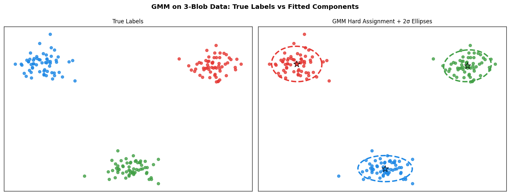
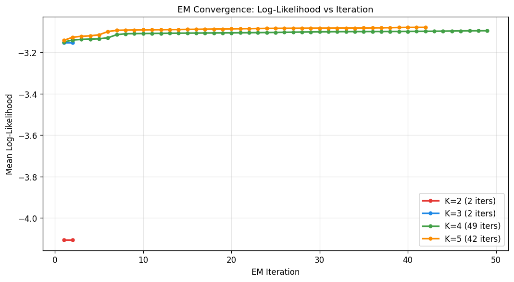
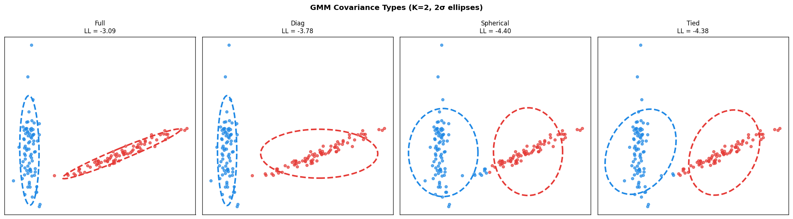
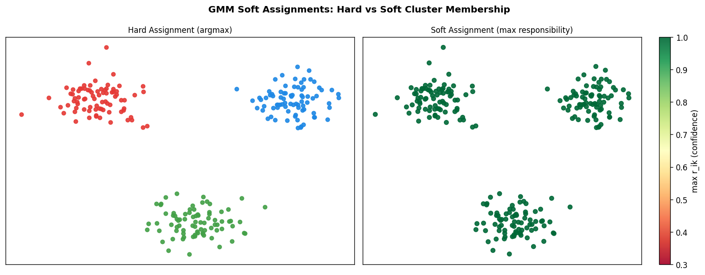
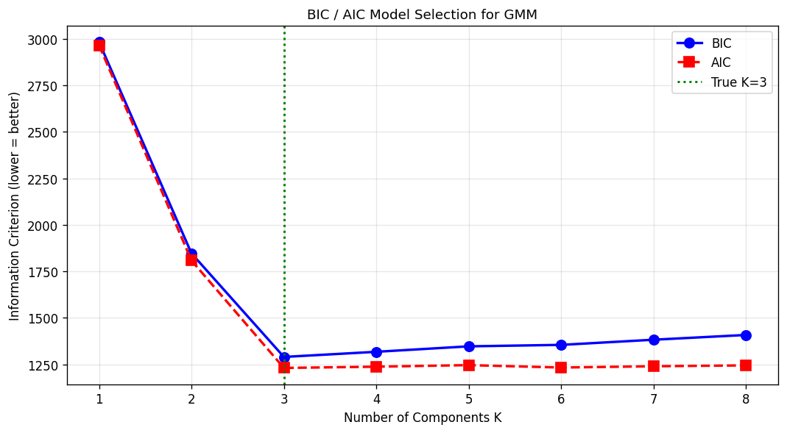
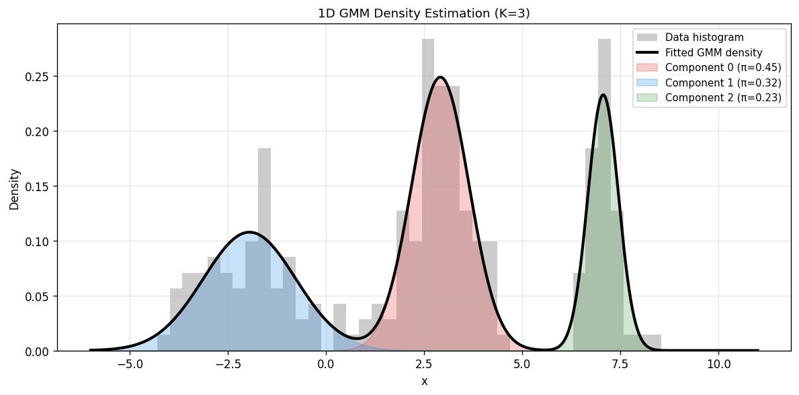
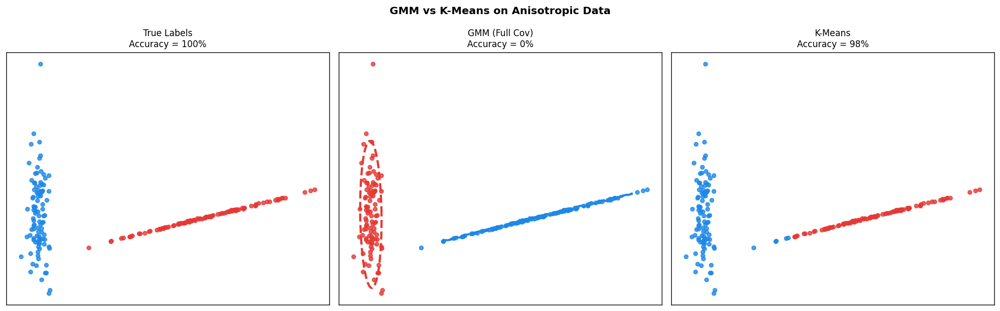
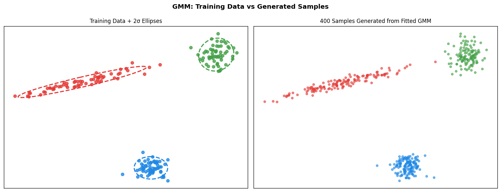

# Module 23 — Gaussian Mixture Models (GMM)

> **From-scratch implementation** of the Gaussian Mixture Model fitted by the
> Expectation-Maximization (EM) algorithm, with four covariance parameterizations,
> BIC/AIC model selection, and density-based sampling.

---

## Table of Contents

1. [Intuition](#1-intuition)
2. [Model Definition](#2-model-definition)
3. [Complete-Data Formulation and Latent Variables](#3-complete-data-formulation-and-latent-variables)
4. [The EM Algorithm](#4-the-em-algorithm)
5. [E-Step: Responsibilities](#5-e-step-responsibilities)
6. [M-Step: Parameter Updates](#6-m-step-parameter-updates)
7. [Log-Likelihood and ELBO](#7-log-likelihood-and-elbo)
8. [Covariance Parameterizations](#8-covariance-parameterizations)
9. [Numerical Stability](#9-numerical-stability)
10. [Model Selection: BIC and AIC](#10-model-selection-bic-and-aic)
11. [Initialization Strategies](#11-initialization-strategies)
12. [Convergence Properties](#12-convergence-properties)
13. [Singularity and Identifiability](#13-singularity-and-identifiability)
14. [Complexity Analysis](#14-complexity-analysis)
15. [Visual Results](#15-visual-results)
16. [GMM vs K-Means](#16-gmm-vs-k-means)
17. [References](#17-references)

---

## 1. Intuition

K-Means assigns each point to exactly one cluster (hard assignment) and assumes clusters are spherical. A **Gaussian Mixture Model** relaxes both constraints:

- **Soft assignment**: every point belongs to every cluster with some probability.
- **Flexible shape**: each cluster is a full multivariate Gaussian with its own mean and covariance matrix.

Geometrically, the model places $K$ Gaussian "bells" over the data and finds the heights, positions, and shapes of those bells so that the total probability of the observed data is maximised.

---

## 2. Model Definition

The GMM defines a probability density over $\mathbb{R}^p$:

$$p(x \mid \theta) = \sum_{k=1}^{K} \pi_k \,\mathcal{N}(x \mid \mu_k,\, \Sigma_k)$$

**Parameters** $\theta = \{\pi_k, \mu_k, \Sigma_k\}_{k=1}^K$:

| Symbol | Name | Constraint |
|--------|------|------------|
| $\pi_k \in \mathbb{R}$ | mixing weight of component $k$ | $\pi_k \geq 0,\;\sum_{k=1}^K \pi_k = 1$ |
| $\mu_k \in \mathbb{R}^p$ | mean of component $k$ | unconstrained |
| $\Sigma_k \in \mathbb{R}^{p \times p}$ | covariance of component $k$ | symmetric positive definite |

The **multivariate Gaussian** density is:

$$\mathcal{N}(x \mid \mu, \Sigma) = \frac{1}{(2\pi)^{p/2}\,|\Sigma|^{1/2}} \exp\!\left(-\frac{1}{2}(x-\mu)^\top \Sigma^{-1}(x-\mu)\right)$$

The quadratic form $(x-\mu)^\top \Sigma^{-1}(x-\mu)$ is the **squared Mahalanobis distance**, which measures distance in units of the covariance structure.

---

## 3. Complete-Data Formulation and Latent Variables

For each data point $x_i$, introduce a **latent indicator**:

$$z_i \in \{1, \ldots, K\}, \qquad P(z_i = k) = \pi_k$$

Then the conditional distribution is:

$$p(x_i \mid z_i = k,\,\theta) = \mathcal{N}(x_i \mid \mu_k, \Sigma_k)$$

The **joint density** of $(x_i, z_i)$:

$$p(x_i, z_i = k \mid \theta) = \pi_k \,\mathcal{N}(x_i \mid \mu_k, \Sigma_k)$$

The **complete-data log-likelihood** (if we knew all $z_i$) would be:

$$\ell_c(\theta) = \sum_{i=1}^{n} \sum_{k=1}^{K} \mathbf{1}[z_i = k]\Bigl(\log \pi_k + \log \mathcal{N}(x_i \mid \mu_k, \Sigma_k)\Bigr)$$

This is easily maximised in closed form because it decomposes over $k$. The problem is that $z_i$ is unobserved — the EM algorithm handles this by iterating between inferring $z_i$ and maximising $\ell_c$.

---

## 4. The EM Algorithm

**Goal**: maximise the **observed log-likelihood**:

$$\ell(\theta) = \sum_{i=1}^{n} \log \sum_{k=1}^{K} \pi_k\,\mathcal{N}(x_i \mid \mu_k, \Sigma_k)$$

The log of a sum has no closed-form maximiser. EM introduces an **Evidence Lower BOund (ELBO)**:

### Jensen's Inequality

For any probability distribution $q_{ik}$ over $k$ with $\sum_k q_{ik} = 1$:

$$\log \sum_{k} \pi_k \mathcal{N}(x_i \mid \mu_k, \Sigma_k) = \log \sum_{k} q_{ik} \cdot \frac{\pi_k \mathcal{N}(x_i \mid \mu_k, \Sigma_k)}{q_{ik}} \;\geq\; \sum_{k} q_{ik} \log \frac{\pi_k \mathcal{N}(x_i \mid \mu_k, \Sigma_k)}{q_{ik}}$$

Summing over all $n$ points defines the ELBO:

$$\mathcal{L}(q, \theta) = \sum_{i=1}^{n} \sum_{k=1}^{K} q_{ik} \log \frac{\pi_k \,\mathcal{N}(x_i \mid \mu_k, \Sigma_k)}{q_{ik}} \;\leq\; \ell(\theta)$$

### EM as Coordinate Ascent on the ELBO

The ELBO gap equals the KL divergence between $q$ and the true posterior:

$$\ell(\theta) - \mathcal{L}(q,\theta) = \sum_i \mathrm{KL}\bigl(q_i \;\|\; p(\cdot \mid x_i, \theta)\bigr) \;\geq\; 0$$

**E-step**: fix $\theta$, maximise $\mathcal{L}$ over $q$ by setting $q_{ik} = p(z_i = k \mid x_i, \theta)$, which makes the KL gap zero.

**M-step**: fix $q$, maximise $\mathcal{L}$ over $\theta$.

Because each step increases (or leaves unchanged) the ELBO, and the ELBO is a lower bound on $\ell(\theta)$, the observed log-likelihood is **guaranteed to be non-decreasing** at every EM iteration.

---

## 5. E-Step: Responsibilities

Setting $q_{ik}$ to the exact posterior via Bayes' theorem:

$$r_{ik} \;=\; P(z_i = k \mid x_i, \theta) \;=\; \frac{\pi_k \,\mathcal{N}(x_i \mid \mu_k, \Sigma_k)}{\displaystyle\sum_{j=1}^{K} \pi_j \,\mathcal{N}(x_i \mid \mu_j, \Sigma_j)}$$

$r_{ik}$ is the **responsibility** that component $k$ takes for point $x_i$.

**Properties**:

$$r_{ik} \geq 0, \qquad \sum_{k=1}^{K} r_{ik} = 1 \quad \forall\, i$$

The **effective number of points** assigned to component $k$:

$$N_k = \sum_{i=1}^{n} r_{ik}$$

with $\sum_{k=1}^K N_k = n$.

**In log-space** (numerically stable):

$$\log r_{ik} = \log \pi_k + \log \mathcal{N}(x_i \mid \mu_k, \Sigma_k) - \log \sum_{j} \exp\!\bigl(\log \pi_j + \log \mathcal{N}(x_i \mid \mu_j, \Sigma_j)\bigr)$$

---

## 6. M-Step: Parameter Updates

Maximising $\mathcal{L}(q, \theta)$ over $\theta$ with $r_{ik}$ fixed gives closed-form updates.

### Mixing Weights

$$\hat{\pi}_k = \frac{N_k}{n}$$

### Means

$$\hat{\mu}_k = \frac{1}{N_k} \sum_{i=1}^{n} r_{ik}\, x_i$$

This is a **responsibility-weighted empirical mean** — a soft generalisation of the K-Means centroid update.

### Full Covariances

$$\hat{\Sigma}_k = \frac{1}{N_k} \sum_{i=1}^{n} r_{ik}\,(x_i - \hat{\mu}_k)(x_i - \hat{\mu}_k)^\top + \varepsilon I$$

where $\varepsilon > 0$ is a small regularisation constant added for numerical stability.

### Derivation Sketch

The M-step objective for $\mu_k$ is:

$$\max_{\mu_k} \sum_{i} r_{ik} \log \mathcal{N}(x_i \mid \mu_k, \Sigma_k) = -\frac{1}{2} \sum_{i} r_{ik} (x_i - \mu_k)^\top \Sigma_k^{-1} (x_i - \mu_k) + \text{const}$$

Taking the gradient and setting to zero:

$$\sum_{i} r_{ik} \Sigma_k^{-1}(x_i - \mu_k) = 0 \implies \hat{\mu}_k = \frac{\sum_i r_{ik} x_i}{\sum_i r_{ik}} = \frac{1}{N_k}\sum_i r_{ik} x_i$$

Similarly for $\Sigma_k$, setting $\partial / \partial \Sigma_k^{-1}$ to zero yields the weighted sample covariance formula above.

---

## 7. Log-Likelihood and ELBO

### Observed Log-Likelihood

$$\ell(\theta) = \sum_{i=1}^{n} \log \sum_{k=1}^{K} \pi_k\,\mathcal{N}(x_i \mid \mu_k, \Sigma_k)$$

### ELBO Decomposition

$$\mathcal{L}(q,\theta) = \underbrace{\sum_{i,k} r_{ik}\,\log \pi_k}_{\text{entropy of weights}} + \underbrace{\sum_{i,k} r_{ik}\,\log \mathcal{N}(x_i \mid \mu_k, \Sigma_k)}_{\text{weighted reconstruction}} - \underbrace{\sum_{i,k} r_{ik}\,\log r_{ik}}_{\text{entropy of }q}$$

### Convergence Criterion

EM stops when the change in mean log-likelihood is below threshold $\tau$:

$$\bigl|\ell(\theta^{(t+1)}) - \ell(\theta^{(t)})\bigr| < \tau$$

---

## 8. Covariance Parameterizations

Different constraints on $\Sigma_k$ trade off **flexibility** against **parameter count** and **sample efficiency**.

| Type | Parameterization | Free params (per component) | Shape captured |
|------|-----------------|--------------------------|----------------|
| `full` | $\Sigma_k \in \mathbb{R}^{p \times p}$, SPD | $\frac{p(p+1)}{2}$ | Any ellipsoid |
| `diag` | $\Sigma_k = \mathrm{diag}(\sigma^2_{k,1},\ldots,\sigma^2_{k,p})$ | $p$ | Axis-aligned ellipsoid |
| `spherical` | $\Sigma_k = \sigma^2_k I$ | $1$ | Sphere (isotropic) |
| `tied` | $\Sigma_k = \Sigma$ (shared) | $\frac{p(p+1)}{2}$ total | Equal ellipsoids |

**Total free parameter count** $d$ (used by BIC/AIC):

$$d = \underbrace{(K-1)}_{\text{weights}} + \underbrace{Kp}_{\text{means}} + \underbrace{d_{\text{cov}}}_{\text{covariances}}$$

where $d_{\text{cov}}$ is:

$$d_{\text{cov}} = \begin{cases} K\,\dfrac{p(p+1)}{2} & \text{full} \\[6pt] Kp & \text{diag} \\[4pt] K & \text{spherical} \\[4pt] \dfrac{p(p+1)}{2} & \text{tied} \end{cases}$$

### M-Step Updates by Type

**Diagonal**:

$$\hat{\sigma}^2_{k,j} = \frac{1}{N_k} \sum_{i=1}^{n} r_{ik}\,(x_{ij} - \hat{\mu}_{kj})^2$$

**Spherical** (average diagonal):

$$\hat{\sigma}^2_k = \frac{1}{N_k\,p} \sum_{i=1}^{n} r_{ik}\,\|x_i - \hat{\mu}_k\|^2$$

**Tied** (pooled across all components):

$$\hat{\Sigma} = \frac{1}{n} \sum_{k=1}^{K} \sum_{i=1}^{n} r_{ik}\,(x_i - \hat{\mu}_k)(x_i - \hat{\mu}_k)^\top$$

---

## 9. Numerical Stability

### Log-Sum-Exp Trick

Computing $\log \sum_k e^{a_k}$ directly overflows/underflows when $a_k$ is large or small. The stable version is:

$$\log \sum_{k=1}^K e^{a_k} = a^* + \log \sum_{k=1}^K e^{a_k - a^*}, \qquad a^* = \max_k a_k$$

Since $e^{a_k - a^*} \in (0, 1]$, no overflow occurs.

### Cholesky Log-Determinant

For a full covariance matrix $\Sigma$, computing $\log|\Sigma|$ via eigendecomposition is expensive and numerically fragile. The Cholesky factorisation $\Sigma = LL^\top$ gives:

$$\log|\Sigma| = 2\sum_{j=1}^{p} \log L_{jj}$$

and the Mahalanobis distance via triangular solve:

$$(x-\mu)^\top \Sigma^{-1} (x-\mu) = \|L^{-1}(x-\mu)\|^2 = \|y\|^2, \quad Ly = x-\mu$$

which avoids explicitly inverting $\Sigma$.

### Covariance Regularization

To prevent near-singular covariances (especially when $N_k$ is small), a regularisation term is added:

$$\hat{\Sigma}_k \leftarrow \hat{\Sigma}_k + \varepsilon I, \qquad \varepsilon = 10^{-6}$$

This keeps all eigenvalues bounded away from zero.

---

## 10. Model Selection: BIC and AIC

Since a higher $K$ always fits better (more parameters), penalised criteria are used to select the optimal number of components.

### Bayesian Information Criterion

$$\mathrm{BIC}(K) = -2\,\ell(\hat\theta_K) + d_K \log n$$

### Akaike Information Criterion

$$\mathrm{AIC}(K) = -2\,\ell(\hat\theta_K) + 2\,d_K$$

| Criterion | Penalty | Behaviour |
|-----------|---------|-----------|
| BIC | $d \log n$ | Consistent (selects true $K$ as $n \to \infty$) |
| AIC | $2d$ | Efficient (minimises prediction error) |

BIC penalises complexity more strongly than AIC for $n > e^2 \approx 7.4$, so it tends to choose sparser models. In practice, the **elbow of the BIC curve** is often used.

**Optimal model**:

$$K^* = \arg\min_K \,\mathrm{BIC}(K)$$

---

## 11. Initialization Strategies

EM is sensitive to initialization and can converge to local maxima.

### K-Means Initialization (`init_params='kmeans'`)

1. Run K-Means for 50 iterations.
2. Assign hard responsibilities from the K-Means labels.
3. Run one M-step to compute initial $\{\pi_k, \mu_k, \Sigma_k\}$.

This is the default and usually gives good starting points because K-Means already clusters the data.

### Random Initialization (`init_params='random'`)

Sample a random Dirichlet responsibility matrix:

$$r_{i\cdot} \sim \mathrm{Dir}(\mathbf{1}_K), \qquad i = 1,\ldots,n$$

then run one M-step to obtain initial parameters.

### Multiple Restarts (`n_init > 1`)

Run EM from `n_init` independent random starts and keep the solution with the highest log-likelihood. This reduces the chance of converging to a poor local maximum at the cost of $O(n\_\text{init})$ runtime.

---

## 12. Convergence Properties

### Monotone Increase

**Theorem**: The observed log-likelihood $\ell(\theta^{(t)})$ is non-decreasing in $t$:

$$\ell(\theta^{(t+1)}) \geq \ell(\theta^{(t)})$$

**Proof sketch**:

After the E-step at iteration $t$, the ELBO equals the log-likelihood:

$$\mathcal{L}(r^{(t)}, \theta^{(t)}) = \ell(\theta^{(t)})$$

The M-step maximises $\mathcal{L}$ over $\theta$:

$$\mathcal{L}(r^{(t)}, \theta^{(t+1)}) \geq \mathcal{L}(r^{(t)}, \theta^{(t)}) = \ell(\theta^{(t)})$$

Since the ELBO is always a lower bound on the log-likelihood:

$$\ell(\theta^{(t+1)}) \geq \mathcal{L}(r^{(t)}, \theta^{(t+1)}) \geq \ell(\theta^{(t)}) \qquad \square$$

### Convergence Rate

EM typically converges **linearly** (geometric rate) near a local maximum. The rate depends on the fraction of "missing information" — if $z_i$ were observed, the complete-data MLE would be immediate; the closer $r_{ik}$ are to hard assignments, the faster the convergence.

---

## 13. Singularity and Identifiability

### Singularity

If a component mean $\mu_k$ collapses onto a single data point $x_j$, the covariance $\Sigma_k \to 0$ and the likelihood diverges:

$$\mathcal{N}(x_j \mid x_j, \varepsilon I) \to \infty \quad \text{as } \varepsilon \to 0$$

This is a degenerate solution. Covariance regularisation ($+\varepsilon I$) prevents this. In some formulations a proper prior on $\Sigma_k$ is used (MAP-EM).

### Label Switching

The likelihood is symmetric in the component indices: permuting $(1, \ldots, K)$ gives an identical density. Thus there are $K!$ equivalent modes — the GMM is **not identifiable without additional constraints**. This matters for inferential purposes but not for density estimation.

### Overfitting

As $K$ increases, the model can overfit. BIC/AIC penalise this. Another symptom is a component collapsing to capture a single outlier.

---

## 14. Complexity Analysis

| Operation | Time | Space |
|-----------|------|-------|
| E-step (all $n$, $K$ components) | $O(nKp^2)$ | $O(nK)$ |
| M-step (full covariance) | $O(nKp^2)$ | $O(Kp^2)$ |
| Full EM run ($T$ iterations) | $O(TnKp^2)$ | $O(nK + Kp^2)$ |
| Cholesky factorization | $O(p^3)$ per component | — |

For **diagonal** or **spherical** covariance the $p^2$ factor reduces to $p$ or $1$, making those variants significantly faster in high dimensions.

The naive K-Means initialization uses an additional $O(TnKp)$ time.

---

## 15. Visual Results

### 1. GMM Contours on 3-Blob Data

Left: true cluster labels. Right: GMM hard assignment (argmax responsibility) with 2-sigma ellipses showing the fitted Gaussian shapes. Stars mark component means.

### 2. EM Convergence

Log-likelihood increases monotonically and plateaus within 5–20 iterations for well-separated data. Over-specified models ($K > K_\text{true}$) converge more slowly.

### 3. Covariance Types Compared

On anisotropic blobs: `full` captures the true elongated shape; `diag` approximates it with axis-aligned ellipsoids; `spherical` is circular; `tied` uses a shared ellipse. Log-likelihood decreases as constraints tighten.

### 4. Soft vs Hard Assignments

Left: hard cluster assignment (argmax $r_{ik}$). Right: colour intensity shows confidence (max $r_{ik}$). Points near cluster boundaries have lower confidence, revealing the probabilistic nature of GMM clustering.

### 5. BIC / AIC Model Selection

Both BIC and AIC decrease until $K = 3$ (the true number of components) then increase. BIC has a sharper minimum due to its stronger penalty for additional parameters.

### 6. 1D Density Estimation

GMM as a non-parametric density estimator in 1D: the fitted mixture (black curve) matches the empirical distribution. Individual component densities (shaded) are weighted by $\pi_k$.

### 7. GMM vs K-Means

On clusters with different elongations, GMM (full covariance) correctly classifies both clusters while K-Means (which effectively uses spherical covariance) misassigns points from the elongated cluster.

### 8. Sampling from a Fitted GMM

Left: training data with 2-sigma ellipses. Right: 400 samples drawn from the fitted model by ancestral sampling — first sample a component $k \sim \pi$, then $x \sim \mathcal{N}(\mu_k, \Sigma_k)$.

---

## 16. GMM vs K-Means

| Property | K-Means | GMM |
|----------|---------|-----|
| Assignment | Hard (one cluster per point) | Soft (probability over all clusters) |
| Cluster shape | Spherical (Voronoi) | Ellipsoidal (full cov) or spherical |
| Objective | Minimize WCSS | Maximize log-likelihood |
| Output | Labels | Labels + probabilities + density |
| Probabilistic | No | Yes |
| Can generate new data | No | Yes |
| Sensitive to outliers | Yes | Somewhat (regularisation helps) |
| Converges to | Local minimum of WCSS | Local maximum of $\ell(\theta)$ |
| Relation | Special case of GMM (spherical, hard) | Generalization of K-Means |

### K-Means as a Limiting GMM

K-Means is exactly the hard-assignment limit of GMM with tied spherical covariances. When $\sigma^2 \to 0$, the responsibilities $r_{ik}$ approach 0/1 indicators and the EM updates collapse to the K-Means assignment and centroid steps.

Formally, for $\Sigma_k = \sigma^2 I$:

$$r_{ik} = \frac{\exp(-\|x_i - \mu_k\|^2 / 2\sigma^2)}{\sum_j \exp(-\|x_i - \mu_j\|^2 / 2\sigma^2)} \xrightarrow{\sigma^2 \to 0} \mathbf{1}\!\left[k = \arg\min_j \|x_i - \mu_j\|^2\right]$$

---

## 17. References

1. **Dempster, A.P., Laird, N.M. & Rubin, D.B.** (1977). Maximum likelihood from incomplete data via the EM algorithm. *Journal of the Royal Statistical Society, Series B*, 39(1), 1–38.

2. **Bishop, C.M.** (2006). *Pattern Recognition and Machine Learning*. Springer. Chapter 9: Mixture Models and EM.

3. **McLachlan, G.J. & Peel, D.** (2000). *Finite Mixture Models*. Wiley-Interscience.

4. **Neal, R.M. & Hinton, G.E.** (1998). A view of the EM algorithm that justifies incremental, sparse, and other variants. In *Learning in Graphical Models*, MIT Press, 355–368.

5. **Schwarz, G.** (1978). Estimating the dimension of a model. *Annals of Statistics*, 6(2), 461–464. (BIC criterion)

6. **Akaike, H.** (1974). A new look at the statistical model identification. *IEEE Transactions on Automatic Control*, 19(6), 716–723. (AIC criterion)
