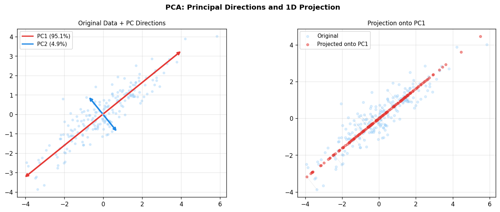
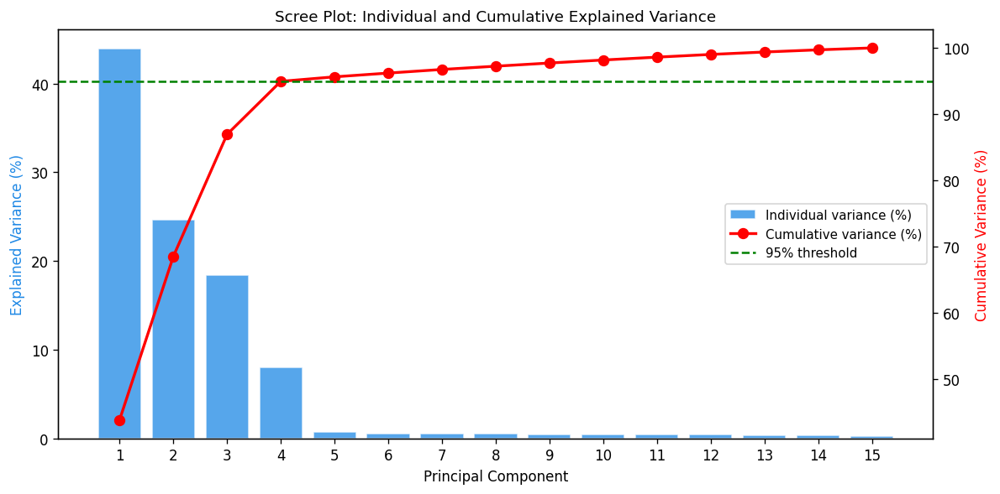
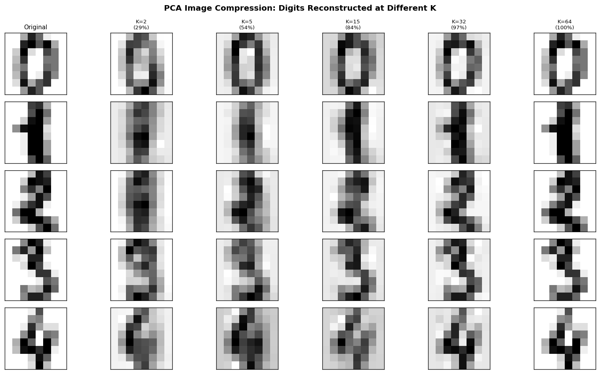
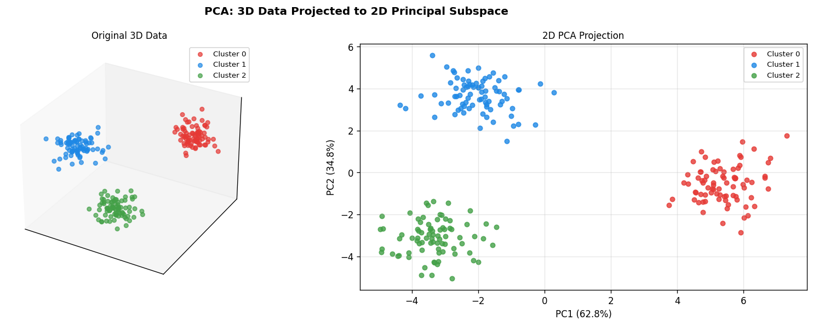
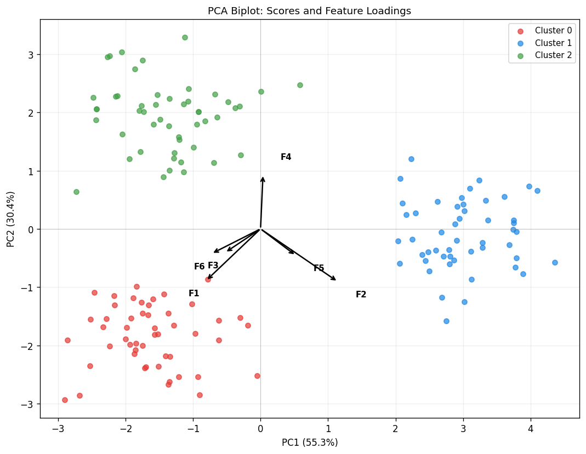
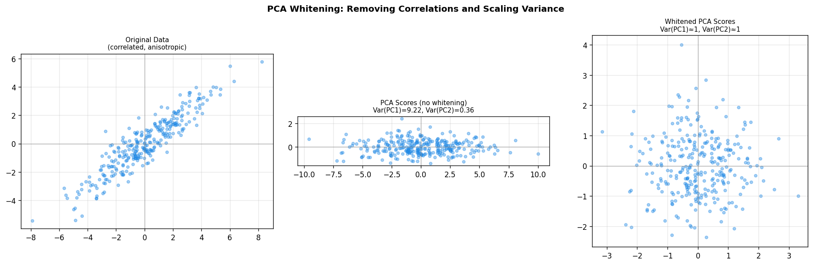
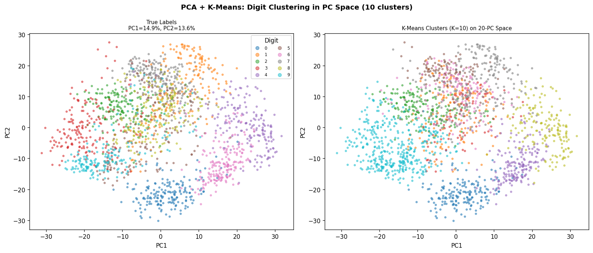
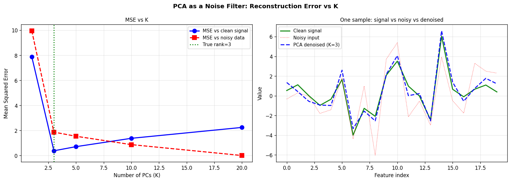

# Module 24 — Principal Component Analysis (PCA)

> **From-scratch implementation** of PCA via the economy SVD of the
> mean-centred data matrix, supporting full/truncated/variance-threshold
> decompositions, whitening, noise-variance estimation (PPCA), and biplot
> visualisation.

---

## Table of Contents

1. [Intuition](#1-intuition)
2. [Problem Setup](#2-problem-setup)
3. [Variance Maximisation View](#3-variance-maximisation-view)
4. [Reconstruction Error View](#4-reconstruction-error-view)
5. [SVD Connection](#5-svd-connection)
6. [The Full Algorithm](#6-the-full-algorithm)
7. [Explained Variance and Scree Plot](#7-explained-variance-and-scree-plot)
8. [Whitening](#8-whitening)
9. [Probabilistic PCA](#9-probabilistic-pca)
10. [Choosing the Number of Components](#10-choosing-the-number-of-components)
11. [Sign Ambiguity and Conventions](#11-sign-ambiguity-and-conventions)
12. [Numerical Stability via SVD vs Eigendecomposition](#12-numerical-stability-via-svd-vs-eigendecomposition)
13. [Complexity Analysis](#13-complexity-analysis)
14. [Properties and Limitations](#14-properties-and-limitations)
15. [Visual Results](#15-visual-results)
16. [References](#16-references)

---

## 1. Intuition

Real data often lives in a low-dimensional **linear subspace** embedded in a high-dimensional ambient space — think pixel images that all show faces, or sensor readings that all capture one underlying process.

PCA finds the directions of **maximum variance** in the data and projects onto them:

- The first principal component (PC1) is the direction along which the data varies most.
- PC2 is perpendicular to PC1 and captures the next most variance.
- Each subsequent PC is orthogonal to all previous ones.

By keeping only the top $d$ PCs we obtain the best rank-$d$ linear approximation of the data in a least-squares sense — this is the Eckart-Young theorem.

---

## 2. Problem Setup

Given a data matrix $X \in \mathbb{R}^{n \times p}$ with $n$ observations and $p$ features:

**Step 1 — Centre the data**:

$$X_c = X - \mathbf{1}_n\,\bar{x}^\top, \qquad \bar{x} = \frac{1}{n}\sum_{i=1}^n x_i \in \mathbb{R}^p$$

**Step 2 — Sample covariance matrix**:

$$C = \frac{1}{n-1}\,X_c^\top X_c \in \mathbb{R}^{p \times p}$$

$C$ is symmetric positive semi-definite with eigendecomposition $C = V \Lambda V^\top$, where $\Lambda = \mathrm{diag}(\lambda_1 \geq \ldots \geq \lambda_p \geq 0)$ and $V \in \mathbb{R}^{p \times p}$ is orthonormal.

---

## 3. Variance Maximisation View

**Goal**: find the unit vector $w_1 \in \mathbb{R}^p$ that maximises the variance of the projected data.

$$w_1 = \arg\max_{\|w\|=1} \mathrm{Var}(X_c w) = \arg\max_{\|w\|=1} \frac{1}{n-1}\|X_c w\|^2 = \arg\max_{\|w\|=1} w^\top C w$$

### Lagrangian Solution

Introduce the constraint $\|w\|^2 = 1$ with multiplier $\lambda$:

$$\mathcal{L}(w, \lambda) = w^\top C w - \lambda(w^\top w - 1)$$

Setting $\partial \mathcal{L}/\partial w = 0$:

$$2Cw = 2\lambda w \implies Cw = \lambda w$$

So $w_1$ is the **eigenvector of $C$ corresponding to the largest eigenvalue $\lambda_1$**, and the maximum variance achieved equals $\lambda_1$.

### Sequential Extraction (Deflation)

The $k$-th PC is the eigenvector with $k$-th largest eigenvalue, subject to orthogonality with all previous PCs:

$$w_k = \arg\max_{\|w\|=1,\, w \perp w_1,\ldots,w_{k-1}} w^\top C w$$

The solution is the $k$-th column of $V$. The principal directions $\{w_1, \ldots, w_d\}$ form an **orthonormal basis** of the $d$-dimensional principal subspace.

---

## 4. Reconstruction Error View

**Goal**: find the rank-$d$ orthonormal projection matrix $W \in \mathbb{R}^{p \times d}$ (with $W^\top W = I_d$) that minimises the mean squared reconstruction error:

$$W^* = \arg\min_{W^\top W = I_d} \frac{1}{n}\left\|X_c - X_c W W^\top\right\|_F^2$$

### Eckart-Young-Mirsky Theorem

The minimum Frobenius-norm rank-$d$ approximation of any matrix $A$ is:

$$A \approx U_d \Sigma_d V_d^\top, \qquad \|A - U_d \Sigma_d V_d^\top\|_F^2 = \sum_{k=d+1}^r \sigma_k^2$$

where $A = U\Sigma V^\top$ is the full SVD. Applied to $X_c$:

$$\|X_c - X_c W W^\top\|_F^2 = \sum_{k=d+1}^{\min(n,p)} \sigma_k^2$$

**The variance-maximisation and reconstruction-minimisation objectives give the same solution** — the top-$d$ right singular vectors of $X_c$.

---

## 5. SVD Connection

The economy (thin) SVD of the centred matrix:

$$X_c = U \Sigma V^\top, \quad U \in \mathbb{R}^{n \times r},\; \Sigma \in \mathbb{R}^{r \times r},\; V^\top \in \mathbb{R}^{r \times p},\; r = \min(n,p)$$

where $U^\top U = V^\top V = I_r$ and $\sigma_1 \geq \ldots \geq \sigma_r \geq 0$.

| Quantity | Expression |
|----------|-----------|
| Principal components (axes) | Rows of $V^\top$ (columns of $V$) |
| PC scores (projections) | $Z = X_c V_d = U_d \Sigma_d \in \mathbb{R}^{n \times d}$ |
| Eigenvalues of $C$ | $\lambda_k = \sigma_k^2 / (n-1)$ |
| Reconstruction | $\hat{X} = Z V_d^\top + \bar{x}^\top$ |

**Why SVD instead of eigendecomposition of $C$?**

- $C = X_c^\top X_c / (n-1)$ squares the condition number — small singular values become numerically zero.
- SVD of $X_c$ directly gives the eigenvectors without forming $C$.
- When $n \ll p$ (tall data), the $n \times n$ SVD is much cheaper than the $p \times p$ eigendecomposition.

---

## 6. The Full Algorithm

```
Input: X ∈ R^{n×p}, n_components d

1. Compute mean:   mean = X.mean(axis=0)                  # (p,)
2. Centre data:    X_c  = X - mean                        # (n, p)
3. Economy SVD:    U, s, Vt = svd(X_c, full_matrices=False)
   # U: (n, r), s: (r,), Vt: (r, p), r = min(n, p)
4. Eigenvalues:    λ_k = s_k² / (n − 1)
5. Select top d:   W = Vt[:d]                             # (d, p) — principal axes
6. Scores:         Z = X_c @ W.T                          # (n, d)
7. Reconstruct:    X_hat = Z @ W + mean                   # (n, p)
```

**Sign convention** (for reproducibility): for each PC, flip the sign so that the element with the largest absolute value is positive:

$$v_k \leftarrow \mathrm{sign}(v_{k,\, j^*})\, v_k, \qquad j^* = \arg\max_j |v_{k,j}|$$

---

## 7. Explained Variance and Scree Plot

The **explained variance** of the $k$-th PC:

$$\lambda_k = \frac{\sigma_k^2}{n-1}$$

The **explained variance ratio** (fraction of total variance):

$$\rho_k = \frac{\lambda_k}{\sum_{j=1}^r \lambda_j}$$

The **cumulative explained variance** with $d$ components:

$$R_d = \sum_{k=1}^d \rho_k$$

A **scree plot** shows $\rho_k$ vs $k$. The "elbow" in the plot suggests a natural dimensionality — the point after which additional PCs contribute little.

A common rule is to keep $d$ components such that:

$$R_d = \sum_{k=1}^d \rho_k \geq 0.95$$

---

## 8. Whitening

Standard PCA scores have variance $\lambda_k$ along PC $k$ — the components are uncorrelated but not unit-variance. **Whitening** rescales each PC to unit variance:

$$Z_w = Z \,\mathrm{diag}(\lambda_1,\ldots,\lambda_d)^{-1/2} = U_d$$

**Properties of whitened scores**:

$$\mathrm{Cov}(Z_w) = \frac{1}{n-1} Z_w^\top Z_w = I_d$$

Whitening is useful as a preprocessing step for algorithms that assume spherical data (e.g., ICA), and for visualisations where we want to compare PCs on a common scale.

**Inverse transform** (un-whitening):

$$Z = Z_w \,\mathrm{diag}(\sqrt{\lambda_1},\ldots,\sqrt{\lambda_d}), \qquad \hat{X} = Z W + \bar{x}^\top$$

---

## 9. Probabilistic PCA

Probabilistic PCA (PPCA) places PCA in a generative framework (Tipping & Bishop, 1999):

**Generative model**:

$$z \sim \mathcal{N}(0, I_d), \qquad x \mid z \sim \mathcal{N}(Wz + \mu,\; \sigma^2 I_p)$$

where $W \in \mathbb{R}^{p \times d}$ is the loading matrix and $\sigma^2 > 0$ is an isotropic noise variance.

**Marginal distribution**:

$$x \sim \mathcal{N}\!\left(\mu,\; WW^\top + \sigma^2 I_p\right)$$

### Maximum Likelihood Solution

The MLE of $W$ is (up to rotation):

$$\hat{W} = V_d\,\bigl(\Lambda_d - \sigma^2 I_d\bigr)^{1/2} R$$

for any rotation $R \in \mathbb{R}^{d \times d}$, where $\Lambda_d = \mathrm{diag}(\lambda_1,\ldots,\lambda_d)$.

The MLE of the noise variance:

$$\hat{\sigma}^2 = \frac{1}{p - d} \sum_{k=d+1}^{p} \lambda_k$$

This is the **average variance of the discarded components** — a natural measure of residual noise. When $d = p$, $\hat{\sigma}^2 = 0$.

**Connection to standard PCA**: as $\sigma^2 \to 0$, the PPCA posterior $p(z \mid x)$ concentrates on the standard PCA projection $W^\top(x - \mu)$.

---

## 10. Choosing the Number of Components

| Strategy | Formula / Rule |
|----------|---------------|
| Scree plot elbow | Visual inspection: find "elbow" in $\rho_k$ vs $k$ |
| Variance threshold | $d = \min\{d' : R_{d'} \geq \alpha\}$, e.g., $\alpha = 0.95$ |
| Kaiser rule | Keep $\lambda_k > \bar{\lambda} = p^{-1}\sum_k \lambda_k$ |
| Cross-validation | Minimise reconstruction error on held-out data |
| PPCA BIC | $\mathrm{BIC} = -2\ell(\hat\theta) + d_\text{params}\log n$ |
| Broken stick | Compare $\rho_k$ to broken-stick null distribution |

For **noise filtering** the optimal $d$ is the true signal rank — PPCA's $\hat{\sigma}^2$ gives a principled estimate.

---

## 11. Sign Ambiguity and Conventions

Both $v_k$ and $-v_k$ are valid principal components (they span the same subspace). Without a convention, the sign of PCs may differ across runs or implementations.

**Convention used here**: the element of $v_k$ with largest absolute value is made positive. This matches the `sklearn` convention and makes results reproducible across platforms.

Note: sign ambiguity has no effect on reconstruction quality or explained variance.

---

## 12. Numerical Stability via SVD vs Eigendecomposition

The two main approaches to computing PCA are:

**Eigendecomposition of $C$**:

$$C = \frac{1}{n-1}X_c^\top X_c, \qquad C v_k = \lambda_k v_k$$

Issues:
- Squaring $X_c$ doubles the condition number: $\kappa(C) = \kappa(X_c)^2$
- Small singular values become numerically zero in $C$

**SVD of $X_c$**:

$$X_c = U\Sigma V^\top, \qquad \lambda_k = \sigma_k^2 / (n-1)$$

Advantages:
- Works directly on the original matrix (no squaring)
- Handles rank-deficient and tall/wide matrices
- Numerically stable via Householder reflections / bidiagonalisation

**This implementation uses SVD** (like `sklearn.decomposition.PCA`).

---

## 13. Complexity Analysis

| Step | Time | Space |
|------|------|-------|
| Mean subtraction | $O(np)$ | $O(np)$ |
| Economy SVD | $O(np\min(n,p))$ | $O(np)$ |
| Top-$d$ truncation | $O(1)$ | $O(dp)$ |
| Transform $Z = X_c W^\top$ | $O(ndp)$ | $O(nd)$ |
| Inverse transform | $O(ndp)$ | $O(np)$ |

For very large datasets, **randomised SVD** (Halko et al., 2011) can compute the top-$d$ components in $O(ndp)$ without forming the full SVD, using random projections.

When $p \gg n$ (wide data), use the **kernel trick** on $XX^\top$ (size $n \times n$) rather than $X^\top X$ (size $p \times p$):

$$X_c X_c^\top = U\Sigma^2 U^\top \implies V = X_c^\top U\Sigma^{-1}$$

---

## 14. Properties and Limitations

| Property | Description |
|----------|------------|
| Optimality | Best rank-$d$ linear reconstruction (Eckart-Young) |
| Orthonormality | $W W^\top = I_d$ — PCs are uncorrelated |
| Uniqueness | Unique up to sign (and rotation within equal-eigenvalue subspaces) |
| Scale sensitivity | Dominated by high-variance features — standardise $X$ first if needed |
| Linearity | Cannot capture nonlinear structure (Kernel PCA / autoencoders extend this) |
| Gaussian assumption | Optimal for Gaussian data; may miss non-Gaussian structure (use ICA) |
| Label-unaware | Unsupervised — does not maximise class separation (use LDA instead) |
| Interpretability | PCs are linear combinations of all features — hard to interpret in high $p$ |

---

## 15. Visual Results

### 1. PC Directions on 2D Correlated Data



Left: scatter of correlated 2D data with PC1 (red) and PC2 (blue) arrows scaled by $\sqrt{\lambda_k}$. Right: orthogonal projection of each point onto PC1 — the grey lines show the reconstruction error that is discarded.

### 2. Scree Plot



Bars show individual explained variance (%); the red line shows cumulative variance. The green dashed line marks 95%. The elbow near component 4 reveals the true rank of the low-rank signal embedded in 15-dimensional noise.

### 3. Image Compression on Digits



8×8 digit images (64 pixels) reconstructed with K = 2, 5, 15, 32, 64 principal components. With K=15 (23% of features) the images are already recognisable; K=32 (50%) gives near-perfect reconstruction.

### 4. 3D → 2D Projection



Three Gaussian clusters in 3D projected onto the 2D PCA subspace. The two principal components together explain most of the between-cluster variance, preserving the cluster structure.

### 5. Biplot



Data scores (scatter) and feature loadings (arrows) in the first two PC dimensions. Arrow direction shows how each original feature aligns with the PCs; arrow length reflects the feature's contribution to variance.

### 6. Whitening



Left: original correlated, anisotropic data. Centre: PCA scores (decorrelated but unequal variance). Right: whitened PCA scores (decorrelated and unit variance along each axis).

### 7. PCA + K-Means on Digits



MNIST digits (64D) projected to 2D via PCA for visualisation, and clustered with K-Means in 20D PC space. The true class structure and K-Means recovered structure align closely in the 2D PC projection.

### 8. Noise Filtering



Left: reconstruction MSE vs K on rank-3 signal buried in noise. The MSE against the clean signal is minimised near K=3 (true rank) — adding more PCs fits noise rather than signal. Right: one sample showing clean vs noisy vs PCA-denoised signal.

---

## 16. References

1. **Pearson, K.** (1901). On lines and planes of closest fit to systems of points in space. *Philosophical Magazine*, 2(11), 559–572.

2. **Hotelling, H.** (1933). Analysis of a complex of statistical variables into principal components. *Journal of Educational Psychology*, 24(6), 417–441.

3. **Eckart, C. & Young, G.** (1936). The approximation of one matrix by another of lower rank. *Psychometrika*, 1(3), 211–218.

4. **Tipping, M.E. & Bishop, C.M.** (1999). Probabilistic principal component analysis. *Journal of the Royal Statistical Society, Series B*, 61(3), 611–622.

5. **Halko, N., Martinsson, P.G. & Tropp, J.A.** (2011). Finding structure with randomness: probabilistic algorithms for constructing approximate matrix decompositions. *SIAM Review*, 53(2), 217–288.

6. **Bishop, C.M.** (2006). *Pattern Recognition and Machine Learning*. Springer. Chapter 12: Continuous Latent Variables.
