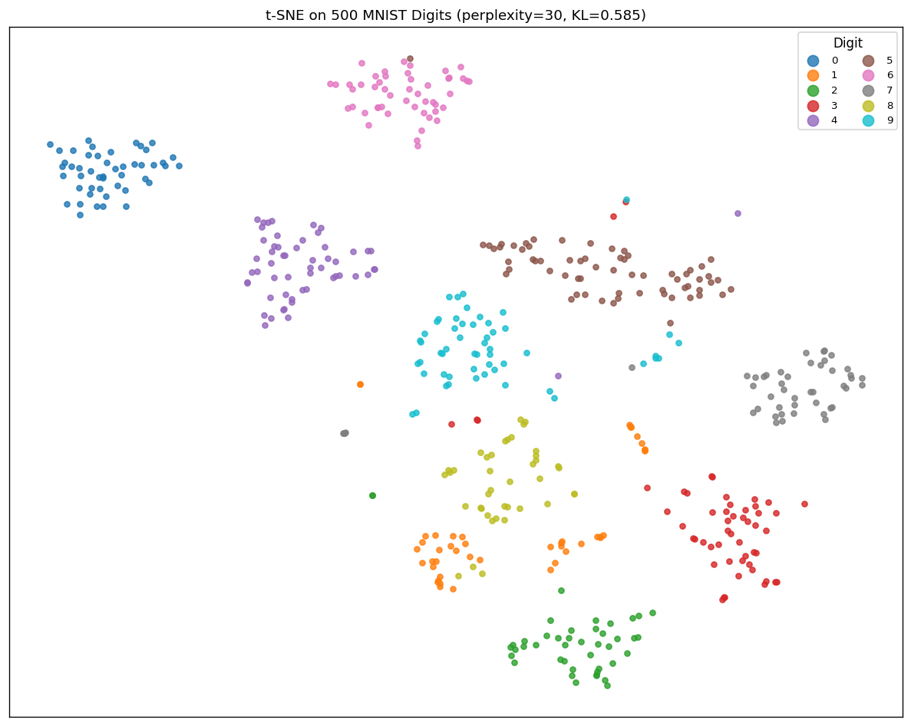
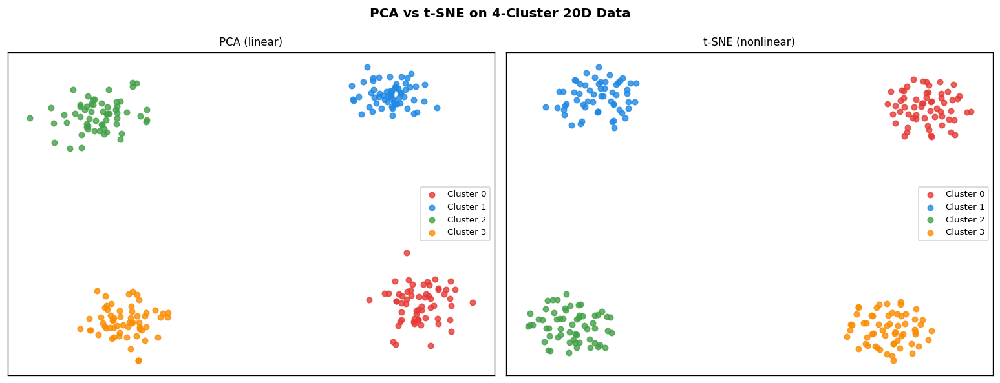
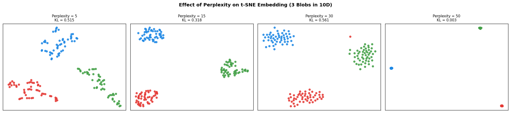
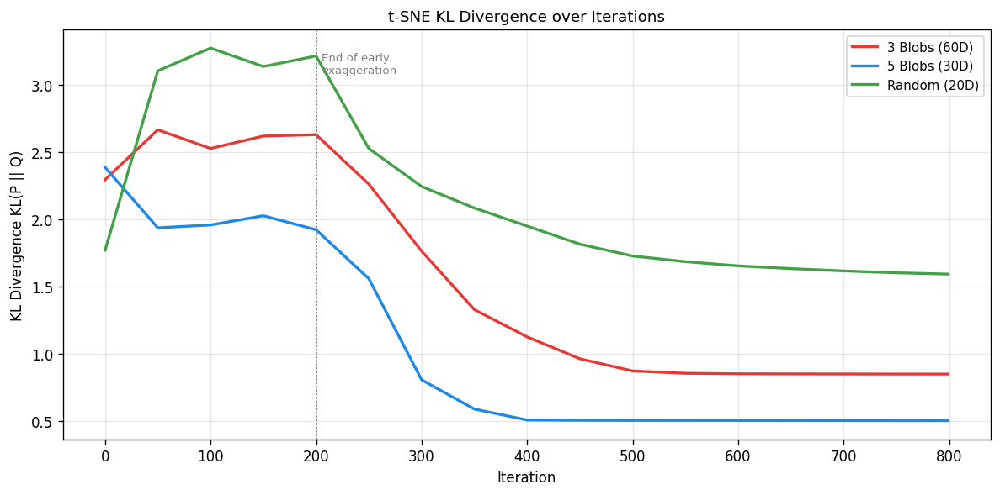
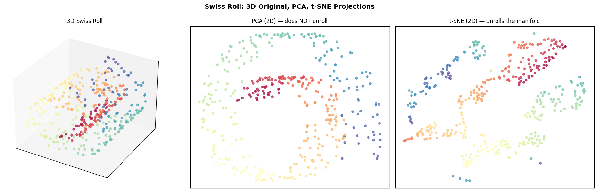
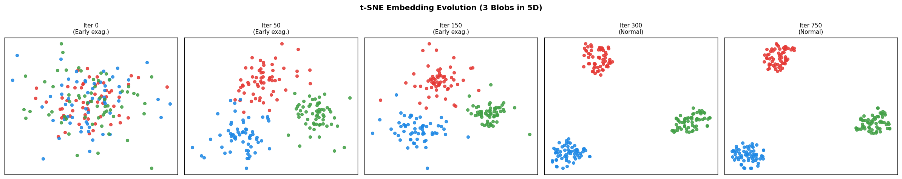
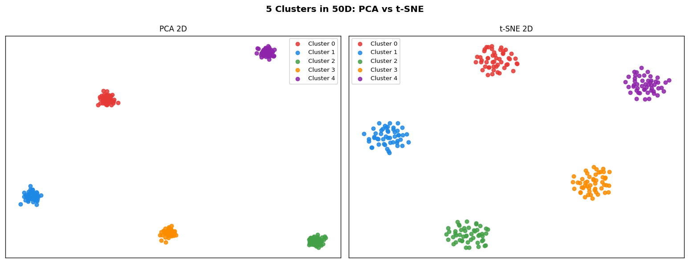
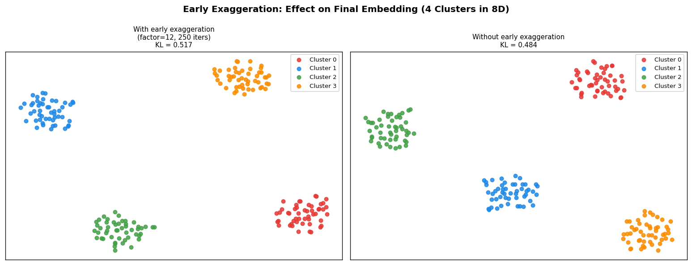

# Module 25 — t-SNE (t-distributed Stochastic Neighbor Embedding)

> **From-scratch implementation** of t-SNE — the standard algorithm for
> visualising high-dimensional data — with Gaussian bandwidth binary search,
> Student-t low-dimensional affinities, early exaggeration, and momentum-based
> gradient descent.

---

## Table of Contents

1. [Motivation](#1-motivation)
2. [High-Dimensional Similarities](#2-high-dimensional-similarities)
3. [Perplexity and Binary Search for Bandwidth](#3-perplexity-and-binary-search-for-bandwidth)
4. [Symmetrised Joint Probabilities](#4-symmetrised-joint-probabilities)
5. [The Crowding Problem](#5-the-crowding-problem)
6. [Low-Dimensional Similarities: Student-t Kernel](#6-low-dimensional-similarities-student-t-kernel)
7. [Cost Function: KL Divergence](#7-cost-function-kl-divergence)
8. [Gradient Derivation](#8-gradient-derivation)
9. [Optimization: Early Exaggeration and Momentum](#9-optimization-early-exaggeration-and-momentum)
10. [The Full Algorithm](#10-the-full-algorithm)
11. [Hyperparameter Guide](#11-hyperparameter-guide)
12. [Complexity Analysis](#12-complexity-analysis)
13. [Properties and Limitations](#13-properties-and-limitations)
14. [Visual Results](#14-visual-results)
15. [References](#15-references)

---

## 1. Motivation

Linear methods such as PCA find the global directions of maximum variance in
the data. They fail to capture **nonlinear, local structure** — two points that
are nearby in the true manifold may end up far apart after a linear projection.

t-SNE builds a probability distribution over **pairs of nearby points** in the
original space, then finds a low-dimensional embedding whose pairwise
distribution matches as closely as possible. Pairs that are close in
high-dimensional space are placed close together; pairs that are far apart can
go anywhere (they contribute negligible gradient).

---

## 2. High-Dimensional Similarities

For each point $x_i \in \mathbb{R}^p$, define the **conditional probability**
that $i$ would pick $j$ as its neighbour under a centred Gaussian:

$$p_{j \mid i} = \frac{\exp\!\left(-\|x_i - x_j\|^2 / 2\sigma_i^2\right)}{\displaystyle\sum_{k \neq i} \exp\!\left(-\|x_i - x_k\|^2 / 2\sigma_i^2\right)}, \qquad p_{i \mid i} = 0$$

The bandwidth $\sigma_i$ is **different for each point** — it is set by a
binary search (Section 3) so that the effective number of neighbours matches
the target **perplexity**.

Properties:
- $p_{j \mid i} \geq 0$ for all $j$
- $\sum_{j \neq i} p_{j \mid i} = 1$
- Note: $p_{j \mid i} \neq p_{i \mid j}$ in general (asymmetric)

---

## 3. Perplexity and Binary Search for Bandwidth

The **Shannon entropy** of the conditional distribution $P_i$:

$$H(P_i) = -\sum_{j \neq i} p_{j \mid i} \ln p_{j \mid i} \quad \text{(nats)}$$

The **perplexity** is defined as:

$$\mathrm{Perp}(P_i) = e^{H(P_i)}$$

Perplexity has an intuitive interpretation as the **effective number of
neighbours**: a uniform distribution over $k$ points has perplexity $k$.

### Binary Search

Let $\beta_i = 1/(2\sigma_i^2)$ (the precision). For a given $\beta_i$:

$$p_{j \mid i} = \frac{e^{-\beta_i \|x_i - x_j\|^2}}{Z_i}, \qquad Z_i = \sum_{k \neq i} e^{-\beta_i \|x_i - x_k\|^2}$$

The entropy satisfies:

$$H(P_i) = \ln Z_i + \beta_i \langle \|x_i - x\|^2 \rangle_{P_i}$$

Since $H$ is **decreasing in $\beta_i$**:

- $\beta_i \to 0$: uniform distribution, $H \to \ln(n-1)$, perplexity $\to n-1$
- $\beta_i \to \infty$: mass on nearest neighbour, $H \to 0$, perplexity $\to 1$

**Algorithm**: binary search over $\beta_i \in (0, \infty)$ to find $\beta_i^*$ such that

$$H(P_i) = \ln(\mathrm{perplexity})$$

Convergence to tolerance $10^{-5}$ typically requires $\leq 50$ iterations.

**Numerical stability**: subtract $\max_k(-\beta_i d_{ik}^2)$ before exponentiating (log-sum-exp trick):

$$p_{j \mid i} \propto \exp\!\bigl(-\beta_i d_{ij}^2 - \max_k(-\beta_i d_{ik}^2)\bigr)$$

---

## 4. Symmetrised Joint Probabilities

The conditional probabilities are asymmetric. For gradient efficiency, t-SNE
uses the **symmetric joint distribution**:

$$p_{ij} = \frac{p_{j \mid i} + p_{i \mid j}}{2n}, \qquad \sum_{i,j} p_{ij} = 1$$

Properties:
- $p_{ij} = p_{ji}$ (symmetric)
- $p_{ij} \geq 1/(2n) \cdot \min(p_{j|i}, p_{i|j}) > 0$: every pair has positive probability, preventing outliers from being ignored
- The $1/(2n)$ normalisation ensures $\sum_{i \neq j} p_{ij} = 1$

---

## 5. The Crowding Problem

**Why not use Gaussian kernels in low dimensions?**

In $\mathbb{R}^p$ with large $p$, many distant points can fit at moderate distance from $x_i$ — the surface area of a $p$-sphere grows as $r^{p-1}$. In $\mathbb{R}^2$ the surface area grows only as $r$, so there is not enough room to faithfully represent all pairwise distances. The embedding is **crowded**.

If we use the same Gaussian kernel in low dimensions, moderate-distance pairs
get too little probability mass — they are placed too close to nearby pairs
(pulled in by attractive forces), causing the embedding to collapse into a ball.

The solution: use a **heavy-tailed distribution** in low dimensions so that
moderate distances get much higher probability than they would under a Gaussian.
The extra "room" in the tails allows points to spread out and avoid crowding.

---

## 6. Low-Dimensional Similarities: Student-t Kernel

t-SNE uses a **Student-t distribution with 1 degree of freedom** (Cauchy distribution) in the low-dimensional space:

$$q_{ij} = \frac{\left(1 + \|y_i - y_j\|^2\right)^{-1}}{\displaystyle\sum_{k \neq l}\left(1 + \|y_k - y_l\|^2\right)^{-1}}, \qquad q_{ii} = 0$$

The unnormalised kernel value:

$$w_{ij} = \frac{1}{1 + \|y_i - y_j\|^2}$$

**Why degree-of-freedom 1?**

The Student-t PDF $\propto (1 + r^2/\nu)^{-(\nu+1)/2}$ has heavier tails for smaller $\nu$. At $\nu = 1$ the tail falls as $r^{-2}$, much slower than the Gaussian $e^{-r^2}$. This means well-separated clusters in high-$p$ space can be placed very far apart in 2D without incurring large cost — the heavy tail gives them room.

---

## 7. Cost Function: KL Divergence

The objective is to minimise the KL divergence between $P$ (high-dim) and $Q$ (low-dim):

$$C = \mathrm{KL}(P \| Q) = \sum_{i \neq j} p_{ij} \ln \frac{p_{ij}}{q_{ij}}$$

**Properties**:
- $C \geq 0$ by Gibbs' inequality (equality iff $P = Q$)
- Asymmetric: $\mathrm{KL}(P \| Q) \neq \mathrm{KL}(Q \| P)$
- Large $p_{ij}$, small $q_{ij}$: huge penalty — nearby high-dim pairs must be nearby in low-dim
- Small $p_{ij}$, large $q_{ij}$: small penalty — distant pairs can be anywhere

This asymmetry is the key property: **t-SNE preserves local structure** (nearby neighbours) but makes no guarantee about global structure (relative cluster positions).

---

## 8. Gradient Derivation

Let $Y \in \mathbb{R}^{n \times d}$ be the embedding. We compute $\partial C / \partial y_i$.

From $q_{ij} = w_{ij} / Z_Q$ where $Z_Q = \sum_{k \neq l} w_{kl}$:

$$\frac{\partial C}{\partial y_i} = -\sum_{j \neq i} p_{ij} \frac{\partial \ln q_{ij}}{\partial y_i} = \sum_{j \neq i} p_{ij}\left(\frac{\partial \ln Z_Q}{\partial y_i} - \frac{\partial \ln w_{ij}}{\partial y_i}\right)$$

Using:

$$\frac{\partial \ln w_{ij}}{\partial y_i} = -2(y_i - y_j)\,w_{ij}$$

$$\frac{\partial \ln Z_Q}{\partial y_i} = \frac{1}{Z_Q}\sum_k \frac{\partial}{\partial y_i}\sum_{l \neq k} w_{kl} = \frac{2}{Z_Q}\sum_{j \neq i} w_{ij}(y_i - y_j)$$

After simplification (using $\sum_j p_{ij} = 1/(2n) \cdot (\text{sum of row})$, and the $1/Z_Q$ denominator defining $q_{ij}$):

$$\boxed{\frac{\partial C}{\partial y_i} = 4\sum_{j \neq i}(p_{ij} - q_{ij})(y_i - y_j)\,w_{ij}}$$

### Attractive and Repulsive Forces

The gradient decomposes into:

$$\frac{\partial C}{\partial y_i} = 4\underbrace{\sum_j p_{ij}(y_i - y_j)w_{ij}}_{\text{attractive}} - 4\underbrace{\sum_j q_{ij}(y_i - y_j)w_{ij}}_{\text{repulsive}}$$

- **Attractive**: pairs with high $p_{ij}$ pull $y_i$ toward $y_j$
- **Repulsive**: all other pairs push $y_i$ away, weighted by $q_{ij}$

### Vectorised Form

Let $A_{ij} = (p_{ij} - q_{ij})\,w_{ij}$. Since $p$, $q$, $w$ are all symmetric, $A$ is symmetric. Then:

$$\frac{\partial C}{\partial Y} = 4\Bigl(\mathrm{diag}(A\mathbf{1}) - A\Bigr)Y$$

This is a single matrix multiplication — $O(n^2 d)$ per iteration with no Python loops.

---

## 9. Optimization: Early Exaggeration and Momentum

### Gradient Descent with Momentum

$$Y^{(t)} = Y^{(t-1)} + v^{(t)}, \qquad v^{(t)} = \alpha\,v^{(t-1)} - \eta\,\frac{\partial C}{\partial Y^{(t-1)}}$$

where $\eta$ is the learning rate and $\alpha$ is the momentum coefficient.

### Early Exaggeration

For the first $T_{\text{exag}}$ iterations, multiply $p_{ij}$ by a large factor $\rho$ (typically $\rho = 12$):

$$C_{\text{exag}} = \sum_{i \neq j} \rho\,p_{ij} \ln \frac{\rho\,p_{ij}}{q_{ij}}$$

The effect: strong attractive forces dominate, pulling similar points into tight, well-separated clusters. After $T_{\text{exag}}$ iterations, $\rho$ is removed and the embedding relaxes into its final configuration.

Without early exaggeration, the repulsive forces are comparable to attractive forces from the start, and the embedding often gets stuck in poor local minima with overlapping clusters.

| Phase | Iterations | $p_{ij}$ | Momentum $\alpha$ |
|-------|-----------|-----------|------------------|
| Early exaggeration | $0, \ldots, T_{\text{exag}}-1$ | $\rho \cdot p_{ij}$ | 0.5 |
| Normal | $T_{\text{exag}}, \ldots, T-1$ | $p_{ij}$ | 0.8 |

**Default parameters**: $\rho = 12$, $T_{\text{exag}} = 250$, $T = 1000$, $\eta = 200$.

### Re-centering

After each update, subtract the mean of $Y$ to prevent drift:

$$Y \leftarrow Y - \bar{Y}$$

This has no effect on the gradient (which only depends on differences $y_i - y_j$) but prevents numerical overflow.

---

## 10. The Full Algorithm

```
Input: X ∈ R^{n×p}, perplexity, n_iter, early_exaggeration ρ, η, α

=== Step 1: High-dimensional P matrix ===
Compute squared pairwise distances D²
For each i:
    Binary search for β_i such that H(P_i) = ln(perplexity)
    Store conditional probabilities p_{j|i}
Symmetrise: p_ij = (p_{j|i} + p_{i|j}) / (2n)

=== Step 2: Initialise embedding ===
Y ~ N(0, 10^{-4} I)   [or PCA projection × 10^{-4}]
v = 0 (velocity)

=== Step 3: Gradient descent ===
For t = 0, ..., n_iter-1:
    P_t = ρ * P  if t < T_exag,  else P
    α_t = 0.5   if t < T_exag,  else 0.8

    Compute w_ij = (1 + ||y_i - y_j||²)^{-1}  [Student-t kernel]
    Compute Q = w / sum(w)
    Compute A = (P_t - Q) * w
    grad = 4 * (diag(A @ 1) * Y - A @ Y)

    v = α_t * v - η * grad
    Y = Y + v
    Y = Y - mean(Y)

Return Y
```

---

## 11. Hyperparameter Guide

| Parameter | Typical range | Effect |
|-----------|--------------|--------|
| `perplexity` | 5 – 50 | Effective number of neighbours. Too low: fragmented clusters. Too high: global structure smeared. For $n < 100$: use $\approx n/4$. |
| `learning_rate` | 100 – 1000 | Too small: slow convergence. Too large: instability. Default 200 works broadly. |
| `n_iter` | 250 – 2000 | More iterations improve quality for complex datasets. |
| `early_exaggeration` | 4 – 12 | Higher values push clusters further apart. Default 12. |
| `n_iter_early_exag` | 100 – 300 | Longer gives more organised initial layout. |
| `init` | `'random'` / `'pca'` | PCA init often gives better global structure and faster convergence. |

**Rule of thumb**: If clusters overlap, try increasing `perplexity` or `n_iter`. If clusters are split, try decreasing `perplexity`.

---

## 12. Complexity Analysis

| Step | Time | Space |
|------|------|-------|
| Pairwise $\|x_i - x_j\|^2$ | $O(n^2 p)$ via BLAS | $O(n^2)$ |
| Binary search (per point) | $O(n)$ × 50 iters | $O(n)$ |
| Full P computation | $O(n^2 p + n^2)$ | $O(n^2)$ |
| Per gradient step | $O(n^2 d)$ | $O(n^2)$ |
| Full optimization ($T$ iters) | $O(T n^2 d)$ | $O(n^2)$ |

**Bottleneck**: $O(n^2)$ memory and computation. Impractical for $n > 10{,}000$.

**Barnes-Hut t-SNE** (van der Maaten, 2014): approximates repulsive forces using a quadtree, reducing complexity to $O(n \log n)$ per iteration. This allows $n \approx 10^5$.

**FIt-SNE** (Linderman et al., 2019): uses interpolation on an equispaced grid + FFT to achieve $O(n)$ per iteration, enabling $n \approx 10^7$.

---

## 13. Properties and Limitations

| Property | Description |
|----------|------------|
| Non-parametric | No explicit mapping $f: x \mapsto y$; new points cannot be embedded without re-running |
| Non-convex | KL divergence has many local minima; results vary across runs |
| Local structure | Preserves neighbourhood relationships; **cluster distances and sizes are not meaningful** |
| Stochastic | Different seeds give different (but qualitatively similar) embeddings |
| Perplexity-sensitive | Structure can change dramatically with perplexity — always try multiple values |
| Slow for large $n$ | Naive $O(n^2)$ — use Barnes-Hut or FIt-SNE for $n > 5000$ |
| Visualisation only | Not suitable as a preprocessing step for ML models (distances not preserved) |

---

## 14. Visual Results

### 1. t-SNE on 500 MNIST Digits



Each of the 10 digit classes forms a compact, well-separated cluster. t-SNE reveals sub-clusters within digits 1 and 4 (different handwriting styles) that are invisible in raw pixel space.

### 2. PCA vs t-SNE



On 4 clusters embedded in 20D noise, PCA projects along global variance directions and may not separate clusters aligned with minor axes. t-SNE consistently recovers the local cluster structure regardless of orientation.

### 3. Effect of Perplexity



Low perplexity (5): each point sees only immediate neighbours — clusters may fragment into sub-clusters or chains. High perplexity (50): broader neighbourhood averaging produces more global, spread-out layouts.

### 4. KL Divergence Convergence



KL divergence drops rapidly during early exaggeration (left of the dashed line) as clusters form, then decreases more slowly during the normal phase. Structured datasets reach lower KL values than random noise.

### 5. Swiss Roll: PCA vs t-SNE



PCA collapses the 3D Swiss Roll into an overlapping 2D projection (cannot unroll the manifold). t-SNE successfully recovers the intrinsic 2D manifold structure, with colour indicating position along the roll.

### 6. Embedding Evolution



Snapshots at iterations 0, 50, 150, 300, 750. During early exaggeration (iter 0–150) clusters compact and separate. In the normal phase (after iter 150) the embedding refines and spreads out within clusters.

### 7. 5 Clusters in 50D



t-SNE correctly separates all 5 clusters despite the high ambient dimension. PCA (right) also separates them for well-isolated clusters, but t-SNE produces tighter, more interpretable groupings.

### 8. Early Exaggeration Comparison



With early exaggeration (left): clusters compact into tight, well-separated islands first, leading to a clear final layout. Without (right): clusters often overlap or merge, reaching a worse local minimum (higher final KL divergence).

---

## 15. References

1. **van der Maaten, L. & Hinton, G.** (2008). Visualizing data using t-SNE. *Journal of Machine Learning Research*, 9, 2579–2605.

2. **van der Maaten, L.** (2014). Accelerating t-SNE using tree-based algorithms. *Journal of Machine Learning Research*, 15, 3221–3245.

3. **Linderman, G.C. et al.** (2019). Fast interpolation-based t-SNE for improved visualization of single-cell RNA sequencing data. *Nature Methods*, 16(3), 243–245.

4. **Wattenberg, M., Viegas, F. & Johnson, I.** (2016). How to use t-SNE effectively. *Distill*. https://distill.pub/2016/misread-tsne/

5. **Kobak, D. & Berens, P.** (2019). The art of using t-SNE for single-cell transcriptomics. *Nature Communications*, 10, 5416.

6. **McInnes, L., Healy, J. & Melville, J.** (2018). UMAP: Uniform manifold approximation and projection for dimension reduction. *arXiv:1802.03426*.
