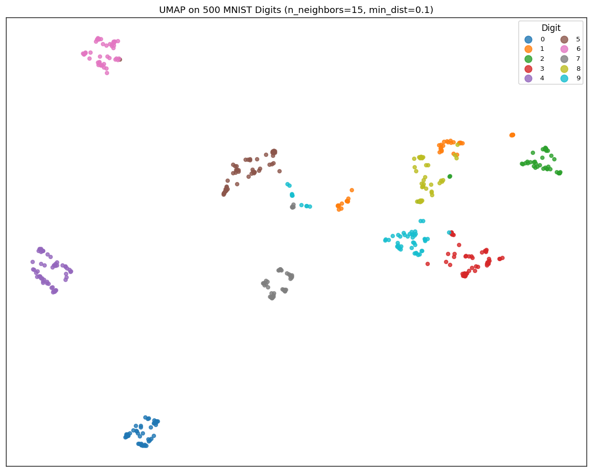
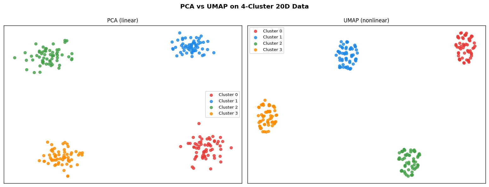
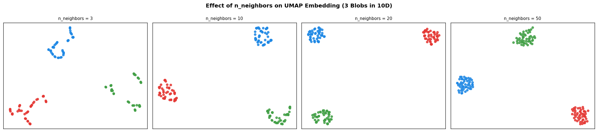
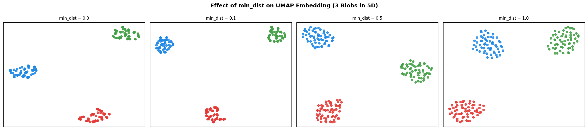
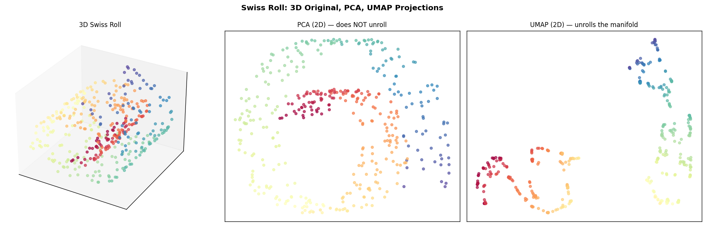
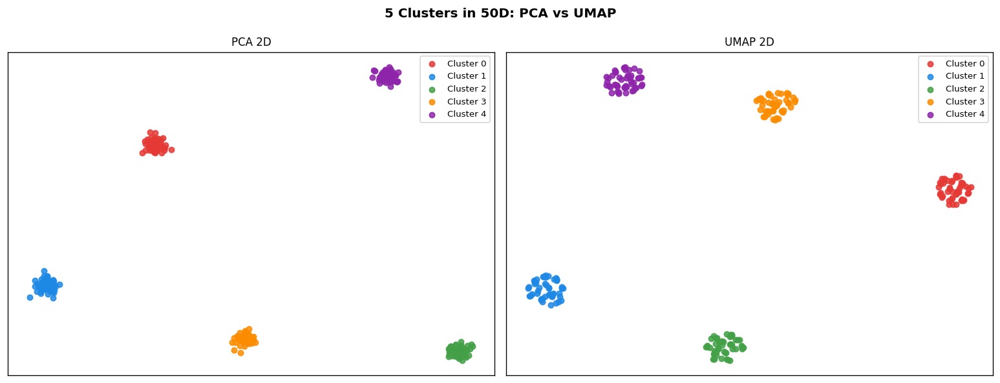
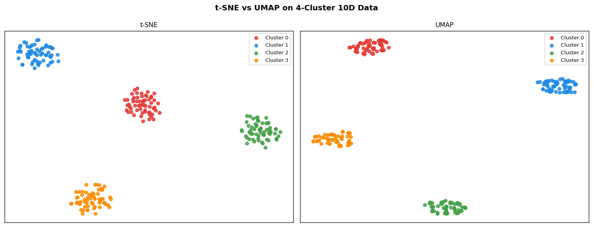
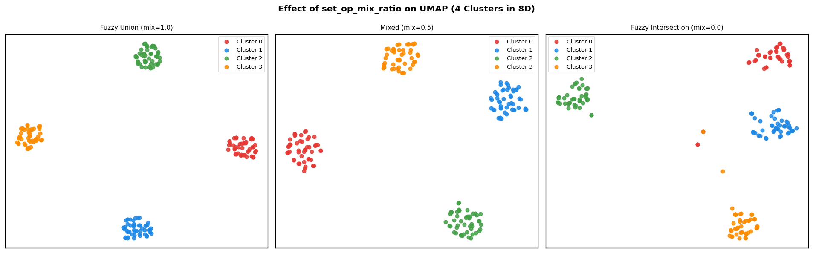

# Module 26 — UMAP: Uniform Manifold Approximation and Projection

> **Paper**: McInnes, L., Healy, J., & Melville, J. (2018). *UMAP: Uniform Manifold Approximation and Projection for Dimension Reduction.* arXiv:1802.03426.

UMAP is a nonlinear dimensionality reduction method grounded in Riemannian geometry and algebraic topology. It constructs a fuzzy topological representation of the high-dimensional data and optimises a low-dimensional layout to match it via cross-entropy minimisation with stochastic gradient descent.

---

## Table of Contents

1. [Core Idea](#core-idea)
2. [Step 1 — k-NN Graph](#step-1--k-nn-graph)
3. [Step 2 — Fuzzy Membership and Binary Search](#step-2--fuzzy-membership-and-binary-search)
4. [Step 3 — Symmetrisation: Fuzzy Union](#step-3--symmetrisation-fuzzy-union)
5. [Step 4 — Low-Dimensional Kernel](#step-4--low-dimensional-kernel)
6. [Step 5 — Cross-Entropy Objective](#step-5--cross-entropy-objective)
7. [Step 6 — Gradient Derivation](#step-6--gradient-derivation)
8. [Step 7 — Initialisation](#step-7--initialisation)
9. [Hyperparameter Guide](#hyperparameter-guide)
10. [UMAP vs t-SNE](#umap-vs-t-sne)
11. [Visualisations](#visualisations)
12. [API Reference](#api-reference)

---

## Core Idea

Given $n$ points $\{x_1, \ldots, x_n\} \subset \mathbb{R}^p$, find embeddings $\{y_1, \ldots, y_n\} \subset \mathbb{R}^d$ ($d \ll p$) that preserve local topological structure.

The algorithm proceeds in two phases:

**Phase 1 — High-dimensional graph:**
For each point $x_i$, fit an adaptive Gaussian kernel to its $k$ nearest neighbours. Symmetrise the resulting directed weights via fuzzy union to obtain a weighted graph $W$.

**Phase 2 — Layout optimisation:**
Fit a smooth low-dimensional kernel $q_{ij}$ whose shape matches a target distribution. Minimise the cross-entropy $\mathcal{C}(W \| Q)$ using mini-batch SGD with negative sampling.

---

## Step 1 — k-NN Graph

Compute the squared Euclidean distance matrix:

$$D^2_{ij} = \|x_i - x_j\|^2 = \sum_{k=1}^{p}(x_i^{(k)} - x_j^{(k)})^2$$

For each point $i$, record its $k$ nearest neighbours and their distances:

$$N_k(i) = \{j_1, j_2, \ldots, j_k\}, \quad d_{ij_1} \le d_{ij_2} \le \cdots \le d_{ij_k}$$

$$\rho_i = d_{i,j_1} \quad \text{(distance to nearest neighbour)}$$

Implementation uses the identity $\|x_i - x_j\|^2 = \|x_i\|^2 + \|x_j\|^2 - 2\,x_i^\top x_j$ for O($n^2 p$) computation via BLAS.

---

## Step 2 — Fuzzy Membership and Binary Search

For each neighbour $j \in N_k(i)$, the directed fuzzy membership is:

$$v_{ij} = \exp\!\left(-\frac{d_{ij} - \rho_i}{\sigma_i}\right)$$

where $\rho_i$ ensures the nearest neighbour always has membership 1 ($v_{i,j_1} = e^0 = 1$), and $\sigma_i$ is chosen so that the total neighbourhood membership equals $\log_2 k$:

$$\sum_{j \in N_k(i)} v_{ij} = \log_2 k$$

**Binary search for $\sigma_i$:** Since $v_{ij}$ is decreasing in $\sigma_i$ (wait — increasing in $\sigma_i$), and the target is fixed, we solve:

$$f(\sigma_i) = \sum_{j \in N_k(i)} \exp\!\left(-\frac{\max(d_{ij} - \rho_i,\; 0)}{\sigma_i}\right) = \log_2 k$$

| Condition | Action |
|-----------|--------|
| $f(\sigma_i) > \log_2 k$ | $\sigma_i$ too large — set $\sigma_{\text{hi}} = \sigma_i$, bisect down |
| $f(\sigma_i) < \log_2 k$ | $\sigma_i$ too small — set $\sigma_{\text{lo}} = \sigma_i$, bisect up |
| $|f(\sigma_i) - \log_2 k| < 10^{-5}$ | Converged |

The vectorised implementation updates all $n$ points simultaneously:

$$\sigma^{(\text{new})} = \begin{cases} (\sigma_{\text{lo}} + \sigma)/2 & f > \log_2 k \\ (\sigma + \sigma_{\text{hi}})/2 & f < \log_2 k \\ 2\sigma & f < \log_2 k \text{ and } \sigma_{\text{hi}} = \infty \end{cases}$$

---

## Step 3 — Symmetrisation: Fuzzy Union

The directed memberships $v_{ij}$ define an asymmetric graph (e.g., $j$ may be a neighbour of $i$ but not vice versa). The **fuzzy union** symmetrises it:

$$w_{ij} = v_{ij} + v_{ji} - v_{ij} \cdot v_{ji}$$

This corresponds to the probability that at least one of the two directed edges exists under the interpretation that $v_{ij}$ is a Bernoulli probability. The resulting weight matrix $W$ satisfies:

$$w_{ij} \in [0, 1], \quad W = W^\top, \quad w_{ii} = 0$$

**Fuzzy intersection** (not used by default):

$$w_{ij}^{\cap} = \min(v_{ij},\, v_{ji})$$

A mix is possible: $W = \lambda\, W^{\cup} + (1-\lambda)\, W^{\cap}$ via `set_op_mix_ratio`.

---

## Step 4 — Low-Dimensional Kernel

The low-dimensional affinity is defined by a smooth parametric family:

$$q_{ij} = \frac{1}{1 + a\,\|y_i - y_j\|^{2b}}$$

Parameters $a, b > 0$ are fitted by least squares to match the piecewise target:

$$f(d) = \begin{cases} 1 & d < d_{\min} \\ e^{-(d - d_{\min})/\text{spread}} & \text{otherwise} \end{cases}$$

**Effect of parameters:**

| Parameter | Small value | Large value |
|-----------|-------------|-------------|
| `min_dist` | Points clump tightly | Points spread out |
| `spread` | Compact clusters | Extended neighbourhood |

For the defaults `spread=1.0`, `min_dist=0.1`, curve fitting yields approximately $a \approx 1.58$, $b \approx 0.90$.

**Connection to t-SNE:** When $a = 1$, $b = 1$ we recover the Cauchy kernel $q_{ij} = (1 + \|y_i - y_j\|^2)^{-1}$ used by t-SNE.

---

## Step 5 — Cross-Entropy Objective

UMAP minimises the binary cross-entropy between the high-dimensional weights $w_{ij}$ and the low-dimensional affinities $q_{ij}$:

$$\mathcal{C} = -\sum_{i,j} \Bigl[w_{ij}\,\log q_{ij} + \gamma(1 - w_{ij})\,\log(1 - q_{ij})\Bigr]$$

where $\gamma \geq 0$ (`repulsion_strength`) controls the relative weight of the repulsive term.

**Attractive term** ($w_{ij} > 0$): Minimised by $q_{ij} \to 1$, i.e., $\|y_i - y_j\| \to 0$.

**Repulsive term** ($w_{ij} \approx 0$): Minimised by $q_{ij} \to 0$, i.e., $\|y_i - y_j\| \to \infty$.

**Contrast with t-SNE:** t-SNE minimises $\text{KL}(P \| Q) = \sum_{ij} p_{ij}\log(p_{ij}/q_{ij})$, which has no explicit repulsive term — repulsion emerges implicitly from the normalisation of $Q$.

---

## Step 6 — Gradient Derivation

**Gradient w.r.t. $\|y_i - y_j\|^2$:**

Let $\delta_{ij} = y_i - y_j$ and $r_{ij}^2 = \|\delta_{ij}\|^2$. Then:

$$\frac{\partial \log q_{ij}}{\partial r_{ij}^2} = \frac{-ab\,(r_{ij}^2)^{b-1}}{1 + a\,(r_{ij}^2)^b}$$

$$\frac{\partial \log(1 - q_{ij})}{\partial r_{ij}^2} = \frac{b}{r_{ij}^2} - \frac{ab\,(r_{ij}^2)^{b-1}}{1 + a\,(r_{ij}^2)^b} = \frac{b}{r_{ij}^2\bigl(1 + a\,(r_{ij}^2)^b\bigr)}$$

**Attractive gradient** for positive edge $(i, j)$ with weight $w_{ij} > 0$:

$$\nabla_{y_i}\mathcal{C}_{\text{attr}} = \frac{2ab\,(r_{ij}^2)^{b-1}}{1 + a\,(r_{ij}^2)^b}\cdot w_{ij}\cdot\delta_{ij}$$

Gradient descent moves $y_i$ toward $y_j$ (attractive force).

**Repulsive gradient** for negative sample $(i, k)$ with $w_{ik} \approx 0$:

$$\nabla_{y_i}\mathcal{C}_{\text{rep}} = -\frac{2b\,\gamma}{(\varepsilon + r_{ik}^2)\bigl(1 + a\,(r_{ik}^2)^b\bigr)}\cdot\delta_{ik}$$

Gradient descent moves $y_i$ away from $y_k$ (repulsive force).

Both gradients are clipped to $[-4, 4]$ for numerical stability.

**SGD update rule** (learning rate $\eta_t = \eta_0(1 - t/T)$):

$$y_i \leftarrow y_i - \eta_t\,\nabla_{y_i}\mathcal{C}_{\text{attr}} - \eta_t\,\nabla_{y_i}\mathcal{C}_{\text{rep}}$$

**Negative sampling:** For each positive edge $(i, j)$, sample `negative_sample_rate` random points $k \sim \text{Uniform}(\{1,\ldots,n\})$ and apply repulsive forces. This is computationally efficient compared to computing all $O(n^2)$ repulsive pairs.

---

## Step 7 — Initialisation

### Spectral Initialisation (default)

Construct the normalised graph Laplacian from $W$:

$$\tilde{W} = \frac{W + W^\top}{2}, \quad D_{ii} = \sum_j \tilde{w}_{ij}$$

$$L = I - D^{-1/2}\,\tilde{W}\,D^{-1/2}$$

Compute the eigenvectors corresponding to the $d$ smallest non-trivial eigenvalues (skip the trivial $\lambda = 0$ eigenvector). Scale each axis to unit variance and multiply by 0.1.

**Key property:** For a graph with $K$ disconnected components (e.g., $K$ well-separated clusters), the null space of $L$ has dimension $K$. The first $d$ non-trivial eigenvectors embed the components at distinct positions — a perfect starting configuration for optimisation.

### PCA Initialisation

Apply PCA to reduce to $d$ dimensions, normalise to unit variance, scale by 0.1.

### Random Initialisation

Sample $Y \sim \mathcal{N}(0,\, 10^{-4}\, I)$.

---

## Hyperparameter Guide

| Parameter | Default | Typical range | Effect |
|-----------|---------|--------------|--------|
| `n_neighbors` | 15 | 5–100 | **Global vs local structure.** Small $k$: preserves fine-grained local clusters. Large $k$: captures global topology, smoother embedding. |
| `min_dist` | 0.1 | 0.0–1.0 | **Clumping.** Small: tight clumps. Large: uniform distribution. |
| `spread` | 1.0 | 0.5–2.0 | Overall scale of the embedding. |
| `n_epochs` | 200 | 100–1000 | More epochs → better convergence. |
| `learning_rate` | 1.0 | 0.1–5.0 | SGD step size. |
| `n_neighbors` vs t-SNE `perplexity` | — | — | Roughly, `n_neighbors` $\approx 3 \times$ `perplexity`. |

**Rule of thumb:** Start with `n_neighbors=15, min_dist=0.1`. If clusters merge, reduce `n_neighbors`. If points are too tightly clumped, increase `min_dist`.

---

## UMAP vs t-SNE

| Property | t-SNE | UMAP |
|----------|-------|------|
| **Objective** | $\text{KL}(P \| Q)$ | Cross-entropy $\mathcal{C}(W \| Q)$ |
| **High-dim affinity** | Gaussian, perplexity-matched | Fuzzy membership, $k$-NN-based |
| **Low-dim kernel** | Cauchy: $(1+r^2)^{-1}$ | Parametric: $(1+a\,r^{2b})^{-1}$ |
| **Optimisation** | Full-batch GD + momentum | Mini-batch SGD + negative sampling |
| **Normalisation** | $\sum_{ij} q_{ij} = 1$ | No global normalisation |
| **Global structure** | Often poor | Better preserved |
| **Speed** | $O(n^2)$ per iter | $O(n k)$ per iter |
| **Repulsion** | Implicit via $\sum q = 1$ | Explicit via negative samples |

**When to use UMAP:**
- Large datasets (faster than t-SNE due to sparse graph)
- When global structure matters (relative positions of clusters)
- When you need reproducible embeddings (less sensitive to random init)

**When to use t-SNE:**
- Small datasets
- When fine-grained local cluster structure is paramount

---

## Visualisations

### 1. UMAP on MNIST Digits



500 MNIST digits projected to 2D. Digit classes separate into distinct regions, with visually similar digits (e.g., 4/9, 3/5/8) placed close together.

### 2. PCA vs UMAP on 4-Cluster Data



4 clusters arranged on a circle in 20D. PCA (linear) compresses variance but cannot resolve the circular arrangement. UMAP separates all 4 clusters cleanly.

### 3. Effect of n_neighbors



Small `n_neighbors` preserves fine local structure; large `n_neighbors` blurs cluster boundaries in favour of global topology.

### 4. Effect of min_dist



`min_dist=0` allows tight clumps; `min_dist=1.0` forces a more uniform spread of points within each cluster.

### 5. Swiss Roll: PCA vs UMAP



PCA cannot unfold the manifold — points at the same height but different roll positions overlap. UMAP successfully unrolls the manifold into a continuous 2D surface.

### 6. High-Dimensional Blobs (50D)



5 clusters in 50D. PCA separates some but overlapping variance makes clusters merge. UMAP cleanly isolates all 5 clusters.

### 7. UMAP vs t-SNE



Both algorithms separate the 4-cluster 10D data. UMAP tends to preserve inter-cluster distances better; t-SNE may distort global layout.

### 8. Effect of set_op_mix_ratio



Fuzzy union (mix=1.0) is standard. Fuzzy intersection (mix=0.0) is more conservative and may produce sparser graphs with weaker connections between bridge points.

---

## API Reference

```python
from umap_scratch import (
    UMAP,
    compute_fuzzy_simplicial_set,
    find_ab_params,
    umap_optimize_layout,
)
```

### `UMAP`

```python
UMAP(
    n_components=2,        # target dimensionality
    n_neighbors=15,        # k for the fuzzy graph
    min_dist=0.1,          # minimum embedding distance
    spread=1.0,            # embedding scale
    n_epochs=200,          # SGD iterations
    learning_rate=1.0,     # initial learning rate
    negative_sample_rate=5,# negatives per positive edge
    repulsion_strength=1.0,# gamma in cross-entropy
    set_op_mix_ratio=1.0,  # 1.0=union, 0.0=intersection
    init='spectral',       # 'spectral'|'pca'|'random'
    random_state=None,
    verbose=False,
)
```

**Methods:** `fit(X)`, `fit_transform(X)`

**Attributes after fit:** `embedding_` (n, d), `graph_` (n, n), `a_`, `b_`

### `compute_fuzzy_simplicial_set(X, n_neighbors, set_op_mix_ratio=1.0)`

Returns the $(n \times n)$ symmetric weight matrix $W$.

### `find_ab_params(spread=1.0, min_dist=0.1)`

Returns fitted $(a, b)$ via `scipy.optimize.curve_fit`.

### `umap_optimize_layout(W, Y, a, b, n_epochs, learning_rate, ...)`

Runs mini-batch SGD and returns the optimised embedding.

---

## References

1. McInnes, L., Healy, J., & Melville, J. (2018). *UMAP: Uniform Manifold Approximation and Projection for Dimension Reduction.* arXiv:1802.03426.
2. McInnes, L., Healy, J., Saul, N., & Grossberger, L. (2018). *UMAP: Uniform Manifold Approximation and Projection.* Journal of Open Source Software, 3(29), 861.
3. Belkin, M., & Niyogi, P. (2003). *Laplacian Eigenmaps for Dimensionality Reduction and Data Representation.* Neural Computation, 15(6), 1373–1396.
4. van der Maaten, L., & Hinton, G. (2008). *Visualizing Data using t-SNE.* JMLR, 9, 2579–2605.
